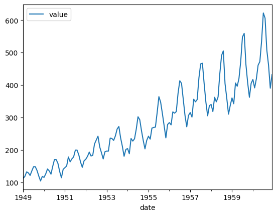
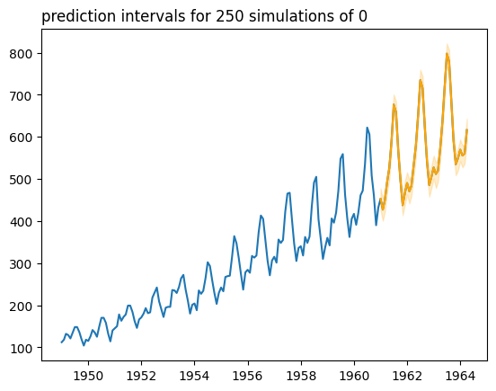
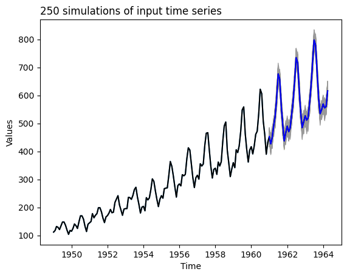
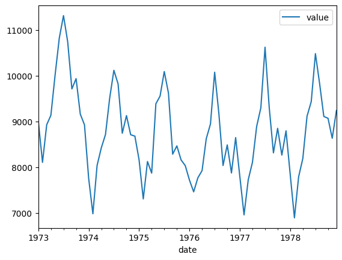
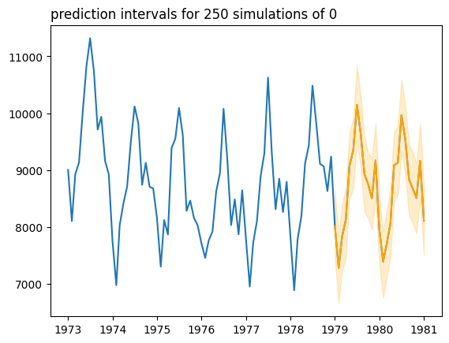
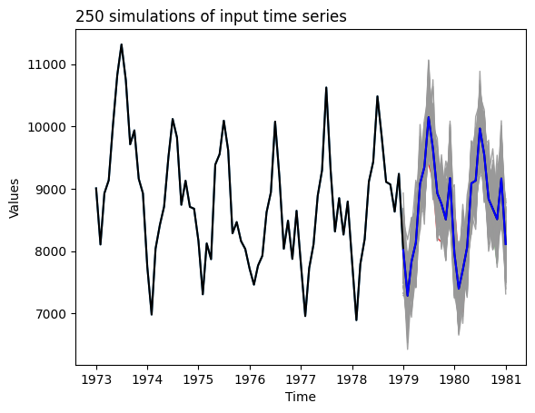

# 0 - Install packages


```python
!pip uninstall nnetsauce -y
```

    Found existing installation: nnetsauce 0.21.3
    Uninstalling nnetsauce-0.21.3:
      Successfully uninstalled nnetsauce-0.21.3


```python
!pip install ../.. --upgrade --no-cache-dir # replace '../..' with 'nnetsauce'
```

    Processing /Users/t/Documents/Python_Packages/nnetsauce
      Preparing metadata (setup.py) ... [?25ldone
    [?25hRequirement already satisfied: joblib in /Users/t/Documents/Python_Packages/nnetsauce/venv/lib/python3.11/site-packages (from nnetsauce==0.21.3) (1.4.2)
    Requirement already satisfied: matplotlib in /Users/t/Documents/Python_Packages/nnetsauce/venv/lib/python3.11/site-packages (from nnetsauce==0.21.3) (3.9.0)
    Requirement already satisfied: numpy in /Users/t/Documents/Python_Packages/nnetsauce/venv/lib/python3.11/site-packages (from nnetsauce==0.21.3) (2.0.0)
    Requirement already satisfied: pandas in /Users/t/Documents/Python_Packages/nnetsauce/venv/lib/python3.11/site-packages (from nnetsauce==0.21.3) (2.2.2)
    Requirement already satisfied: requests in /Users/t/Documents/Python_Packages/nnetsauce/venv/lib/python3.11/site-packages (from nnetsauce==0.21.3) (2.32.3)
    Requirement already satisfied: scipy in /Users/t/Documents/Python_Packages/nnetsauce/venv/lib/python3.11/site-packages (from nnetsauce==0.21.3) (1.13.1)
    Requirement already satisfied: scikit-learn in /Users/t/Documents/Python_Packages/nnetsauce/venv/lib/python3.11/site-packages (from nnetsauce==0.21.3) (1.5.0)
    Requirement already satisfied: threadpoolctl in /Users/t/Documents/Python_Packages/nnetsauce/venv/lib/python3.11/site-packages (from nnetsauce==0.21.3) (3.5.0)
    Requirement already satisfied: tqdm in /Users/t/Documents/Python_Packages/nnetsauce/venv/lib/python3.11/site-packages (from nnetsauce==0.21.3) (4.66.4)
    Requirement already satisfied: jax in /Users/t/Documents/Python_Packages/nnetsauce/venv/lib/python3.11/site-packages (from nnetsauce==0.21.3) (0.4.29)
    Requirement already satisfied: jaxlib in /Users/t/Documents/Python_Packages/nnetsauce/venv/lib/python3.11/site-packages (from nnetsauce==0.21.3) (0.4.29)
    Requirement already satisfied: ml-dtypes>=0.4.0 in /Users/t/Documents/Python_Packages/nnetsauce/venv/lib/python3.11/site-packages (from jax->nnetsauce==0.21.3) (0.4.0)
    Requirement already satisfied: opt-einsum in /Users/t/Documents/Python_Packages/nnetsauce/venv/lib/python3.11/site-packages (from jax->nnetsauce==0.21.3) (3.3.0)
    Requirement already satisfied: contourpy>=1.0.1 in /Users/t/Documents/Python_Packages/nnetsauce/venv/lib/python3.11/site-packages (from matplotlib->nnetsauce==0.21.3) (1.2.1)
    Requirement already satisfied: cycler>=0.10 in /Users/t/Documents/Python_Packages/nnetsauce/venv/lib/python3.11/site-packages (from matplotlib->nnetsauce==0.21.3) (0.12.1)
    Requirement already satisfied: fonttools>=4.22.0 in /Users/t/Documents/Python_Packages/nnetsauce/venv/lib/python3.11/site-packages (from matplotlib->nnetsauce==0.21.3) (4.53.0)
    Requirement already satisfied: kiwisolver>=1.3.1 in /Users/t/Documents/Python_Packages/nnetsauce/venv/lib/python3.11/site-packages (from matplotlib->nnetsauce==0.21.3) (1.4.5)
    Requirement already satisfied: packaging>=20.0 in /Users/t/Documents/Python_Packages/nnetsauce/venv/lib/python3.11/site-packages (from matplotlib->nnetsauce==0.21.3) (24.1)
    Requirement already satisfied: pillow>=8 in /Users/t/Documents/Python_Packages/nnetsauce/venv/lib/python3.11/site-packages (from matplotlib->nnetsauce==0.21.3) (10.3.0)
    Requirement already satisfied: pyparsing>=2.3.1 in /Users/t/Documents/Python_Packages/nnetsauce/venv/lib/python3.11/site-packages (from matplotlib->nnetsauce==0.21.3) (3.1.2)
    Requirement already satisfied: python-dateutil>=2.7 in /Users/t/Documents/Python_Packages/nnetsauce/venv/lib/python3.11/site-packages (from matplotlib->nnetsauce==0.21.3) (2.9.0.post0)
    Requirement already satisfied: pytz>=2020.1 in /Users/t/Documents/Python_Packages/nnetsauce/venv/lib/python3.11/site-packages (from pandas->nnetsauce==0.21.3) (2024.1)
    Requirement already satisfied: tzdata>=2022.7 in /Users/t/Documents/Python_Packages/nnetsauce/venv/lib/python3.11/site-packages (from pandas->nnetsauce==0.21.3) (2024.1)
    Requirement already satisfied: charset-normalizer<4,>=2 in /Users/t/Documents/Python_Packages/nnetsauce/venv/lib/python3.11/site-packages (from requests->nnetsauce==0.21.3) (3.3.2)
    Requirement already satisfied: idna<4,>=2.5 in /Users/t/Documents/Python_Packages/nnetsauce/venv/lib/python3.11/site-packages (from requests->nnetsauce==0.21.3) (3.7)
    Requirement already satisfied: urllib3<3,>=1.21.1 in /Users/t/Documents/Python_Packages/nnetsauce/venv/lib/python3.11/site-packages (from requests->nnetsauce==0.21.3) (2.2.2)
    Requirement already satisfied: certifi>=2017.4.17 in /Users/t/Documents/Python_Packages/nnetsauce/venv/lib/python3.11/site-packages (from requests->nnetsauce==0.21.3) (2024.6.2)
    Requirement already satisfied: six>=1.5 in /Users/t/Documents/Python_Packages/nnetsauce/venv/lib/python3.11/site-packages (from python-dateutil>=2.7->matplotlib->nnetsauce==0.21.3) (1.16.0)
    Building wheels for collected packages: nnetsauce
      Building wheel for nnetsauce (setup.py) ... [?25ldone
    [?25h  Created wheel for nnetsauce: filename=nnetsauce-0.21.3-py2.py3-none-any.whl size=165601 sha256=cca8ce7578992f49e670e9564eb923223e85b38cfa015b5af2ffcadbc5b41e43
      Stored in directory: /private/var/folders/cp/q8d6040n3m38d22z3hkk1zc40000gn/T/pip-ephem-wheel-cache-lo0x6o_f/wheels/1a/03/81/1cc0cae33e498e24d4eec5887a4e621a55002440ceebce517d
    Successfully built nnetsauce
    Installing collected packages: nnetsauce
    Successfully installed nnetsauce-0.21.3


```python
import nnetsauce as ns
import numpy as np
import pandas as pd
from sklearn.linear_model import Ridge
from statsmodels.tsa.seasonal import STL
```

# 1 - AirPassengers


```python
url = "https://raw.githubusercontent.com/Techtonique/datasets/main/time_series/univariate/AirPassengers.csv"
df = pd.read_csv(url)
```


```python
df.index = pd.DatetimeIndex(df.date)
```


```python
df.drop(columns=['date'], inplace=True)
```


```python
df.plot()
```


    <Axes: xlabel='date'>


    

    


```python
regr = ns.MTS(obj=Ridge(),
              replications=250,
              kernel='gaussian',
              lags=15)
```


```python
regr.fit(df)
```

    100%|██████████| 1/1 [00:00<00:00, 55.66it/s]


<style>#sk-container-id-7 {
  /* Definition of color scheme common for light and dark mode */
  --sklearn-color-text: black;
  --sklearn-color-line: gray;
  /* Definition of color scheme for unfitted estimators */
  --sklearn-color-unfitted-level-0: #fff5e6;
  --sklearn-color-unfitted-level-1: #f6e4d2;
  --sklearn-color-unfitted-level-2: #ffe0b3;
  --sklearn-color-unfitted-level-3: chocolate;
  /* Definition of color scheme for fitted estimators */
  --sklearn-color-fitted-level-0: #f0f8ff;
  --sklearn-color-fitted-level-1: #d4ebff;
  --sklearn-color-fitted-level-2: #b3dbfd;
  --sklearn-color-fitted-level-3: cornflowerblue;

  /* Specific color for light theme */
  --sklearn-color-text-on-default-background: var(--sg-text-color, var(--theme-code-foreground, var(--jp-content-font-color1, black)));
  --sklearn-color-background: var(--sg-background-color, var(--theme-background, var(--jp-layout-color0, white)));
  --sklearn-color-border-box: var(--sg-text-color, var(--theme-code-foreground, var(--jp-content-font-color1, black)));
  --sklearn-color-icon: #696969;

  @media (prefers-color-scheme: dark) {
    /* Redefinition of color scheme for dark theme */
    --sklearn-color-text-on-default-background: var(--sg-text-color, var(--theme-code-foreground, var(--jp-content-font-color1, white)));
    --sklearn-color-background: var(--sg-background-color, var(--theme-background, var(--jp-layout-color0, #111)));
    --sklearn-color-border-box: var(--sg-text-color, var(--theme-code-foreground, var(--jp-content-font-color1, white)));
    --sklearn-color-icon: #878787;
  }
}

#sk-container-id-7 {
  color: var(--sklearn-color-text);
}

#sk-container-id-7 pre {
  padding: 0;
}

#sk-container-id-7 input.sk-hidden--visually {
  border: 0;
  clip: rect(1px 1px 1px 1px);
  clip: rect(1px, 1px, 1px, 1px);
  height: 1px;
  margin: -1px;
  overflow: hidden;
  padding: 0;
  position: absolute;
  width: 1px;
}

#sk-container-id-7 div.sk-dashed-wrapped {
  border: 1px dashed var(--sklearn-color-line);
  margin: 0 0.4em 0.5em 0.4em;
  box-sizing: border-box;
  padding-bottom: 0.4em;
  background-color: var(--sklearn-color-background);
}

#sk-container-id-7 div.sk-container {
  /* jupyter's `normalize.less` sets `[hidden] { display: none; }`
     but bootstrap.min.css set `[hidden] { display: none !important; }`
     so we also need the `!important` here to be able to override the
     default hidden behavior on the sphinx rendered scikit-learn.org.
     See: https://github.com/scikit-learn/scikit-learn/issues/21755 */
  display: inline-block !important;
  position: relative;
}

#sk-container-id-7 div.sk-text-repr-fallback {
  display: none;
}

div.sk-parallel-item,
div.sk-serial,
div.sk-item {
  /* draw centered vertical line to link estimators */
  background-image: linear-gradient(var(--sklearn-color-text-on-default-background), var(--sklearn-color-text-on-default-background));
  background-size: 2px 100%;
  background-repeat: no-repeat;
  background-position: center center;
}

/* Parallel-specific style estimator block */

#sk-container-id-7 div.sk-parallel-item::after {
  content: "";
  width: 100%;
  border-bottom: 2px solid var(--sklearn-color-text-on-default-background);
  flex-grow: 1;
}

#sk-container-id-7 div.sk-parallel {
  display: flex;
  align-items: stretch;
  justify-content: center;
  background-color: var(--sklearn-color-background);
  position: relative;
}

#sk-container-id-7 div.sk-parallel-item {
  display: flex;
  flex-direction: column;
}

#sk-container-id-7 div.sk-parallel-item:first-child::after {
  align-self: flex-end;
  width: 50%;
}

#sk-container-id-7 div.sk-parallel-item:last-child::after {
  align-self: flex-start;
  width: 50%;
}

#sk-container-id-7 div.sk-parallel-item:only-child::after {
  width: 0;
}

/* Serial-specific style estimator block */

#sk-container-id-7 div.sk-serial {
  display: flex;
  flex-direction: column;
  align-items: center;
  background-color: var(--sklearn-color-background);
  padding-right: 1em;
  padding-left: 1em;
}


/* Toggleable style: style used for estimator/Pipeline/ColumnTransformer box that is
clickable and can be expanded/collapsed.
- Pipeline and ColumnTransformer use this feature and define the default style
- Estimators will overwrite some part of the style using the `sk-estimator` class
*/

/* Pipeline and ColumnTransformer style (default) */

#sk-container-id-7 div.sk-toggleable {
  /* Default theme specific background. It is overwritten whether we have a
  specific estimator or a Pipeline/ColumnTransformer */
  background-color: var(--sklearn-color-background);
}

/* Toggleable label */
#sk-container-id-7 label.sk-toggleable__label {
  cursor: pointer;
  display: block;
  width: 100%;
  margin-bottom: 0;
  padding: 0.5em;
  box-sizing: border-box;
  text-align: center;
}

#sk-container-id-7 label.sk-toggleable__label-arrow:before {
  /* Arrow on the left of the label */
  content: "▸";
  float: left;
  margin-right: 0.25em;
  color: var(--sklearn-color-icon);
}

#sk-container-id-7 label.sk-toggleable__label-arrow:hover:before {
  color: var(--sklearn-color-text);
}

/* Toggleable content - dropdown */

#sk-container-id-7 div.sk-toggleable__content {
  max-height: 0;
  max-width: 0;
  overflow: hidden;
  text-align: left;
  /* unfitted */
  background-color: var(--sklearn-color-unfitted-level-0);
}

#sk-container-id-7 div.sk-toggleable__content.fitted {
  /* fitted */
  background-color: var(--sklearn-color-fitted-level-0);
}

#sk-container-id-7 div.sk-toggleable__content pre {
  margin: 0.2em;
  border-radius: 0.25em;
  color: var(--sklearn-color-text);
  /* unfitted */
  background-color: var(--sklearn-color-unfitted-level-0);
}

#sk-container-id-7 div.sk-toggleable__content.fitted pre {
  /* unfitted */
  background-color: var(--sklearn-color-fitted-level-0);
}

#sk-container-id-7 input.sk-toggleable__control:checked~div.sk-toggleable__content {
  /* Expand drop-down */
  max-height: 200px;
  max-width: 100%;
  overflow: auto;
}

#sk-container-id-7 input.sk-toggleable__control:checked~label.sk-toggleable__label-arrow:before {
  content: "▾";
}

/* Pipeline/ColumnTransformer-specific style */

#sk-container-id-7 div.sk-label input.sk-toggleable__control:checked~label.sk-toggleable__label {
  color: var(--sklearn-color-text);
  background-color: var(--sklearn-color-unfitted-level-2);
}

#sk-container-id-7 div.sk-label.fitted input.sk-toggleable__control:checked~label.sk-toggleable__label {
  background-color: var(--sklearn-color-fitted-level-2);
}

/* Estimator-specific style */

/* Colorize estimator box */
#sk-container-id-7 div.sk-estimator input.sk-toggleable__control:checked~label.sk-toggleable__label {
  /* unfitted */
  background-color: var(--sklearn-color-unfitted-level-2);
}

#sk-container-id-7 div.sk-estimator.fitted input.sk-toggleable__control:checked~label.sk-toggleable__label {
  /* fitted */
  background-color: var(--sklearn-color-fitted-level-2);
}

#sk-container-id-7 div.sk-label label.sk-toggleable__label,
#sk-container-id-7 div.sk-label label {
  /* The background is the default theme color */
  color: var(--sklearn-color-text-on-default-background);
}

/* On hover, darken the color of the background */
#sk-container-id-7 div.sk-label:hover label.sk-toggleable__label {
  color: var(--sklearn-color-text);
  background-color: var(--sklearn-color-unfitted-level-2);
}

/* Label box, darken color on hover, fitted */
#sk-container-id-7 div.sk-label.fitted:hover label.sk-toggleable__label.fitted {
  color: var(--sklearn-color-text);
  background-color: var(--sklearn-color-fitted-level-2);
}

/* Estimator label */

#sk-container-id-7 div.sk-label label {
  font-family: monospace;
  font-weight: bold;
  display: inline-block;
  line-height: 1.2em;
}

#sk-container-id-7 div.sk-label-container {
  text-align: center;
}

/* Estimator-specific */
#sk-container-id-7 div.sk-estimator {
  font-family: monospace;
  border: 1px dotted var(--sklearn-color-border-box);
  border-radius: 0.25em;
  box-sizing: border-box;
  margin-bottom: 0.5em;
  /* unfitted */
  background-color: var(--sklearn-color-unfitted-level-0);
}

#sk-container-id-7 div.sk-estimator.fitted {
  /* fitted */
  background-color: var(--sklearn-color-fitted-level-0);
}

/* on hover */
#sk-container-id-7 div.sk-estimator:hover {
  /* unfitted */
  background-color: var(--sklearn-color-unfitted-level-2);
}

#sk-container-id-7 div.sk-estimator.fitted:hover {
  /* fitted */
  background-color: var(--sklearn-color-fitted-level-2);
}

/* Specification for estimator info (e.g. "i" and "?") */

/* Common style for "i" and "?" */

.sk-estimator-doc-link,
a:link.sk-estimator-doc-link,
a:visited.sk-estimator-doc-link {
  float: right;
  font-size: smaller;
  line-height: 1em;
  font-family: monospace;
  background-color: var(--sklearn-color-background);
  border-radius: 1em;
  height: 1em;
  width: 1em;
  text-decoration: none !important;
  margin-left: 1ex;
  /* unfitted */
  border: var(--sklearn-color-unfitted-level-1) 1pt solid;
  color: var(--sklearn-color-unfitted-level-1);
}

.sk-estimator-doc-link.fitted,
a:link.sk-estimator-doc-link.fitted,
a:visited.sk-estimator-doc-link.fitted {
  /* fitted */
  border: var(--sklearn-color-fitted-level-1) 1pt solid;
  color: var(--sklearn-color-fitted-level-1);
}

/* On hover */
div.sk-estimator:hover .sk-estimator-doc-link:hover,
.sk-estimator-doc-link:hover,
div.sk-label-container:hover .sk-estimator-doc-link:hover,
.sk-estimator-doc-link:hover {
  /* unfitted */
  background-color: var(--sklearn-color-unfitted-level-3);
  color: var(--sklearn-color-background);
  text-decoration: none;
}

div.sk-estimator.fitted:hover .sk-estimator-doc-link.fitted:hover,
.sk-estimator-doc-link.fitted:hover,
div.sk-label-container:hover .sk-estimator-doc-link.fitted:hover,
.sk-estimator-doc-link.fitted:hover {
  /* fitted */
  background-color: var(--sklearn-color-fitted-level-3);
  color: var(--sklearn-color-background);
  text-decoration: none;
}

/* Span, style for the box shown on hovering the info icon */
.sk-estimator-doc-link span {
  display: none;
  z-index: 9999;
  position: relative;
  font-weight: normal;
  right: .2ex;
  padding: .5ex;
  margin: .5ex;
  width: min-content;
  min-width: 20ex;
  max-width: 50ex;
  color: var(--sklearn-color-text);
  box-shadow: 2pt 2pt 4pt #999;
  /* unfitted */
  background: var(--sklearn-color-unfitted-level-0);
  border: .5pt solid var(--sklearn-color-unfitted-level-3);
}

.sk-estimator-doc-link.fitted span {
  /* fitted */
  background: var(--sklearn-color-fitted-level-0);
  border: var(--sklearn-color-fitted-level-3);
}

.sk-estimator-doc-link:hover span {
  display: block;
}

/* "?"-specific style due to the `<a>` HTML tag */

#sk-container-id-7 a.estimator_doc_link {
  float: right;
  font-size: 1rem;
  line-height: 1em;
  font-family: monospace;
  background-color: var(--sklearn-color-background);
  border-radius: 1rem;
  height: 1rem;
  width: 1rem;
  text-decoration: none;
  /* unfitted */
  color: var(--sklearn-color-unfitted-level-1);
  border: var(--sklearn-color-unfitted-level-1) 1pt solid;
}

#sk-container-id-7 a.estimator_doc_link.fitted {
  /* fitted */
  border: var(--sklearn-color-fitted-level-1) 1pt solid;
  color: var(--sklearn-color-fitted-level-1);
}

/* On hover */
#sk-container-id-7 a.estimator_doc_link:hover {
  /* unfitted */
  background-color: var(--sklearn-color-unfitted-level-3);
  color: var(--sklearn-color-background);
  text-decoration: none;
}

#sk-container-id-7 a.estimator_doc_link.fitted:hover {
  /* fitted */
  background-color: var(--sklearn-color-fitted-level-3);
}
</style><div id="sk-container-id-7" class="sk-top-container"><div class="sk-text-repr-fallback"><pre>MTS(kernel=&#x27;gaussian&#x27;, lags=15, obj=Ridge(), replications=250)</pre><b>In a Jupyter environment, please rerun this cell to show the HTML representation or trust the notebook. <br />On GitHub, the HTML representation is unable to render, please try loading this page with nbviewer.org.</b></div><div class="sk-container" hidden><div class="sk-item sk-dashed-wrapped"><div class="sk-label-container"><div class="sk-label fitted sk-toggleable"><input class="sk-toggleable__control sk-hidden--visually" id="sk-estimator-id-19" type="checkbox" ><label for="sk-estimator-id-19" class="sk-toggleable__label fitted sk-toggleable__label-arrow fitted">&nbsp;MTS<span class="sk-estimator-doc-link fitted">i<span>Fitted</span></span></label><div class="sk-toggleable__content fitted"><pre>MTS(kernel=&#x27;gaussian&#x27;, lags=15, obj=Ridge(), replications=250)</pre></div> </div></div><div class="sk-parallel"><div class="sk-parallel-item"><div class="sk-item"><div class="sk-label-container"><div class="sk-label fitted sk-toggleable"><input class="sk-toggleable__control sk-hidden--visually" id="sk-estimator-id-20" type="checkbox" ><label for="sk-estimator-id-20" class="sk-toggleable__label fitted sk-toggleable__label-arrow fitted">obj: Ridge</label><div class="sk-toggleable__content fitted"><pre>Ridge()</pre></div> </div></div><div class="sk-serial"><div class="sk-item"><div class="sk-estimator fitted sk-toggleable"><input class="sk-toggleable__control sk-hidden--visually" id="sk-estimator-id-21" type="checkbox" ><label for="sk-estimator-id-21" class="sk-toggleable__label fitted sk-toggleable__label-arrow fitted">&nbsp;Ridge<a class="sk-estimator-doc-link fitted" rel="noreferrer" target="_blank" href="https://scikit-learn.org/1.5/modules/generated/sklearn.linear_model.Ridge.html">?<span>Documentation for Ridge</span></a></label><div class="sk-toggleable__content fitted"><pre>Ridge()</pre></div> </div></div></div></div></div></div></div></div></div>


```python
regr.predict(h=40)
```

    100%|██████████| 250/250 [00:00<00:00, 1259.12it/s]
    100%|██████████| 250/250 [00:00<00:00, 2592.50it/s]


    DescribeResult(mean=            value
    date             
    1961-01-01 452.87
    1961-02-01 426.91
    1961-03-01 449.53
    1961-04-01 492.12
    1961-05-01 525.58
    1961-06-01 591.30
    1961-07-01 676.69
    1961-08-01 658.61
    1961-09-01 566.13
    1961-10-01 497.21
    1961-11-01 437.52
    1961-12-01 465.72
    1962-01-01 490.16
    1962-02-01 470.47
    1962-03-01 483.49
    1962-04-01 531.45
    1962-05-01 579.01
    1962-06-01 652.13
    1962-07-01 734.83
    1962-08-01 715.87
    1962-09-01 622.30
    1962-10-01 540.55
    1962-11-01 484.96
    1962-12-01 504.64
    1963-01-01 527.27
    1963-02-01 511.62
    1963-03-01 519.51
    1963-04-01 573.05
    1963-05-01 635.65
    1963-06-01 719.93
    1963-07-01 797.68
    1963-08-01 778.93
    1963-09-01 681.91
    1963-10-01 590.00
    1963-11-01 534.73
    1963-12-01 548.96
    1964-01-01 569.43
    1964-02-01 555.48
    1964-03-01 560.21
    1964-04-01 615.90, sims=(            value
    date             
    1961-01-01 440.72
    1961-02-01 428.80
    1961-03-01 440.87
    1961-04-01 493.01
    1961-05-01 545.62
    1961-06-01 606.83
    1961-07-01 681.54
    1961-08-01 658.06
    1961-09-01 584.44
    1961-10-01 496.78
    1961-11-01 443.99
    1961-12-01 472.72
    1962-01-01 479.92
    1962-02-01 459.81
    1962-03-01 493.01
    1962-04-01 518.55
    1962-05-01 583.39
    1962-06-01 659.42
    1962-07-01 741.73
    1962-08-01 728.08
    1962-09-01 626.15
    1962-10-01 553.55
    1962-11-01 502.75
    1962-12-01 515.34
    1963-01-01 552.04
    1963-02-01 509.38
    1963-03-01 520.29
    1963-04-01 574.22
    1963-05-01 631.21
    1963-06-01 711.29
    1963-07-01 799.65
    1963-08-01 780.43
    1963-09-01 686.42
    1963-10-01 589.37
    1963-11-01 557.10
    1963-12-01 557.79
    1964-01-01 566.61
    1964-02-01 578.02
    1964-03-01 547.81
    1964-04-01 620.00,             value
    date             
    1961-01-01 437.33
    1961-02-01 416.32
    1961-03-01 450.72
    1961-04-01 495.35
    1961-05-01 521.81
    1961-06-01 588.32
    1961-07-01 665.52
    1961-08-01 661.45
    1961-09-01 561.48
    1961-10-01 501.80
    1961-11-01 436.46
    1961-12-01 478.03
    1962-01-01 498.58
    1962-02-01 465.54
    1962-03-01 494.31
    1962-04-01 528.99
    1962-05-01 586.57
    1962-06-01 665.24
    1962-07-01 716.92
    1962-08-01 726.90
    1962-09-01 618.38
    1962-10-01 519.09
    1962-11-01 479.06
    1962-12-01 499.48
    1963-01-01 526.99
    1963-02-01 521.18
    1963-03-01 532.00
    1963-04-01 587.94
    1963-05-01 630.88
    1963-06-01 714.21
    1963-07-01 809.72
    1963-08-01 779.15
    1963-09-01 684.53
    1963-10-01 607.83
    1963-11-01 546.60
    1963-12-01 544.73
    1964-01-01 583.36
    1964-02-01 556.30
    1964-03-01 558.51
    1964-04-01 599.44,             value
    date             
    1961-01-01 460.31
    1961-02-01 434.49
    1961-03-01 446.00
    1961-04-01 503.44
    1961-05-01 539.53
    1961-06-01 584.50
    1961-07-01 675.82
    1961-08-01 631.42
    1961-09-01 566.73
    1961-10-01 484.66
    1961-11-01 442.85
    1961-12-01 452.45
    1962-01-01 497.38
    1962-02-01 466.29
    1962-03-01 490.19
    1962-04-01 531.63
    1962-05-01 594.15
    1962-06-01 657.73
    1962-07-01 735.67
    1962-08-01 726.44
    1962-09-01 617.22
    1962-10-01 536.44
    1962-11-01 506.60
    1962-12-01 480.64
    1963-01-01 520.74
    1963-02-01 501.89
    1963-03-01 515.90
    1963-04-01 597.03
    1963-05-01 648.40
    1963-06-01 714.29
    1963-07-01 811.64
    1963-08-01 773.60
    1963-09-01 669.60
    1963-10-01 582.70
    1963-11-01 543.05
    1963-12-01 542.17
    1964-01-01 546.93
    1964-02-01 547.04
    1964-03-01 574.48
    1964-04-01 617.49,             value
    date             
    1961-01-01 457.40
    1961-02-01 418.82
    1961-03-01 460.46
    1961-04-01 492.52
    1961-05-01 541.00
    1961-06-01 587.68
    1961-07-01 678.14
    1961-08-01 657.24
    1961-09-01 559.80
    1961-10-01 479.19
    1961-11-01 434.22
    1961-12-01 463.61
    1962-01-01 475.70
    1962-02-01 447.75
    1962-03-01 469.70
    1962-04-01 531.86
    1962-05-01 578.45
    1962-06-01 666.10
    1962-07-01 751.59
    1962-08-01 738.10
    1962-09-01 619.24
    1962-10-01 541.07
    1962-11-01 500.39
    1962-12-01 495.02
    1963-01-01 518.78
    1963-02-01 536.11
    1963-03-01 518.07
    1963-04-01 575.62
    1963-05-01 636.44
    1963-06-01 723.98
    1963-07-01 804.03
    1963-08-01 790.97
    1963-09-01 683.23
    1963-10-01 591.40
    1963-11-01 541.80
    1963-12-01 549.57
    1964-01-01 572.63
    1964-02-01 567.13
    1964-03-01 550.92
    1964-04-01 624.45,             value
    date             
    1961-01-01 462.54
    1961-02-01 452.49
    1961-03-01 445.69
    1961-04-01 489.45
    1961-05-01 536.64
    1961-06-01 592.88
    1961-07-01 661.67
    1961-08-01 651.00
    1961-09-01 582.19
    1961-10-01 510.34
    1961-11-01 424.29
    1961-12-01 477.25
    1962-01-01 493.17
    1962-02-01 481.78
    1962-03-01 468.52
    1962-04-01 550.43
    1962-05-01 556.71
    1962-06-01 656.88
    1962-07-01 729.03
    1962-08-01 702.24
    1962-09-01 643.04
    1962-10-01 538.97
    1962-11-01 464.12
    1962-12-01 474.26
    1963-01-01 513.55
    1963-02-01 499.62
    1963-03-01 505.48
    1963-04-01 541.94
    1963-05-01 645.59
    1963-06-01 723.37
    1963-07-01 808.89
    1963-08-01 781.14
    1963-09-01 695.56
    1963-10-01 590.84
    1963-11-01 506.40
    1963-12-01 547.47
    1964-01-01 571.42
    1964-02-01 547.29
    1964-03-01 557.96
    1964-04-01 607.39,             value
    date             
    1961-01-01 441.59
    1961-02-01 415.31
    1961-03-01 444.46
    1961-04-01 491.43
    1961-05-01 520.91
    1961-06-01 581.57
    1961-07-01 685.84
    1961-08-01 648.29
    1961-09-01 577.61
    1961-10-01 514.11
    1961-11-01 407.44
    1961-12-01 455.04
    1962-01-01 482.56
    1962-02-01 478.91
    1962-03-01 485.99
    1962-04-01 512.32
    1962-05-01 581.57
    1962-06-01 676.18
    1962-07-01 742.13
    1962-08-01 721.62
    1962-09-01 628.54
    1962-10-01 543.04
    1962-11-01 463.17
    1962-12-01 484.11
    1963-01-01 536.53
    1963-02-01 513.74
    1963-03-01 511.12
    1963-04-01 560.69
    1963-05-01 629.13
    1963-06-01 725.77
    1963-07-01 801.49
    1963-08-01 779.02
    1963-09-01 663.76
    1963-10-01 592.23
    1963-11-01 519.64
    1963-12-01 539.35
    1964-01-01 568.27
    1964-02-01 565.06
    1964-03-01 564.72
    1964-04-01 648.90,             value
    date             
    1961-01-01 469.11
    1961-02-01 430.43
    1961-03-01 441.91
    1961-04-01 502.68
    1961-05-01 522.76
    1961-06-01 630.82
    1961-07-01 683.23
    1961-08-01 659.58
    1961-09-01 565.61
    1961-10-01 490.90
    1961-11-01 445.36
    1961-12-01 455.17
    1962-01-01 499.68
    1962-02-01 466.57
    1962-03-01 509.98
    1962-04-01 549.85
    1962-05-01 566.27
    1962-06-01 653.55
    1962-07-01 735.97
    1962-08-01 724.20
    1962-09-01 624.23
    1962-10-01 526.34
    1962-11-01 485.74
    1962-12-01 493.27
    1963-01-01 505.93
    1963-02-01 501.21
    1963-03-01 519.75
    1963-04-01 590.28
    1963-05-01 653.55
    1963-06-01 688.26
    1963-07-01 812.80
    1963-08-01 796.75
    1963-09-01 686.40
    1963-10-01 596.25
    1963-11-01 532.97
    1963-12-01 547.82
    1964-01-01 550.71
    1964-02-01 557.91
    1964-03-01 570.20
    1964-04-01 608.26,             value
    date             
    1961-01-01 464.37
    1961-02-01 400.43
    1961-03-01 454.51
    1961-04-01 489.60
    1961-05-01 529.92
    1961-06-01 614.52
    1961-07-01 672.22
    1961-08-01 621.48
    1961-09-01 555.02
    1961-10-01 482.18
    1961-11-01 448.58
    1961-12-01 460.33
    1962-01-01 488.57
    1962-02-01 466.82
    1962-03-01 484.43
    1962-04-01 537.41
    1962-05-01 557.43
    1962-06-01 654.44
    1962-07-01 755.75
    1962-08-01 703.33
    1962-09-01 616.35
    1962-10-01 555.49
    1962-11-01 482.92
    1962-12-01 501.29
    1963-01-01 517.11
    1963-02-01 523.74
    1963-03-01 525.06
    1963-04-01 593.33
    1963-05-01 639.35
    1963-06-01 719.20
    1963-07-01 795.78
    1963-08-01 795.12
    1963-09-01 670.15
    1963-10-01 586.73
    1963-11-01 545.96
    1963-12-01 547.98
    1964-01-01 565.74
    1964-02-01 564.56
    1964-03-01 567.90
    1964-04-01 619.35,             value
    date             
    1961-01-01 454.37
    1961-02-01 411.88
    1961-03-01 452.60
    1961-04-01 507.48
    1961-05-01 507.14
    1961-06-01 586.36
    1961-07-01 652.16
    1961-08-01 671.73
    1961-09-01 548.72
    1961-10-01 504.56
    1961-11-01 422.92
    1961-12-01 473.08
    1962-01-01 491.88
    1962-02-01 487.56
    1962-03-01 503.50
    1962-04-01 555.55
    1962-05-01 569.80
    1962-06-01 647.48
    1962-07-01 755.53
    1962-08-01 716.99
    1962-09-01 630.94
    1962-10-01 521.05
    1962-11-01 487.44
    1962-12-01 490.74
    1963-01-01 508.01
    1963-02-01 533.81
    1963-03-01 532.70
    1963-04-01 566.35
    1963-05-01 627.75
    1963-06-01 699.41
    1963-07-01 814.47
    1963-08-01 798.81
    1963-09-01 684.35
    1963-10-01 581.77
    1963-11-01 509.70
    1963-12-01 528.97
    1964-01-01 583.08
    1964-02-01 538.28
    1964-03-01 548.47
    1964-04-01 620.02,             value
    date             
    1961-01-01 476.87
    1961-02-01 413.82
    1961-03-01 463.21
    1961-04-01 492.48
    1961-05-01 529.46
    1961-06-01 575.33
    1961-07-01 656.88
    1961-08-01 664.13
    1961-09-01 571.65
    1961-10-01 482.49
    1961-11-01 433.31
    1961-12-01 478.44
    1962-01-01 486.02
    1962-02-01 463.58
    1962-03-01 496.33
    1962-04-01 535.35
    1962-05-01 580.06
    1962-06-01 652.76
    1962-07-01 729.39
    1962-08-01 727.69
    1962-09-01 633.87
    1962-10-01 531.94
    1962-11-01 458.35
    1962-12-01 527.06
    1963-01-01 521.95
    1963-02-01 504.96
    1963-03-01 534.11
    1963-04-01 569.46
    1963-05-01 630.90
    1963-06-01 726.60
    1963-07-01 795.19
    1963-08-01 771.15
    1963-09-01 677.58
    1963-10-01 594.68
    1963-11-01 540.49
    1963-12-01 529.31
    1964-01-01 567.41
    1964-02-01 546.95
    1964-03-01 577.61
    1964-04-01 614.10,             value
    date             
    1961-01-01 474.27
    1961-02-01 422.44
    1961-03-01 474.35
    1961-04-01 489.08
    1961-05-01 502.12
    1961-06-01 622.12
    1961-07-01 686.65
    1961-08-01 647.29
    1961-09-01 583.37
    1961-10-01 493.32
    1961-11-01 452.31
    1961-12-01 478.72
    1962-01-01 491.35
    1962-02-01 458.60
    1962-03-01 502.34
    1962-04-01 523.12
    1962-05-01 603.84
    1962-06-01 668.63
    1962-07-01 747.65
    1962-08-01 731.83
    1962-09-01 622.43
    1962-10-01 548.80
    1962-11-01 473.00
    1962-12-01 500.43
    1963-01-01 538.16
    1963-02-01 517.16
    1963-03-01 538.38
    1963-04-01 561.06
    1963-05-01 640.61
    1963-06-01 726.72
    1963-07-01 795.18
    1963-08-01 770.65
    1963-09-01 693.19
    1963-10-01 583.64
    1963-11-01 527.92
    1963-12-01 568.25
    1964-01-01 563.20
    1964-02-01 559.58
    1964-03-01 557.24
    1964-04-01 601.22,             value
    date             
    1961-01-01 461.00
    1961-02-01 463.70
    1961-03-01 442.15
    1961-04-01 485.53
    1961-05-01 523.53
    1961-06-01 573.92
    1961-07-01 676.52
    1961-08-01 638.41
    1961-09-01 548.02
    1961-10-01 506.33
    1961-11-01 425.66
    1961-12-01 476.15
    1962-01-01 496.23
    1962-02-01 488.88
    1962-03-01 481.37
    1962-04-01 543.82
    1962-05-01 569.23
    1962-06-01 645.66
    1962-07-01 730.65
    1962-08-01 712.47
    1962-09-01 611.45
    1962-10-01 535.60
    1962-11-01 486.25
    1962-12-01 505.51
    1963-01-01 554.58
    1963-02-01 502.06
    1963-03-01 531.48
    1963-04-01 581.84
    1963-05-01 639.73
    1963-06-01 719.30
    1963-07-01 781.82
    1963-08-01 758.66
    1963-09-01 690.96
    1963-10-01 590.17
    1963-11-01 527.72
    1963-12-01 555.38
    1964-01-01 565.02
    1964-02-01 577.13
    1964-03-01 577.45
    1964-04-01 640.48,             value
    date             
    1961-01-01 435.65
    1961-02-01 413.58
    1961-03-01 429.82
    1961-04-01 500.49
    1961-05-01 523.34
    1961-06-01 571.64
    1961-07-01 668.50
    1961-08-01 646.77
    1961-09-01 563.04
    1961-10-01 503.23
    1961-11-01 430.87
    1961-12-01 467.93
    1962-01-01 486.51
    1962-02-01 495.34
    1962-03-01 466.43
    1962-04-01 516.37
    1962-05-01 572.16
    1962-06-01 640.64
    1962-07-01 735.45
    1962-08-01 739.55
    1962-09-01 616.15
    1962-10-01 517.74
    1962-11-01 485.30
    1962-12-01 501.64
    1963-01-01 503.15
    1963-02-01 522.15
    1963-03-01 523.92
    1963-04-01 584.01
    1963-05-01 636.10
    1963-06-01 721.35
    1963-07-01 799.32
    1963-08-01 783.09
    1963-09-01 707.13
    1963-10-01 585.56
    1963-11-01 505.38
    1963-12-01 545.56
    1964-01-01 570.59
    1964-02-01 549.61
    1964-03-01 545.29
    1964-04-01 591.92,             value
    date             
    1961-01-01 459.02
    1961-02-01 432.30
    1961-03-01 448.38
    1961-04-01 501.44
    1961-05-01 522.50
    1961-06-01 610.38
    1961-07-01 703.55
    1961-08-01 662.88
    1961-09-01 579.20
    1961-10-01 502.96
    1961-11-01 454.59
    1961-12-01 467.12
    1962-01-01 502.49
    1962-02-01 483.75
    1962-03-01 488.09
    1962-04-01 531.72
    1962-05-01 604.83
    1962-06-01 653.09
    1962-07-01 724.86
    1962-08-01 740.36
    1962-09-01 617.69
    1962-10-01 551.84
    1962-11-01 490.60
    1962-12-01 490.68
    1963-01-01 543.18
    1963-02-01 517.95
    1963-03-01 508.88
    1963-04-01 579.78
    1963-05-01 604.82
    1963-06-01 727.29
    1963-07-01 795.68
    1963-08-01 774.75
    1963-09-01 668.89
    1963-10-01 605.39
    1963-11-01 538.71
    1963-12-01 555.04
    1964-01-01 574.34
    1964-02-01 549.22
    1964-03-01 576.92
    1964-04-01 601.82,             value
    date             
    1961-01-01 425.85
    1961-02-01 414.78
    1961-03-01 459.38
    1961-04-01 492.60
    1961-05-01 539.85
    1961-06-01 589.05
    1961-07-01 686.70
    1961-08-01 660.15
    1961-09-01 592.84
    1961-10-01 490.33
    1961-11-01 421.95
    1961-12-01 445.59
    1962-01-01 452.13
    1962-02-01 458.83
    1962-03-01 494.54
    1962-04-01 530.47
    1962-05-01 569.49
    1962-06-01 654.20
    1962-07-01 734.76
    1962-08-01 712.37
    1962-09-01 621.43
    1962-10-01 527.26
    1962-11-01 480.01
    1962-12-01 493.86
    1963-01-01 547.57
    1963-02-01 498.04
    1963-03-01 522.45
    1963-04-01 573.71
    1963-05-01 631.06
    1963-06-01 725.75
    1963-07-01 813.29
    1963-08-01 802.70
    1963-09-01 680.79
    1963-10-01 592.74
    1963-11-01 533.09
    1963-12-01 539.09
    1964-01-01 560.84
    1964-02-01 569.85
    1964-03-01 555.45
    1964-04-01 604.55,             value
    date             
    1961-01-01 459.02
    1961-02-01 420.63
    1961-03-01 447.09
    1961-04-01 481.24
    1961-05-01 537.84
    1961-06-01 580.84
    1961-07-01 677.39
    1961-08-01 653.24
    1961-09-01 572.24
    1961-10-01 471.73
    1961-11-01 415.41
    1961-12-01 458.31
    1962-01-01 489.11
    1962-02-01 470.98
    1962-03-01 503.57
    1962-04-01 540.92
    1962-05-01 585.71
    1962-06-01 683.47
    1962-07-01 733.59
    1962-08-01 722.66
    1962-09-01 623.20
    1962-10-01 528.16
    1962-11-01 477.43
    1962-12-01 498.26
    1963-01-01 517.05
    1963-02-01 530.28
    1963-03-01 518.45
    1963-04-01 552.48
    1963-05-01 638.54
    1963-06-01 715.20
    1963-07-01 804.38
    1963-08-01 769.68
    1963-09-01 689.54
    1963-10-01 587.68
    1963-11-01 515.66
    1963-12-01 558.92
    1964-01-01 579.09
    1964-02-01 567.68
    1964-03-01 564.76
    1964-04-01 634.28,             value
    date             
    1961-01-01 439.75
    1961-02-01 391.47
    1961-03-01 462.97
    1961-04-01 489.71
    1961-05-01 534.64
    1961-06-01 590.79
    1961-07-01 683.22
    1961-08-01 679.83
    1961-09-01 566.75
    1961-10-01 492.37
    1961-11-01 450.59
    1961-12-01 482.76
    1962-01-01 489.46
    1962-02-01 468.88
    1962-03-01 498.88
    1962-04-01 535.78
    1962-05-01 559.35
    1962-06-01 645.84
    1962-07-01 729.34
    1962-08-01 713.25
    1962-09-01 614.63
    1962-10-01 541.69
    1962-11-01 468.90
    1962-12-01 510.24
    1963-01-01 533.23
    1963-02-01 514.95
    1963-03-01 532.31
    1963-04-01 563.24
    1963-05-01 660.05
    1963-06-01 732.48
    1963-07-01 804.97
    1963-08-01 762.29
    1963-09-01 658.00
    1963-10-01 553.67
    1963-11-01 528.38
    1963-12-01 532.42
    1964-01-01 567.05
    1964-02-01 566.61
    1964-03-01 551.67
    1964-04-01 619.96,             value
    date             
    1961-01-01 443.89
    1961-02-01 454.81
    1961-03-01 436.49
    1961-04-01 473.16
    1961-05-01 504.29
    1961-06-01 593.08
    1961-07-01 683.45
    1961-08-01 661.41
    1961-09-01 553.76
    1961-10-01 483.06
    1961-11-01 438.89
    1961-12-01 480.42
    1962-01-01 503.73
    1962-02-01 474.50
    1962-03-01 456.48
    1962-04-01 557.00
    1962-05-01 571.66
    1962-06-01 649.37
    1962-07-01 731.60
    1962-08-01 710.93
    1962-09-01 597.57
    1962-10-01 562.05
    1962-11-01 487.28
    1962-12-01 502.50
    1963-01-01 532.38
    1963-02-01 517.50
    1963-03-01 514.58
    1963-04-01 574.36
    1963-05-01 633.24
    1963-06-01 715.77
    1963-07-01 798.36
    1963-08-01 786.85
    1963-09-01 674.89
    1963-10-01 600.23
    1963-11-01 533.06
    1963-12-01 559.54
    1964-01-01 585.78
    1964-02-01 572.26
    1964-03-01 555.03
    1964-04-01 606.47,             value
    date             
    1961-01-01 477.25
    1961-02-01 420.25
    1961-03-01 435.40
    1961-04-01 484.57
    1961-05-01 525.55
    1961-06-01 597.96
    1961-07-01 670.44
    1961-08-01 650.09
    1961-09-01 545.33
    1961-10-01 498.45
    1961-11-01 443.77
    1961-12-01 463.88
    1962-01-01 507.64
    1962-02-01 495.28
    1962-03-01 487.94
    1962-04-01 522.52
    1962-05-01 550.11
    1962-06-01 669.66
    1962-07-01 744.68
    1962-08-01 710.22
    1962-09-01 599.07
    1962-10-01 529.05
    1962-11-01 509.00
    1962-12-01 511.62
    1963-01-01 523.03
    1963-02-01 521.90
    1963-03-01 515.87
    1963-04-01 572.55
    1963-05-01 645.92
    1963-06-01 723.61
    1963-07-01 818.03
    1963-08-01 786.42
    1963-09-01 676.78
    1963-10-01 610.33
    1963-11-01 513.13
    1963-12-01 551.53
    1964-01-01 576.42
    1964-02-01 551.01
    1964-03-01 569.77
    1964-04-01 610.03,             value
    date             
    1961-01-01 455.56
    1961-02-01 410.76
    1961-03-01 455.91
    1961-04-01 510.29
    1961-05-01 522.79
    1961-06-01 599.59
    1961-07-01 687.51
    1961-08-01 683.09
    1961-09-01 564.37
    1961-10-01 495.82
    1961-11-01 436.70
    1961-12-01 477.05
    1962-01-01 479.62
    1962-02-01 461.48
    1962-03-01 475.88
    1962-04-01 531.68
    1962-05-01 576.77
    1962-06-01 658.96
    1962-07-01 716.02
    1962-08-01 708.85
    1962-09-01 644.70
    1962-10-01 518.29
    1962-11-01 502.50
    1962-12-01 496.39
    1963-01-01 525.48
    1963-02-01 520.04
    1963-03-01 506.17
    1963-04-01 558.66
    1963-05-01 639.48
    1963-06-01 727.54
    1963-07-01 800.00
    1963-08-01 770.96
    1963-09-01 675.10
    1963-10-01 614.98
    1963-11-01 523.79
    1963-12-01 550.77
    1964-01-01 556.90
    1964-02-01 569.60
    1964-03-01 560.24
    1964-04-01 626.76,             value
    date             
    1961-01-01 440.34
    1961-02-01 428.37
    1961-03-01 462.97
    1961-04-01 488.31
    1961-05-01 528.33
    1961-06-01 578.58
    1961-07-01 683.40
    1961-08-01 659.58
    1961-09-01 573.42
    1961-10-01 501.77
    1961-11-01 413.49
    1961-12-01 442.41
    1962-01-01 494.66
    1962-02-01 460.81
    1962-03-01 484.16
    1962-04-01 523.87
    1962-05-01 595.07
    1962-06-01 658.40
    1962-07-01 730.50
    1962-08-01 700.93
    1962-09-01 605.55
    1962-10-01 533.08
    1962-11-01 469.19
    1962-12-01 512.37
    1963-01-01 520.50
    1963-02-01 478.45
    1963-03-01 508.32
    1963-04-01 575.64
    1963-05-01 643.65
    1963-06-01 719.13
    1963-07-01 781.99
    1963-08-01 784.78
    1963-09-01 665.11
    1963-10-01 590.01
    1963-11-01 553.78
    1963-12-01 537.03
    1964-01-01 589.75
    1964-02-01 555.43
    1964-03-01 566.16
    1964-04-01 622.09,             value
    date             
    1961-01-01 454.30
    1961-02-01 410.22
    1961-03-01 479.57
    1961-04-01 495.81
    1961-05-01 533.44
    1961-06-01 580.25
    1961-07-01 674.73
    1961-08-01 685.23
    1961-09-01 558.13
    1961-10-01 480.83
    1961-11-01 440.35
    1961-12-01 451.78
    1962-01-01 492.65
    1962-02-01 460.21
    1962-03-01 475.03
    1962-04-01 545.35
    1962-05-01 573.55
    1962-06-01 647.49
    1962-07-01 724.13
    1962-08-01 744.70
    1962-09-01 582.75
    1962-10-01 549.46
    1962-11-01 485.99
    1962-12-01 519.75
    1963-01-01 532.24
    1963-02-01 500.51
    1963-03-01 507.24
    1963-04-01 565.21
    1963-05-01 637.87
    1963-06-01 686.02
    1963-07-01 787.33
    1963-08-01 782.53
    1963-09-01 713.09
    1963-10-01 615.73
    1963-11-01 522.85
    1963-12-01 541.90
    1964-01-01 562.66
    1964-02-01 553.44
    1964-03-01 547.61
    1964-04-01 598.52,             value
    date             
    1961-01-01 448.52
    1961-02-01 424.94
    1961-03-01 449.75
    1961-04-01 490.77
    1961-05-01 518.30
    1961-06-01 569.60
    1961-07-01 682.79
    1961-08-01 662.48
    1961-09-01 571.85
    1961-10-01 498.14
    1961-11-01 429.82
    1961-12-01 462.37
    1962-01-01 499.86
    1962-02-01 483.25
    1962-03-01 473.65
    1962-04-01 528.75
    1962-05-01 580.07
    1962-06-01 645.96
    1962-07-01 729.44
    1962-08-01 701.32
    1962-09-01 623.81
    1962-10-01 523.59
    1962-11-01 454.01
    1962-12-01 501.08
    1963-01-01 558.40
    1963-02-01 504.97
    1963-03-01 504.00
    1963-04-01 561.35
    1963-05-01 636.95
    1963-06-01 736.88
    1963-07-01 825.57
    1963-08-01 764.63
    1963-09-01 681.47
    1963-10-01 584.27
    1963-11-01 539.72
    1963-12-01 540.26
    1964-01-01 579.64
    1964-02-01 559.40
    1964-03-01 566.12
    1964-04-01 638.57,             value
    date             
    1961-01-01 459.37
    1961-02-01 419.01
    1961-03-01 435.84
    1961-04-01 484.41
    1961-05-01 535.81
    1961-06-01 607.07
    1961-07-01 679.33
    1961-08-01 678.19
    1961-09-01 560.76
    1961-10-01 496.77
    1961-11-01 448.99
    1961-12-01 442.35
    1962-01-01 493.23
    1962-02-01 472.65
    1962-03-01 474.77
    1962-04-01 530.71
    1962-05-01 575.21
    1962-06-01 656.44
    1962-07-01 716.71
    1962-08-01 720.76
    1962-09-01 623.64
    1962-10-01 541.42
    1962-11-01 487.77
    1962-12-01 462.63
    1963-01-01 522.56
    1963-02-01 476.69
    1963-03-01 511.48
    1963-04-01 575.55
    1963-05-01 649.49
    1963-06-01 723.51
    1963-07-01 806.02
    1963-08-01 780.13
    1963-09-01 671.03
    1963-10-01 546.05
    1963-11-01 525.83
    1963-12-01 547.68
    1964-01-01 568.90
    1964-02-01 560.47
    1964-03-01 558.78
    1964-04-01 596.10,             value
    date             
    1961-01-01 431.99
    1961-02-01 414.21
    1961-03-01 454.40
    1961-04-01 497.40
    1961-05-01 559.43
    1961-06-01 569.21
    1961-07-01 694.55
    1961-08-01 633.63
    1961-09-01 570.34
    1961-10-01 503.91
    1961-11-01 437.04
    1961-12-01 471.26
    1962-01-01 519.59
    1962-02-01 470.24
    1962-03-01 514.29
    1962-04-01 529.48
    1962-05-01 583.31
    1962-06-01 643.40
    1962-07-01 757.88
    1962-08-01 734.07
    1962-09-01 608.73
    1962-10-01 556.51
    1962-11-01 481.86
    1962-12-01 516.03
    1963-01-01 543.60
    1963-02-01 525.01
    1963-03-01 540.70
    1963-04-01 567.92
    1963-05-01 639.67
    1963-06-01 736.63
    1963-07-01 809.61
    1963-08-01 783.46
    1963-09-01 682.48
    1963-10-01 583.95
    1963-11-01 555.38
    1963-12-01 551.67
    1964-01-01 600.87
    1964-02-01 566.03
    1964-03-01 562.75
    1964-04-01 634.62,             value
    date             
    1961-01-01 438.64
    1961-02-01 434.92
    1961-03-01 453.26
    1961-04-01 496.42
    1961-05-01 491.13
    1961-06-01 596.17
    1961-07-01 672.13
    1961-08-01 661.46
    1961-09-01 556.74
    1961-10-01 508.53
    1961-11-01 454.68
    1961-12-01 457.68
    1962-01-01 516.70
    1962-02-01 459.82
    1962-03-01 480.88
    1962-04-01 536.75
    1962-05-01 595.52
    1962-06-01 635.02
    1962-07-01 726.31
    1962-08-01 708.63
    1962-09-01 624.42
    1962-10-01 537.47
    1962-11-01 481.94
    1962-12-01 479.80
    1963-01-01 530.70
    1963-02-01 513.18
    1963-03-01 517.34
    1963-04-01 567.50
    1963-05-01 618.33
    1963-06-01 723.10
    1963-07-01 806.18
    1963-08-01 787.45
    1963-09-01 680.01
    1963-10-01 620.99
    1963-11-01 507.49
    1963-12-01 550.67
    1964-01-01 554.43
    1964-02-01 524.49
    1964-03-01 569.67
    1964-04-01 606.16,             value
    date             
    1961-01-01 459.45
    1961-02-01 419.25
    1961-03-01 458.50
    1961-04-01 514.55
    1961-05-01 530.08
    1961-06-01 582.16
    1961-07-01 683.07
    1961-08-01 662.90
    1961-09-01 558.48
    1961-10-01 496.89
    1961-11-01 449.38
    1961-12-01 483.12
    1962-01-01 469.39
    1962-02-01 460.93
    1962-03-01 499.30
    1962-04-01 531.52
    1962-05-01 583.65
    1962-06-01 657.93
    1962-07-01 754.89
    1962-08-01 680.40
    1962-09-01 629.28
    1962-10-01 548.29
    1962-11-01 471.33
    1962-12-01 518.42
    1963-01-01 536.84
    1963-02-01 506.27
    1963-03-01 515.47
    1963-04-01 567.09
    1963-05-01 644.85
    1963-06-01 722.27
    1963-07-01 782.24
    1963-08-01 781.73
    1963-09-01 673.57
    1963-10-01 589.16
    1963-11-01 538.26
    1963-12-01 556.09
    1964-01-01 555.79
    1964-02-01 554.50
    1964-03-01 536.74
    1964-04-01 618.58,             value
    date             
    1961-01-01 439.92
    1961-02-01 455.99
    1961-03-01 449.25
    1961-04-01 487.63
    1961-05-01 542.67
    1961-06-01 584.33
    1961-07-01 673.23
    1961-08-01 631.50
    1961-09-01 564.25
    1961-10-01 503.20
    1961-11-01 440.34
    1961-12-01 449.14
    1962-01-01 495.22
    1962-02-01 496.54
    1962-03-01 454.23
    1962-04-01 550.71
    1962-05-01 581.55
    1962-06-01 624.52
    1962-07-01 730.50
    1962-08-01 745.54
    1962-09-01 639.00
    1962-10-01 541.07
    1962-11-01 509.54
    1962-12-01 502.57
    1963-01-01 522.87
    1963-02-01 519.02
    1963-03-01 494.63
    1963-04-01 587.36
    1963-05-01 642.36
    1963-06-01 733.45
    1963-07-01 806.25
    1963-08-01 766.16
    1963-09-01 706.60
    1963-10-01 595.53
    1963-11-01 527.06
    1963-12-01 560.82
    1964-01-01 548.20
    1964-02-01 541.03
    1964-03-01 554.36
    1964-04-01 614.10,             value
    date             
    1961-01-01 424.73
    1961-02-01 415.89
    1961-03-01 441.63
    1961-04-01 492.65
    1961-05-01 541.43
    1961-06-01 609.29
    1961-07-01 660.54
    1961-08-01 655.65
    1961-09-01 584.95
    1961-10-01 484.75
    1961-11-01 449.84
    1961-12-01 467.83
    1962-01-01 476.75
    1962-02-01 465.65
    1962-03-01 478.43
    1962-04-01 506.73
    1962-05-01 546.82
    1962-06-01 638.20
    1962-07-01 730.81
    1962-08-01 718.30
    1962-09-01 633.81
    1962-10-01 546.65
    1962-11-01 476.00
    1962-12-01 512.34
    1963-01-01 518.41
    1963-02-01 533.55
    1963-03-01 529.08
    1963-04-01 594.55
    1963-05-01 629.67
    1963-06-01 731.84
    1963-07-01 806.23
    1963-08-01 770.53
    1963-09-01 675.37
    1963-10-01 592.84
    1963-11-01 528.45
    1963-12-01 546.49
    1964-01-01 544.23
    1964-02-01 557.19
    1964-03-01 559.80
    1964-04-01 624.95,             value
    date             
    1961-01-01 454.92
    1961-02-01 447.52
    1961-03-01 460.64
    1961-04-01 480.58
    1961-05-01 521.15
    1961-06-01 586.53
    1961-07-01 684.34
    1961-08-01 676.02
    1961-09-01 559.17
    1961-10-01 522.31
    1961-11-01 454.19
    1961-12-01 477.22
    1962-01-01 478.40
    1962-02-01 484.20
    1962-03-01 476.63
    1962-04-01 540.17
    1962-05-01 569.44
    1962-06-01 641.58
    1962-07-01 735.47
    1962-08-01 683.52
    1962-09-01 633.64
    1962-10-01 562.24
    1962-11-01 502.43
    1962-12-01 497.24
    1963-01-01 540.88
    1963-02-01 487.14
    1963-03-01 519.48
    1963-04-01 575.66
    1963-05-01 646.87
    1963-06-01 712.51
    1963-07-01 796.69
    1963-08-01 762.12
    1963-09-01 668.08
    1963-10-01 593.01
    1963-11-01 533.81
    1963-12-01 561.90
    1964-01-01 540.85
    1964-02-01 561.19
    1964-03-01 569.03
    1964-04-01 607.23,             value
    date             
    1961-01-01 473.89
    1961-02-01 432.72
    1961-03-01 431.84
    1961-04-01 487.44
    1961-05-01 526.04
    1961-06-01 579.02
    1961-07-01 680.45
    1961-08-01 673.68
    1961-09-01 552.79
    1961-10-01 498.60
    1961-11-01 458.88
    1961-12-01 456.25
    1962-01-01 479.87
    1962-02-01 456.02
    1962-03-01 483.37
    1962-04-01 528.75
    1962-05-01 591.29
    1962-06-01 645.58
    1962-07-01 729.80
    1962-08-01 722.34
    1962-09-01 619.63
    1962-10-01 559.58
    1962-11-01 476.67
    1962-12-01 515.55
    1963-01-01 544.58
    1963-02-01 496.77
    1963-03-01 524.76
    1963-04-01 568.10
    1963-05-01 648.49
    1963-06-01 730.24
    1963-07-01 793.13
    1963-08-01 772.04
    1963-09-01 671.21
    1963-10-01 594.38
    1963-11-01 533.46
    1963-12-01 559.89
    1964-01-01 597.44
    1964-02-01 552.09
    1964-03-01 548.96
    1964-04-01 642.13,             value
    date             
    1961-01-01 447.55
    1961-02-01 413.87
    1961-03-01 465.62
    1961-04-01 498.68
    1961-05-01 526.73
    1961-06-01 574.03
    1961-07-01 683.20
    1961-08-01 645.52
    1961-09-01 572.39
    1961-10-01 493.16
    1961-11-01 466.11
    1961-12-01 483.64
    1962-01-01 494.29
    1962-02-01 478.83
    1962-03-01 465.87
    1962-04-01 531.54
    1962-05-01 580.91
    1962-06-01 634.11
    1962-07-01 724.24
    1962-08-01 702.93
    1962-09-01 629.46
    1962-10-01 527.44
    1962-11-01 487.34
    1962-12-01 486.93
    1963-01-01 521.41
    1963-02-01 509.97
    1963-03-01 516.94
    1963-04-01 577.64
    1963-05-01 660.80
    1963-06-01 714.31
    1963-07-01 811.84
    1963-08-01 796.78
    1963-09-01 695.41
    1963-10-01 614.42
    1963-11-01 551.69
    1963-12-01 539.73
    1964-01-01 569.90
    1964-02-01 556.50
    1964-03-01 559.19
    1964-04-01 612.78,             value
    date             
    1961-01-01 434.69
    1961-02-01 412.17
    1961-03-01 432.93
    1961-04-01 515.87
    1961-05-01 501.70
    1961-06-01 585.04
    1961-07-01 674.53
    1961-08-01 657.26
    1961-09-01 571.02
    1961-10-01 482.31
    1961-11-01 423.84
    1961-12-01 465.58
    1962-01-01 488.51
    1962-02-01 463.54
    1962-03-01 476.62
    1962-04-01 533.03
    1962-05-01 591.45
    1962-06-01 664.83
    1962-07-01 756.22
    1962-08-01 716.68
    1962-09-01 610.22
    1962-10-01 566.30
    1962-11-01 493.94
    1962-12-01 509.12
    1963-01-01 485.63
    1963-02-01 515.14
    1963-03-01 500.18
    1963-04-01 596.35
    1963-05-01 641.79
    1963-06-01 734.20
    1963-07-01 807.83
    1963-08-01 764.75
    1963-09-01 680.28
    1963-10-01 588.04
    1963-11-01 538.18
    1963-12-01 549.85
    1964-01-01 574.44
    1964-02-01 534.54
    1964-03-01 557.29
    1964-04-01 625.58,             value
    date             
    1961-01-01 458.97
    1961-02-01 419.14
    1961-03-01 444.03
    1961-04-01 474.09
    1961-05-01 531.88
    1961-06-01 583.69
    1961-07-01 681.66
    1961-08-01 617.00
    1961-09-01 568.44
    1961-10-01 503.72
    1961-11-01 447.85
    1961-12-01 448.63
    1962-01-01 454.69
    1962-02-01 483.59
    1962-03-01 492.80
    1962-04-01 544.82
    1962-05-01 584.78
    1962-06-01 640.90
    1962-07-01 758.71
    1962-08-01 719.82
    1962-09-01 617.93
    1962-10-01 550.82
    1962-11-01 486.94
    1962-12-01 512.54
    1963-01-01 520.53
    1963-02-01 509.52
    1963-03-01 520.64
    1963-04-01 567.34
    1963-05-01 629.34
    1963-06-01 717.39
    1963-07-01 790.97
    1963-08-01 793.07
    1963-09-01 674.34
    1963-10-01 608.20
    1963-11-01 547.36
    1963-12-01 542.76
    1964-01-01 553.02
    1964-02-01 542.61
    1964-03-01 569.04
    1964-04-01 615.31,             value
    date             
    1961-01-01 464.11
    1961-02-01 448.99
    1961-03-01 436.04
    1961-04-01 474.09
    1961-05-01 539.33
    1961-06-01 577.75
    1961-07-01 663.07
    1961-08-01 614.81
    1961-09-01 578.14
    1961-10-01 474.57
    1961-11-01 418.46
    1961-12-01 500.42
    1962-01-01 462.57
    1962-02-01 473.43
    1962-03-01 477.06
    1962-04-01 541.71
    1962-05-01 568.94
    1962-06-01 654.36
    1962-07-01 740.70
    1962-08-01 725.39
    1962-09-01 620.34
    1962-10-01 544.35
    1962-11-01 504.62
    1962-12-01 517.08
    1963-01-01 535.26
    1963-02-01 514.28
    1963-03-01 527.33
    1963-04-01 581.14
    1963-05-01 631.33
    1963-06-01 722.50
    1963-07-01 801.16
    1963-08-01 791.84
    1963-09-01 688.73
    1963-10-01 589.01
    1963-11-01 535.11
    1963-12-01 548.51
    1964-01-01 563.30
    1964-02-01 565.19
    1964-03-01 557.89
    1964-04-01 615.50,             value
    date             
    1961-01-01 455.75
    1961-02-01 431.08
    1961-03-01 447.44
    1961-04-01 486.02
    1961-05-01 530.82
    1961-06-01 574.77
    1961-07-01 668.17
    1961-08-01 651.49
    1961-09-01 559.92
    1961-10-01 507.07
    1961-11-01 447.45
    1961-12-01 433.13
    1962-01-01 505.49
    1962-02-01 473.75
    1962-03-01 478.83
    1962-04-01 528.39
    1962-05-01 567.83
    1962-06-01 650.75
    1962-07-01 726.50
    1962-08-01 710.10
    1962-09-01 625.53
    1962-10-01 524.03
    1962-11-01 457.20
    1962-12-01 484.78
    1963-01-01 526.78
    1963-02-01 523.42
    1963-03-01 515.10
    1963-04-01 588.61
    1963-05-01 621.79
    1963-06-01 709.23
    1963-07-01 833.53
    1963-08-01 807.30
    1963-09-01 681.17
    1963-10-01 596.78
    1963-11-01 526.29
    1963-12-01 543.52
    1964-01-01 564.23
    1964-02-01 548.57
    1964-03-01 545.87
    1964-04-01 639.85,             value
    date             
    1961-01-01 443.69
    1961-02-01 405.29
    1961-03-01 449.46
    1961-04-01 495.70
    1961-05-01 522.94
    1961-06-01 592.97
    1961-07-01 691.77
    1961-08-01 664.33
    1961-09-01 579.93
    1961-10-01 503.41
    1961-11-01 425.01
    1961-12-01 494.57
    1962-01-01 492.28
    1962-02-01 481.37
    1962-03-01 460.71
    1962-04-01 536.50
    1962-05-01 556.24
    1962-06-01 678.95
    1962-07-01 700.50
    1962-08-01 718.82
    1962-09-01 617.48
    1962-10-01 526.70
    1962-11-01 500.69
    1962-12-01 510.63
    1963-01-01 520.11
    1963-02-01 524.95
    1963-03-01 504.22
    1963-04-01 569.07
    1963-05-01 647.16
    1963-06-01 733.37
    1963-07-01 780.87
    1963-08-01 784.68
    1963-09-01 689.33
    1963-10-01 597.59
    1963-11-01 525.21
    1963-12-01 560.15
    1964-01-01 558.91
    1964-02-01 575.57
    1964-03-01 566.82
    1964-04-01 632.02,             value
    date             
    1961-01-01 446.30
    1961-02-01 450.25
    1961-03-01 451.06
    1961-04-01 482.61
    1961-05-01 522.73
    1961-06-01 583.29
    1961-07-01 684.02
    1961-08-01 656.98
    1961-09-01 588.06
    1961-10-01 492.54
    1961-11-01 444.83
    1961-12-01 462.74
    1962-01-01 477.77
    1962-02-01 493.78
    1962-03-01 481.67
    1962-04-01 527.56
    1962-05-01 585.62
    1962-06-01 645.00
    1962-07-01 750.66
    1962-08-01 725.74
    1962-09-01 626.87
    1962-10-01 530.29
    1962-11-01 490.86
    1962-12-01 487.84
    1963-01-01 523.75
    1963-02-01 506.59
    1963-03-01 519.35
    1963-04-01 573.54
    1963-05-01 621.72
    1963-06-01 725.02
    1963-07-01 783.59
    1963-08-01 783.75
    1963-09-01 664.61
    1963-10-01 603.83
    1963-11-01 527.01
    1963-12-01 553.06
    1964-01-01 562.84
    1964-02-01 582.04
    1964-03-01 557.20
    1964-04-01 616.94,             value
    date             
    1961-01-01 455.56
    1961-02-01 423.16
    1961-03-01 457.43
    1961-04-01 510.07
    1961-05-01 506.26
    1961-06-01 600.38
    1961-07-01 685.54
    1961-08-01 669.26
    1961-09-01 586.16
    1961-10-01 478.16
    1961-11-01 416.73
    1961-12-01 454.43
    1962-01-01 497.82
    1962-02-01 494.13
    1962-03-01 490.39
    1962-04-01 534.26
    1962-05-01 570.95
    1962-06-01 671.77
    1962-07-01 738.38
    1962-08-01 716.43
    1962-09-01 606.56
    1962-10-01 534.80
    1962-11-01 479.21
    1962-12-01 491.36
    1963-01-01 540.75
    1963-02-01 513.86
    1963-03-01 533.51
    1963-04-01 559.35
    1963-05-01 631.34
    1963-06-01 724.80
    1963-07-01 811.22
    1963-08-01 752.41
    1963-09-01 678.94
    1963-10-01 586.20
    1963-11-01 539.20
    1963-12-01 539.61
    1964-01-01 565.19
    1964-02-01 552.03
    1964-03-01 550.87
    1964-04-01 623.07,             value
    date             
    1961-01-01 438.39
    1961-02-01 414.01
    1961-03-01 409.75
    1961-04-01 486.35
    1961-05-01 521.57
    1961-06-01 598.09
    1961-07-01 680.67
    1961-08-01 673.45
    1961-09-01 571.54
    1961-10-01 467.97
    1961-11-01 436.59
    1961-12-01 454.83
    1962-01-01 505.66
    1962-02-01 474.82
    1962-03-01 468.20
    1962-04-01 531.86
    1962-05-01 584.68
    1962-06-01 638.85
    1962-07-01 726.83
    1962-08-01 704.68
    1962-09-01 631.26
    1962-10-01 547.18
    1962-11-01 481.95
    1962-12-01 509.30
    1963-01-01 532.94
    1963-02-01 532.71
    1963-03-01 526.76
    1963-04-01 572.31
    1963-05-01 617.78
    1963-06-01 747.83
    1963-07-01 798.30
    1963-08-01 782.49
    1963-09-01 694.35
    1963-10-01 588.67
    1963-11-01 528.70
    1963-12-01 541.18
    1964-01-01 573.12
    1964-02-01 566.47
    1964-03-01 556.60
    1964-04-01 603.24,             value
    date             
    1961-01-01 475.76
    1961-02-01 435.38
    1961-03-01 454.00
    1961-04-01 491.03
    1961-05-01 515.64
    1961-06-01 580.91
    1961-07-01 663.16
    1961-08-01 660.04
    1961-09-01 551.55
    1961-10-01 498.26
    1961-11-01 428.49
    1961-12-01 482.95
    1962-01-01 501.75
    1962-02-01 471.97
    1962-03-01 478.69
    1962-04-01 538.68
    1962-05-01 586.17
    1962-06-01 666.55
    1962-07-01 723.95
    1962-08-01 725.89
    1962-09-01 631.44
    1962-10-01 547.74
    1962-11-01 491.17
    1962-12-01 523.69
    1963-01-01 522.14
    1963-02-01 507.12
    1963-03-01 532.09
    1963-04-01 565.49
    1963-05-01 631.70
    1963-06-01 723.50
    1963-07-01 791.33
    1963-08-01 795.57
    1963-09-01 663.64
    1963-10-01 601.41
    1963-11-01 541.62
    1963-12-01 552.78
    1964-01-01 560.37
    1964-02-01 560.98
    1964-03-01 571.53
    1964-04-01 589.04,             value
    date             
    1961-01-01 451.35
    1961-02-01 410.25
    1961-03-01 433.20
    1961-04-01 495.24
    1961-05-01 558.81
    1961-06-01 603.64
    1961-07-01 673.84
    1961-08-01 663.21
    1961-09-01 549.00
    1961-10-01 488.69
    1961-11-01 430.95
    1961-12-01 447.54
    1962-01-01 469.04
    1962-02-01 459.37
    1962-03-01 463.69
    1962-04-01 519.24
    1962-05-01 574.60
    1962-06-01 673.37
    1962-07-01 743.66
    1962-08-01 711.07
    1962-09-01 661.61
    1962-10-01 514.67
    1962-11-01 469.89
    1962-12-01 482.89
    1963-01-01 539.54
    1963-02-01 498.90
    1963-03-01 530.88
    1963-04-01 547.24
    1963-05-01 642.52
    1963-06-01 718.14
    1963-07-01 806.11
    1963-08-01 749.09
    1963-09-01 689.65
    1963-10-01 605.93
    1963-11-01 532.06
    1963-12-01 546.34
    1964-01-01 546.78
    1964-02-01 554.79
    1964-03-01 578.09
    1964-04-01 629.78,             value
    date             
    1961-01-01 457.71
    1961-02-01 441.72
    1961-03-01 460.02
    1961-04-01 483.16
    1961-05-01 522.30
    1961-06-01 592.95
    1961-07-01 679.34
    1961-08-01 668.12
    1961-09-01 565.47
    1961-10-01 494.22
    1961-11-01 429.56
    1961-12-01 488.61
    1962-01-01 501.16
    1962-02-01 505.93
    1962-03-01 473.17
    1962-04-01 518.24
    1962-05-01 596.32
    1962-06-01 654.93
    1962-07-01 736.84
    1962-08-01 704.08
    1962-09-01 626.26
    1962-10-01 537.91
    1962-11-01 478.78
    1962-12-01 514.10
    1963-01-01 532.99
    1963-02-01 514.63
    1963-03-01 508.50
    1963-04-01 571.10
    1963-05-01 650.41
    1963-06-01 740.76
    1963-07-01 794.90
    1963-08-01 752.61
    1963-09-01 692.83
    1963-10-01 574.86
    1963-11-01 560.58
    1963-12-01 551.59
    1964-01-01 563.99
    1964-02-01 563.96
    1964-03-01 582.13
    1964-04-01 638.99,             value
    date             
    1961-01-01 451.64
    1961-02-01 437.59
    1961-03-01 441.86
    1961-04-01 498.43
    1961-05-01 514.85
    1961-06-01 589.23
    1961-07-01 683.16
    1961-08-01 683.28
    1961-09-01 566.29
    1961-10-01 508.52
    1961-11-01 451.45
    1961-12-01 442.84
    1962-01-01 483.39
    1962-02-01 468.04
    1962-03-01 483.29
    1962-04-01 521.36
    1962-05-01 580.97
    1962-06-01 659.20
    1962-07-01 741.99
    1962-08-01 718.28
    1962-09-01 625.28
    1962-10-01 549.91
    1962-11-01 481.97
    1962-12-01 526.95
    1963-01-01 531.67
    1963-02-01 526.85
    1963-03-01 527.44
    1963-04-01 581.32
    1963-05-01 622.89
    1963-06-01 709.78
    1963-07-01 806.93
    1963-08-01 775.75
    1963-09-01 685.30
    1963-10-01 574.47
    1963-11-01 541.53
    1963-12-01 551.67
    1964-01-01 596.65
    1964-02-01 565.47
    1964-03-01 563.69
    1964-04-01 613.02,             value
    date             
    1961-01-01 462.37
    1961-02-01 404.48
    1961-03-01 457.23
    1961-04-01 482.10
    1961-05-01 519.48
    1961-06-01 601.10
    1961-07-01 658.42
    1961-08-01 671.03
    1961-09-01 565.68
    1961-10-01 501.22
    1961-11-01 446.06
    1961-12-01 468.83
    1962-01-01 487.95
    1962-02-01 489.55
    1962-03-01 510.04
    1962-04-01 531.12
    1962-05-01 565.87
    1962-06-01 666.95
    1962-07-01 739.28
    1962-08-01 721.95
    1962-09-01 631.78
    1962-10-01 559.85
    1962-11-01 514.81
    1962-12-01 532.05
    1963-01-01 521.01
    1963-02-01 530.36
    1963-03-01 524.85
    1963-04-01 573.19
    1963-05-01 647.99
    1963-06-01 735.15
    1963-07-01 783.85
    1963-08-01 763.64
    1963-09-01 703.06
    1963-10-01 590.38
    1963-11-01 533.01
    1963-12-01 569.42
    1964-01-01 561.88
    1964-02-01 577.77
    1964-03-01 571.84
    1964-04-01 645.52,             value
    date             
    1961-01-01 448.39
    1961-02-01 429.50
    1961-03-01 458.80
    1961-04-01 472.12
    1961-05-01 529.86
    1961-06-01 588.80
    1961-07-01 691.23
    1961-08-01 657.60
    1961-09-01 576.88
    1961-10-01 497.41
    1961-11-01 440.91
    1961-12-01 468.66
    1962-01-01 499.77
    1962-02-01 460.20
    1962-03-01 512.24
    1962-04-01 513.50
    1962-05-01 583.69
    1962-06-01 664.77
    1962-07-01 747.51
    1962-08-01 732.28
    1962-09-01 617.42
    1962-10-01 546.19
    1962-11-01 484.12
    1962-12-01 504.56
    1963-01-01 515.10
    1963-02-01 534.04
    1963-03-01 493.58
    1963-04-01 579.87
    1963-05-01 620.38
    1963-06-01 730.02
    1963-07-01 790.89
    1963-08-01 792.48
    1963-09-01 670.55
    1963-10-01 552.74
    1963-11-01 538.89
    1963-12-01 556.29
    1964-01-01 568.40
    1964-02-01 571.22
    1964-03-01 560.12
    1964-04-01 611.00,             value
    date             
    1961-01-01 456.36
    1961-02-01 413.94
    1961-03-01 463.40
    1961-04-01 511.69
    1961-05-01 516.80
    1961-06-01 577.79
    1961-07-01 663.18
    1961-08-01 658.61
    1961-09-01 568.76
    1961-10-01 480.75
    1961-11-01 425.69
    1961-12-01 450.31
    1962-01-01 496.16
    1962-02-01 475.82
    1962-03-01 493.30
    1962-04-01 541.82
    1962-05-01 567.97
    1962-06-01 643.02
    1962-07-01 725.79
    1962-08-01 723.17
    1962-09-01 620.99
    1962-10-01 545.53
    1962-11-01 513.04
    1962-12-01 505.64
    1963-01-01 530.62
    1963-02-01 508.69
    1963-03-01 516.84
    1963-04-01 558.43
    1963-05-01 618.66
    1963-06-01 714.80
    1963-07-01 771.45
    1963-08-01 780.63
    1963-09-01 674.13
    1963-10-01 599.58
    1963-11-01 548.04
    1963-12-01 552.62
    1964-01-01 581.18
    1964-02-01 560.05
    1964-03-01 545.20
    1964-04-01 602.75,             value
    date             
    1961-01-01 445.74
    1961-02-01 436.46
    1961-03-01 473.77
    1961-04-01 501.58
    1961-05-01 506.57
    1961-06-01 584.23
    1961-07-01 682.12
    1961-08-01 641.34
    1961-09-01 583.23
    1961-10-01 482.39
    1961-11-01 449.40
    1961-12-01 454.17
    1962-01-01 483.86
    1962-02-01 469.31
    1962-03-01 477.68
    1962-04-01 510.19
    1962-05-01 586.47
    1962-06-01 625.07
    1962-07-01 736.52
    1962-08-01 705.32
    1962-09-01 616.54
    1962-10-01 526.97
    1962-11-01 465.95
    1962-12-01 516.73
    1963-01-01 534.03
    1963-02-01 512.86
    1963-03-01 533.33
    1963-04-01 588.37
    1963-05-01 641.21
    1963-06-01 725.59
    1963-07-01 806.40
    1963-08-01 773.37
    1963-09-01 672.59
    1963-10-01 574.20
    1963-11-01 525.91
    1963-12-01 561.99
    1964-01-01 559.85
    1964-02-01 570.11
    1964-03-01 537.57
    1964-04-01 608.38,             value
    date             
    1961-01-01 470.48
    1961-02-01 426.21
    1961-03-01 464.47
    1961-04-01 504.43
    1961-05-01 516.34
    1961-06-01 589.91
    1961-07-01 685.89
    1961-08-01 665.03
    1961-09-01 541.52
    1961-10-01 485.60
    1961-11-01 441.29
    1961-12-01 455.62
    1962-01-01 486.95
    1962-02-01 486.87
    1962-03-01 494.15
    1962-04-01 541.16
    1962-05-01 564.52
    1962-06-01 638.48
    1962-07-01 725.30
    1962-08-01 729.13
    1962-09-01 625.77
    1962-10-01 546.78
    1962-11-01 475.26
    1962-12-01 503.19
    1963-01-01 530.04
    1963-02-01 516.10
    1963-03-01 524.21
    1963-04-01 570.38
    1963-05-01 614.17
    1963-06-01 719.35
    1963-07-01 811.58
    1963-08-01 775.01
    1963-09-01 671.73
    1963-10-01 599.45
    1963-11-01 540.98
    1963-12-01 550.90
    1964-01-01 559.46
    1964-02-01 548.75
    1964-03-01 564.09
    1964-04-01 613.49,             value
    date             
    1961-01-01 456.24
    1961-02-01 447.61
    1961-03-01 451.53
    1961-04-01 476.12
    1961-05-01 519.90
    1961-06-01 601.82
    1961-07-01 652.00
    1961-08-01 659.49
    1961-09-01 561.05
    1961-10-01 488.72
    1961-11-01 432.30
    1961-12-01 453.07
    1962-01-01 494.60
    1962-02-01 464.98
    1962-03-01 512.35
    1962-04-01 547.99
    1962-05-01 581.17
    1962-06-01 659.95
    1962-07-01 750.63
    1962-08-01 706.06
    1962-09-01 603.64
    1962-10-01 530.40
    1962-11-01 483.14
    1962-12-01 464.18
    1963-01-01 539.53
    1963-02-01 518.83
    1963-03-01 500.56
    1963-04-01 559.51
    1963-05-01 625.45
    1963-06-01 709.32
    1963-07-01 809.89
    1963-08-01 777.99
    1963-09-01 694.25
    1963-10-01 605.15
    1963-11-01 543.40
    1963-12-01 551.46
    1964-01-01 572.32
    1964-02-01 568.31
    1964-03-01 570.94
    1964-04-01 612.49,             value
    date             
    1961-01-01 474.34
    1961-02-01 426.19
    1961-03-01 464.61
    1961-04-01 499.14
    1961-05-01 547.98
    1961-06-01 587.49
    1961-07-01 662.13
    1961-08-01 657.50
    1961-09-01 544.58
    1961-10-01 510.50
    1961-11-01 427.57
    1961-12-01 457.71
    1962-01-01 462.98
    1962-02-01 471.66
    1962-03-01 477.90
    1962-04-01 542.31
    1962-05-01 591.13
    1962-06-01 651.02
    1962-07-01 731.19
    1962-08-01 731.18
    1962-09-01 619.63
    1962-10-01 528.25
    1962-11-01 477.07
    1962-12-01 497.41
    1963-01-01 500.56
    1963-02-01 511.60
    1963-03-01 513.75
    1963-04-01 570.43
    1963-05-01 623.84
    1963-06-01 736.62
    1963-07-01 773.41
    1963-08-01 776.50
    1963-09-01 664.89
    1963-10-01 588.04
    1963-11-01 548.20
    1963-12-01 559.21
    1964-01-01 592.60
    1964-02-01 529.51
    1964-03-01 570.96
    1964-04-01 605.96,             value
    date             
    1961-01-01 444.56
    1961-02-01 434.54
    1961-03-01 454.93
    1961-04-01 505.80
    1961-05-01 532.78
    1961-06-01 594.41
    1961-07-01 681.13
    1961-08-01 651.48
    1961-09-01 579.81
    1961-10-01 508.27
    1961-11-01 464.42
    1961-12-01 473.70
    1962-01-01 486.73
    1962-02-01 488.84
    1962-03-01 470.77
    1962-04-01 538.52
    1962-05-01 612.91
    1962-06-01 660.95
    1962-07-01 746.43
    1962-08-01 724.23
    1962-09-01 625.77
    1962-10-01 538.17
    1962-11-01 513.05
    1962-12-01 483.87
    1963-01-01 520.10
    1963-02-01 538.64
    1963-03-01 513.95
    1963-04-01 585.32
    1963-05-01 644.84
    1963-06-01 713.03
    1963-07-01 790.18
    1963-08-01 738.87
    1963-09-01 685.93
    1963-10-01 613.88
    1963-11-01 536.86
    1963-12-01 553.12
    1964-01-01 566.58
    1964-02-01 548.16
    1964-03-01 563.78
    1964-04-01 636.27,             value
    date             
    1961-01-01 439.34
    1961-02-01 423.25
    1961-03-01 473.69
    1961-04-01 504.09
    1961-05-01 510.04
    1961-06-01 577.01
    1961-07-01 683.61
    1961-08-01 680.15
    1961-09-01 550.43
    1961-10-01 505.29
    1961-11-01 446.68
    1961-12-01 464.50
    1962-01-01 488.62
    1962-02-01 452.96
    1962-03-01 489.33
    1962-04-01 528.29
    1962-05-01 577.75
    1962-06-01 649.09
    1962-07-01 715.48
    1962-08-01 711.48
    1962-09-01 625.72
    1962-10-01 537.18
    1962-11-01 479.62
    1962-12-01 510.15
    1963-01-01 535.02
    1963-02-01 509.08
    1963-03-01 521.41
    1963-04-01 557.74
    1963-05-01 598.18
    1963-06-01 688.45
    1963-07-01 790.75
    1963-08-01 766.60
    1963-09-01 674.50
    1963-10-01 579.26
    1963-11-01 542.85
    1963-12-01 568.48
    1964-01-01 559.43
    1964-02-01 540.10
    1964-03-01 557.73
    1964-04-01 626.09,             value
    date             
    1961-01-01 434.66
    1961-02-01 420.40
    1961-03-01 456.31
    1961-04-01 505.44
    1961-05-01 511.87
    1961-06-01 612.05
    1961-07-01 682.61
    1961-08-01 653.10
    1961-09-01 571.70
    1961-10-01 503.24
    1961-11-01 430.61
    1961-12-01 480.32
    1962-01-01 485.69
    1962-02-01 476.29
    1962-03-01 473.01
    1962-04-01 498.45
    1962-05-01 588.94
    1962-06-01 653.87
    1962-07-01 743.25
    1962-08-01 721.11
    1962-09-01 628.11
    1962-10-01 527.43
    1962-11-01 488.35
    1962-12-01 502.95
    1963-01-01 538.32
    1963-02-01 513.85
    1963-03-01 506.31
    1963-04-01 537.48
    1963-05-01 640.15
    1963-06-01 724.91
    1963-07-01 783.60
    1963-08-01 767.06
    1963-09-01 676.08
    1963-10-01 593.79
    1963-11-01 527.33
    1963-12-01 551.40
    1964-01-01 567.99
    1964-02-01 569.50
    1964-03-01 554.88
    1964-04-01 611.51,             value
    date             
    1961-01-01 444.14
    1961-02-01 407.97
    1961-03-01 412.23
    1961-04-01 502.22
    1961-05-01 520.90
    1961-06-01 617.12
    1961-07-01 672.72
    1961-08-01 661.16
    1961-09-01 570.10
    1961-10-01 496.82
    1961-11-01 424.38
    1961-12-01 471.01
    1962-01-01 484.52
    1962-02-01 451.79
    1962-03-01 462.78
    1962-04-01 525.46
    1962-05-01 599.28
    1962-06-01 647.61
    1962-07-01 743.19
    1962-08-01 717.45
    1962-09-01 628.87
    1962-10-01 548.82
    1962-11-01 486.74
    1962-12-01 504.10
    1963-01-01 539.13
    1963-02-01 500.65
    1963-03-01 514.49
    1963-04-01 585.63
    1963-05-01 639.21
    1963-06-01 744.24
    1963-07-01 782.61
    1963-08-01 771.46
    1963-09-01 695.34
    1963-10-01 593.65
    1963-11-01 546.58
    1963-12-01 560.37
    1964-01-01 552.31
    1964-02-01 561.84
    1964-03-01 570.18
    1964-04-01 605.05,             value
    date             
    1961-01-01 431.84
    1961-02-01 432.81
    1961-03-01 474.20
    1961-04-01 497.54
    1961-05-01 553.02
    1961-06-01 583.78
    1961-07-01 657.56
    1961-08-01 654.51
    1961-09-01 574.87
    1961-10-01 505.57
    1961-11-01 420.20
    1961-12-01 502.64
    1962-01-01 490.13
    1962-02-01 470.20
    1962-03-01 476.71
    1962-04-01 522.24
    1962-05-01 575.31
    1962-06-01 677.10
    1962-07-01 733.57
    1962-08-01 694.45
    1962-09-01 626.97
    1962-10-01 529.85
    1962-11-01 499.14
    1962-12-01 517.96
    1963-01-01 504.45
    1963-02-01 527.41
    1963-03-01 534.85
    1963-04-01 583.74
    1963-05-01 645.65
    1963-06-01 735.66
    1963-07-01 798.66
    1963-08-01 757.94
    1963-09-01 688.66
    1963-10-01 602.46
    1963-11-01 533.09
    1963-12-01 568.02
    1964-01-01 541.82
    1964-02-01 549.49
    1964-03-01 558.86
    1964-04-01 624.02,             value
    date             
    1961-01-01 455.59
    1961-02-01 434.34
    1961-03-01 439.62
    1961-04-01 491.32
    1961-05-01 529.82
    1961-06-01 590.83
    1961-07-01 676.23
    1961-08-01 655.63
    1961-09-01 559.18
    1961-10-01 498.02
    1961-11-01 429.44
    1961-12-01 454.57
    1962-01-01 476.36
    1962-02-01 473.43
    1962-03-01 480.84
    1962-04-01 537.33
    1962-05-01 552.18
    1962-06-01 675.54
    1962-07-01 735.01
    1962-08-01 701.73
    1962-09-01 623.48
    1962-10-01 531.28
    1962-11-01 497.57
    1962-12-01 507.58
    1963-01-01 559.55
    1963-02-01 496.93
    1963-03-01 547.28
    1963-04-01 567.08
    1963-05-01 643.30
    1963-06-01 716.08
    1963-07-01 803.64
    1963-08-01 775.96
    1963-09-01 695.17
    1963-10-01 610.20
    1963-11-01 553.40
    1963-12-01 548.99
    1964-01-01 582.67
    1964-02-01 549.85
    1964-03-01 572.49
    1964-04-01 620.00,             value
    date             
    1961-01-01 461.01
    1961-02-01 426.52
    1961-03-01 448.07
    1961-04-01 499.18
    1961-05-01 535.89
    1961-06-01 570.38
    1961-07-01 656.27
    1961-08-01 669.35
    1961-09-01 588.00
    1961-10-01 488.12
    1961-11-01 444.84
    1961-12-01 469.48
    1962-01-01 526.88
    1962-02-01 474.84
    1962-03-01 462.28
    1962-04-01 541.81
    1962-05-01 586.06
    1962-06-01 639.65
    1962-07-01 734.56
    1962-08-01 713.70
    1962-09-01 619.79
    1962-10-01 513.23
    1962-11-01 481.60
    1962-12-01 506.54
    1963-01-01 498.55
    1963-02-01 496.95
    1963-03-01 537.03
    1963-04-01 572.36
    1963-05-01 623.85
    1963-06-01 718.90
    1963-07-01 810.45
    1963-08-01 762.13
    1963-09-01 685.24
    1963-10-01 589.03
    1963-11-01 532.23
    1963-12-01 541.13
    1964-01-01 586.02
    1964-02-01 567.77
    1964-03-01 565.13
    1964-04-01 604.19,             value
    date             
    1961-01-01 461.42
    1961-02-01 430.65
    1961-03-01 463.20
    1961-04-01 504.06
    1961-05-01 547.74
    1961-06-01 594.19
    1961-07-01 688.53
    1961-08-01 667.43
    1961-09-01 579.74
    1961-10-01 502.97
    1961-11-01 443.68
    1961-12-01 468.94
    1962-01-01 492.72
    1962-02-01 472.05
    1962-03-01 458.70
    1962-04-01 548.61
    1962-05-01 581.57
    1962-06-01 643.78
    1962-07-01 733.12
    1962-08-01 745.01
    1962-09-01 596.94
    1962-10-01 552.27
    1962-11-01 476.35
    1962-12-01 498.60
    1963-01-01 551.18
    1963-02-01 524.94
    1963-03-01 534.18
    1963-04-01 562.38
    1963-05-01 646.91
    1963-06-01 721.00
    1963-07-01 773.90
    1963-08-01 776.60
    1963-09-01 679.00
    1963-10-01 596.69
    1963-11-01 539.14
    1963-12-01 571.57
    1964-01-01 574.57
    1964-02-01 555.47
    1964-03-01 573.07
    1964-04-01 602.27,             value
    date             
    1961-01-01 420.73
    1961-02-01 441.59
    1961-03-01 444.51
    1961-04-01 502.88
    1961-05-01 531.40
    1961-06-01 564.31
    1961-07-01 661.04
    1961-08-01 662.69
    1961-09-01 538.86
    1961-10-01 498.74
    1961-11-01 448.82
    1961-12-01 475.35
    1962-01-01 489.31
    1962-02-01 460.74
    1962-03-01 498.84
    1962-04-01 544.58
    1962-05-01 605.14
    1962-06-01 639.53
    1962-07-01 732.55
    1962-08-01 716.37
    1962-09-01 631.49
    1962-10-01 547.78
    1962-11-01 480.86
    1962-12-01 504.81
    1963-01-01 528.13
    1963-02-01 511.52
    1963-03-01 505.52
    1963-04-01 569.42
    1963-05-01 631.14
    1963-06-01 715.15
    1963-07-01 814.57
    1963-08-01 755.69
    1963-09-01 679.24
    1963-10-01 586.39
    1963-11-01 569.91
    1963-12-01 555.60
    1964-01-01 568.53
    1964-02-01 567.12
    1964-03-01 559.69
    1964-04-01 627.31,             value
    date             
    1961-01-01 434.15
    1961-02-01 416.08
    1961-03-01 441.40
    1961-04-01 494.25
    1961-05-01 515.06
    1961-06-01 581.74
    1961-07-01 686.37
    1961-08-01 649.30
    1961-09-01 563.64
    1961-10-01 489.20
    1961-11-01 439.68
    1961-12-01 472.00
    1962-01-01 494.66
    1962-02-01 472.04
    1962-03-01 469.78
    1962-04-01 529.74
    1962-05-01 584.56
    1962-06-01 663.78
    1962-07-01 729.31
    1962-08-01 703.02
    1962-09-01 635.71
    1962-10-01 546.98
    1962-11-01 508.13
    1962-12-01 523.57
    1963-01-01 522.27
    1963-02-01 510.10
    1963-03-01 523.30
    1963-04-01 584.96
    1963-05-01 608.11
    1963-06-01 723.87
    1963-07-01 778.46
    1963-08-01 796.32
    1963-09-01 696.27
    1963-10-01 577.60
    1963-11-01 514.64
    1963-12-01 520.33
    1964-01-01 577.47
    1964-02-01 553.63
    1964-03-01 556.34
    1964-04-01 641.13,             value
    date             
    1961-01-01 453.65
    1961-02-01 430.13
    1961-03-01 469.74
    1961-04-01 513.65
    1961-05-01 540.38
    1961-06-01 568.34
    1961-07-01 676.11
    1961-08-01 665.55
    1961-09-01 582.60
    1961-10-01 494.95
    1961-11-01 436.94
    1961-12-01 466.96
    1962-01-01 517.94
    1962-02-01 462.06
    1962-03-01 489.57
    1962-04-01 546.30
    1962-05-01 599.45
    1962-06-01 656.37
    1962-07-01 762.52
    1962-08-01 708.98
    1962-09-01 615.99
    1962-10-01 529.27
    1962-11-01 473.79
    1962-12-01 499.81
    1963-01-01 536.47
    1963-02-01 500.70
    1963-03-01 478.58
    1963-04-01 559.43
    1963-05-01 638.34
    1963-06-01 712.65
    1963-07-01 817.71
    1963-08-01 776.74
    1963-09-01 691.61
    1963-10-01 614.08
    1963-11-01 535.93
    1963-12-01 533.99
    1964-01-01 575.53
    1964-02-01 553.07
    1964-03-01 563.91
    1964-04-01 593.63,             value
    date             
    1961-01-01 450.56
    1961-02-01 406.59
    1961-03-01 448.39
    1961-04-01 499.43
    1961-05-01 540.28
    1961-06-01 600.71
    1961-07-01 667.36
    1961-08-01 671.76
    1961-09-01 556.45
    1961-10-01 482.38
    1961-11-01 429.03
    1961-12-01 459.00
    1962-01-01 497.84
    1962-02-01 454.88
    1962-03-01 482.13
    1962-04-01 528.10
    1962-05-01 579.11
    1962-06-01 674.87
    1962-07-01 731.69
    1962-08-01 699.91
    1962-09-01 632.25
    1962-10-01 539.50
    1962-11-01 474.89
    1962-12-01 498.35
    1963-01-01 517.93
    1963-02-01 521.97
    1963-03-01 510.68
    1963-04-01 584.75
    1963-05-01 623.70
    1963-06-01 739.40
    1963-07-01 798.26
    1963-08-01 769.26
    1963-09-01 686.79
    1963-10-01 563.59
    1963-11-01 534.33
    1963-12-01 545.69
    1964-01-01 584.87
    1964-02-01 552.58
    1964-03-01 546.45
    1964-04-01 600.61,             value
    date             
    1961-01-01 450.69
    1961-02-01 426.79
    1961-03-01 440.99
    1961-04-01 477.54
    1961-05-01 518.50
    1961-06-01 588.40
    1961-07-01 694.83
    1961-08-01 658.92
    1961-09-01 559.14
    1961-10-01 501.66
    1961-11-01 446.63
    1961-12-01 492.74
    1962-01-01 481.28
    1962-02-01 504.17
    1962-03-01 493.62
    1962-04-01 517.50
    1962-05-01 568.03
    1962-06-01 636.78
    1962-07-01 743.59
    1962-08-01 690.99
    1962-09-01 650.00
    1962-10-01 566.16
    1962-11-01 473.58
    1962-12-01 504.13
    1963-01-01 520.27
    1963-02-01 511.49
    1963-03-01 524.65
    1963-04-01 563.81
    1963-05-01 646.72
    1963-06-01 732.72
    1963-07-01 766.41
    1963-08-01 776.40
    1963-09-01 699.09
    1963-10-01 590.19
    1963-11-01 544.08
    1963-12-01 558.46
    1964-01-01 574.90
    1964-02-01 580.16
    1964-03-01 561.62
    1964-04-01 590.91,             value
    date             
    1961-01-01 471.00
    1961-02-01 422.23
    1961-03-01 452.00
    1961-04-01 507.25
    1961-05-01 539.45
    1961-06-01 595.72
    1961-07-01 667.50
    1961-08-01 661.55
    1961-09-01 568.27
    1961-10-01 491.53
    1961-11-01 429.89
    1961-12-01 457.12
    1962-01-01 473.30
    1962-02-01 440.79
    1962-03-01 517.85
    1962-04-01 512.28
    1962-05-01 574.24
    1962-06-01 661.32
    1962-07-01 737.98
    1962-08-01 720.11
    1962-09-01 623.14
    1962-10-01 526.97
    1962-11-01 480.21
    1962-12-01 482.55
    1963-01-01 529.77
    1963-02-01 538.72
    1963-03-01 507.86
    1963-04-01 599.11
    1963-05-01 639.99
    1963-06-01 715.50
    1963-07-01 792.90
    1963-08-01 770.47
    1963-09-01 670.67
    1963-10-01 596.35
    1963-11-01 512.97
    1963-12-01 579.20
    1964-01-01 575.54
    1964-02-01 549.82
    1964-03-01 562.02
    1964-04-01 613.41,             value
    date             
    1961-01-01 455.66
    1961-02-01 420.31
    1961-03-01 449.46
    1961-04-01 494.50
    1961-05-01 526.53
    1961-06-01 580.79
    1961-07-01 687.76
    1961-08-01 673.04
    1961-09-01 564.66
    1961-10-01 491.15
    1961-11-01 439.10
    1961-12-01 484.65
    1962-01-01 487.89
    1962-02-01 474.18
    1962-03-01 463.88
    1962-04-01 525.65
    1962-05-01 565.27
    1962-06-01 660.22
    1962-07-01 735.08
    1962-08-01 720.67
    1962-09-01 614.78
    1962-10-01 535.35
    1962-11-01 476.82
    1962-12-01 514.45
    1963-01-01 536.65
    1963-02-01 513.19
    1963-03-01 516.18
    1963-04-01 585.08
    1963-05-01 646.16
    1963-06-01 717.22
    1963-07-01 806.77
    1963-08-01 775.45
    1963-09-01 658.88
    1963-10-01 592.59
    1963-11-01 540.55
    1963-12-01 540.40
    1964-01-01 545.00
    1964-02-01 561.42
    1964-03-01 559.14
    1964-04-01 612.29,             value
    date             
    1961-01-01 451.86
    1961-02-01 429.50
    1961-03-01 460.70
    1961-04-01 488.08
    1961-05-01 556.07
    1961-06-01 598.52
    1961-07-01 656.88
    1961-08-01 659.37
    1961-09-01 565.58
    1961-10-01 509.94
    1961-11-01 437.08
    1961-12-01 461.35
    1962-01-01 520.12
    1962-02-01 474.86
    1962-03-01 494.38
    1962-04-01 524.44
    1962-05-01 581.09
    1962-06-01 641.89
    1962-07-01 738.25
    1962-08-01 700.46
    1962-09-01 623.72
    1962-10-01 546.16
    1962-11-01 490.81
    1962-12-01 502.72
    1963-01-01 534.48
    1963-02-01 507.64
    1963-03-01 512.20
    1963-04-01 532.46
    1963-05-01 622.24
    1963-06-01 709.66
    1963-07-01 773.47
    1963-08-01 795.05
    1963-09-01 699.94
    1963-10-01 602.27
    1963-11-01 552.78
    1963-12-01 566.30
    1964-01-01 568.16
    1964-02-01 551.71
    1964-03-01 541.88
    1964-04-01 606.00,             value
    date             
    1961-01-01 452.33
    1961-02-01 445.61
    1961-03-01 481.53
    1961-04-01 488.82
    1961-05-01 540.08
    1961-06-01 622.27
    1961-07-01 692.50
    1961-08-01 641.76
    1961-09-01 584.14
    1961-10-01 484.20
    1961-11-01 444.97
    1961-12-01 473.18
    1962-01-01 502.17
    1962-02-01 485.76
    1962-03-01 502.07
    1962-04-01 492.36
    1962-05-01 595.34
    1962-06-01 647.78
    1962-07-01 732.32
    1962-08-01 718.75
    1962-09-01 624.68
    1962-10-01 537.15
    1962-11-01 483.07
    1962-12-01 510.27
    1963-01-01 522.42
    1963-02-01 531.08
    1963-03-01 520.32
    1963-04-01 561.95
    1963-05-01 637.30
    1963-06-01 722.50
    1963-07-01 785.99
    1963-08-01 797.80
    1963-09-01 684.73
    1963-10-01 597.52
    1963-11-01 526.19
    1963-12-01 555.88
    1964-01-01 574.55
    1964-02-01 565.95
    1964-03-01 544.90
    1964-04-01 622.51,             value
    date             
    1961-01-01 450.77
    1961-02-01 408.01
    1961-03-01 446.39
    1961-04-01 454.70
    1961-05-01 526.88
    1961-06-01 578.13
    1961-07-01 673.76
    1961-08-01 645.77
    1961-09-01 575.08
    1961-10-01 489.50
    1961-11-01 432.19
    1961-12-01 454.95
    1962-01-01 510.38
    1962-02-01 493.82
    1962-03-01 483.68
    1962-04-01 539.68
    1962-05-01 588.55
    1962-06-01 629.70
    1962-07-01 753.03
    1962-08-01 728.38
    1962-09-01 626.84
    1962-10-01 524.37
    1962-11-01 482.96
    1962-12-01 509.06
    1963-01-01 527.29
    1963-02-01 500.63
    1963-03-01 505.15
    1963-04-01 577.72
    1963-05-01 645.36
    1963-06-01 735.08
    1963-07-01 795.32
    1963-08-01 782.01
    1963-09-01 679.21
    1963-10-01 587.34
    1963-11-01 540.37
    1963-12-01 556.28
    1964-01-01 572.80
    1964-02-01 548.17
    1964-03-01 566.56
    1964-04-01 615.36,             value
    date             
    1961-01-01 461.24
    1961-02-01 411.00
    1961-03-01 438.56
    1961-04-01 488.25
    1961-05-01 529.42
    1961-06-01 608.80
    1961-07-01 673.66
    1961-08-01 653.52
    1961-09-01 559.29
    1961-10-01 514.47
    1961-11-01 426.85
    1961-12-01 480.30
    1962-01-01 480.45
    1962-02-01 483.94
    1962-03-01 486.13
    1962-04-01 547.12
    1962-05-01 591.34
    1962-06-01 621.14
    1962-07-01 722.10
    1962-08-01 722.42
    1962-09-01 615.03
    1962-10-01 550.32
    1962-11-01 484.18
    1962-12-01 530.64
    1963-01-01 506.83
    1963-02-01 532.94
    1963-03-01 526.35
    1963-04-01 568.22
    1963-05-01 649.63
    1963-06-01 730.78
    1963-07-01 784.48
    1963-08-01 769.42
    1963-09-01 711.96
    1963-10-01 590.39
    1963-11-01 522.50
    1963-12-01 539.12
    1964-01-01 593.68
    1964-02-01 543.75
    1964-03-01 543.26
    1964-04-01 634.16,             value
    date             
    1961-01-01 467.43
    1961-02-01 431.82
    1961-03-01 422.61
    1961-04-01 465.35
    1961-05-01 527.29
    1961-06-01 609.60
    1961-07-01 621.60
    1961-08-01 663.91
    1961-09-01 585.91
    1961-10-01 478.56
    1961-11-01 445.23
    1961-12-01 457.77
    1962-01-01 490.19
    1962-02-01 452.69
    1962-03-01 497.75
    1962-04-01 542.41
    1962-05-01 585.94
    1962-06-01 650.72
    1962-07-01 750.87
    1962-08-01 721.35
    1962-09-01 595.88
    1962-10-01 549.52
    1962-11-01 490.56
    1962-12-01 503.54
    1963-01-01 546.17
    1963-02-01 507.65
    1963-03-01 496.22
    1963-04-01 546.95
    1963-05-01 634.51
    1963-06-01 740.23
    1963-07-01 804.64
    1963-08-01 777.41
    1963-09-01 696.45
    1963-10-01 590.94
    1963-11-01 529.49
    1963-12-01 557.96
    1964-01-01 570.56
    1964-02-01 546.97
    1964-03-01 549.17
    1964-04-01 612.97,             value
    date             
    1961-01-01 441.85
    1961-02-01 407.36
    1961-03-01 462.27
    1961-04-01 486.91
    1961-05-01 531.40
    1961-06-01 589.22
    1961-07-01 684.45
    1961-08-01 661.76
    1961-09-01 575.33
    1961-10-01 493.17
    1961-11-01 475.07
    1961-12-01 472.15
    1962-01-01 492.92
    1962-02-01 479.85
    1962-03-01 499.87
    1962-04-01 535.88
    1962-05-01 581.55
    1962-06-01 655.52
    1962-07-01 740.08
    1962-08-01 713.35
    1962-09-01 609.78
    1962-10-01 543.64
    1962-11-01 470.55
    1962-12-01 503.82
    1963-01-01 515.74
    1963-02-01 540.62
    1963-03-01 487.60
    1963-04-01 564.06
    1963-05-01 632.58
    1963-06-01 726.89
    1963-07-01 787.19
    1963-08-01 779.12
    1963-09-01 655.65
    1963-10-01 568.17
    1963-11-01 534.14
    1963-12-01 518.86
    1964-01-01 568.23
    1964-02-01 570.36
    1964-03-01 548.84
    1964-04-01 622.18,             value
    date             
    1961-01-01 465.11
    1961-02-01 427.19
    1961-03-01 456.45
    1961-04-01 486.09
    1961-05-01 514.73
    1961-06-01 589.78
    1961-07-01 689.23
    1961-08-01 683.70
    1961-09-01 590.14
    1961-10-01 499.43
    1961-11-01 411.97
    1961-12-01 442.33
    1962-01-01 499.92
    1962-02-01 464.51
    1962-03-01 482.94
    1962-04-01 539.81
    1962-05-01 581.58
    1962-06-01 658.42
    1962-07-01 731.59
    1962-08-01 709.85
    1962-09-01 608.64
    1962-10-01 542.60
    1962-11-01 499.21
    1962-12-01 509.56
    1963-01-01 510.77
    1963-02-01 506.66
    1963-03-01 494.86
    1963-04-01 564.24
    1963-05-01 639.13
    1963-06-01 723.92
    1963-07-01 809.25
    1963-08-01 783.22
    1963-09-01 675.60
    1963-10-01 600.65
    1963-11-01 514.93
    1963-12-01 557.85
    1964-01-01 572.32
    1964-02-01 543.32
    1964-03-01 542.63
    1964-04-01 628.21,             value
    date             
    1961-01-01 460.50
    1961-02-01 450.32
    1961-03-01 450.69
    1961-04-01 493.84
    1961-05-01 531.12
    1961-06-01 591.65
    1961-07-01 661.48
    1961-08-01 660.20
    1961-09-01 556.90
    1961-10-01 506.97
    1961-11-01 446.08
    1961-12-01 468.20
    1962-01-01 481.80
    1962-02-01 472.58
    1962-03-01 481.40
    1962-04-01 537.74
    1962-05-01 596.76
    1962-06-01 662.45
    1962-07-01 706.73
    1962-08-01 720.02
    1962-09-01 658.92
    1962-10-01 544.07
    1962-11-01 478.61
    1962-12-01 524.79
    1963-01-01 544.01
    1963-02-01 538.68
    1963-03-01 518.89
    1963-04-01 572.31
    1963-05-01 646.91
    1963-06-01 722.47
    1963-07-01 804.13
    1963-08-01 783.90
    1963-09-01 687.03
    1963-10-01 574.42
    1963-11-01 543.71
    1963-12-01 523.88
    1964-01-01 578.40
    1964-02-01 563.49
    1964-03-01 576.51
    1964-04-01 612.98,             value
    date             
    1961-01-01 464.81
    1961-02-01 427.84
    1961-03-01 467.54
    1961-04-01 507.61
    1961-05-01 530.88
    1961-06-01 580.12
    1961-07-01 681.37
    1961-08-01 641.54
    1961-09-01 566.22
    1961-10-01 516.72
    1961-11-01 439.11
    1961-12-01 473.34
    1962-01-01 485.25
    1962-02-01 465.52
    1962-03-01 482.62
    1962-04-01 557.22
    1962-05-01 567.45
    1962-06-01 624.66
    1962-07-01 732.75
    1962-08-01 693.25
    1962-09-01 615.21
    1962-10-01 545.84
    1962-11-01 480.20
    1962-12-01 495.76
    1963-01-01 523.74
    1963-02-01 507.76
    1963-03-01 526.52
    1963-04-01 570.12
    1963-05-01 620.07
    1963-06-01 701.46
    1963-07-01 787.54
    1963-08-01 776.85
    1963-09-01 675.37
    1963-10-01 570.01
    1963-11-01 528.71
    1963-12-01 546.95
    1964-01-01 555.45
    1964-02-01 543.62
    1964-03-01 589.78
    1964-04-01 615.03,             value
    date             
    1961-01-01 446.06
    1961-02-01 422.51
    1961-03-01 456.29
    1961-04-01 493.26
    1961-05-01 512.47
    1961-06-01 584.35
    1961-07-01 659.17
    1961-08-01 672.62
    1961-09-01 565.97
    1961-10-01 490.90
    1961-11-01 425.95
    1961-12-01 464.45
    1962-01-01 476.57
    1962-02-01 463.24
    1962-03-01 491.32
    1962-04-01 536.35
    1962-05-01 585.23
    1962-06-01 623.82
    1962-07-01 751.23
    1962-08-01 721.82
    1962-09-01 578.19
    1962-10-01 536.12
    1962-11-01 493.80
    1962-12-01 483.42
    1963-01-01 539.31
    1963-02-01 507.10
    1963-03-01 539.71
    1963-04-01 561.70
    1963-05-01 638.03
    1963-06-01 718.09
    1963-07-01 795.02
    1963-08-01 767.00
    1963-09-01 656.09
    1963-10-01 555.33
    1963-11-01 559.62
    1963-12-01 535.84
    1964-01-01 563.07
    1964-02-01 530.44
    1964-03-01 533.16
    1964-04-01 606.39,             value
    date             
    1961-01-01 436.62
    1961-02-01 447.26
    1961-03-01 451.74
    1961-04-01 505.61
    1961-05-01 513.56
    1961-06-01 593.43
    1961-07-01 699.35
    1961-08-01 653.73
    1961-09-01 581.71
    1961-10-01 498.52
    1961-11-01 420.88
    1961-12-01 462.60
    1962-01-01 492.58
    1962-02-01 465.98
    1962-03-01 482.92
    1962-04-01 523.12
    1962-05-01 581.17
    1962-06-01 654.43
    1962-07-01 759.29
    1962-08-01 704.15
    1962-09-01 608.92
    1962-10-01 545.11
    1962-11-01 465.39
    1962-12-01 511.01
    1963-01-01 540.57
    1963-02-01 515.18
    1963-03-01 517.77
    1963-04-01 559.54
    1963-05-01 619.18
    1963-06-01 724.40
    1963-07-01 817.92
    1963-08-01 791.78
    1963-09-01 716.45
    1963-10-01 590.25
    1963-11-01 532.95
    1963-12-01 556.63
    1964-01-01 585.16
    1964-02-01 563.47
    1964-03-01 567.33
    1964-04-01 625.72,             value
    date             
    1961-01-01 459.36
    1961-02-01 420.46
    1961-03-01 443.55
    1961-04-01 478.83
    1961-05-01 521.07
    1961-06-01 582.65
    1961-07-01 676.95
    1961-08-01 658.55
    1961-09-01 577.18
    1961-10-01 519.78
    1961-11-01 435.63
    1961-12-01 493.08
    1962-01-01 485.07
    1962-02-01 457.88
    1962-03-01 478.31
    1962-04-01 533.57
    1962-05-01 578.46
    1962-06-01 638.61
    1962-07-01 731.92
    1962-08-01 706.32
    1962-09-01 629.76
    1962-10-01 557.41
    1962-11-01 486.05
    1962-12-01 506.06
    1963-01-01 522.24
    1963-02-01 508.15
    1963-03-01 520.32
    1963-04-01 565.82
    1963-05-01 634.57
    1963-06-01 714.46
    1963-07-01 806.23
    1963-08-01 782.65
    1963-09-01 681.13
    1963-10-01 615.44
    1963-11-01 520.91
    1963-12-01 540.31
    1964-01-01 579.31
    1964-02-01 553.63
    1964-03-01 558.91
    1964-04-01 615.08,             value
    date             
    1961-01-01 475.03
    1961-02-01 402.75
    1961-03-01 449.60
    1961-04-01 497.58
    1961-05-01 525.89
    1961-06-01 587.97
    1961-07-01 681.06
    1961-08-01 660.77
    1961-09-01 564.56
    1961-10-01 489.78
    1961-11-01 449.10
    1961-12-01 465.64
    1962-01-01 474.28
    1962-02-01 466.35
    1962-03-01 498.99
    1962-04-01 522.01
    1962-05-01 589.02
    1962-06-01 653.22
    1962-07-01 752.55
    1962-08-01 706.77
    1962-09-01 625.82
    1962-10-01 531.12
    1962-11-01 487.31
    1962-12-01 490.98
    1963-01-01 524.46
    1963-02-01 474.41
    1963-03-01 511.75
    1963-04-01 586.05
    1963-05-01 657.24
    1963-06-01 722.21
    1963-07-01 798.27
    1963-08-01 804.01
    1963-09-01 669.28
    1963-10-01 569.54
    1963-11-01 555.28
    1963-12-01 535.77
    1964-01-01 557.02
    1964-02-01 551.91
    1964-03-01 549.57
    1964-04-01 609.87,             value
    date             
    1961-01-01 476.01
    1961-02-01 436.29
    1961-03-01 432.91
    1961-04-01 505.43
    1961-05-01 542.12
    1961-06-01 581.84
    1961-07-01 669.00
    1961-08-01 645.34
    1961-09-01 575.72
    1961-10-01 491.78
    1961-11-01 432.74
    1961-12-01 450.95
    1962-01-01 470.67
    1962-02-01 454.90
    1962-03-01 487.26
    1962-04-01 521.04
    1962-05-01 570.76
    1962-06-01 648.82
    1962-07-01 726.00
    1962-08-01 698.72
    1962-09-01 606.20
    1962-10-01 558.40
    1962-11-01 469.56
    1962-12-01 513.37
    1963-01-01 536.06
    1963-02-01 509.99
    1963-03-01 515.93
    1963-04-01 600.81
    1963-05-01 627.19
    1963-06-01 711.69
    1963-07-01 801.62
    1963-08-01 761.29
    1963-09-01 694.34
    1963-10-01 602.86
    1963-11-01 516.15
    1963-12-01 546.99
    1964-01-01 571.56
    1964-02-01 569.59
    1964-03-01 564.51
    1964-04-01 615.07,             value
    date             
    1961-01-01 441.51
    1961-02-01 402.00
    1961-03-01 449.52
    1961-04-01 488.53
    1961-05-01 534.16
    1961-06-01 584.99
    1961-07-01 684.05
    1961-08-01 651.53
    1961-09-01 566.19
    1961-10-01 518.39
    1961-11-01 443.41
    1961-12-01 462.60
    1962-01-01 461.95
    1962-02-01 454.40
    1962-03-01 484.09
    1962-04-01 523.08
    1962-05-01 574.55
    1962-06-01 649.47
    1962-07-01 741.06
    1962-08-01 716.49
    1962-09-01 624.16
    1962-10-01 534.43
    1962-11-01 486.91
    1962-12-01 506.28
    1963-01-01 541.41
    1963-02-01 529.79
    1963-03-01 523.49
    1963-04-01 569.83
    1963-05-01 608.56
    1963-06-01 702.20
    1963-07-01 799.43
    1963-08-01 779.82
    1963-09-01 685.51
    1963-10-01 585.50
    1963-11-01 553.58
    1963-12-01 545.55
    1964-01-01 587.04
    1964-02-01 561.05
    1964-03-01 556.52
    1964-04-01 642.02,             value
    date             
    1961-01-01 455.63
    1961-02-01 453.74
    1961-03-01 461.73
    1961-04-01 497.66
    1961-05-01 536.67
    1961-06-01 587.55
    1961-07-01 674.66
    1961-08-01 642.00
    1961-09-01 560.32
    1961-10-01 509.62
    1961-11-01 459.91
    1961-12-01 481.95
    1962-01-01 498.47
    1962-02-01 441.58
    1962-03-01 476.83
    1962-04-01 529.33
    1962-05-01 576.80
    1962-06-01 671.36
    1962-07-01 729.84
    1962-08-01 712.03
    1962-09-01 615.52
    1962-10-01 541.75
    1962-11-01 474.68
    1962-12-01 504.78
    1963-01-01 540.09
    1963-02-01 534.15
    1963-03-01 545.76
    1963-04-01 582.82
    1963-05-01 617.43
    1963-06-01 719.13
    1963-07-01 802.32
    1963-08-01 775.07
    1963-09-01 684.64
    1963-10-01 587.14
    1963-11-01 539.20
    1963-12-01 555.49
    1964-01-01 579.76
    1964-02-01 509.47
    1964-03-01 584.79
    1964-04-01 634.91,             value
    date             
    1961-01-01 437.44
    1961-02-01 413.32
    1961-03-01 437.17
    1961-04-01 494.89
    1961-05-01 536.45
    1961-06-01 596.68
    1961-07-01 670.37
    1961-08-01 653.26
    1961-09-01 561.43
    1961-10-01 502.49
    1961-11-01 430.74
    1961-12-01 488.42
    1962-01-01 477.75
    1962-02-01 466.41
    1962-03-01 500.95
    1962-04-01 520.25
    1962-05-01 579.24
    1962-06-01 645.66
    1962-07-01 735.68
    1962-08-01 727.28
    1962-09-01 623.12
    1962-10-01 535.23
    1962-11-01 454.23
    1962-12-01 533.69
    1963-01-01 520.09
    1963-02-01 511.61
    1963-03-01 511.94
    1963-04-01 576.01
    1963-05-01 622.65
    1963-06-01 745.57
    1963-07-01 807.41
    1963-08-01 774.13
    1963-09-01 707.22
    1963-10-01 600.50
    1963-11-01 510.80
    1963-12-01 552.73
    1964-01-01 554.08
    1964-02-01 561.12
    1964-03-01 548.43
    1964-04-01 621.15,             value
    date             
    1961-01-01 456.05
    1961-02-01 427.60
    1961-03-01 435.06
    1961-04-01 487.82
    1961-05-01 545.01
    1961-06-01 602.88
    1961-07-01 688.06
    1961-08-01 651.56
    1961-09-01 582.59
    1961-10-01 470.17
    1961-11-01 425.45
    1961-12-01 482.47
    1962-01-01 510.37
    1962-02-01 512.90
    1962-03-01 467.63
    1962-04-01 510.72
    1962-05-01 585.65
    1962-06-01 650.20
    1962-07-01 729.79
    1962-08-01 711.42
    1962-09-01 624.12
    1962-10-01 525.53
    1962-11-01 466.17
    1962-12-01 487.51
    1963-01-01 534.35
    1963-02-01 489.58
    1963-03-01 497.27
    1963-04-01 571.41
    1963-05-01 631.99
    1963-06-01 716.70
    1963-07-01 790.17
    1963-08-01 782.06
    1963-09-01 695.33
    1963-10-01 601.92
    1963-11-01 529.64
    1963-12-01 563.97
    1964-01-01 571.58
    1964-02-01 557.27
    1964-03-01 552.59
    1964-04-01 650.33,             value
    date             
    1961-01-01 471.76
    1961-02-01 419.87
    1961-03-01 433.05
    1961-04-01 502.48
    1961-05-01 519.19
    1961-06-01 575.89
    1961-07-01 658.07
    1961-08-01 667.77
    1961-09-01 562.28
    1961-10-01 497.58
    1961-11-01 439.28
    1961-12-01 474.53
    1962-01-01 493.73
    1962-02-01 466.89
    1962-03-01 480.05
    1962-04-01 514.78
    1962-05-01 587.91
    1962-06-01 661.33
    1962-07-01 767.45
    1962-08-01 726.82
    1962-09-01 614.72
    1962-10-01 536.06
    1962-11-01 458.98
    1962-12-01 514.99
    1963-01-01 546.70
    1963-02-01 511.84
    1963-03-01 537.64
    1963-04-01 565.69
    1963-05-01 653.99
    1963-06-01 721.56
    1963-07-01 795.18
    1963-08-01 799.24
    1963-09-01 689.75
    1963-10-01 598.23
    1963-11-01 562.59
    1963-12-01 562.02
    1964-01-01 589.59
    1964-02-01 552.25
    1964-03-01 562.55
    1964-04-01 593.94,             value
    date             
    1961-01-01 446.97
    1961-02-01 432.27
    1961-03-01 451.60
    1961-04-01 497.94
    1961-05-01 546.49
    1961-06-01 589.93
    1961-07-01 681.02
    1961-08-01 640.21
    1961-09-01 571.49
    1961-10-01 502.72
    1961-11-01 437.96
    1961-12-01 451.71
    1962-01-01 476.19
    1962-02-01 456.15
    1962-03-01 498.55
    1962-04-01 526.73
    1962-05-01 575.90
    1962-06-01 656.67
    1962-07-01 740.07
    1962-08-01 715.12
    1962-09-01 614.98
    1962-10-01 544.96
    1962-11-01 490.37
    1962-12-01 512.80
    1963-01-01 523.10
    1963-02-01 503.06
    1963-03-01 494.17
    1963-04-01 573.54
    1963-05-01 637.10
    1963-06-01 707.72
    1963-07-01 796.71
    1963-08-01 759.58
    1963-09-01 673.38
    1963-10-01 600.47
    1963-11-01 539.12
    1963-12-01 532.73
    1964-01-01 593.28
    1964-02-01 560.74
    1964-03-01 550.35
    1964-04-01 631.91,             value
    date             
    1961-01-01 452.25
    1961-02-01 410.47
    1961-03-01 460.04
    1961-04-01 484.09
    1961-05-01 527.92
    1961-06-01 592.90
    1961-07-01 690.46
    1961-08-01 643.26
    1961-09-01 578.92
    1961-10-01 506.32
    1961-11-01 420.61
    1961-12-01 463.39
    1962-01-01 503.36
    1962-02-01 467.74
    1962-03-01 491.64
    1962-04-01 530.66
    1962-05-01 587.87
    1962-06-01 662.84
    1962-07-01 738.39
    1962-08-01 695.84
    1962-09-01 628.70
    1962-10-01 548.29
    1962-11-01 480.92
    1962-12-01 513.13
    1963-01-01 520.25
    1963-02-01 529.73
    1963-03-01 525.56
    1963-04-01 585.99
    1963-05-01 648.09
    1963-06-01 736.82
    1963-07-01 792.77
    1963-08-01 776.09
    1963-09-01 687.87
    1963-10-01 561.91
    1963-11-01 548.43
    1963-12-01 566.16
    1964-01-01 567.12
    1964-02-01 544.94
    1964-03-01 557.55
    1964-04-01 599.59,             value
    date             
    1961-01-01 453.27
    1961-02-01 441.90
    1961-03-01 452.45
    1961-04-01 511.56
    1961-05-01 508.08
    1961-06-01 608.30
    1961-07-01 674.44
    1961-08-01 655.51
    1961-09-01 546.71
    1961-10-01 508.44
    1961-11-01 426.88
    1961-12-01 442.02
    1962-01-01 487.72
    1962-02-01 458.18
    1962-03-01 494.77
    1962-04-01 526.72
    1962-05-01 598.37
    1962-06-01 646.02
    1962-07-01 733.23
    1962-08-01 735.96
    1962-09-01 623.52
    1962-10-01 547.06
    1962-11-01 476.80
    1962-12-01 505.72
    1963-01-01 538.11
    1963-02-01 501.48
    1963-03-01 521.04
    1963-04-01 612.87
    1963-05-01 631.39
    1963-06-01 732.75
    1963-07-01 804.84
    1963-08-01 773.46
    1963-09-01 674.32
    1963-10-01 598.61
    1963-11-01 527.94
    1963-12-01 564.91
    1964-01-01 571.67
    1964-02-01 546.53
    1964-03-01 573.08
    1964-04-01 599.92,             value
    date             
    1961-01-01 463.90
    1961-02-01 432.35
    1961-03-01 441.02
    1961-04-01 494.19
    1961-05-01 533.76
    1961-06-01 586.86
    1961-07-01 667.54
    1961-08-01 662.25
    1961-09-01 553.95
    1961-10-01 489.57
    1961-11-01 438.82
    1961-12-01 463.03
    1962-01-01 514.88
    1962-02-01 474.48
    1962-03-01 475.68
    1962-04-01 521.67
    1962-05-01 581.29
    1962-06-01 650.13
    1962-07-01 744.57
    1962-08-01 677.72
    1962-09-01 617.02
    1962-10-01 544.68
    1962-11-01 479.52
    1962-12-01 519.56
    1963-01-01 559.33
    1963-02-01 493.61
    1963-03-01 521.65
    1963-04-01 560.02
    1963-05-01 635.77
    1963-06-01 711.30
    1963-07-01 806.62
    1963-08-01 786.00
    1963-09-01 715.64
    1963-10-01 586.88
    1963-11-01 541.62
    1963-12-01 537.02
    1964-01-01 530.93
    1964-02-01 561.92
    1964-03-01 558.63
    1964-04-01 620.94,             value
    date             
    1961-01-01 432.16
    1961-02-01 437.63
    1961-03-01 451.29
    1961-04-01 502.96
    1961-05-01 522.78
    1961-06-01 574.59
    1961-07-01 678.67
    1961-08-01 662.84
    1961-09-01 573.59
    1961-10-01 499.11
    1961-11-01 455.09
    1961-12-01 437.73
    1962-01-01 503.63
    1962-02-01 458.53
    1962-03-01 466.44
    1962-04-01 533.38
    1962-05-01 593.72
    1962-06-01 646.05
    1962-07-01 720.64
    1962-08-01 746.80
    1962-09-01 644.06
    1962-10-01 556.35
    1962-11-01 485.76
    1962-12-01 491.81
    1963-01-01 520.09
    1963-02-01 530.34
    1963-03-01 507.72
    1963-04-01 573.08
    1963-05-01 618.73
    1963-06-01 700.00
    1963-07-01 780.45
    1963-08-01 758.59
    1963-09-01 683.32
    1963-10-01 599.91
    1963-11-01 537.06
    1963-12-01 539.02
    1964-01-01 571.93
    1964-02-01 559.41
    1964-03-01 574.41
    1964-04-01 605.58,             value
    date             
    1961-01-01 450.15
    1961-02-01 409.31
    1961-03-01 421.50
    1961-04-01 497.37
    1961-05-01 518.83
    1961-06-01 581.97
    1961-07-01 684.16
    1961-08-01 654.63
    1961-09-01 569.38
    1961-10-01 502.17
    1961-11-01 425.71
    1961-12-01 466.16
    1962-01-01 475.77
    1962-02-01 454.73
    1962-03-01 497.22
    1962-04-01 513.95
    1962-05-01 570.30
    1962-06-01 640.27
    1962-07-01 716.27
    1962-08-01 719.28
    1962-09-01 612.40
    1962-10-01 530.55
    1962-11-01 464.08
    1962-12-01 523.60
    1963-01-01 542.39
    1963-02-01 484.83
    1963-03-01 520.24
    1963-04-01 559.31
    1963-05-01 640.74
    1963-06-01 721.95
    1963-07-01 794.34
    1963-08-01 774.63
    1963-09-01 677.59
    1963-10-01 601.04
    1963-11-01 552.06
    1963-12-01 569.28
    1964-01-01 578.14
    1964-02-01 540.54
    1964-03-01 562.26
    1964-04-01 605.75,             value
    date             
    1961-01-01 450.78
    1961-02-01 426.18
    1961-03-01 448.93
    1961-04-01 500.99
    1961-05-01 521.46
    1961-06-01 609.00
    1961-07-01 668.50
    1961-08-01 670.87
    1961-09-01 561.81
    1961-10-01 488.35
    1961-11-01 416.75
    1961-12-01 476.54
    1962-01-01 491.06
    1962-02-01 456.99
    1962-03-01 480.79
    1962-04-01 540.42
    1962-05-01 572.16
    1962-06-01 672.85
    1962-07-01 743.87
    1962-08-01 741.71
    1962-09-01 606.00
    1962-10-01 530.71
    1962-11-01 478.69
    1962-12-01 485.38
    1963-01-01 517.39
    1963-02-01 516.14
    1963-03-01 534.43
    1963-04-01 548.23
    1963-05-01 635.94
    1963-06-01 730.34
    1963-07-01 805.36
    1963-08-01 792.79
    1963-09-01 704.29
    1963-10-01 587.00
    1963-11-01 528.29
    1963-12-01 566.33
    1964-01-01 566.36
    1964-02-01 539.74
    1964-03-01 552.17
    1964-04-01 621.69,             value
    date             
    1961-01-01 456.29
    1961-02-01 427.17
    1961-03-01 447.58
    1961-04-01 474.06
    1961-05-01 520.38
    1961-06-01 579.04
    1961-07-01 674.66
    1961-08-01 648.09
    1961-09-01 574.40
    1961-10-01 506.37
    1961-11-01 437.42
    1961-12-01 479.61
    1962-01-01 499.39
    1962-02-01 478.28
    1962-03-01 495.60
    1962-04-01 523.31
    1962-05-01 561.12
    1962-06-01 630.48
    1962-07-01 723.88
    1962-08-01 698.85
    1962-09-01 622.14
    1962-10-01 517.78
    1962-11-01 483.64
    1962-12-01 499.80
    1963-01-01 527.06
    1963-02-01 515.96
    1963-03-01 516.61
    1963-04-01 545.45
    1963-05-01 631.78
    1963-06-01 718.84
    1963-07-01 819.02
    1963-08-01 808.92
    1963-09-01 692.26
    1963-10-01 568.01
    1963-11-01 524.46
    1963-12-01 568.60
    1964-01-01 597.18
    1964-02-01 570.43
    1964-03-01 543.66
    1964-04-01 628.69,             value
    date             
    1961-01-01 465.97
    1961-02-01 446.59
    1961-03-01 470.79
    1961-04-01 508.47
    1961-05-01 516.21
    1961-06-01 590.61
    1961-07-01 650.97
    1961-08-01 661.24
    1961-09-01 584.44
    1961-10-01 491.29
    1961-11-01 442.18
    1961-12-01 440.77
    1962-01-01 499.30
    1962-02-01 478.06
    1962-03-01 471.58
    1962-04-01 515.68
    1962-05-01 574.44
    1962-06-01 645.76
    1962-07-01 700.84
    1962-08-01 707.76
    1962-09-01 616.45
    1962-10-01 547.83
    1962-11-01 489.46
    1962-12-01 503.22
    1963-01-01 537.31
    1963-02-01 477.11
    1963-03-01 516.50
    1963-04-01 579.69
    1963-05-01 664.40
    1963-06-01 703.55
    1963-07-01 800.44
    1963-08-01 793.69
    1963-09-01 693.25
    1963-10-01 586.14
    1963-11-01 517.78
    1963-12-01 562.48
    1964-01-01 573.68
    1964-02-01 526.69
    1964-03-01 574.19
    1964-04-01 625.19,             value
    date             
    1961-01-01 456.06
    1961-02-01 431.44
    1961-03-01 431.50
    1961-04-01 483.61
    1961-05-01 518.93
    1961-06-01 593.64
    1961-07-01 683.62
    1961-08-01 669.77
    1961-09-01 571.22
    1961-10-01 485.95
    1961-11-01 449.02
    1961-12-01 473.26
    1962-01-01 492.81
    1962-02-01 472.62
    1962-03-01 493.26
    1962-04-01 551.77
    1962-05-01 577.43
    1962-06-01 636.53
    1962-07-01 728.94
    1962-08-01 725.41
    1962-09-01 636.31
    1962-10-01 549.81
    1962-11-01 469.36
    1962-12-01 499.29
    1963-01-01 530.11
    1963-02-01 507.36
    1963-03-01 525.52
    1963-04-01 581.26
    1963-05-01 632.33
    1963-06-01 711.59
    1963-07-01 750.61
    1963-08-01 780.48
    1963-09-01 681.01
    1963-10-01 604.99
    1963-11-01 523.01
    1963-12-01 568.50
    1964-01-01 561.51
    1964-02-01 554.50
    1964-03-01 554.46
    1964-04-01 616.77,             value
    date             
    1961-01-01 458.42
    1961-02-01 432.95
    1961-03-01 474.78
    1961-04-01 519.09
    1961-05-01 533.34
    1961-06-01 593.13
    1961-07-01 672.26
    1961-08-01 669.64
    1961-09-01 586.62
    1961-10-01 475.49
    1961-11-01 433.09
    1961-12-01 480.86
    1962-01-01 495.49
    1962-02-01 483.26
    1962-03-01 491.35
    1962-04-01 551.55
    1962-05-01 568.56
    1962-06-01 640.34
    1962-07-01 724.60
    1962-08-01 716.24
    1962-09-01 604.67
    1962-10-01 538.41
    1962-11-01 481.65
    1962-12-01 499.65
    1963-01-01 514.32
    1963-02-01 516.31
    1963-03-01 502.84
    1963-04-01 563.38
    1963-05-01 624.47
    1963-06-01 707.88
    1963-07-01 808.23
    1963-08-01 789.38
    1963-09-01 699.04
    1963-10-01 609.61
    1963-11-01 528.63
    1963-12-01 535.55
    1964-01-01 573.24
    1964-02-01 581.03
    1964-03-01 565.51
    1964-04-01 643.13,             value
    date             
    1961-01-01 456.67
    1961-02-01 449.60
    1961-03-01 430.63
    1961-04-01 485.26
    1961-05-01 534.11
    1961-06-01 605.63
    1961-07-01 658.14
    1961-08-01 672.35
    1961-09-01 585.82
    1961-10-01 481.95
    1961-11-01 432.88
    1961-12-01 469.12
    1962-01-01 484.16
    1962-02-01 484.30
    1962-03-01 510.84
    1962-04-01 542.58
    1962-05-01 550.38
    1962-06-01 651.92
    1962-07-01 726.98
    1962-08-01 713.25
    1962-09-01 629.94
    1962-10-01 542.79
    1962-11-01 507.81
    1962-12-01 503.26
    1963-01-01 524.22
    1963-02-01 491.64
    1963-03-01 499.39
    1963-04-01 550.84
    1963-05-01 643.05
    1963-06-01 721.60
    1963-07-01 792.12
    1963-08-01 778.48
    1963-09-01 673.22
    1963-10-01 593.46
    1963-11-01 516.09
    1963-12-01 528.50
    1964-01-01 586.72
    1964-02-01 538.28
    1964-03-01 571.66
    1964-04-01 610.39,             value
    date             
    1961-01-01 453.99
    1961-02-01 406.22
    1961-03-01 443.91
    1961-04-01 473.06
    1961-05-01 527.54
    1961-06-01 588.90
    1961-07-01 703.28
    1961-08-01 657.42
    1961-09-01 581.77
    1961-10-01 503.11
    1961-11-01 434.71
    1961-12-01 450.51
    1962-01-01 485.12
    1962-02-01 475.42
    1962-03-01 487.00
    1962-04-01 522.28
    1962-05-01 575.39
    1962-06-01 654.39
    1962-07-01 729.25
    1962-08-01 710.91
    1962-09-01 628.82
    1962-10-01 540.67
    1962-11-01 486.81
    1962-12-01 504.23
    1963-01-01 523.70
    1963-02-01 510.39
    1963-03-01 508.39
    1963-04-01 586.03
    1963-05-01 617.18
    1963-06-01 729.95
    1963-07-01 798.04
    1963-08-01 760.90
    1963-09-01 688.80
    1963-10-01 609.81
    1963-11-01 512.51
    1963-12-01 552.87
    1964-01-01 533.96
    1964-02-01 570.46
    1964-03-01 559.00
    1964-04-01 619.51,             value
    date             
    1961-01-01 455.37
    1961-02-01 430.14
    1961-03-01 453.81
    1961-04-01 494.14
    1961-05-01 534.70
    1961-06-01 588.86
    1961-07-01 672.61
    1961-08-01 650.77
    1961-09-01 572.18
    1961-10-01 463.08
    1961-11-01 440.53
    1961-12-01 460.47
    1962-01-01 505.70
    1962-02-01 458.50
    1962-03-01 490.48
    1962-04-01 513.25
    1962-05-01 584.78
    1962-06-01 656.14
    1962-07-01 727.09
    1962-08-01 710.99
    1962-09-01 644.18
    1962-10-01 525.24
    1962-11-01 486.53
    1962-12-01 519.97
    1963-01-01 541.53
    1963-02-01 479.44
    1963-03-01 528.60
    1963-04-01 562.47
    1963-05-01 637.02
    1963-06-01 743.18
    1963-07-01 803.98
    1963-08-01 781.77
    1963-09-01 703.99
    1963-10-01 570.87
    1963-11-01 504.87
    1963-12-01 555.56
    1964-01-01 573.66
    1964-02-01 542.29
    1964-03-01 565.79
    1964-04-01 618.97,             value
    date             
    1961-01-01 461.49
    1961-02-01 425.83
    1961-03-01 462.72
    1961-04-01 511.35
    1961-05-01 518.49
    1961-06-01 573.91
    1961-07-01 672.56
    1961-08-01 654.09
    1961-09-01 557.00
    1961-10-01 502.60
    1961-11-01 446.04
    1961-12-01 477.11
    1962-01-01 485.97
    1962-02-01 475.54
    1962-03-01 482.33
    1962-04-01 543.37
    1962-05-01 591.53
    1962-06-01 660.84
    1962-07-01 731.06
    1962-08-01 721.67
    1962-09-01 641.39
    1962-10-01 532.87
    1962-11-01 515.30
    1962-12-01 514.20
    1963-01-01 522.28
    1963-02-01 518.59
    1963-03-01 518.16
    1963-04-01 566.88
    1963-05-01 656.83
    1963-06-01 735.05
    1963-07-01 771.40
    1963-08-01 785.52
    1963-09-01 677.77
    1963-10-01 587.40
    1963-11-01 541.69
    1963-12-01 549.29
    1964-01-01 584.86
    1964-02-01 574.21
    1964-03-01 559.26
    1964-04-01 618.80,             value
    date             
    1961-01-01 450.50
    1961-02-01 430.76
    1961-03-01 450.75
    1961-04-01 472.78
    1961-05-01 532.64
    1961-06-01 590.31
    1961-07-01 660.52
    1961-08-01 657.74
    1961-09-01 573.54
    1961-10-01 489.86
    1961-11-01 443.52
    1961-12-01 430.88
    1962-01-01 477.47
    1962-02-01 472.23
    1962-03-01 484.92
    1962-04-01 536.98
    1962-05-01 580.78
    1962-06-01 672.63
    1962-07-01 726.92
    1962-08-01 708.61
    1962-09-01 616.86
    1962-10-01 533.34
    1962-11-01 490.20
    1962-12-01 491.60
    1963-01-01 534.08
    1963-02-01 509.44
    1963-03-01 547.78
    1963-04-01 577.50
    1963-05-01 612.28
    1963-06-01 723.29
    1963-07-01 798.05
    1963-08-01 762.05
    1963-09-01 674.78
    1963-10-01 598.71
    1963-11-01 530.21
    1963-12-01 550.29
    1964-01-01 575.45
    1964-02-01 561.90
    1964-03-01 539.92
    1964-04-01 608.51,             value
    date             
    1961-01-01 456.84
    1961-02-01 430.25
    1961-03-01 451.66
    1961-04-01 503.06
    1961-05-01 556.57
    1961-06-01 583.82
    1961-07-01 665.09
    1961-08-01 635.51
    1961-09-01 531.37
    1961-10-01 499.23
    1961-11-01 431.41
    1961-12-01 451.88
    1962-01-01 504.21
    1962-02-01 457.66
    1962-03-01 502.97
    1962-04-01 523.54
    1962-05-01 577.97
    1962-06-01 641.31
    1962-07-01 711.83
    1962-08-01 729.91
    1962-09-01 631.06
    1962-10-01 535.72
    1962-11-01 469.68
    1962-12-01 497.20
    1963-01-01 525.00
    1963-02-01 495.68
    1963-03-01 530.65
    1963-04-01 587.24
    1963-05-01 637.42
    1963-06-01 724.12
    1963-07-01 789.68
    1963-08-01 779.19
    1963-09-01 678.11
    1963-10-01 614.80
    1963-11-01 534.41
    1963-12-01 544.03
    1964-01-01 575.83
    1964-02-01 550.34
    1964-03-01 551.11
    1964-04-01 618.97,             value
    date             
    1961-01-01 446.62
    1961-02-01 435.28
    1961-03-01 434.12
    1961-04-01 506.63
    1961-05-01 535.61
    1961-06-01 569.09
    1961-07-01 691.76
    1961-08-01 648.07
    1961-09-01 561.53
    1961-10-01 482.49
    1961-11-01 425.60
    1961-12-01 472.12
    1962-01-01 492.94
    1962-02-01 465.40
    1962-03-01 460.79
    1962-04-01 537.99
    1962-05-01 578.72
    1962-06-01 673.85
    1962-07-01 743.98
    1962-08-01 711.28
    1962-09-01 628.55
    1962-10-01 541.16
    1962-11-01 490.50
    1962-12-01 483.70
    1963-01-01 538.66
    1963-02-01 505.33
    1963-03-01 500.06
    1963-04-01 571.18
    1963-05-01 618.87
    1963-06-01 709.10
    1963-07-01 793.19
    1963-08-01 779.71
    1963-09-01 671.83
    1963-10-01 579.39
    1963-11-01 539.35
    1963-12-01 548.49
    1964-01-01 559.31
    1964-02-01 545.53
    1964-03-01 555.54
    1964-04-01 616.74,             value
    date             
    1961-01-01 417.17
    1961-02-01 431.04
    1961-03-01 467.45
    1961-04-01 485.27
    1961-05-01 533.36
    1961-06-01 584.09
    1961-07-01 653.89
    1961-08-01 629.97
    1961-09-01 565.39
    1961-10-01 493.43
    1961-11-01 462.51
    1961-12-01 459.99
    1962-01-01 504.68
    1962-02-01 470.18
    1962-03-01 493.98
    1962-04-01 505.64
    1962-05-01 566.39
    1962-06-01 651.34
    1962-07-01 752.97
    1962-08-01 706.86
    1962-09-01 612.40
    1962-10-01 548.04
    1962-11-01 495.92
    1962-12-01 515.72
    1963-01-01 520.64
    1963-02-01 508.29
    1963-03-01 523.55
    1963-04-01 584.09
    1963-05-01 655.08
    1963-06-01 734.38
    1963-07-01 809.86
    1963-08-01 772.86
    1963-09-01 691.59
    1963-10-01 582.35
    1963-11-01 537.90
    1963-12-01 530.86
    1964-01-01 574.65
    1964-02-01 536.23
    1964-03-01 567.98
    1964-04-01 610.59,             value
    date             
    1961-01-01 448.44
    1961-02-01 420.95
    1961-03-01 452.02
    1961-04-01 500.78
    1961-05-01 529.52
    1961-06-01 591.27
    1961-07-01 683.80
    1961-08-01 664.45
    1961-09-01 566.81
    1961-10-01 499.27
    1961-11-01 431.30
    1961-12-01 469.10
    1962-01-01 501.76
    1962-02-01 469.92
    1962-03-01 462.25
    1962-04-01 536.84
    1962-05-01 593.95
    1962-06-01 684.17
    1962-07-01 743.76
    1962-08-01 711.21
    1962-09-01 635.76
    1962-10-01 530.29
    1962-11-01 486.58
    1962-12-01 491.72
    1963-01-01 517.18
    1963-02-01 507.75
    1963-03-01 513.44
    1963-04-01 556.75
    1963-05-01 639.58
    1963-06-01 719.12
    1963-07-01 757.95
    1963-08-01 787.63
    1963-09-01 673.68
    1963-10-01 576.31
    1963-11-01 533.99
    1963-12-01 533.55
    1964-01-01 566.51
    1964-02-01 547.53
    1964-03-01 556.41
    1964-04-01 608.77,             value
    date             
    1961-01-01 465.61
    1961-02-01 417.56
    1961-03-01 432.62
    1961-04-01 473.78
    1961-05-01 526.01
    1961-06-01 589.03
    1961-07-01 691.48
    1961-08-01 663.82
    1961-09-01 552.57
    1961-10-01 497.52
    1961-11-01 426.11
    1961-12-01 427.71
    1962-01-01 474.96
    1962-02-01 475.28
    1962-03-01 485.06
    1962-04-01 564.02
    1962-05-01 570.67
    1962-06-01 653.64
    1962-07-01 730.51
    1962-08-01 736.05
    1962-09-01 597.39
    1962-10-01 528.21
    1962-11-01 498.92
    1962-12-01 488.20
    1963-01-01 509.20
    1963-02-01 541.49
    1963-03-01 552.66
    1963-04-01 562.39
    1963-05-01 633.91
    1963-06-01 704.75
    1963-07-01 810.31
    1963-08-01 782.48
    1963-09-01 688.54
    1963-10-01 580.08
    1963-11-01 533.15
    1963-12-01 563.53
    1964-01-01 579.21
    1964-02-01 538.30
    1964-03-01 573.13
    1964-04-01 616.06,             value
    date             
    1961-01-01 458.87
    1961-02-01 467.30
    1961-03-01 440.60
    1961-04-01 509.78
    1961-05-01 539.71
    1961-06-01 585.93
    1961-07-01 669.46
    1961-08-01 656.08
    1961-09-01 563.71
    1961-10-01 494.20
    1961-11-01 439.08
    1961-12-01 474.95
    1962-01-01 509.42
    1962-02-01 480.60
    1962-03-01 505.44
    1962-04-01 555.70
    1962-05-01 571.69
    1962-06-01 658.16
    1962-07-01 718.26
    1962-08-01 711.70
    1962-09-01 621.20
    1962-10-01 550.32
    1962-11-01 498.58
    1962-12-01 528.64
    1963-01-01 548.14
    1963-02-01 531.29
    1963-03-01 530.58
    1963-04-01 571.34
    1963-05-01 637.76
    1963-06-01 735.26
    1963-07-01 791.27
    1963-08-01 762.30
    1963-09-01 700.79
    1963-10-01 596.62
    1963-11-01 542.15
    1963-12-01 562.09
    1964-01-01 573.74
    1964-02-01 514.15
    1964-03-01 566.44
    1964-04-01 623.07,             value
    date             
    1961-01-01 458.31
    1961-02-01 438.23
    1961-03-01 458.28
    1961-04-01 493.73
    1961-05-01 533.24
    1961-06-01 588.32
    1961-07-01 685.44
    1961-08-01 653.08
    1961-09-01 547.45
    1961-10-01 503.53
    1961-11-01 430.98
    1961-12-01 470.66
    1962-01-01 476.34
    1962-02-01 466.73
    1962-03-01 487.90
    1962-04-01 526.73
    1962-05-01 581.34
    1962-06-01 659.01
    1962-07-01 727.27
    1962-08-01 700.97
    1962-09-01 607.37
    1962-10-01 543.75
    1962-11-01 503.86
    1962-12-01 492.50
    1963-01-01 537.43
    1963-02-01 536.20
    1963-03-01 500.61
    1963-04-01 596.43
    1963-05-01 663.79
    1963-06-01 715.12
    1963-07-01 791.69
    1963-08-01 819.46
    1963-09-01 678.75
    1963-10-01 597.51
    1963-11-01 527.90
    1963-12-01 547.96
    1964-01-01 562.94
    1964-02-01 546.28
    1964-03-01 569.40
    1964-04-01 629.07,             value
    date             
    1961-01-01 418.92
    1961-02-01 427.91
    1961-03-01 437.74
    1961-04-01 501.47
    1961-05-01 547.29
    1961-06-01 578.80
    1961-07-01 660.41
    1961-08-01 662.43
    1961-09-01 577.85
    1961-10-01 511.19
    1961-11-01 428.85
    1961-12-01 467.71
    1962-01-01 469.94
    1962-02-01 476.84
    1962-03-01 487.79
    1962-04-01 537.41
    1962-05-01 568.98
    1962-06-01 677.13
    1962-07-01 725.81
    1962-08-01 703.81
    1962-09-01 619.97
    1962-10-01 529.16
    1962-11-01 503.08
    1962-12-01 527.46
    1963-01-01 515.27
    1963-02-01 519.00
    1963-03-01 545.26
    1963-04-01 601.24
    1963-05-01 628.57
    1963-06-01 708.59
    1963-07-01 803.42
    1963-08-01 781.42
    1963-09-01 696.33
    1963-10-01 603.63
    1963-11-01 520.74
    1963-12-01 556.98
    1964-01-01 555.25
    1964-02-01 588.27
    1964-03-01 542.66
    1964-04-01 618.05,             value
    date             
    1961-01-01 449.05
    1961-02-01 424.68
    1961-03-01 482.01
    1961-04-01 483.46
    1961-05-01 523.18
    1961-06-01 604.12
    1961-07-01 677.10
    1961-08-01 693.23
    1961-09-01 566.57
    1961-10-01 498.84
    1961-11-01 444.63
    1961-12-01 469.06
    1962-01-01 495.17
    1962-02-01 474.92
    1962-03-01 495.36
    1962-04-01 522.74
    1962-05-01 565.37
    1962-06-01 644.64
    1962-07-01 729.53
    1962-08-01 755.69
    1962-09-01 609.74
    1962-10-01 528.70
    1962-11-01 493.04
    1962-12-01 490.15
    1963-01-01 530.76
    1963-02-01 526.10
    1963-03-01 528.00
    1963-04-01 580.87
    1963-05-01 626.31
    1963-06-01 715.28
    1963-07-01 790.76
    1963-08-01 783.27
    1963-09-01 674.97
    1963-10-01 590.73
    1963-11-01 523.90
    1963-12-01 554.34
    1964-01-01 585.83
    1964-02-01 545.93
    1964-03-01 556.00
    1964-04-01 606.63,             value
    date             
    1961-01-01 447.59
    1961-02-01 425.42
    1961-03-01 460.47
    1961-04-01 500.11
    1961-05-01 508.91
    1961-06-01 594.67
    1961-07-01 674.25
    1961-08-01 640.55
    1961-09-01 569.06
    1961-10-01 479.91
    1961-11-01 440.24
    1961-12-01 450.86
    1962-01-01 502.76
    1962-02-01 477.63
    1962-03-01 483.07
    1962-04-01 526.40
    1962-05-01 578.26
    1962-06-01 657.48
    1962-07-01 729.75
    1962-08-01 717.94
    1962-09-01 616.02
    1962-10-01 551.27
    1962-11-01 507.85
    1962-12-01 522.10
    1963-01-01 514.17
    1963-02-01 508.07
    1963-03-01 501.24
    1963-04-01 546.85
    1963-05-01 634.29
    1963-06-01 715.60
    1963-07-01 817.92
    1963-08-01 788.48
    1963-09-01 664.45
    1963-10-01 599.40
    1963-11-01 528.21
    1963-12-01 556.57
    1964-01-01 564.19
    1964-02-01 559.10
    1964-03-01 550.01
    1964-04-01 607.94,             value
    date             
    1961-01-01 458.78
    1961-02-01 427.59
    1961-03-01 448.87
    1961-04-01 509.83
    1961-05-01 512.08
    1961-06-01 554.02
    1961-07-01 669.71
    1961-08-01 641.92
    1961-09-01 555.79
    1961-10-01 488.10
    1961-11-01 419.90
    1961-12-01 457.79
    1962-01-01 481.55
    1962-02-01 468.49
    1962-03-01 496.55
    1962-04-01 530.98
    1962-05-01 597.30
    1962-06-01 642.61
    1962-07-01 735.11
    1962-08-01 693.72
    1962-09-01 611.55
    1962-10-01 536.09
    1962-11-01 484.18
    1962-12-01 486.59
    1963-01-01 528.57
    1963-02-01 516.89
    1963-03-01 515.16
    1963-04-01 570.49
    1963-05-01 634.57
    1963-06-01 720.69
    1963-07-01 807.48
    1963-08-01 777.01
    1963-09-01 686.77
    1963-10-01 586.40
    1963-11-01 533.91
    1963-12-01 543.69
    1964-01-01 549.89
    1964-02-01 562.84
    1964-03-01 560.20
    1964-04-01 602.04,             value
    date             
    1961-01-01 432.94
    1961-02-01 431.78
    1961-03-01 450.14
    1961-04-01 506.76
    1961-05-01 504.17
    1961-06-01 612.84
    1961-07-01 674.51
    1961-08-01 669.19
    1961-09-01 582.64
    1961-10-01 484.35
    1961-11-01 445.89
    1961-12-01 476.40
    1962-01-01 490.11
    1962-02-01 471.02
    1962-03-01 489.41
    1962-04-01 534.25
    1962-05-01 577.65
    1962-06-01 656.50
    1962-07-01 729.95
    1962-08-01 712.93
    1962-09-01 626.79
    1962-10-01 547.76
    1962-11-01 485.78
    1962-12-01 504.94
    1963-01-01 517.96
    1963-02-01 516.55
    1963-03-01 525.83
    1963-04-01 571.38
    1963-05-01 630.39
    1963-06-01 711.12
    1963-07-01 795.75
    1963-08-01 783.88
    1963-09-01 668.73
    1963-10-01 611.86
    1963-11-01 531.11
    1963-12-01 538.24
    1964-01-01 564.38
    1964-02-01 567.74
    1964-03-01 565.48
    1964-04-01 593.45,             value
    date             
    1961-01-01 451.35
    1961-02-01 418.00
    1961-03-01 456.45
    1961-04-01 452.04
    1961-05-01 532.66
    1961-06-01 605.52
    1961-07-01 684.10
    1961-08-01 653.98
    1961-09-01 562.45
    1961-10-01 514.03
    1961-11-01 462.18
    1961-12-01 456.67
    1962-01-01 495.75
    1962-02-01 469.74
    1962-03-01 472.57
    1962-04-01 559.50
    1962-05-01 556.88
    1962-06-01 638.23
    1962-07-01 746.03
    1962-08-01 714.49
    1962-09-01 638.82
    1962-10-01 553.17
    1962-11-01 473.41
    1962-12-01 494.44
    1963-01-01 517.23
    1963-02-01 535.43
    1963-03-01 532.51
    1963-04-01 568.27
    1963-05-01 627.73
    1963-06-01 703.74
    1963-07-01 787.82
    1963-08-01 778.89
    1963-09-01 670.60
    1963-10-01 608.82
    1963-11-01 535.65
    1963-12-01 549.29
    1964-01-01 561.76
    1964-02-01 570.89
    1964-03-01 581.91
    1964-04-01 640.52,             value
    date             
    1961-01-01 452.85
    1961-02-01 422.09
    1961-03-01 472.05
    1961-04-01 484.96
    1961-05-01 498.59
    1961-06-01 583.01
    1961-07-01 695.61
    1961-08-01 652.73
    1961-09-01 589.59
    1961-10-01 486.68
    1961-11-01 429.17
    1961-12-01 472.02
    1962-01-01 488.22
    1962-02-01 488.69
    1962-03-01 488.98
    1962-04-01 523.58
    1962-05-01 583.98
    1962-06-01 650.26
    1962-07-01 748.41
    1962-08-01 714.24
    1962-09-01 612.99
    1962-10-01 538.39
    1962-11-01 493.69
    1962-12-01 514.09
    1963-01-01 554.08
    1963-02-01 519.49
    1963-03-01 499.26
    1963-04-01 585.10
    1963-05-01 632.58
    1963-06-01 754.11
    1963-07-01 803.24
    1963-08-01 770.96
    1963-09-01 681.38
    1963-10-01 548.38
    1963-11-01 518.37
    1963-12-01 548.00
    1964-01-01 552.36
    1964-02-01 570.45
    1964-03-01 575.30
    1964-04-01 598.94,             value
    date             
    1961-01-01 426.12
    1961-02-01 426.76
    1961-03-01 461.57
    1961-04-01 496.55
    1961-05-01 521.95
    1961-06-01 607.18
    1961-07-01 691.98
    1961-08-01 667.52
    1961-09-01 526.83
    1961-10-01 476.70
    1961-11-01 433.04
    1961-12-01 456.47
    1962-01-01 482.76
    1962-02-01 472.87
    1962-03-01 469.93
    1962-04-01 532.74
    1962-05-01 577.00
    1962-06-01 656.98
    1962-07-01 730.56
    1962-08-01 721.75
    1962-09-01 619.01
    1962-10-01 545.78
    1962-11-01 491.14
    1962-12-01 491.67
    1963-01-01 505.18
    1963-02-01 497.98
    1963-03-01 522.52
    1963-04-01 576.91
    1963-05-01 650.57
    1963-06-01 705.39
    1963-07-01 788.29
    1963-08-01 774.73
    1963-09-01 682.54
    1963-10-01 623.54
    1963-11-01 526.64
    1963-12-01 578.05
    1964-01-01 571.51
    1964-02-01 555.62
    1964-03-01 551.53
    1964-04-01 602.05,             value
    date             
    1961-01-01 464.02
    1961-02-01 426.63
    1961-03-01 460.74
    1961-04-01 515.44
    1961-05-01 523.19
    1961-06-01 588.80
    1961-07-01 677.56
    1961-08-01 645.43
    1961-09-01 565.15
    1961-10-01 509.21
    1961-11-01 443.79
    1961-12-01 448.13
    1962-01-01 506.76
    1962-02-01 473.49
    1962-03-01 481.81
    1962-04-01 531.87
    1962-05-01 583.61
    1962-06-01 649.98
    1962-07-01 739.09
    1962-08-01 733.68
    1962-09-01 627.58
    1962-10-01 554.95
    1962-11-01 493.74
    1962-12-01 493.55
    1963-01-01 526.46
    1963-02-01 502.18
    1963-03-01 516.80
    1963-04-01 536.47
    1963-05-01 632.12
    1963-06-01 734.70
    1963-07-01 812.57
    1963-08-01 786.45
    1963-09-01 691.11
    1963-10-01 612.02
    1963-11-01 548.73
    1963-12-01 544.04
    1964-01-01 568.73
    1964-02-01 575.23
    1964-03-01 572.74
    1964-04-01 586.95,             value
    date             
    1961-01-01 465.74
    1961-02-01 433.83
    1961-03-01 463.45
    1961-04-01 494.97
    1961-05-01 543.55
    1961-06-01 596.83
    1961-07-01 674.15
    1961-08-01 666.78
    1961-09-01 566.96
    1961-10-01 489.00
    1961-11-01 446.94
    1961-12-01 509.81
    1962-01-01 501.70
    1962-02-01 487.44
    1962-03-01 485.58
    1962-04-01 545.73
    1962-05-01 589.42
    1962-06-01 651.37
    1962-07-01 725.89
    1962-08-01 709.99
    1962-09-01 594.97
    1962-10-01 553.64
    1962-11-01 492.24
    1962-12-01 510.75
    1963-01-01 542.47
    1963-02-01 522.38
    1963-03-01 505.40
    1963-04-01 594.46
    1963-05-01 631.28
    1963-06-01 716.65
    1963-07-01 798.04
    1963-08-01 779.37
    1963-09-01 658.79
    1963-10-01 580.59
    1963-11-01 520.07
    1963-12-01 570.84
    1964-01-01 560.09
    1964-02-01 579.49
    1964-03-01 546.95
    1964-04-01 625.69,             value
    date             
    1961-01-01 460.69
    1961-02-01 452.53
    1961-03-01 439.09
    1961-04-01 481.60
    1961-05-01 519.43
    1961-06-01 610.42
    1961-07-01 673.38
    1961-08-01 660.17
    1961-09-01 571.37
    1961-10-01 516.49
    1961-11-01 443.98
    1961-12-01 460.40
    1962-01-01 490.85
    1962-02-01 462.63
    1962-03-01 475.38
    1962-04-01 532.66
    1962-05-01 580.23
    1962-06-01 638.88
    1962-07-01 735.49
    1962-08-01 706.34
    1962-09-01 626.43
    1962-10-01 544.21
    1962-11-01 462.31
    1962-12-01 517.01
    1963-01-01 541.61
    1963-02-01 513.47
    1963-03-01 497.12
    1963-04-01 541.96
    1963-05-01 647.29
    1963-06-01 705.07
    1963-07-01 794.86
    1963-08-01 802.70
    1963-09-01 690.93
    1963-10-01 602.52
    1963-11-01 522.08
    1963-12-01 559.68
    1964-01-01 560.10
    1964-02-01 572.18
    1964-03-01 564.07
    1964-04-01 626.06,             value
    date             
    1961-01-01 446.77
    1961-02-01 425.57
    1961-03-01 453.13
    1961-04-01 488.35
    1961-05-01 535.45
    1961-06-01 585.29
    1961-07-01 698.76
    1961-08-01 663.69
    1961-09-01 581.81
    1961-10-01 496.38
    1961-11-01 435.55
    1961-12-01 448.56
    1962-01-01 505.91
    1962-02-01 462.58
    1962-03-01 486.85
    1962-04-01 531.25
    1962-05-01 586.31
    1962-06-01 631.21
    1962-07-01 731.27
    1962-08-01 711.13
    1962-09-01 599.50
    1962-10-01 552.66
    1962-11-01 513.68
    1962-12-01 516.86
    1963-01-01 513.42
    1963-02-01 503.02
    1963-03-01 528.08
    1963-04-01 563.08
    1963-05-01 626.49
    1963-06-01 739.29
    1963-07-01 801.57
    1963-08-01 769.99
    1963-09-01 688.85
    1963-10-01 600.43
    1963-11-01 527.87
    1963-12-01 567.64
    1964-01-01 561.01
    1964-02-01 557.98
    1964-03-01 546.05
    1964-04-01 609.27,             value
    date             
    1961-01-01 475.93
    1961-02-01 423.61
    1961-03-01 478.34
    1961-04-01 482.87
    1961-05-01 545.79
    1961-06-01 590.81
    1961-07-01 673.93
    1961-08-01 647.09
    1961-09-01 573.17
    1961-10-01 485.78
    1961-11-01 439.71
    1961-12-01 493.92
    1962-01-01 486.29
    1962-02-01 492.31
    1962-03-01 473.60
    1962-04-01 527.27
    1962-05-01 595.60
    1962-06-01 650.17
    1962-07-01 731.11
    1962-08-01 722.15
    1962-09-01 618.95
    1962-10-01 547.78
    1962-11-01 487.19
    1962-12-01 519.91
    1963-01-01 526.45
    1963-02-01 511.73
    1963-03-01 521.53
    1963-04-01 572.38
    1963-05-01 643.20
    1963-06-01 723.98
    1963-07-01 779.54
    1963-08-01 776.80
    1963-09-01 665.35
    1963-10-01 608.77
    1963-11-01 529.18
    1963-12-01 549.22
    1964-01-01 575.51
    1964-02-01 545.28
    1964-03-01 573.18
    1964-04-01 597.40,             value
    date             
    1961-01-01 449.32
    1961-02-01 411.32
    1961-03-01 440.09
    1961-04-01 495.44
    1961-05-01 521.02
    1961-06-01 578.89
    1961-07-01 665.15
    1961-08-01 665.34
    1961-09-01 568.98
    1961-10-01 497.66
    1961-11-01 411.14
    1961-12-01 459.78
    1962-01-01 497.26
    1962-02-01 483.18
    1962-03-01 467.41
    1962-04-01 534.75
    1962-05-01 607.55
    1962-06-01 656.07
    1962-07-01 723.97
    1962-08-01 728.43
    1962-09-01 618.91
    1962-10-01 537.69
    1962-11-01 471.55
    1962-12-01 507.87
    1963-01-01 529.83
    1963-02-01 506.67
    1963-03-01 515.32
    1963-04-01 576.76
    1963-05-01 641.14
    1963-06-01 704.33
    1963-07-01 796.68
    1963-08-01 807.81
    1963-09-01 671.49
    1963-10-01 584.35
    1963-11-01 516.14
    1963-12-01 547.04
    1964-01-01 562.51
    1964-02-01 555.88
    1964-03-01 564.39
    1964-04-01 622.05,             value
    date             
    1961-01-01 433.41
    1961-02-01 441.38
    1961-03-01 462.04
    1961-04-01 511.79
    1961-05-01 514.78
    1961-06-01 583.43
    1961-07-01 676.16
    1961-08-01 650.38
    1961-09-01 560.72
    1961-10-01 525.32
    1961-11-01 427.22
    1961-12-01 424.19
    1962-01-01 504.35
    1962-02-01 483.39
    1962-03-01 478.57
    1962-04-01 520.84
    1962-05-01 579.05
    1962-06-01 644.79
    1962-07-01 734.00
    1962-08-01 715.68
    1962-09-01 625.21
    1962-10-01 545.27
    1962-11-01 467.23
    1962-12-01 502.76
    1963-01-01 540.13
    1963-02-01 543.30
    1963-03-01 523.66
    1963-04-01 579.50
    1963-05-01 636.47
    1963-06-01 731.85
    1963-07-01 816.14
    1963-08-01 775.59
    1963-09-01 688.64
    1963-10-01 604.00
    1963-11-01 529.22
    1963-12-01 556.67
    1964-01-01 565.36
    1964-02-01 580.64
    1964-03-01 566.99
    1964-04-01 635.33,             value
    date             
    1961-01-01 481.72
    1961-02-01 427.24
    1961-03-01 434.48
    1961-04-01 477.93
    1961-05-01 543.10
    1961-06-01 593.94
    1961-07-01 670.52
    1961-08-01 657.34
    1961-09-01 560.91
    1961-10-01 470.51
    1961-11-01 443.79
    1961-12-01 464.25
    1962-01-01 468.44
    1962-02-01 456.98
    1962-03-01 476.45
    1962-04-01 536.23
    1962-05-01 608.51
    1962-06-01 669.73
    1962-07-01 729.35
    1962-08-01 708.00
    1962-09-01 621.60
    1962-10-01 525.94
    1962-11-01 493.28
    1962-12-01 488.86
    1963-01-01 530.52
    1963-02-01 532.15
    1963-03-01 514.97
    1963-04-01 564.12
    1963-05-01 647.89
    1963-06-01 721.91
    1963-07-01 785.39
    1963-08-01 763.48
    1963-09-01 673.02
    1963-10-01 599.89
    1963-11-01 546.70
    1963-12-01 561.02
    1964-01-01 577.49
    1964-02-01 565.65
    1964-03-01 569.93
    1964-04-01 616.75,             value
    date             
    1961-01-01 464.58
    1961-02-01 391.40
    1961-03-01 464.41
    1961-04-01 501.15
    1961-05-01 482.43
    1961-06-01 576.36
    1961-07-01 680.96
    1961-08-01 648.31
    1961-09-01 558.45
    1961-10-01 484.90
    1961-11-01 423.25
    1961-12-01 447.84
    1962-01-01 492.53
    1962-02-01 464.01
    1962-03-01 489.89
    1962-04-01 539.11
    1962-05-01 548.84
    1962-06-01 658.42
    1962-07-01 750.26
    1962-08-01 700.48
    1962-09-01 613.51
    1962-10-01 546.77
    1962-11-01 502.68
    1962-12-01 478.38
    1963-01-01 515.92
    1963-02-01 462.83
    1963-03-01 493.25
    1963-04-01 572.74
    1963-05-01 629.42
    1963-06-01 704.70
    1963-07-01 790.27
    1963-08-01 769.63
    1963-09-01 678.73
    1963-10-01 584.64
    1963-11-01 493.35
    1963-12-01 551.93
    1964-01-01 576.00
    1964-02-01 549.69
    1964-03-01 570.12
    1964-04-01 618.91,             value
    date             
    1961-01-01 458.35
    1961-02-01 435.23
    1961-03-01 438.26
    1961-04-01 498.11
    1961-05-01 522.39
    1961-06-01 553.56
    1961-07-01 683.70
    1961-08-01 659.54
    1961-09-01 559.83
    1961-10-01 492.76
    1961-11-01 425.13
    1961-12-01 466.51
    1962-01-01 490.86
    1962-02-01 472.93
    1962-03-01 442.96
    1962-04-01 502.18
    1962-05-01 573.84
    1962-06-01 649.87
    1962-07-01 739.89
    1962-08-01 701.12
    1962-09-01 631.84
    1962-10-01 529.38
    1962-11-01 469.54
    1962-12-01 524.21
    1963-01-01 528.46
    1963-02-01 520.10
    1963-03-01 524.34
    1963-04-01 594.74
    1963-05-01 635.41
    1963-06-01 721.17
    1963-07-01 811.78
    1963-08-01 781.33
    1963-09-01 682.42
    1963-10-01 568.65
    1963-11-01 541.50
    1963-12-01 575.74
    1964-01-01 562.57
    1964-02-01 551.59
    1964-03-01 566.55
    1964-04-01 610.36,             value
    date             
    1961-01-01 434.26
    1961-02-01 453.52
    1961-03-01 447.05
    1961-04-01 486.04
    1961-05-01 524.46
    1961-06-01 625.25
    1961-07-01 677.93
    1961-08-01 651.23
    1961-09-01 598.52
    1961-10-01 516.29
    1961-11-01 439.39
    1961-12-01 459.46
    1962-01-01 476.53
    1962-02-01 502.92
    1962-03-01 491.34
    1962-04-01 538.45
    1962-05-01 568.03
    1962-06-01 676.44
    1962-07-01 723.73
    1962-08-01 706.67
    1962-09-01 588.49
    1962-10-01 546.23
    1962-11-01 464.41
    1962-12-01 527.40
    1963-01-01 510.60
    1963-02-01 513.63
    1963-03-01 516.61
    1963-04-01 562.85
    1963-05-01 638.68
    1963-06-01 699.64
    1963-07-01 792.12
    1963-08-01 771.92
    1963-09-01 704.24
    1963-10-01 577.61
    1963-11-01 540.04
    1963-12-01 560.13
    1964-01-01 583.11
    1964-02-01 558.53
    1964-03-01 566.84
    1964-04-01 625.59,             value
    date             
    1961-01-01 454.33
    1961-02-01 400.16
    1961-03-01 446.20
    1961-04-01 492.16
    1961-05-01 493.12
    1961-06-01 590.33
    1961-07-01 675.69
    1961-08-01 674.30
    1961-09-01 586.16
    1961-10-01 480.20
    1961-11-01 445.59
    1961-12-01 468.32
    1962-01-01 490.98
    1962-02-01 474.34
    1962-03-01 489.34
    1962-04-01 526.13
    1962-05-01 579.15
    1962-06-01 673.82
    1962-07-01 747.28
    1962-08-01 707.13
    1962-09-01 609.31
    1962-10-01 562.98
    1962-11-01 476.08
    1962-12-01 505.35
    1963-01-01 510.10
    1963-02-01 521.71
    1963-03-01 527.22
    1963-04-01 570.11
    1963-05-01 629.54
    1963-06-01 758.25
    1963-07-01 794.81
    1963-08-01 783.81
    1963-09-01 676.59
    1963-10-01 581.70
    1963-11-01 526.06
    1963-12-01 513.63
    1964-01-01 560.69
    1964-02-01 557.70
    1964-03-01 530.16
    1964-04-01 604.93,             value
    date             
    1961-01-01 442.23
    1961-02-01 416.58
    1961-03-01 441.67
    1961-04-01 488.71
    1961-05-01 498.04
    1961-06-01 607.70
    1961-07-01 673.42
    1961-08-01 655.89
    1961-09-01 572.89
    1961-10-01 493.98
    1961-11-01 440.68
    1961-12-01 468.25
    1962-01-01 488.15
    1962-02-01 482.42
    1962-03-01 485.79
    1962-04-01 523.60
    1962-05-01 568.09
    1962-06-01 635.51
    1962-07-01 739.14
    1962-08-01 729.13
    1962-09-01 616.22
    1962-10-01 552.66
    1962-11-01 513.87
    1962-12-01 532.65
    1963-01-01 516.88
    1963-02-01 518.94
    1963-03-01 540.84
    1963-04-01 568.27
    1963-05-01 647.02
    1963-06-01 718.16
    1963-07-01 789.05
    1963-08-01 772.25
    1963-09-01 668.22
    1963-10-01 584.93
    1963-11-01 544.63
    1963-12-01 546.33
    1964-01-01 561.67
    1964-02-01 540.43
    1964-03-01 563.61
    1964-04-01 610.97,             value
    date             
    1961-01-01 485.14
    1961-02-01 444.46
    1961-03-01 443.93
    1961-04-01 474.20
    1961-05-01 525.60
    1961-06-01 600.19
    1961-07-01 678.44
    1961-08-01 689.31
    1961-09-01 563.35
    1961-10-01 480.84
    1961-11-01 423.61
    1961-12-01 469.40
    1962-01-01 495.22
    1962-02-01 462.65
    1962-03-01 492.21
    1962-04-01 504.15
    1962-05-01 588.28
    1962-06-01 657.95
    1962-07-01 730.62
    1962-08-01 706.21
    1962-09-01 622.59
    1962-10-01 519.68
    1962-11-01 486.61
    1962-12-01 506.68
    1963-01-01 512.30
    1963-02-01 504.73
    1963-03-01 509.16
    1963-04-01 585.90
    1963-05-01 657.17
    1963-06-01 706.44
    1963-07-01 805.76
    1963-08-01 782.06
    1963-09-01 685.34
    1963-10-01 608.77
    1963-11-01 535.93
    1963-12-01 558.83
    1964-01-01 565.66
    1964-02-01 564.51
    1964-03-01 560.90
    1964-04-01 623.65,             value
    date             
    1961-01-01 440.49
    1961-02-01 394.56
    1961-03-01 455.05
    1961-04-01 465.96
    1961-05-01 532.10
    1961-06-01 605.85
    1961-07-01 665.59
    1961-08-01 659.17
    1961-09-01 568.62
    1961-10-01 513.20
    1961-11-01 437.82
    1961-12-01 467.30
    1962-01-01 493.26
    1962-02-01 464.64
    1962-03-01 473.42
    1962-04-01 524.23
    1962-05-01 598.18
    1962-06-01 633.11
    1962-07-01 732.45
    1962-08-01 713.10
    1962-09-01 620.23
    1962-10-01 535.33
    1962-11-01 497.40
    1962-12-01 502.08
    1963-01-01 519.79
    1963-02-01 537.60
    1963-03-01 509.91
    1963-04-01 576.50
    1963-05-01 638.74
    1963-06-01 719.56
    1963-07-01 771.83
    1963-08-01 778.32
    1963-09-01 653.14
    1963-10-01 577.49
    1963-11-01 526.25
    1963-12-01 553.06
    1964-01-01 558.99
    1964-02-01 536.11
    1964-03-01 575.82
    1964-04-01 628.07,             value
    date             
    1961-01-01 427.02
    1961-02-01 410.51
    1961-03-01 443.14
    1961-04-01 463.71
    1961-05-01 549.99
    1961-06-01 590.07
    1961-07-01 715.20
    1961-08-01 677.18
    1961-09-01 567.30
    1961-10-01 503.76
    1961-11-01 444.87
    1961-12-01 455.78
    1962-01-01 486.94
    1962-02-01 481.88
    1962-03-01 487.70
    1962-04-01 540.09
    1962-05-01 597.08
    1962-06-01 652.36
    1962-07-01 739.01
    1962-08-01 749.14
    1962-09-01 629.66
    1962-10-01 531.27
    1962-11-01 480.01
    1962-12-01 507.43
    1963-01-01 519.15
    1963-02-01 525.03
    1963-03-01 509.58
    1963-04-01 564.04
    1963-05-01 638.16
    1963-06-01 746.05
    1963-07-01 795.78
    1963-08-01 786.52
    1963-09-01 697.32
    1963-10-01 603.22
    1963-11-01 556.30
    1963-12-01 551.19
    1964-01-01 556.80
    1964-02-01 563.35
    1964-03-01 564.69
    1964-04-01 612.00,             value
    date             
    1961-01-01 428.84
    1961-02-01 422.42
    1961-03-01 452.81
    1961-04-01 515.67
    1961-05-01 546.42
    1961-06-01 607.34
    1961-07-01 666.19
    1961-08-01 660.37
    1961-09-01 574.13
    1961-10-01 503.83
    1961-11-01 410.84
    1961-12-01 456.67
    1962-01-01 483.48
    1962-02-01 473.59
    1962-03-01 475.25
    1962-04-01 551.57
    1962-05-01 599.32
    1962-06-01 639.41
    1962-07-01 768.26
    1962-08-01 710.61
    1962-09-01 625.92
    1962-10-01 571.25
    1962-11-01 465.21
    1962-12-01 518.55
    1963-01-01 512.98
    1963-02-01 491.88
    1963-03-01 513.79
    1963-04-01 580.53
    1963-05-01 631.94
    1963-06-01 728.48
    1963-07-01 788.73
    1963-08-01 767.80
    1963-09-01 688.35
    1963-10-01 576.86
    1963-11-01 540.92
    1963-12-01 520.14
    1964-01-01 561.46
    1964-02-01 540.62
    1964-03-01 551.95
    1964-04-01 601.22,             value
    date             
    1961-01-01 455.13
    1961-02-01 421.16
    1961-03-01 449.92
    1961-04-01 507.19
    1961-05-01 525.72
    1961-06-01 591.87
    1961-07-01 698.83
    1961-08-01 679.67
    1961-09-01 564.59
    1961-10-01 471.75
    1961-11-01 425.72
    1961-12-01 464.65
    1962-01-01 471.85
    1962-02-01 471.71
    1962-03-01 482.35
    1962-04-01 509.39
    1962-05-01 565.05
    1962-06-01 655.70
    1962-07-01 734.33
    1962-08-01 716.07
    1962-09-01 611.83
    1962-10-01 532.45
    1962-11-01 493.04
    1962-12-01 520.57
    1963-01-01 522.18
    1963-02-01 510.21
    1963-03-01 506.26
    1963-04-01 579.70
    1963-05-01 619.12
    1963-06-01 713.31
    1963-07-01 821.58
    1963-08-01 795.26
    1963-09-01 661.91
    1963-10-01 590.96
    1963-11-01 533.97
    1963-12-01 550.15
    1964-01-01 568.36
    1964-02-01 541.39
    1964-03-01 586.21
    1964-04-01 611.13,             value
    date             
    1961-01-01 479.41
    1961-02-01 434.54
    1961-03-01 446.40
    1961-04-01 495.58
    1961-05-01 507.60
    1961-06-01 604.79
    1961-07-01 687.22
    1961-08-01 652.07
    1961-09-01 566.01
    1961-10-01 504.62
    1961-11-01 432.28
    1961-12-01 448.75
    1962-01-01 484.50
    1962-02-01 485.91
    1962-03-01 497.53
    1962-04-01 516.06
    1962-05-01 575.31
    1962-06-01 670.73
    1962-07-01 748.84
    1962-08-01 734.04
    1962-09-01 609.64
    1962-10-01 531.63
    1962-11-01 477.70
    1962-12-01 512.92
    1963-01-01 525.87
    1963-02-01 523.67
    1963-03-01 521.35
    1963-04-01 578.32
    1963-05-01 597.77
    1963-06-01 711.63
    1963-07-01 801.75
    1963-08-01 774.78
    1963-09-01 686.55
    1963-10-01 585.20
    1963-11-01 546.63
    1963-12-01 549.20
    1964-01-01 559.34
    1964-02-01 568.44
    1964-03-01 551.42
    1964-04-01 632.38,             value
    date             
    1961-01-01 454.65
    1961-02-01 422.85
    1961-03-01 453.53
    1961-04-01 488.52
    1961-05-01 525.20
    1961-06-01 596.45
    1961-07-01 671.86
    1961-08-01 672.35
    1961-09-01 561.07
    1961-10-01 490.77
    1961-11-01 453.11
    1961-12-01 464.11
    1962-01-01 506.11
    1962-02-01 460.42
    1962-03-01 503.05
    1962-04-01 539.51
    1962-05-01 558.08
    1962-06-01 660.55
    1962-07-01 694.22
    1962-08-01 726.42
    1962-09-01 623.07
    1962-10-01 545.49
    1962-11-01 467.54
    1962-12-01 499.39
    1963-01-01 521.38
    1963-02-01 528.07
    1963-03-01 532.95
    1963-04-01 558.37
    1963-05-01 635.74
    1963-06-01 727.14
    1963-07-01 799.66
    1963-08-01 780.31
    1963-09-01 649.10
    1963-10-01 625.37
    1963-11-01 528.36
    1963-12-01 547.15
    1964-01-01 579.41
    1964-02-01 572.36
    1964-03-01 551.30
    1964-04-01 620.26,             value
    date             
    1961-01-01 482.50
    1961-02-01 428.01
    1961-03-01 461.96
    1961-04-01 475.12
    1961-05-01 524.92
    1961-06-01 606.02
    1961-07-01 673.91
    1961-08-01 642.59
    1961-09-01 544.19
    1961-10-01 498.89
    1961-11-01 438.23
    1961-12-01 475.44
    1962-01-01 474.27
    1962-02-01 465.47
    1962-03-01 460.77
    1962-04-01 530.07
    1962-05-01 580.44
    1962-06-01 680.50
    1962-07-01 716.05
    1962-08-01 714.42
    1962-09-01 625.81
    1962-10-01 544.13
    1962-11-01 462.20
    1962-12-01 499.63
    1963-01-01 540.54
    1963-02-01 507.33
    1963-03-01 544.13
    1963-04-01 533.08
    1963-05-01 641.05
    1963-06-01 728.09
    1963-07-01 802.86
    1963-08-01 771.11
    1963-09-01 674.31
    1963-10-01 596.94
    1963-11-01 527.68
    1963-12-01 537.80
    1964-01-01 551.50
    1964-02-01 565.50
    1964-03-01 534.33
    1964-04-01 604.28,             value
    date             
    1961-01-01 441.93
    1961-02-01 437.81
    1961-03-01 449.80
    1961-04-01 497.57
    1961-05-01 543.88
    1961-06-01 592.75
    1961-07-01 674.58
    1961-08-01 652.79
    1961-09-01 540.72
    1961-10-01 491.69
    1961-11-01 436.38
    1961-12-01 463.84
    1962-01-01 486.52
    1962-02-01 465.13
    1962-03-01 485.77
    1962-04-01 527.95
    1962-05-01 574.82
    1962-06-01 675.01
    1962-07-01 708.64
    1962-08-01 699.05
    1962-09-01 650.58
    1962-10-01 560.65
    1962-11-01 489.33
    1962-12-01 497.43
    1963-01-01 530.31
    1963-02-01 497.82
    1963-03-01 504.79
    1963-04-01 588.18
    1963-05-01 637.31
    1963-06-01 724.87
    1963-07-01 787.21
    1963-08-01 781.47
    1963-09-01 671.91
    1963-10-01 581.54
    1963-11-01 539.22
    1963-12-01 523.73
    1964-01-01 569.91
    1964-02-01 538.18
    1964-03-01 530.17
    1964-04-01 607.54,             value
    date             
    1961-01-01 428.94
    1961-02-01 453.15
    1961-03-01 438.20
    1961-04-01 498.49
    1961-05-01 543.53
    1961-06-01 594.03
    1961-07-01 697.69
    1961-08-01 674.67
    1961-09-01 576.29
    1961-10-01 502.59
    1961-11-01 432.29
    1961-12-01 471.60
    1962-01-01 503.43
    1962-02-01 474.77
    1962-03-01 477.47
    1962-04-01 525.01
    1962-05-01 561.34
    1962-06-01 651.63
    1962-07-01 730.25
    1962-08-01 729.20
    1962-09-01 627.31
    1962-10-01 548.50
    1962-11-01 481.59
    1962-12-01 493.47
    1963-01-01 530.50
    1963-02-01 503.07
    1963-03-01 493.88
    1963-04-01 588.24
    1963-05-01 628.55
    1963-06-01 717.90
    1963-07-01 796.28
    1963-08-01 778.25
    1963-09-01 674.50
    1963-10-01 572.79
    1963-11-01 541.17
    1963-12-01 533.28
    1964-01-01 549.79
    1964-02-01 537.46
    1964-03-01 571.98
    1964-04-01 614.98,             value
    date             
    1961-01-01 448.01
    1961-02-01 433.76
    1961-03-01 436.14
    1961-04-01 491.54
    1961-05-01 525.21
    1961-06-01 570.25
    1961-07-01 666.12
    1961-08-01 691.56
    1961-09-01 558.67
    1961-10-01 497.77
    1961-11-01 442.03
    1961-12-01 484.04
    1962-01-01 508.28
    1962-02-01 495.01
    1962-03-01 500.47
    1962-04-01 514.04
    1962-05-01 563.84
    1962-06-01 637.43
    1962-07-01 739.37
    1962-08-01 718.13
    1962-09-01 626.48
    1962-10-01 553.04
    1962-11-01 478.60
    1962-12-01 488.86
    1963-01-01 520.95
    1963-02-01 487.85
    1963-03-01 529.12
    1963-04-01 544.71
    1963-05-01 649.96
    1963-06-01 713.67
    1963-07-01 796.40
    1963-08-01 773.05
    1963-09-01 699.10
    1963-10-01 593.70
    1963-11-01 553.94
    1963-12-01 538.20
    1964-01-01 568.76
    1964-02-01 563.04
    1964-03-01 588.82
    1964-04-01 624.73,             value
    date             
    1961-01-01 473.14
    1961-02-01 434.36
    1961-03-01 439.91
    1961-04-01 471.78
    1961-05-01 531.99
    1961-06-01 587.94
    1961-07-01 676.88
    1961-08-01 685.06
    1961-09-01 564.31
    1961-10-01 529.53
    1961-11-01 441.14
    1961-12-01 446.59
    1962-01-01 481.51
    1962-02-01 465.15
    1962-03-01 471.15
    1962-04-01 527.47
    1962-05-01 576.01
    1962-06-01 632.28
    1962-07-01 710.51
    1962-08-01 690.40
    1962-09-01 637.44
    1962-10-01 528.62
    1962-11-01 478.13
    1962-12-01 523.08
    1963-01-01 535.17
    1963-02-01 522.22
    1963-03-01 535.09
    1963-04-01 574.10
    1963-05-01 641.19
    1963-06-01 728.80
    1963-07-01 772.04
    1963-08-01 753.37
    1963-09-01 692.01
    1963-10-01 584.03
    1963-11-01 547.50
    1963-12-01 550.57
    1964-01-01 581.70
    1964-02-01 567.32
    1964-03-01 567.24
    1964-04-01 639.68,             value
    date             
    1961-01-01 458.28
    1961-02-01 424.86
    1961-03-01 460.12
    1961-04-01 490.82
    1961-05-01 524.65
    1961-06-01 584.32
    1961-07-01 694.62
    1961-08-01 645.47
    1961-09-01 570.08
    1961-10-01 531.05
    1961-11-01 427.21
    1961-12-01 471.77
    1962-01-01 492.41
    1962-02-01 484.35
    1962-03-01 495.04
    1962-04-01 544.78
    1962-05-01 560.25
    1962-06-01 638.71
    1962-07-01 767.98
    1962-08-01 731.52
    1962-09-01 623.88
    1962-10-01 558.13
    1962-11-01 474.11
    1962-12-01 493.45
    1963-01-01 529.26
    1963-02-01 524.04
    1963-03-01 540.31
    1963-04-01 573.60
    1963-05-01 648.69
    1963-06-01 725.72
    1963-07-01 834.21
    1963-08-01 765.12
    1963-09-01 663.05
    1963-10-01 590.32
    1963-11-01 533.89
    1963-12-01 554.22
    1964-01-01 577.15
    1964-02-01 552.56
    1964-03-01 548.10
    1964-04-01 626.49,             value
    date             
    1961-01-01 444.01
    1961-02-01 418.62
    1961-03-01 449.37
    1961-04-01 496.35
    1961-05-01 486.58
    1961-06-01 608.10
    1961-07-01 653.83
    1961-08-01 650.23
    1961-09-01 547.92
    1961-10-01 518.94
    1961-11-01 433.75
    1961-12-01 456.74
    1962-01-01 483.84
    1962-02-01 450.09
    1962-03-01 499.99
    1962-04-01 503.20
    1962-05-01 581.05
    1962-06-01 649.59
    1962-07-01 745.00
    1962-08-01 743.86
    1962-09-01 621.62
    1962-10-01 551.07
    1962-11-01 503.01
    1962-12-01 522.99
    1963-01-01 535.19
    1963-02-01 521.48
    1963-03-01 529.46
    1963-04-01 575.68
    1963-05-01 654.84
    1963-06-01 726.85
    1963-07-01 798.86
    1963-08-01 774.68
    1963-09-01 684.57
    1963-10-01 596.39
    1963-11-01 524.72
    1963-12-01 521.50
    1964-01-01 587.58
    1964-02-01 539.13
    1964-03-01 577.77
    1964-04-01 598.33,             value
    date             
    1961-01-01 423.70
    1961-02-01 435.23
    1961-03-01 452.01
    1961-04-01 496.75
    1961-05-01 528.21
    1961-06-01 585.16
    1961-07-01 700.28
    1961-08-01 658.08
    1961-09-01 585.46
    1961-10-01 499.32
    1961-11-01 431.23
    1961-12-01 458.99
    1962-01-01 501.24
    1962-02-01 478.56
    1962-03-01 483.47
    1962-04-01 540.18
    1962-05-01 590.02
    1962-06-01 654.44
    1962-07-01 743.31
    1962-08-01 693.48
    1962-09-01 615.12
    1962-10-01 532.42
    1962-11-01 486.35
    1962-12-01 516.53
    1963-01-01 529.33
    1963-02-01 502.87
    1963-03-01 521.41
    1963-04-01 583.33
    1963-05-01 638.79
    1963-06-01 728.63
    1963-07-01 797.09
    1963-08-01 777.54
    1963-09-01 691.35
    1963-10-01 567.99
    1963-11-01 531.13
    1963-12-01 544.82
    1964-01-01 577.38
    1964-02-01 559.97
    1964-03-01 569.43
    1964-04-01 616.29,             value
    date             
    1961-01-01 464.31
    1961-02-01 439.97
    1961-03-01 444.20
    1961-04-01 483.64
    1961-05-01 515.30
    1961-06-01 577.76
    1961-07-01 685.73
    1961-08-01 638.69
    1961-09-01 550.34
    1961-10-01 517.27
    1961-11-01 425.91
    1961-12-01 461.55
    1962-01-01 487.38
    1962-02-01 473.16
    1962-03-01 479.39
    1962-04-01 535.39
    1962-05-01 602.26
    1962-06-01 646.58
    1962-07-01 722.69
    1962-08-01 722.84
    1962-09-01 644.51
    1962-10-01 537.19
    1962-11-01 534.66
    1962-12-01 516.31
    1963-01-01 547.92
    1963-02-01 471.71
    1963-03-01 515.88
    1963-04-01 578.49
    1963-05-01 632.99
    1963-06-01 724.95
    1963-07-01 797.56
    1963-08-01 801.53
    1963-09-01 688.12
    1963-10-01 597.09
    1963-11-01 546.91
    1963-12-01 526.33
    1964-01-01 569.66
    1964-02-01 549.23
    1964-03-01 573.03
    1964-04-01 650.39,             value
    date             
    1961-01-01 466.39
    1961-02-01 411.62
    1961-03-01 433.55
    1961-04-01 508.64
    1961-05-01 537.90
    1961-06-01 568.55
    1961-07-01 669.83
    1961-08-01 683.85
    1961-09-01 556.51
    1961-10-01 487.14
    1961-11-01 436.16
    1961-12-01 484.29
    1962-01-01 486.27
    1962-02-01 455.67
    1962-03-01 466.54
    1962-04-01 534.69
    1962-05-01 583.59
    1962-06-01 637.46
    1962-07-01 718.31
    1962-08-01 722.60
    1962-09-01 615.76
    1962-10-01 523.86
    1962-11-01 500.68
    1962-12-01 501.08
    1963-01-01 512.20
    1963-02-01 498.80
    1963-03-01 523.56
    1963-04-01 584.49
    1963-05-01 642.10
    1963-06-01 708.90
    1963-07-01 798.63
    1963-08-01 783.00
    1963-09-01 664.36
    1963-10-01 580.60
    1963-11-01 531.32
    1963-12-01 565.41
    1964-01-01 585.23
    1964-02-01 560.76
    1964-03-01 559.45
    1964-04-01 611.42,             value
    date             
    1961-01-01 477.04
    1961-02-01 432.37
    1961-03-01 450.82
    1961-04-01 495.61
    1961-05-01 527.90
    1961-06-01 589.42
    1961-07-01 671.24
    1961-08-01 641.95
    1961-09-01 569.24
    1961-10-01 497.87
    1961-11-01 446.29
    1961-12-01 485.17
    1962-01-01 494.58
    1962-02-01 451.06
    1962-03-01 470.76
    1962-04-01 525.30
    1962-05-01 577.13
    1962-06-01 658.54
    1962-07-01 725.51
    1962-08-01 724.94
    1962-09-01 619.56
    1962-10-01 536.70
    1962-11-01 487.14
    1962-12-01 489.93
    1963-01-01 508.72
    1963-02-01 497.82
    1963-03-01 532.57
    1963-04-01 577.64
    1963-05-01 625.56
    1963-06-01 727.52
    1963-07-01 813.63
    1963-08-01 785.74
    1963-09-01 691.16
    1963-10-01 587.41
    1963-11-01 566.75
    1963-12-01 519.70
    1964-01-01 566.80
    1964-02-01 533.12
    1964-03-01 546.44
    1964-04-01 610.57,             value
    date             
    1961-01-01 451.41
    1961-02-01 417.95
    1961-03-01 462.70
    1961-04-01 475.19
    1961-05-01 516.63
    1961-06-01 594.18
    1961-07-01 676.35
    1961-08-01 657.37
    1961-09-01 540.35
    1961-10-01 496.51
    1961-11-01 419.01
    1961-12-01 481.45
    1962-01-01 483.78
    1962-02-01 474.35
    1962-03-01 479.26
    1962-04-01 518.55
    1962-05-01 583.96
    1962-06-01 645.70
    1962-07-01 737.36
    1962-08-01 724.36
    1962-09-01 660.72
    1962-10-01 527.90
    1962-11-01 469.89
    1962-12-01 506.36
    1963-01-01 540.52
    1963-02-01 512.66
    1963-03-01 529.18
    1963-04-01 564.22
    1963-05-01 631.09
    1963-06-01 730.40
    1963-07-01 794.83
    1963-08-01 785.97
    1963-09-01 672.15
    1963-10-01 589.91
    1963-11-01 549.83
    1963-12-01 544.93
    1964-01-01 548.83
    1964-02-01 560.46
    1964-03-01 565.45
    1964-04-01 617.26,             value
    date             
    1961-01-01 454.80
    1961-02-01 432.96
    1961-03-01 450.20
    1961-04-01 508.22
    1961-05-01 517.63
    1961-06-01 585.16
    1961-07-01 679.49
    1961-08-01 663.71
    1961-09-01 565.13
    1961-10-01 480.57
    1961-11-01 428.47
    1961-12-01 462.80
    1962-01-01 495.13
    1962-02-01 481.55
    1962-03-01 472.94
    1962-04-01 550.65
    1962-05-01 583.73
    1962-06-01 635.45
    1962-07-01 732.34
    1962-08-01 733.50
    1962-09-01 617.77
    1962-10-01 567.63
    1962-11-01 483.08
    1962-12-01 498.88
    1963-01-01 523.49
    1963-02-01 512.49
    1963-03-01 533.04
    1963-04-01 580.92
    1963-05-01 628.46
    1963-06-01 730.47
    1963-07-01 804.85
    1963-08-01 785.03
    1963-09-01 677.16
    1963-10-01 589.48
    1963-11-01 524.87
    1963-12-01 539.94
    1964-01-01 590.87
    1964-02-01 558.87
    1964-03-01 549.71
    1964-04-01 604.30,             value
    date             
    1961-01-01 471.99
    1961-02-01 414.23
    1961-03-01 424.85
    1961-04-01 491.22
    1961-05-01 523.59
    1961-06-01 579.26
    1961-07-01 673.89
    1961-08-01 671.48
    1961-09-01 579.66
    1961-10-01 482.03
    1961-11-01 442.06
    1961-12-01 460.45
    1962-01-01 505.03
    1962-02-01 466.67
    1962-03-01 491.87
    1962-04-01 537.33
    1962-05-01 570.18
    1962-06-01 660.48
    1962-07-01 743.99
    1962-08-01 727.13
    1962-09-01 618.06
    1962-10-01 542.69
    1962-11-01 468.55
    1962-12-01 502.82
    1963-01-01 522.56
    1963-02-01 483.16
    1963-03-01 526.81
    1963-04-01 570.85
    1963-05-01 608.77
    1963-06-01 704.05
    1963-07-01 804.13
    1963-08-01 784.20
    1963-09-01 697.73
    1963-10-01 593.40
    1963-11-01 521.46
    1963-12-01 557.84
    1964-01-01 561.13
    1964-02-01 552.54
    1964-03-01 540.34
    1964-04-01 609.97,             value
    date             
    1961-01-01 442.83
    1961-02-01 437.78
    1961-03-01 451.68
    1961-04-01 517.30
    1961-05-01 504.76
    1961-06-01 587.23
    1961-07-01 679.96
    1961-08-01 670.72
    1961-09-01 555.40
    1961-10-01 508.53
    1961-11-01 434.04
    1961-12-01 442.27
    1962-01-01 476.60
    1962-02-01 460.61
    1962-03-01 494.93
    1962-04-01 521.39
    1962-05-01 583.28
    1962-06-01 666.47
    1962-07-01 739.61
    1962-08-01 729.61
    1962-09-01 614.91
    1962-10-01 533.35
    1962-11-01 480.46
    1962-12-01 504.67
    1963-01-01 522.05
    1963-02-01 504.51
    1963-03-01 517.00
    1963-04-01 551.72
    1963-05-01 648.73
    1963-06-01 728.45
    1963-07-01 810.92
    1963-08-01 811.36
    1963-09-01 693.73
    1963-10-01 567.77
    1963-11-01 511.80
    1963-12-01 537.77
    1964-01-01 569.58
    1964-02-01 566.45
    1964-03-01 557.39
    1964-04-01 618.77,             value
    date             
    1961-01-01 451.54
    1961-02-01 432.12
    1961-03-01 449.95
    1961-04-01 469.33
    1961-05-01 527.54
    1961-06-01 609.25
    1961-07-01 672.97
    1961-08-01 651.60
    1961-09-01 550.10
    1961-10-01 479.88
    1961-11-01 427.93
    1961-12-01 473.82
    1962-01-01 515.15
    1962-02-01 484.07
    1962-03-01 479.33
    1962-04-01 551.00
    1962-05-01 580.80
    1962-06-01 658.86
    1962-07-01 737.91
    1962-08-01 715.84
    1962-09-01 608.30
    1962-10-01 534.48
    1962-11-01 484.73
    1962-12-01 494.13
    1963-01-01 499.03
    1963-02-01 511.28
    1963-03-01 524.63
    1963-04-01 591.91
    1963-05-01 632.62
    1963-06-01 694.02
    1963-07-01 800.54
    1963-08-01 748.60
    1963-09-01 701.68
    1963-10-01 601.48
    1963-11-01 537.86
    1963-12-01 566.81
    1964-01-01 577.12
    1964-02-01 539.88
    1964-03-01 566.67
    1964-04-01 619.52,             value
    date             
    1961-01-01 465.79
    1961-02-01 420.73
    1961-03-01 429.90
    1961-04-01 468.43
    1961-05-01 544.57
    1961-06-01 587.00
    1961-07-01 668.96
    1961-08-01 682.24
    1961-09-01 571.36
    1961-10-01 508.95
    1961-11-01 437.96
    1961-12-01 482.13
    1962-01-01 495.29
    1962-02-01 484.04
    1962-03-01 468.21
    1962-04-01 534.95
    1962-05-01 580.39
    1962-06-01 653.25
    1962-07-01 720.29
    1962-08-01 706.78
    1962-09-01 592.98
    1962-10-01 563.18
    1962-11-01 522.44
    1962-12-01 503.91
    1963-01-01 517.58
    1963-02-01 492.74
    1963-03-01 507.39
    1963-04-01 556.61
    1963-05-01 648.77
    1963-06-01 717.26
    1963-07-01 812.36
    1963-08-01 781.76
    1963-09-01 697.62
    1963-10-01 585.13
    1963-11-01 538.57
    1963-12-01 541.01
    1964-01-01 572.73
    1964-02-01 542.00
    1964-03-01 559.26
    1964-04-01 638.71,             value
    date             
    1961-01-01 477.59
    1961-02-01 419.09
    1961-03-01 449.60
    1961-04-01 480.40
    1961-05-01 522.70
    1961-06-01 601.57
    1961-07-01 661.99
    1961-08-01 675.25
    1961-09-01 568.42
    1961-10-01 510.67
    1961-11-01 437.29
    1961-12-01 438.50
    1962-01-01 499.93
    1962-02-01 471.46
    1962-03-01 479.32
    1962-04-01 534.10
    1962-05-01 552.49
    1962-06-01 655.71
    1962-07-01 711.81
    1962-08-01 710.43
    1962-09-01 629.35
    1962-10-01 555.54
    1962-11-01 501.60
    1962-12-01 494.72
    1963-01-01 527.16
    1963-02-01 531.59
    1963-03-01 506.12
    1963-04-01 595.32
    1963-05-01 657.60
    1963-06-01 705.08
    1963-07-01 803.11
    1963-08-01 755.15
    1963-09-01 686.86
    1963-10-01 583.27
    1963-11-01 524.89
    1963-12-01 569.97
    1964-01-01 559.32
    1964-02-01 537.19
    1964-03-01 558.20
    1964-04-01 602.94,             value
    date             
    1961-01-01 425.14
    1961-02-01 436.14
    1961-03-01 441.74
    1961-04-01 504.26
    1961-05-01 509.76
    1961-06-01 590.16
    1961-07-01 683.42
    1961-08-01 662.34
    1961-09-01 562.30
    1961-10-01 513.84
    1961-11-01 463.03
    1961-12-01 487.38
    1962-01-01 482.08
    1962-02-01 481.26
    1962-03-01 488.30
    1962-04-01 516.46
    1962-05-01 557.45
    1962-06-01 648.75
    1962-07-01 740.65
    1962-08-01 730.42
    1962-09-01 628.71
    1962-10-01 535.82
    1962-11-01 477.46
    1962-12-01 516.28
    1963-01-01 507.47
    1963-02-01 515.76
    1963-03-01 510.86
    1963-04-01 572.37
    1963-05-01 634.11
    1963-06-01 719.20
    1963-07-01 798.67
    1963-08-01 800.30
    1963-09-01 680.37
    1963-10-01 586.84
    1963-11-01 539.56
    1963-12-01 524.90
    1964-01-01 588.62
    1964-02-01 553.51
    1964-03-01 572.93
    1964-04-01 606.63,             value
    date             
    1961-01-01 450.67
    1961-02-01 428.05
    1961-03-01 438.60
    1961-04-01 491.09
    1961-05-01 524.31
    1961-06-01 587.86
    1961-07-01 666.81
    1961-08-01 644.50
    1961-09-01 570.78
    1961-10-01 502.31
    1961-11-01 444.57
    1961-12-01 498.06
    1962-01-01 465.65
    1962-02-01 486.21
    1962-03-01 459.67
    1962-04-01 529.68
    1962-05-01 576.73
    1962-06-01 653.50
    1962-07-01 731.86
    1962-08-01 717.53
    1962-09-01 636.44
    1962-10-01 530.72
    1962-11-01 478.26
    1962-12-01 502.71
    1963-01-01 525.05
    1963-02-01 508.39
    1963-03-01 534.15
    1963-04-01 559.70
    1963-05-01 638.12
    1963-06-01 709.18
    1963-07-01 805.48
    1963-08-01 762.72
    1963-09-01 662.60
    1963-10-01 576.49
    1963-11-01 542.44
    1963-12-01 565.05
    1964-01-01 568.82
    1964-02-01 566.90
    1964-03-01 569.84
    1964-04-01 609.55,             value
    date             
    1961-01-01 446.80
    1961-02-01 425.71
    1961-03-01 446.84
    1961-04-01 505.55
    1961-05-01 508.82
    1961-06-01 605.75
    1961-07-01 687.88
    1961-08-01 661.65
    1961-09-01 564.90
    1961-10-01 511.10
    1961-11-01 427.14
    1961-12-01 466.98
    1962-01-01 499.30
    1962-02-01 436.70
    1962-03-01 480.48
    1962-04-01 521.08
    1962-05-01 569.28
    1962-06-01 648.76
    1962-07-01 720.16
    1962-08-01 729.07
    1962-09-01 626.79
    1962-10-01 549.03
    1962-11-01 485.96
    1962-12-01 504.00
    1963-01-01 527.73
    1963-02-01 510.15
    1963-03-01 534.87
    1963-04-01 574.45
    1963-05-01 618.04
    1963-06-01 740.39
    1963-07-01 787.08
    1963-08-01 783.43
    1963-09-01 683.91
    1963-10-01 575.60
    1963-11-01 538.88
    1963-12-01 556.74
    1964-01-01 566.48
    1964-02-01 556.72
    1964-03-01 549.60
    1964-04-01 640.22,             value
    date             
    1961-01-01 476.10
    1961-02-01 425.36
    1961-03-01 454.76
    1961-04-01 494.79
    1961-05-01 516.08
    1961-06-01 605.82
    1961-07-01 688.62
    1961-08-01 681.41
    1961-09-01 547.65
    1961-10-01 495.74
    1961-11-01 437.09
    1961-12-01 451.83
    1962-01-01 490.29
    1962-02-01 482.52
    1962-03-01 462.12
    1962-04-01 517.00
    1962-05-01 579.75
    1962-06-01 648.32
    1962-07-01 727.34
    1962-08-01 710.15
    1962-09-01 615.43
    1962-10-01 543.77
    1962-11-01 507.70
    1962-12-01 484.66
    1963-01-01 528.14
    1963-02-01 501.15
    1963-03-01 506.66
    1963-04-01 562.71
    1963-05-01 629.68
    1963-06-01 733.39
    1963-07-01 801.13
    1963-08-01 797.70
    1963-09-01 680.91
    1963-10-01 601.84
    1963-11-01 524.93
    1963-12-01 543.99
    1964-01-01 571.49
    1964-02-01 574.10
    1964-03-01 541.51
    1964-04-01 609.25,             value
    date             
    1961-01-01 426.71
    1961-02-01 448.91
    1961-03-01 450.38
    1961-04-01 504.55
    1961-05-01 531.74
    1961-06-01 588.59
    1961-07-01 677.42
    1961-08-01 669.37
    1961-09-01 571.02
    1961-10-01 526.88
    1961-11-01 439.79
    1961-12-01 455.94
    1962-01-01 477.58
    1962-02-01 438.74
    1962-03-01 497.15
    1962-04-01 525.93
    1962-05-01 580.75
    1962-06-01 668.85
    1962-07-01 742.02
    1962-08-01 706.42
    1962-09-01 630.78
    1962-10-01 533.38
    1962-11-01 467.92
    1962-12-01 483.02
    1963-01-01 530.10
    1963-02-01 502.02
    1963-03-01 529.45
    1963-04-01 571.88
    1963-05-01 608.43
    1963-06-01 716.37
    1963-07-01 805.62
    1963-08-01 770.02
    1963-09-01 680.75
    1963-10-01 566.85
    1963-11-01 543.11
    1963-12-01 554.28
    1964-01-01 580.08
    1964-02-01 575.01
    1964-03-01 557.64
    1964-04-01 623.50,             value
    date             
    1961-01-01 445.69
    1961-02-01 427.24
    1961-03-01 452.43
    1961-04-01 497.87
    1961-05-01 521.40
    1961-06-01 603.85
    1961-07-01 670.96
    1961-08-01 646.76
    1961-09-01 603.51
    1961-10-01 491.71
    1961-11-01 440.51
    1961-12-01 476.01
    1962-01-01 482.58
    1962-02-01 468.78
    1962-03-01 473.63
    1962-04-01 525.23
    1962-05-01 576.94
    1962-06-01 651.08
    1962-07-01 728.31
    1962-08-01 705.42
    1962-09-01 603.27
    1962-10-01 518.54
    1962-11-01 476.15
    1962-12-01 491.23
    1963-01-01 533.29
    1963-02-01 510.30
    1963-03-01 514.69
    1963-04-01 580.28
    1963-05-01 651.43
    1963-06-01 711.64
    1963-07-01 798.03
    1963-08-01 788.54
    1963-09-01 684.09
    1963-10-01 596.92
    1963-11-01 556.07
    1963-12-01 557.73
    1964-01-01 556.70
    1964-02-01 568.88
    1964-03-01 549.45
    1964-04-01 626.33,             value
    date             
    1961-01-01 452.65
    1961-02-01 400.50
    1961-03-01 460.59
    1961-04-01 486.57
    1961-05-01 514.88
    1961-06-01 590.90
    1961-07-01 679.14
    1961-08-01 650.81
    1961-09-01 584.36
    1961-10-01 482.44
    1961-11-01 427.66
    1961-12-01 443.78
    1962-01-01 513.83
    1962-02-01 457.98
    1962-03-01 482.04
    1962-04-01 537.21
    1962-05-01 566.29
    1962-06-01 653.38
    1962-07-01 743.86
    1962-08-01 732.54
    1962-09-01 602.34
    1962-10-01 547.50
    1962-11-01 481.70
    1962-12-01 524.64
    1963-01-01 541.42
    1963-02-01 517.01
    1963-03-01 538.12
    1963-04-01 570.13
    1963-05-01 616.74
    1963-06-01 719.10
    1963-07-01 786.96
    1963-08-01 762.59
    1963-09-01 699.41
    1963-10-01 589.76
    1963-11-01 524.40
    1963-12-01 545.72
    1964-01-01 561.76
    1964-02-01 556.71
    1964-03-01 569.08
    1964-04-01 629.65,             value
    date             
    1961-01-01 418.04
    1961-02-01 428.93
    1961-03-01 436.31
    1961-04-01 485.78
    1961-05-01 519.92
    1961-06-01 599.27
    1961-07-01 685.99
    1961-08-01 658.17
    1961-09-01 536.37
    1961-10-01 491.29
    1961-11-01 442.50
    1961-12-01 482.35
    1962-01-01 485.64
    1962-02-01 491.54
    1962-03-01 466.29
    1962-04-01 537.47
    1962-05-01 591.72
    1962-06-01 652.25
    1962-07-01 726.38
    1962-08-01 706.39
    1962-09-01 632.04
    1962-10-01 524.80
    1962-11-01 492.81
    1962-12-01 517.11
    1963-01-01 533.71
    1963-02-01 533.97
    1963-03-01 501.33
    1963-04-01 583.34
    1963-05-01 647.68
    1963-06-01 726.74
    1963-07-01 794.52
    1963-08-01 787.21
    1963-09-01 713.40
    1963-10-01 551.57
    1963-11-01 549.32
    1963-12-01 529.86
    1964-01-01 565.93
    1964-02-01 560.51
    1964-03-01 546.98
    1964-04-01 620.96,             value
    date             
    1961-01-01 455.93
    1961-02-01 433.44
    1961-03-01 445.43
    1961-04-01 476.15
    1961-05-01 520.09
    1961-06-01 605.49
    1961-07-01 685.20
    1961-08-01 650.61
    1961-09-01 574.52
    1961-10-01 494.43
    1961-11-01 436.07
    1961-12-01 487.03
    1962-01-01 490.41
    1962-02-01 480.85
    1962-03-01 493.33
    1962-04-01 564.91
    1962-05-01 604.87
    1962-06-01 654.63
    1962-07-01 746.37
    1962-08-01 690.09
    1962-09-01 622.71
    1962-10-01 540.50
    1962-11-01 493.70
    1962-12-01 493.01
    1963-01-01 530.27
    1963-02-01 509.75
    1963-03-01 491.72
    1963-04-01 576.64
    1963-05-01 624.28
    1963-06-01 715.99
    1963-07-01 777.13
    1963-08-01 779.94
    1963-09-01 689.67
    1963-10-01 596.49
    1963-11-01 538.17
    1963-12-01 517.45
    1964-01-01 544.31
    1964-02-01 562.89
    1964-03-01 567.85
    1964-04-01 622.93,             value
    date             
    1961-01-01 454.69
    1961-02-01 428.36
    1961-03-01 457.74
    1961-04-01 480.68
    1961-05-01 530.51
    1961-06-01 577.31
    1961-07-01 676.56
    1961-08-01 674.64
    1961-09-01 587.12
    1961-10-01 478.80
    1961-11-01 430.63
    1961-12-01 494.55
    1962-01-01 488.55
    1962-02-01 467.05
    1962-03-01 480.79
    1962-04-01 544.44
    1962-05-01 594.69
    1962-06-01 649.05
    1962-07-01 737.60
    1962-08-01 719.47
    1962-09-01 636.33
    1962-10-01 530.02
    1962-11-01 493.69
    1962-12-01 516.30
    1963-01-01 509.14
    1963-02-01 503.51
    1963-03-01 494.79
    1963-04-01 582.94
    1963-05-01 629.30
    1963-06-01 722.15
    1963-07-01 779.08
    1963-08-01 783.40
    1963-09-01 704.66
    1963-10-01 614.96
    1963-11-01 525.24
    1963-12-01 545.80
    1964-01-01 563.99
    1964-02-01 549.53
    1964-03-01 569.54
    1964-04-01 594.88,             value
    date             
    1961-01-01 427.32
    1961-02-01 435.80
    1961-03-01 462.81
    1961-04-01 503.28
    1961-05-01 523.22
    1961-06-01 584.52
    1961-07-01 663.72
    1961-08-01 644.88
    1961-09-01 568.32
    1961-10-01 512.93
    1961-11-01 442.58
    1961-12-01 460.24
    1962-01-01 482.56
    1962-02-01 450.70
    1962-03-01 485.78
    1962-04-01 531.14
    1962-05-01 579.88
    1962-06-01 652.90
    1962-07-01 728.25
    1962-08-01 725.12
    1962-09-01 626.42
    1962-10-01 544.33
    1962-11-01 482.76
    1962-12-01 504.56
    1963-01-01 523.13
    1963-02-01 499.63
    1963-03-01 499.42
    1963-04-01 569.21
    1963-05-01 639.18
    1963-06-01 699.73
    1963-07-01 821.22
    1963-08-01 787.64
    1963-09-01 667.33
    1963-10-01 602.05
    1963-11-01 522.68
    1963-12-01 524.08
    1964-01-01 574.86
    1964-02-01 552.04
    1964-03-01 536.14
    1964-04-01 599.18,             value
    date             
    1961-01-01 430.73
    1961-02-01 432.65
    1961-03-01 444.59
    1961-04-01 490.59
    1961-05-01 518.51
    1961-06-01 579.22
    1961-07-01 673.56
    1961-08-01 657.78
    1961-09-01 575.51
    1961-10-01 508.48
    1961-11-01 438.12
    1961-12-01 475.70
    1962-01-01 495.05
    1962-02-01 495.85
    1962-03-01 496.62
    1962-04-01 529.12
    1962-05-01 543.07
    1962-06-01 636.63
    1962-07-01 700.78
    1962-08-01 718.79
    1962-09-01 600.69
    1962-10-01 557.37
    1962-11-01 486.28
    1962-12-01 504.48
    1963-01-01 553.35
    1963-02-01 515.16
    1963-03-01 493.55
    1963-04-01 584.61
    1963-05-01 653.16
    1963-06-01 728.91
    1963-07-01 798.37
    1963-08-01 788.22
    1963-09-01 676.99
    1963-10-01 597.40
    1963-11-01 525.13
    1963-12-01 557.68
    1964-01-01 586.27
    1964-02-01 566.13
    1964-03-01 563.03
    1964-04-01 612.06,             value
    date             
    1961-01-01 440.66
    1961-02-01 418.90
    1961-03-01 445.71
    1961-04-01 511.62
    1961-05-01 531.48
    1961-06-01 591.41
    1961-07-01 672.56
    1961-08-01 668.07
    1961-09-01 563.67
    1961-10-01 483.72
    1961-11-01 452.78
    1961-12-01 477.52
    1962-01-01 484.36
    1962-02-01 472.01
    1962-03-01 484.80
    1962-04-01 526.42
    1962-05-01 587.33
    1962-06-01 642.28
    1962-07-01 733.75
    1962-08-01 685.37
    1962-09-01 607.94
    1962-10-01 512.56
    1962-11-01 483.92
    1962-12-01 523.09
    1963-01-01 526.36
    1963-02-01 529.28
    1963-03-01 512.64
    1963-04-01 575.25
    1963-05-01 617.40
    1963-06-01 726.08
    1963-07-01 806.46
    1963-08-01 762.56
    1963-09-01 676.80
    1963-10-01 587.68
    1963-11-01 542.33
    1963-12-01 556.70
    1964-01-01 564.30
    1964-02-01 524.50
    1964-03-01 558.98
    1964-04-01 615.46,             value
    date             
    1961-01-01 432.32
    1961-02-01 441.56
    1961-03-01 459.08
    1961-04-01 503.92
    1961-05-01 517.88
    1961-06-01 581.97
    1961-07-01 671.37
    1961-08-01 666.31
    1961-09-01 544.53
    1961-10-01 499.98
    1961-11-01 446.34
    1961-12-01 466.20
    1962-01-01 495.07
    1962-02-01 460.14
    1962-03-01 481.75
    1962-04-01 525.21
    1962-05-01 567.06
    1962-06-01 636.11
    1962-07-01 748.84
    1962-08-01 712.13
    1962-09-01 632.43
    1962-10-01 533.02
    1962-11-01 478.25
    1962-12-01 519.42
    1963-01-01 524.57
    1963-02-01 523.93
    1963-03-01 508.79
    1963-04-01 583.90
    1963-05-01 645.02
    1963-06-01 708.42
    1963-07-01 795.91
    1963-08-01 776.62
    1963-09-01 674.31
    1963-10-01 593.40
    1963-11-01 536.77
    1963-12-01 541.84
    1964-01-01 574.82
    1964-02-01 572.53
    1964-03-01 564.28
    1964-04-01 624.67,             value
    date             
    1961-01-01 455.25
    1961-02-01 431.68
    1961-03-01 412.95
    1961-04-01 492.92
    1961-05-01 519.05
    1961-06-01 610.32
    1961-07-01 677.21
    1961-08-01 646.69
    1961-09-01 540.19
    1961-10-01 516.13
    1961-11-01 458.13
    1961-12-01 469.11
    1962-01-01 487.37
    1962-02-01 456.08
    1962-03-01 480.80
    1962-04-01 531.84
    1962-05-01 584.63
    1962-06-01 659.86
    1962-07-01 723.43
    1962-08-01 704.56
    1962-09-01 626.06
    1962-10-01 559.48
    1962-11-01 500.54
    1962-12-01 506.32
    1963-01-01 531.26
    1963-02-01 491.02
    1963-03-01 533.28
    1963-04-01 588.03
    1963-05-01 606.70
    1963-06-01 729.49
    1963-07-01 802.91
    1963-08-01 783.83
    1963-09-01 674.02
    1963-10-01 596.19
    1963-11-01 531.49
    1963-12-01 538.78
    1964-01-01 575.35
    1964-02-01 556.99
    1964-03-01 567.16
    1964-04-01 621.36,             value
    date             
    1961-01-01 452.43
    1961-02-01 409.72
    1961-03-01 419.15
    1961-04-01 499.04
    1961-05-01 507.75
    1961-06-01 577.54
    1961-07-01 649.04
    1961-08-01 647.11
    1961-09-01 574.70
    1961-10-01 504.66
    1961-11-01 468.82
    1961-12-01 470.71
    1962-01-01 485.30
    1962-02-01 468.92
    1962-03-01 469.80
    1962-04-01 558.62
    1962-05-01 590.52
    1962-06-01 642.29
    1962-07-01 743.54
    1962-08-01 717.74
    1962-09-01 619.38
    1962-10-01 543.38
    1962-11-01 494.36
    1962-12-01 502.77
    1963-01-01 524.61
    1963-02-01 505.31
    1963-03-01 503.11
    1963-04-01 584.65
    1963-05-01 652.30
    1963-06-01 723.11
    1963-07-01 772.99
    1963-08-01 788.01
    1963-09-01 683.14
    1963-10-01 563.50
    1963-11-01 533.50
    1963-12-01 552.79
    1964-01-01 557.79
    1964-02-01 546.64
    1964-03-01 538.47
    1964-04-01 621.46,             value
    date             
    1961-01-01 443.95
    1961-02-01 428.43
    1961-03-01 419.65
    1961-04-01 498.74
    1961-05-01 549.57
    1961-06-01 595.59
    1961-07-01 679.13
    1961-08-01 679.68
    1961-09-01 564.88
    1961-10-01 488.37
    1961-11-01 444.99
    1961-12-01 459.80
    1962-01-01 476.40
    1962-02-01 460.21
    1962-03-01 480.90
    1962-04-01 531.74
    1962-05-01 578.40
    1962-06-01 647.40
    1962-07-01 757.38
    1962-08-01 727.13
    1962-09-01 584.84
    1962-10-01 551.58
    1962-11-01 496.35
    1962-12-01 518.52
    1963-01-01 534.29
    1963-02-01 522.87
    1963-03-01 527.25
    1963-04-01 577.25
    1963-05-01 632.35
    1963-06-01 680.77
    1963-07-01 804.52
    1963-08-01 781.52
    1963-09-01 668.55
    1963-10-01 583.92
    1963-11-01 529.64
    1963-12-01 540.11
    1964-01-01 557.26
    1964-02-01 553.22
    1964-03-01 571.32
    1964-04-01 618.33,             value
    date             
    1961-01-01 473.77
    1961-02-01 452.07
    1961-03-01 469.33
    1961-04-01 483.88
    1961-05-01 518.66
    1961-06-01 600.82
    1961-07-01 676.62
    1961-08-01 665.40
    1961-09-01 575.00
    1961-10-01 497.61
    1961-11-01 443.55
    1961-12-01 469.05
    1962-01-01 479.20
    1962-02-01 446.32
    1962-03-01 473.36
    1962-04-01 518.32
    1962-05-01 575.75
    1962-06-01 657.90
    1962-07-01 752.70
    1962-08-01 718.30
    1962-09-01 630.36
    1962-10-01 541.17
    1962-11-01 493.65
    1962-12-01 507.01
    1963-01-01 515.59
    1963-02-01 500.19
    1963-03-01 518.91
    1963-04-01 567.30
    1963-05-01 633.36
    1963-06-01 749.27
    1963-07-01 810.44
    1963-08-01 782.69
    1963-09-01 662.42
    1963-10-01 581.56
    1963-11-01 550.14
    1963-12-01 555.73
    1964-01-01 562.27
    1964-02-01 559.95
    1964-03-01 586.80
    1964-04-01 635.03,             value
    date             
    1961-01-01 452.93
    1961-02-01 416.96
    1961-03-01 428.61
    1961-04-01 483.63
    1961-05-01 522.32
    1961-06-01 585.38
    1961-07-01 703.27
    1961-08-01 665.90
    1961-09-01 525.18
    1961-10-01 498.49
    1961-11-01 441.21
    1961-12-01 479.17
    1962-01-01 483.58
    1962-02-01 483.61
    1962-03-01 466.42
    1962-04-01 536.38
    1962-05-01 573.17
    1962-06-01 653.80
    1962-07-01 735.17
    1962-08-01 721.05
    1962-09-01 618.16
    1962-10-01 538.04
    1962-11-01 479.48
    1962-12-01 497.43
    1963-01-01 521.26
    1963-02-01 509.45
    1963-03-01 547.28
    1963-04-01 568.18
    1963-05-01 640.63
    1963-06-01 756.28
    1963-07-01 806.65
    1963-08-01 794.83
    1963-09-01 665.89
    1963-10-01 596.28
    1963-11-01 540.02
    1963-12-01 553.62
    1964-01-01 576.52
    1964-02-01 559.59
    1964-03-01 561.99
    1964-04-01 631.43,             value
    date             
    1961-01-01 437.90
    1961-02-01 420.64
    1961-03-01 465.87
    1961-04-01 497.35
    1961-05-01 520.11
    1961-06-01 598.50
    1961-07-01 667.76
    1961-08-01 668.06
    1961-09-01 569.13
    1961-10-01 496.87
    1961-11-01 436.94
    1961-12-01 460.49
    1962-01-01 486.22
    1962-02-01 463.96
    1962-03-01 470.75
    1962-04-01 500.39
    1962-05-01 582.72
    1962-06-01 670.49
    1962-07-01 740.05
    1962-08-01 707.09
    1962-09-01 622.79
    1962-10-01 537.88
    1962-11-01 488.27
    1962-12-01 493.71
    1963-01-01 516.79
    1963-02-01 522.36
    1963-03-01 535.60
    1963-04-01 573.18
    1963-05-01 625.81
    1963-06-01 712.98
    1963-07-01 815.90
    1963-08-01 758.90
    1963-09-01 666.30
    1963-10-01 616.97
    1963-11-01 529.44
    1963-12-01 553.36
    1964-01-01 584.79
    1964-02-01 551.86
    1964-03-01 553.19
    1964-04-01 620.51,             value
    date             
    1961-01-01 463.92
    1961-02-01 453.26
    1961-03-01 447.13
    1961-04-01 485.18
    1961-05-01 520.51
    1961-06-01 586.50
    1961-07-01 700.54
    1961-08-01 650.07
    1961-09-01 564.74
    1961-10-01 505.14
    1961-11-01 435.77
    1961-12-01 473.96
    1962-01-01 489.07
    1962-02-01 450.93
    1962-03-01 495.20
    1962-04-01 534.67
    1962-05-01 578.99
    1962-06-01 647.32
    1962-07-01 742.98
    1962-08-01 715.45
    1962-09-01 622.71
    1962-10-01 522.45
    1962-11-01 480.31
    1962-12-01 500.46
    1963-01-01 535.79
    1963-02-01 481.98
    1963-03-01 489.96
    1963-04-01 568.66
    1963-05-01 657.09
    1963-06-01 689.97
    1963-07-01 814.44
    1963-08-01 756.84
    1963-09-01 684.21
    1963-10-01 573.39
    1963-11-01 556.37
    1963-12-01 529.95
    1964-01-01 553.45
    1964-02-01 513.30
    1964-03-01 555.33
    1964-04-01 625.73,             value
    date             
    1961-01-01 448.05
    1961-02-01 427.04
    1961-03-01 431.87
    1961-04-01 491.51
    1961-05-01 516.20
    1961-06-01 598.00
    1961-07-01 690.52
    1961-08-01 646.00
    1961-09-01 580.69
    1961-10-01 503.01
    1961-11-01 433.79
    1961-12-01 450.17
    1962-01-01 507.36
    1962-02-01 466.38
    1962-03-01 484.78
    1962-04-01 530.77
    1962-05-01 585.17
    1962-06-01 644.83
    1962-07-01 715.07
    1962-08-01 715.29
    1962-09-01 648.67
    1962-10-01 543.23
    1962-11-01 509.36
    1962-12-01 508.25
    1963-01-01 556.52
    1963-02-01 501.37
    1963-03-01 507.63
    1963-04-01 569.62
    1963-05-01 655.52
    1963-06-01 742.80
    1963-07-01 821.86
    1963-08-01 778.25
    1963-09-01 680.61
    1963-10-01 576.12
    1963-11-01 545.11
    1963-12-01 544.58
    1964-01-01 581.99
    1964-02-01 550.30
    1964-03-01 561.94
    1964-04-01 601.16,             value
    date             
    1961-01-01 437.47
    1961-02-01 431.12
    1961-03-01 446.22
    1961-04-01 488.79
    1961-05-01 514.40
    1961-06-01 586.88
    1961-07-01 688.07
    1961-08-01 658.74
    1961-09-01 564.85
    1961-10-01 510.08
    1961-11-01 430.94
    1961-12-01 441.65
    1962-01-01 495.19
    1962-02-01 470.64
    1962-03-01 496.28
    1962-04-01 534.57
    1962-05-01 582.66
    1962-06-01 652.61
    1962-07-01 740.22
    1962-08-01 734.43
    1962-09-01 631.76
    1962-10-01 546.10
    1962-11-01 492.48
    1962-12-01 500.78
    1963-01-01 522.22
    1963-02-01 477.80
    1963-03-01 522.16
    1963-04-01 587.26
    1963-05-01 609.76
    1963-06-01 730.57
    1963-07-01 821.16
    1963-08-01 803.54
    1963-09-01 703.21
    1963-10-01 577.53
    1963-11-01 536.50
    1963-12-01 547.85
    1964-01-01 586.04
    1964-02-01 561.54
    1964-03-01 546.27
    1964-04-01 605.82,             value
    date             
    1961-01-01 444.25
    1961-02-01 436.18
    1961-03-01 455.96
    1961-04-01 470.66
    1961-05-01 521.27
    1961-06-01 595.13
    1961-07-01 678.73
    1961-08-01 636.68
    1961-09-01 558.53
    1961-10-01 500.79
    1961-11-01 434.64
    1961-12-01 466.12
    1962-01-01 473.92
    1962-02-01 473.05
    1962-03-01 468.77
    1962-04-01 511.53
    1962-05-01 589.62
    1962-06-01 641.95
    1962-07-01 727.59
    1962-08-01 730.20
    1962-09-01 640.50
    1962-10-01 548.15
    1962-11-01 495.73
    1962-12-01 491.84
    1963-01-01 539.32
    1963-02-01 485.24
    1963-03-01 501.45
    1963-04-01 564.31
    1963-05-01 632.36
    1963-06-01 706.53
    1963-07-01 813.16
    1963-08-01 768.07
    1963-09-01 686.45
    1963-10-01 595.29
    1963-11-01 524.65
    1963-12-01 553.87
    1964-01-01 576.60
    1964-02-01 545.29
    1964-03-01 547.04
    1964-04-01 631.13,             value
    date             
    1961-01-01 457.16
    1961-02-01 426.33
    1961-03-01 435.95
    1961-04-01 477.56
    1961-05-01 532.35
    1961-06-01 602.26
    1961-07-01 662.55
    1961-08-01 658.80
    1961-09-01 558.90
    1961-10-01 508.90
    1961-11-01 432.63
    1961-12-01 464.58
    1962-01-01 479.20
    1962-02-01 446.46
    1962-03-01 484.43
    1962-04-01 534.49
    1962-05-01 583.95
    1962-06-01 642.96
    1962-07-01 743.80
    1962-08-01 701.68
    1962-09-01 597.56
    1962-10-01 545.11
    1962-11-01 488.35
    1962-12-01 505.88
    1963-01-01 508.90
    1963-02-01 514.32
    1963-03-01 510.35
    1963-04-01 581.95
    1963-05-01 651.89
    1963-06-01 723.01
    1963-07-01 766.30
    1963-08-01 781.40
    1963-09-01 670.67
    1963-10-01 622.72
    1963-11-01 525.29
    1963-12-01 571.01
    1964-01-01 570.17
    1964-02-01 550.74
    1964-03-01 546.29
    1964-04-01 649.64,             value
    date             
    1961-01-01 434.05
    1961-02-01 426.58
    1961-03-01 460.32
    1961-04-01 479.47
    1961-05-01 525.72
    1961-06-01 596.12
    1961-07-01 706.39
    1961-08-01 650.61
    1961-09-01 571.73
    1961-10-01 501.77
    1961-11-01 440.39
    1961-12-01 465.88
    1962-01-01 481.39
    1962-02-01 484.01
    1962-03-01 495.35
    1962-04-01 538.20
    1962-05-01 587.00
    1962-06-01 678.58
    1962-07-01 735.26
    1962-08-01 701.44
    1962-09-01 632.18
    1962-10-01 558.04
    1962-11-01 487.40
    1962-12-01 525.77
    1963-01-01 522.75
    1963-02-01 505.42
    1963-03-01 553.12
    1963-04-01 580.82
    1963-05-01 611.97
    1963-06-01 727.58
    1963-07-01 788.64
    1963-08-01 759.49
    1963-09-01 683.00
    1963-10-01 583.63
    1963-11-01 549.66
    1963-12-01 548.83
    1964-01-01 569.61
    1964-02-01 552.81
    1964-03-01 567.88
    1964-04-01 622.19,             value
    date             
    1961-01-01 455.16
    1961-02-01 446.31
    1961-03-01 463.25
    1961-04-01 496.45
    1961-05-01 531.22
    1961-06-01 593.45
    1961-07-01 677.10
    1961-08-01 660.76
    1961-09-01 564.35
    1961-10-01 505.20
    1961-11-01 430.26
    1961-12-01 473.75
    1962-01-01 489.93
    1962-02-01 476.16
    1962-03-01 471.30
    1962-04-01 521.78
    1962-05-01 579.35
    1962-06-01 651.69
    1962-07-01 733.54
    1962-08-01 685.81
    1962-09-01 628.58
    1962-10-01 539.10
    1962-11-01 494.63
    1962-12-01 486.19
    1963-01-01 527.06
    1963-02-01 488.16
    1963-03-01 512.03
    1963-04-01 569.20
    1963-05-01 642.51
    1963-06-01 701.34
    1963-07-01 793.61
    1963-08-01 759.82
    1963-09-01 667.15
    1963-10-01 597.69
    1963-11-01 545.73
    1963-12-01 540.54
    1964-01-01 566.29
    1964-02-01 554.89
    1964-03-01 542.96
    1964-04-01 610.22,             value
    date             
    1961-01-01 438.47
    1961-02-01 435.83
    1961-03-01 440.86
    1961-04-01 499.16
    1961-05-01 542.91
    1961-06-01 597.04
    1961-07-01 673.64
    1961-08-01 644.17
    1961-09-01 554.71
    1961-10-01 491.71
    1961-11-01 443.01
    1961-12-01 466.63
    1962-01-01 503.95
    1962-02-01 457.17
    1962-03-01 471.61
    1962-04-01 524.91
    1962-05-01 577.52
    1962-06-01 658.12
    1962-07-01 735.39
    1962-08-01 729.10
    1962-09-01 611.40
    1962-10-01 534.67
    1962-11-01 451.78
    1962-12-01 512.00
    1963-01-01 521.53
    1963-02-01 511.11
    1963-03-01 539.45
    1963-04-01 549.03
    1963-05-01 641.69
    1963-06-01 704.73
    1963-07-01 796.27
    1963-08-01 762.71
    1963-09-01 682.33
    1963-10-01 584.93
    1963-11-01 536.50
    1963-12-01 568.32
    1964-01-01 585.09
    1964-02-01 569.93
    1964-03-01 571.08
    1964-04-01 613.99,             value
    date             
    1961-01-01 451.70
    1961-02-01 438.89
    1961-03-01 445.04
    1961-04-01 487.63
    1961-05-01 520.00
    1961-06-01 584.65
    1961-07-01 663.30
    1961-08-01 653.05
    1961-09-01 562.61
    1961-10-01 484.83
    1961-11-01 450.44
    1961-12-01 467.58
    1962-01-01 483.64
    1962-02-01 457.85
    1962-03-01 487.57
    1962-04-01 536.57
    1962-05-01 608.80
    1962-06-01 675.48
    1962-07-01 743.05
    1962-08-01 720.28
    1962-09-01 612.18
    1962-10-01 531.74
    1962-11-01 494.62
    1962-12-01 501.53
    1963-01-01 531.97
    1963-02-01 523.04
    1963-03-01 514.72
    1963-04-01 578.33
    1963-05-01 643.25
    1963-06-01 718.91
    1963-07-01 787.59
    1963-08-01 768.59
    1963-09-01 674.25
    1963-10-01 584.93
    1963-11-01 546.29
    1963-12-01 543.15
    1964-01-01 555.83
    1964-02-01 564.69
    1964-03-01 539.68
    1964-04-01 610.61,             value
    date             
    1961-01-01 443.86
    1961-02-01 417.52
    1961-03-01 436.48
    1961-04-01 498.44
    1961-05-01 521.92
    1961-06-01 606.62
    1961-07-01 681.87
    1961-08-01 687.13
    1961-09-01 568.29
    1961-10-01 514.39
    1961-11-01 406.12
    1961-12-01 457.52
    1962-01-01 480.87
    1962-02-01 460.70
    1962-03-01 448.74
    1962-04-01 531.57
    1962-05-01 583.19
    1962-06-01 649.48
    1962-07-01 725.22
    1962-08-01 716.69
    1962-09-01 627.74
    1962-10-01 567.51
    1962-11-01 503.26
    1962-12-01 477.87
    1963-01-01 526.42
    1963-02-01 517.18
    1963-03-01 542.31
    1963-04-01 562.94
    1963-05-01 644.07
    1963-06-01 710.98
    1963-07-01 814.98
    1963-08-01 769.29
    1963-09-01 645.01
    1963-10-01 596.18
    1963-11-01 545.19
    1963-12-01 527.87
    1964-01-01 583.40
    1964-02-01 552.23
    1964-03-01 545.86
    1964-04-01 606.15,             value
    date             
    1961-01-01 449.82
    1961-02-01 426.61
    1961-03-01 455.39
    1961-04-01 506.91
    1961-05-01 529.96
    1961-06-01 594.45
    1961-07-01 687.06
    1961-08-01 658.10
    1961-09-01 553.02
    1961-10-01 512.39
    1961-11-01 434.15
    1961-12-01 453.87
    1962-01-01 505.64
    1962-02-01 498.16
    1962-03-01 475.51
    1962-04-01 520.30
    1962-05-01 587.24
    1962-06-01 655.28
    1962-07-01 733.60
    1962-08-01 672.76
    1962-09-01 622.50
    1962-10-01 535.28
    1962-11-01 463.40
    1962-12-01 508.25
    1963-01-01 515.80
    1963-02-01 516.11
    1963-03-01 525.21
    1963-04-01 568.30
    1963-05-01 649.79
    1963-06-01 710.94
    1963-07-01 796.86
    1963-08-01 800.01
    1963-09-01 686.82
    1963-10-01 607.37
    1963-11-01 539.42
    1963-12-01 562.65
    1964-01-01 554.06
    1964-02-01 553.72
    1964-03-01 541.47
    1964-04-01 607.79,             value
    date             
    1961-01-01 450.62
    1961-02-01 421.45
    1961-03-01 451.73
    1961-04-01 488.07
    1961-05-01 507.15
    1961-06-01 585.00
    1961-07-01 669.78
    1961-08-01 653.52
    1961-09-01 552.80
    1961-10-01 501.45
    1961-11-01 431.23
    1961-12-01 464.70
    1962-01-01 502.54
    1962-02-01 465.04
    1962-03-01 472.57
    1962-04-01 528.98
    1962-05-01 566.99
    1962-06-01 634.66
    1962-07-01 727.73
    1962-08-01 684.74
    1962-09-01 603.79
    1962-10-01 529.73
    1962-11-01 480.53
    1962-12-01 520.82
    1963-01-01 537.45
    1963-02-01 525.48
    1963-03-01 524.86
    1963-04-01 592.24
    1963-05-01 646.44
    1963-06-01 737.69
    1963-07-01 814.40
    1963-08-01 786.76
    1963-09-01 645.29
    1963-10-01 582.70
    1963-11-01 552.86
    1963-12-01 563.87
    1964-01-01 574.62
    1964-02-01 551.38
    1964-03-01 563.81
    1964-04-01 606.26,             value
    date             
    1961-01-01 447.58
    1961-02-01 466.18
    1961-03-01 463.78
    1961-04-01 485.77
    1961-05-01 545.59
    1961-06-01 592.31
    1961-07-01 692.16
    1961-08-01 649.74
    1961-09-01 577.01
    1961-10-01 515.16
    1961-11-01 454.46
    1961-12-01 454.63
    1962-01-01 485.81
    1962-02-01 480.63
    1962-03-01 502.51
    1962-04-01 550.73
    1962-05-01 574.25
    1962-06-01 632.49
    1962-07-01 734.53
    1962-08-01 743.80
    1962-09-01 638.47
    1962-10-01 541.13
    1962-11-01 472.75
    1962-12-01 519.15
    1963-01-01 515.43
    1963-02-01 520.43
    1963-03-01 528.11
    1963-04-01 567.72
    1963-05-01 618.58
    1963-06-01 720.54
    1963-07-01 808.65
    1963-08-01 747.78
    1963-09-01 685.70
    1963-10-01 591.58
    1963-11-01 541.54
    1963-12-01 522.05
    1964-01-01 574.59
    1964-02-01 559.82
    1964-03-01 560.44
    1964-04-01 627.45,             value
    date             
    1961-01-01 454.07
    1961-02-01 436.92
    1961-03-01 452.66
    1961-04-01 492.50
    1961-05-01 509.45
    1961-06-01 577.84
    1961-07-01 679.22
    1961-08-01 657.95
    1961-09-01 551.65
    1961-10-01 506.91
    1961-11-01 462.26
    1961-12-01 476.83
    1962-01-01 462.50
    1962-02-01 479.28
    1962-03-01 483.02
    1962-04-01 532.33
    1962-05-01 597.41
    1962-06-01 664.04
    1962-07-01 746.81
    1962-08-01 719.86
    1962-09-01 630.46
    1962-10-01 541.02
    1962-11-01 492.10
    1962-12-01 500.71
    1963-01-01 503.87
    1963-02-01 498.47
    1963-03-01 507.71
    1963-04-01 567.80
    1963-05-01 626.99
    1963-06-01 710.59
    1963-07-01 771.55
    1963-08-01 787.46
    1963-09-01 700.27
    1963-10-01 587.18
    1963-11-01 550.73
    1963-12-01 551.58
    1964-01-01 563.59
    1964-02-01 566.32
    1964-03-01 568.78
    1964-04-01 637.99,             value
    date             
    1961-01-01 450.77
    1961-02-01 417.74
    1961-03-01 457.26
    1961-04-01 485.34
    1961-05-01 513.75
    1961-06-01 611.06
    1961-07-01 686.11
    1961-08-01 650.78
    1961-09-01 585.27
    1961-10-01 509.52
    1961-11-01 441.93
    1961-12-01 476.36
    1962-01-01 485.71
    1962-02-01 453.06
    1962-03-01 499.83
    1962-04-01 522.61
    1962-05-01 582.95
    1962-06-01 665.09
    1962-07-01 738.44
    1962-08-01 701.45
    1962-09-01 604.79
    1962-10-01 557.05
    1962-11-01 485.96
    1962-12-01 487.13
    1963-01-01 536.74
    1963-02-01 506.72
    1963-03-01 493.45
    1963-04-01 556.28
    1963-05-01 619.22
    1963-06-01 718.38
    1963-07-01 781.63
    1963-08-01 777.66
    1963-09-01 677.32
    1963-10-01 622.64
    1963-11-01 541.19
    1963-12-01 564.07
    1964-01-01 581.84
    1964-02-01 548.68
    1964-03-01 564.98
    1964-04-01 621.63,             value
    date             
    1961-01-01 460.09
    1961-02-01 425.40
    1961-03-01 456.66
    1961-04-01 480.71
    1961-05-01 507.82
    1961-06-01 582.81
    1961-07-01 668.97
    1961-08-01 661.20
    1961-09-01 563.45
    1961-10-01 488.36
    1961-11-01 423.89
    1961-12-01 446.60
    1962-01-01 488.28
    1962-02-01 472.59
    1962-03-01 489.22
    1962-04-01 540.66
    1962-05-01 565.77
    1962-06-01 654.09
    1962-07-01 758.64
    1962-08-01 721.24
    1962-09-01 618.03
    1962-10-01 546.84
    1962-11-01 483.98
    1962-12-01 497.41
    1963-01-01 535.10
    1963-02-01 516.13
    1963-03-01 526.97
    1963-04-01 571.70
    1963-05-01 643.64
    1963-06-01 718.68
    1963-07-01 793.42
    1963-08-01 785.33
    1963-09-01 660.97
    1963-10-01 613.15
    1963-11-01 520.01
    1963-12-01 533.06
    1964-01-01 567.02
    1964-02-01 569.89
    1964-03-01 560.40
    1964-04-01 616.78,             value
    date             
    1961-01-01 469.43
    1961-02-01 397.36
    1961-03-01 429.63
    1961-04-01 495.82
    1961-05-01 516.43
    1961-06-01 595.51
    1961-07-01 690.29
    1961-08-01 655.32
    1961-09-01 580.76
    1961-10-01 455.92
    1961-11-01 444.56
    1961-12-01 471.93
    1962-01-01 476.91
    1962-02-01 455.57
    1962-03-01 471.40
    1962-04-01 536.49
    1962-05-01 581.95
    1962-06-01 650.46
    1962-07-01 720.30
    1962-08-01 720.49
    1962-09-01 623.71
    1962-10-01 531.81
    1962-11-01 469.77
    1962-12-01 509.34
    1963-01-01 518.53
    1963-02-01 514.37
    1963-03-01 522.18
    1963-04-01 568.43
    1963-05-01 642.91
    1963-06-01 694.87
    1963-07-01 765.55
    1963-08-01 801.34
    1963-09-01 670.57
    1963-10-01 605.07
    1963-11-01 527.55
    1963-12-01 547.38
    1964-01-01 573.71
    1964-02-01 592.49
    1964-03-01 539.39
    1964-04-01 627.17,             value
    date             
    1961-01-01 460.36
    1961-02-01 429.61
    1961-03-01 458.91
    1961-04-01 473.09
    1961-05-01 515.79
    1961-06-01 580.74
    1961-07-01 673.46
    1961-08-01 674.56
    1961-09-01 557.97
    1961-10-01 501.74
    1961-11-01 435.24
    1961-12-01 460.37
    1962-01-01 483.70
    1962-02-01 480.79
    1962-03-01 479.91
    1962-04-01 525.36
    1962-05-01 580.66
    1962-06-01 652.36
    1962-07-01 725.03
    1962-08-01 718.28
    1962-09-01 644.62
    1962-10-01 535.13
    1962-11-01 478.31
    1962-12-01 498.85
    1963-01-01 497.81
    1963-02-01 516.42
    1963-03-01 517.41
    1963-04-01 581.07
    1963-05-01 667.20
    1963-06-01 731.22
    1963-07-01 795.20
    1963-08-01 741.14
    1963-09-01 681.71
    1963-10-01 569.40
    1963-11-01 529.63
    1963-12-01 557.15
    1964-01-01 570.88
    1964-02-01 553.39
    1964-03-01 571.24
    1964-04-01 617.46,             value
    date             
    1961-01-01 444.50
    1961-02-01 424.67
    1961-03-01 428.66
    1961-04-01 497.63
    1961-05-01 525.94
    1961-06-01 614.02
    1961-07-01 665.10
    1961-08-01 656.50
    1961-09-01 547.69
    1961-10-01 503.12
    1961-11-01 422.94
    1961-12-01 474.02
    1962-01-01 513.44
    1962-02-01 474.49
    1962-03-01 489.64
    1962-04-01 527.53
    1962-05-01 574.25
    1962-06-01 665.32
    1962-07-01 733.81
    1962-08-01 715.21
    1962-09-01 609.59
    1962-10-01 531.16
    1962-11-01 480.03
    1962-12-01 490.12
    1963-01-01 523.66
    1963-02-01 500.94
    1963-03-01 532.93
    1963-04-01 573.15
    1963-05-01 631.10
    1963-06-01 729.10
    1963-07-01 788.85
    1963-08-01 749.79
    1963-09-01 679.93
    1963-10-01 580.04
    1963-11-01 535.94
    1963-12-01 533.39
    1964-01-01 576.44
    1964-02-01 564.81
    1964-03-01 568.31
    1964-04-01 606.93,             value
    date             
    1961-01-01 445.01
    1961-02-01 443.50
    1961-03-01 467.62
    1961-04-01 496.14
    1961-05-01 542.06
    1961-06-01 599.55
    1961-07-01 650.65
    1961-08-01 663.75
    1961-09-01 588.83
    1961-10-01 512.43
    1961-11-01 431.16
    1961-12-01 472.86
    1962-01-01 472.34
    1962-02-01 445.80
    1962-03-01 467.13
    1962-04-01 497.57
    1962-05-01 575.05
    1962-06-01 645.55
    1962-07-01 740.20
    1962-08-01 712.20
    1962-09-01 623.72
    1962-10-01 532.93
    1962-11-01 475.47
    1962-12-01 463.18
    1963-01-01 523.63
    1963-02-01 500.70
    1963-03-01 525.29
    1963-04-01 554.58
    1963-05-01 667.29
    1963-06-01 717.78
    1963-07-01 799.19
    1963-08-01 778.31
    1963-09-01 695.97
    1963-10-01 586.15
    1963-11-01 545.97
    1963-12-01 547.86
    1964-01-01 566.08
    1964-02-01 544.61
    1964-03-01 577.06
    1964-04-01 620.36,             value
    date             
    1961-01-01 450.67
    1961-02-01 428.57
    1961-03-01 440.72
    1961-04-01 503.14
    1961-05-01 524.93
    1961-06-01 592.85
    1961-07-01 690.12
    1961-08-01 660.14
    1961-09-01 556.67
    1961-10-01 519.78
    1961-11-01 439.15
    1961-12-01 453.77
    1962-01-01 481.62
    1962-02-01 470.35
    1962-03-01 466.16
    1962-04-01 531.66
    1962-05-01 585.74
    1962-06-01 665.39
    1962-07-01 733.66
    1962-08-01 724.55
    1962-09-01 633.93
    1962-10-01 538.48
    1962-11-01 472.53
    1962-12-01 497.13
    1963-01-01 538.02
    1963-02-01 496.28
    1963-03-01 524.47
    1963-04-01 578.02
    1963-05-01 627.66
    1963-06-01 724.39
    1963-07-01 783.62
    1963-08-01 776.98
    1963-09-01 690.04
    1963-10-01 598.50
    1963-11-01 523.06
    1963-12-01 545.12
    1964-01-01 576.47
    1964-02-01 570.70
    1964-03-01 558.22
    1964-04-01 614.98,             value
    date             
    1961-01-01 461.21
    1961-02-01 420.21
    1961-03-01 448.25
    1961-04-01 501.18
    1961-05-01 520.29
    1961-06-01 592.50
    1961-07-01 675.77
    1961-08-01 633.09
    1961-09-01 550.97
    1961-10-01 456.57
    1961-11-01 438.25
    1961-12-01 458.06
    1962-01-01 492.47
    1962-02-01 463.17
    1962-03-01 493.43
    1962-04-01 529.69
    1962-05-01 599.81
    1962-06-01 646.95
    1962-07-01 740.51
    1962-08-01 721.72
    1962-09-01 606.32
    1962-10-01 552.32
    1962-11-01 484.64
    1962-12-01 488.93
    1963-01-01 525.03
    1963-02-01 520.06
    1963-03-01 528.65
    1963-04-01 577.68
    1963-05-01 620.37
    1963-06-01 714.42
    1963-07-01 802.17
    1963-08-01 771.99
    1963-09-01 674.58
    1963-10-01 569.89
    1963-11-01 522.13
    1963-12-01 544.37
    1964-01-01 567.77
    1964-02-01 562.65
    1964-03-01 556.51
    1964-04-01 628.90,             value
    date             
    1961-01-01 451.03
    1961-02-01 421.10
    1961-03-01 459.05
    1961-04-01 506.50
    1961-05-01 527.78
    1961-06-01 582.43
    1961-07-01 676.60
    1961-08-01 663.57
    1961-09-01 577.65
    1961-10-01 487.85
    1961-11-01 450.99
    1961-12-01 466.44
    1962-01-01 490.58
    1962-02-01 474.94
    1962-03-01 485.88
    1962-04-01 544.57
    1962-05-01 573.25
    1962-06-01 627.22
    1962-07-01 733.39
    1962-08-01 717.37
    1962-09-01 638.23
    1962-10-01 530.07
    1962-11-01 488.79
    1962-12-01 515.52
    1963-01-01 515.76
    1963-02-01 520.56
    1963-03-01 496.28
    1963-04-01 575.81
    1963-05-01 649.01
    1963-06-01 730.57
    1963-07-01 800.34
    1963-08-01 795.55
    1963-09-01 687.89
    1963-10-01 570.47
    1963-11-01 544.91
    1963-12-01 541.84
    1964-01-01 566.39
    1964-02-01 572.66
    1964-03-01 554.75
    1964-04-01 630.69,             value
    date             
    1961-01-01 471.80
    1961-02-01 421.39
    1961-03-01 434.12
    1961-04-01 495.96
    1961-05-01 515.35
    1961-06-01 579.68
    1961-07-01 682.98
    1961-08-01 651.19
    1961-09-01 601.85
    1961-10-01 494.35
    1961-11-01 441.02
    1961-12-01 468.30
    1962-01-01 482.55
    1962-02-01 458.78
    1962-03-01 493.43
    1962-04-01 528.15
    1962-05-01 593.40
    1962-06-01 651.72
    1962-07-01 745.08
    1962-08-01 721.66
    1962-09-01 596.76
    1962-10-01 536.25
    1962-11-01 474.14
    1962-12-01 509.18
    1963-01-01 551.71
    1963-02-01 510.13
    1963-03-01 520.96
    1963-04-01 565.19
    1963-05-01 625.70
    1963-06-01 707.91
    1963-07-01 799.38
    1963-08-01 793.14
    1963-09-01 704.68
    1963-10-01 575.65
    1963-11-01 543.35
    1963-12-01 522.66
    1964-01-01 585.06
    1964-02-01 545.95
    1964-03-01 553.09
    1964-04-01 585.69,             value
    date             
    1961-01-01 477.05
    1961-02-01 434.28
    1961-03-01 450.25
    1961-04-01 485.01
    1961-05-01 516.78
    1961-06-01 584.90
    1961-07-01 671.94
    1961-08-01 670.36
    1961-09-01 575.33
    1961-10-01 495.19
    1961-11-01 453.94
    1961-12-01 471.35
    1962-01-01 489.91
    1962-02-01 459.58
    1962-03-01 475.15
    1962-04-01 537.01
    1962-05-01 571.73
    1962-06-01 646.87
    1962-07-01 717.36
    1962-08-01 723.79
    1962-09-01 622.90
    1962-10-01 540.60
    1962-11-01 477.75
    1962-12-01 510.04
    1963-01-01 532.37
    1963-02-01 501.08
    1963-03-01 536.50
    1963-04-01 573.12
    1963-05-01 647.21
    1963-06-01 722.97
    1963-07-01 805.37
    1963-08-01 775.37
    1963-09-01 669.89
    1963-10-01 582.27
    1963-11-01 543.70
    1963-12-01 549.06
    1964-01-01 573.05
    1964-02-01 566.90
    1964-03-01 550.82
    1964-04-01 603.57,             value
    date             
    1961-01-01 450.70
    1961-02-01 435.55
    1961-03-01 448.63
    1961-04-01 501.57
    1961-05-01 535.23
    1961-06-01 581.83
    1961-07-01 679.95
    1961-08-01 670.70
    1961-09-01 572.23
    1961-10-01 502.97
    1961-11-01 439.42
    1961-12-01 463.31
    1962-01-01 490.50
    1962-02-01 478.83
    1962-03-01 485.40
    1962-04-01 522.37
    1962-05-01 565.96
    1962-06-01 654.20
    1962-07-01 760.69
    1962-08-01 723.40
    1962-09-01 612.76
    1962-10-01 570.52
    1962-11-01 492.77
    1962-12-01 507.40
    1963-01-01 512.74
    1963-02-01 510.87
    1963-03-01 536.11
    1963-04-01 547.09
    1963-05-01 654.50
    1963-06-01 701.57
    1963-07-01 790.82
    1963-08-01 783.39
    1963-09-01 673.64
    1963-10-01 584.57
    1963-11-01 539.10
    1963-12-01 550.86
    1964-01-01 600.93
    1964-02-01 535.95
    1964-03-01 558.52
    1964-04-01 586.16,             value
    date             
    1961-01-01 463.50
    1961-02-01 435.06
    1961-03-01 438.04
    1961-04-01 487.91
    1961-05-01 541.05
    1961-06-01 597.85
    1961-07-01 672.13
    1961-08-01 652.33
    1961-09-01 567.37
    1961-10-01 522.94
    1961-11-01 464.47
    1961-12-01 467.19
    1962-01-01 488.48
    1962-02-01 473.89
    1962-03-01 483.11
    1962-04-01 533.38
    1962-05-01 565.48
    1962-06-01 641.50
    1962-07-01 732.09
    1962-08-01 702.89
    1962-09-01 601.69
    1962-10-01 558.96
    1962-11-01 493.79
    1962-12-01 511.85
    1963-01-01 539.20
    1963-02-01 534.42
    1963-03-01 531.71
    1963-04-01 579.75
    1963-05-01 641.88
    1963-06-01 696.39
    1963-07-01 792.73
    1963-08-01 810.73
    1963-09-01 680.02
    1963-10-01 580.43
    1963-11-01 555.24
    1963-12-01 552.42
    1964-01-01 557.69
    1964-02-01 541.77
    1964-03-01 555.65
    1964-04-01 605.64,             value
    date             
    1961-01-01 441.91
    1961-02-01 424.76
    1961-03-01 421.14
    1961-04-01 477.88
    1961-05-01 525.03
    1961-06-01 587.43
    1961-07-01 681.76
    1961-08-01 687.17
    1961-09-01 562.44
    1961-10-01 477.40
    1961-11-01 453.95
    1961-12-01 459.95
    1962-01-01 482.87
    1962-02-01 480.68
    1962-03-01 484.88
    1962-04-01 536.49
    1962-05-01 591.54
    1962-06-01 640.00
    1962-07-01 745.90
    1962-08-01 707.41
    1962-09-01 614.97
    1962-10-01 543.50
    1962-11-01 486.12
    1962-12-01 493.65
    1963-01-01 499.84
    1963-02-01 503.59
    1963-03-01 515.55
    1963-04-01 585.59
    1963-05-01 657.80
    1963-06-01 725.64
    1963-07-01 790.59
    1963-08-01 782.00
    1963-09-01 673.45
    1963-10-01 580.09
    1963-11-01 530.86
    1963-12-01 541.84
    1964-01-01 592.50
    1964-02-01 542.08
    1964-03-01 564.55
    1964-04-01 603.18,             value
    date             
    1961-01-01 466.88
    1961-02-01 437.66
    1961-03-01 425.67
    1961-04-01 494.48
    1961-05-01 538.97
    1961-06-01 608.56
    1961-07-01 671.42
    1961-08-01 649.03
    1961-09-01 545.96
    1961-10-01 512.03
    1961-11-01 428.38
    1961-12-01 470.61
    1962-01-01 489.15
    1962-02-01 462.64
    1962-03-01 488.56
    1962-04-01 528.31
    1962-05-01 595.20
    1962-06-01 654.79
    1962-07-01 736.69
    1962-08-01 722.26
    1962-09-01 623.73
    1962-10-01 552.34
    1962-11-01 483.34
    1962-12-01 503.86
    1963-01-01 528.73
    1963-02-01 510.76
    1963-03-01 539.49
    1963-04-01 571.95
    1963-05-01 631.17
    1963-06-01 721.53
    1963-07-01 789.88
    1963-08-01 759.00
    1963-09-01 685.85
    1963-10-01 578.34
    1963-11-01 559.19
    1963-12-01 571.63
    1964-01-01 589.31
    1964-02-01 548.71
    1964-03-01 571.40
    1964-04-01 611.54,             value
    date             
    1961-01-01 453.05
    1961-02-01 410.42
    1961-03-01 453.27
    1961-04-01 499.20
    1961-05-01 508.50
    1961-06-01 603.51
    1961-07-01 663.81
    1961-08-01 654.64
    1961-09-01 571.16
    1961-10-01 496.56
    1961-11-01 444.13
    1961-12-01 474.99
    1962-01-01 499.14
    1962-02-01 469.29
    1962-03-01 494.37
    1962-04-01 535.65
    1962-05-01 584.03
    1962-06-01 659.20
    1962-07-01 749.12
    1962-08-01 706.28
    1962-09-01 645.57
    1962-10-01 511.93
    1962-11-01 497.15
    1962-12-01 518.10
    1963-01-01 529.31
    1963-02-01 497.97
    1963-03-01 516.10
    1963-04-01 581.56
    1963-05-01 645.70
    1963-06-01 751.61
    1963-07-01 783.76
    1963-08-01 785.66
    1963-09-01 704.40
    1963-10-01 595.80
    1963-11-01 536.74
    1963-12-01 544.88
    1964-01-01 571.30
    1964-02-01 543.42
    1964-03-01 545.39
    1964-04-01 612.70,             value
    date             
    1961-01-01 429.34
    1961-02-01 413.90
    1961-03-01 438.12
    1961-04-01 480.21
    1961-05-01 524.34
    1961-06-01 588.87
    1961-07-01 685.31
    1961-08-01 652.63
    1961-09-01 560.97
    1961-10-01 498.63
    1961-11-01 423.58
    1961-12-01 496.17
    1962-01-01 486.74
    1962-02-01 444.35
    1962-03-01 490.22
    1962-04-01 527.98
    1962-05-01 566.62
    1962-06-01 668.71
    1962-07-01 719.22
    1962-08-01 716.22
    1962-09-01 623.62
    1962-10-01 539.52
    1962-11-01 446.06
    1962-12-01 518.99
    1963-01-01 509.66
    1963-02-01 520.48
    1963-03-01 556.84
    1963-04-01 565.87
    1963-05-01 642.12
    1963-06-01 709.99
    1963-07-01 767.69
    1963-08-01 767.87
    1963-09-01 696.43
    1963-10-01 563.00
    1963-11-01 541.62
    1963-12-01 550.96
    1964-01-01 543.80
    1964-02-01 555.18
    1964-03-01 561.38
    1964-04-01 621.31,             value
    date             
    1961-01-01 451.24
    1961-02-01 416.08
    1961-03-01 460.11
    1961-04-01 490.79
    1961-05-01 506.33
    1961-06-01 602.48
    1961-07-01 675.24
    1961-08-01 659.47
    1961-09-01 574.30
    1961-10-01 503.57
    1961-11-01 423.65
    1961-12-01 456.02
    1962-01-01 491.64
    1962-02-01 479.45
    1962-03-01 474.45
    1962-04-01 537.05
    1962-05-01 578.77
    1962-06-01 651.51
    1962-07-01 730.48
    1962-08-01 728.69
    1962-09-01 618.10
    1962-10-01 552.08
    1962-11-01 489.81
    1962-12-01 509.07
    1963-01-01 523.78
    1963-02-01 486.86
    1963-03-01 498.46
    1963-04-01 576.74
    1963-05-01 625.81
    1963-06-01 731.00
    1963-07-01 811.74
    1963-08-01 785.37
    1963-09-01 676.84
    1963-10-01 572.61
    1963-11-01 535.35
    1963-12-01 542.33
    1964-01-01 559.60
    1964-02-01 548.01
    1964-03-01 545.31
    1964-04-01 615.87,             value
    date             
    1961-01-01 431.98
    1961-02-01 422.77
    1961-03-01 442.00
    1961-04-01 478.45
    1961-05-01 540.31
    1961-06-01 632.61
    1961-07-01 674.83
    1961-08-01 628.78
    1961-09-01 573.99
    1961-10-01 503.89
    1961-11-01 431.40
    1961-12-01 458.35
    1962-01-01 501.05
    1962-02-01 487.27
    1962-03-01 487.86
    1962-04-01 534.01
    1962-05-01 576.91
    1962-06-01 664.56
    1962-07-01 740.32
    1962-08-01 724.00
    1962-09-01 625.37
    1962-10-01 557.90
    1962-11-01 475.21
    1962-12-01 494.15
    1963-01-01 538.27
    1963-02-01 523.15
    1963-03-01 510.41
    1963-04-01 580.61
    1963-05-01 625.91
    1963-06-01 709.17
    1963-07-01 804.65
    1963-08-01 807.44
    1963-09-01 665.67
    1963-10-01 575.92
    1963-11-01 523.07
    1963-12-01 529.56
    1964-01-01 574.18
    1964-02-01 551.02
    1964-03-01 550.98
    1964-04-01 601.00,             value
    date             
    1961-01-01 477.25
    1961-02-01 434.99
    1961-03-01 444.31
    1961-04-01 491.19
    1961-05-01 538.14
    1961-06-01 614.95
    1961-07-01 700.60
    1961-08-01 637.59
    1961-09-01 560.21
    1961-10-01 494.59
    1961-11-01 418.12
    1961-12-01 474.45
    1962-01-01 496.31
    1962-02-01 466.26
    1962-03-01 481.88
    1962-04-01 534.71
    1962-05-01 593.96
    1962-06-01 667.19
    1962-07-01 724.85
    1962-08-01 721.27
    1962-09-01 635.95
    1962-10-01 552.13
    1962-11-01 500.54
    1962-12-01 486.47
    1963-01-01 506.31
    1963-02-01 538.98
    1963-03-01 539.52
    1963-04-01 573.41
    1963-05-01 639.49
    1963-06-01 723.42
    1963-07-01 787.48
    1963-08-01 793.53
    1963-09-01 676.65
    1963-10-01 588.07
    1963-11-01 538.67
    1963-12-01 566.25
    1964-01-01 584.71
    1964-02-01 539.51
    1964-03-01 567.10
    1964-04-01 632.98,             value
    date             
    1961-01-01 437.29
    1961-02-01 441.76
    1961-03-01 463.72
    1961-04-01 485.37
    1961-05-01 541.78
    1961-06-01 567.75
    1961-07-01 684.18
    1961-08-01 653.79
    1961-09-01 560.22
    1961-10-01 498.97
    1961-11-01 428.07
    1961-12-01 453.70
    1962-01-01 506.44
    1962-02-01 464.69
    1962-03-01 488.96
    1962-04-01 532.22
    1962-05-01 589.00
    1962-06-01 653.54
    1962-07-01 764.19
    1962-08-01 714.70
    1962-09-01 630.57
    1962-10-01 540.93
    1962-11-01 487.71
    1962-12-01 511.73
    1963-01-01 539.12
    1963-02-01 503.22
    1963-03-01 534.92
    1963-04-01 577.13
    1963-05-01 638.34
    1963-06-01 729.45
    1963-07-01 784.53
    1963-08-01 772.99
    1963-09-01 689.70
    1963-10-01 579.35
    1963-11-01 539.60
    1963-12-01 554.53
    1964-01-01 570.93
    1964-02-01 533.33
    1964-03-01 561.96
    1964-04-01 608.93,             value
    date             
    1961-01-01 474.51
    1961-02-01 446.53
    1961-03-01 470.71
    1961-04-01 490.43
    1961-05-01 535.93
    1961-06-01 578.65
    1961-07-01 677.83
    1961-08-01 654.72
    1961-09-01 579.68
    1961-10-01 496.42
    1961-11-01 429.40
    1961-12-01 452.21
    1962-01-01 514.88
    1962-02-01 437.18
    1962-03-01 482.82
    1962-04-01 516.08
    1962-05-01 592.13
    1962-06-01 647.08
    1962-07-01 724.77
    1962-08-01 716.31
    1962-09-01 637.61
    1962-10-01 527.11
    1962-11-01 482.30
    1962-12-01 509.63
    1963-01-01 529.75
    1963-02-01 482.61
    1963-03-01 517.27
    1963-04-01 586.54
    1963-05-01 617.90
    1963-06-01 736.79
    1963-07-01 816.60
    1963-08-01 773.24
    1963-09-01 681.90
    1963-10-01 587.99
    1963-11-01 546.02
    1963-12-01 546.44
    1964-01-01 560.56
    1964-02-01 536.79
    1964-03-01 551.14
    1964-04-01 573.09,             value
    date             
    1961-01-01 458.34
    1961-02-01 448.09
    1961-03-01 489.28
    1961-04-01 472.96
    1961-05-01 538.31
    1961-06-01 596.15
    1961-07-01 678.59
    1961-08-01 651.99
    1961-09-01 587.92
    1961-10-01 489.03
    1961-11-01 445.02
    1961-12-01 459.11
    1962-01-01 501.41
    1962-02-01 479.11
    1962-03-01 466.01
    1962-04-01 534.69
    1962-05-01 551.01
    1962-06-01 651.87
    1962-07-01 717.77
    1962-08-01 700.96
    1962-09-01 624.58
    1962-10-01 536.93
    1962-11-01 509.16
    1962-12-01 546.50
    1963-01-01 544.49
    1963-02-01 523.13
    1963-03-01 515.98
    1963-04-01 579.31
    1963-05-01 639.55
    1963-06-01 711.57
    1963-07-01 802.05
    1963-08-01 791.76
    1963-09-01 650.70
    1963-10-01 592.43
    1963-11-01 528.65
    1963-12-01 540.88
    1964-01-01 571.54
    1964-02-01 548.71
    1964-03-01 560.24
    1964-04-01 620.04,             value
    date             
    1961-01-01 446.89
    1961-02-01 412.16
    1961-03-01 445.05
    1961-04-01 489.68
    1961-05-01 538.72
    1961-06-01 604.49
    1961-07-01 683.10
    1961-08-01 657.36
    1961-09-01 544.42
    1961-10-01 508.39
    1961-11-01 449.59
    1961-12-01 450.01
    1962-01-01 500.58
    1962-02-01 485.22
    1962-03-01 486.37
    1962-04-01 526.42
    1962-05-01 580.07
    1962-06-01 641.36
    1962-07-01 736.75
    1962-08-01 708.37
    1962-09-01 652.69
    1962-10-01 532.68
    1962-11-01 472.92
    1962-12-01 515.77
    1963-01-01 519.01
    1963-02-01 511.29
    1963-03-01 546.22
    1963-04-01 579.92
    1963-05-01 654.66
    1963-06-01 723.47
    1963-07-01 783.35
    1963-08-01 800.96
    1963-09-01 679.74
    1963-10-01 593.01
    1963-11-01 531.09
    1963-12-01 567.31
    1964-01-01 558.82
    1964-02-01 554.70
    1964-03-01 581.00
    1964-04-01 614.40,             value
    date             
    1961-01-01 438.59
    1961-02-01 431.84
    1961-03-01 443.13
    1961-04-01 492.75
    1961-05-01 508.73
    1961-06-01 582.00
    1961-07-01 679.46
    1961-08-01 655.29
    1961-09-01 547.39
    1961-10-01 500.88
    1961-11-01 441.50
    1961-12-01 475.16
    1962-01-01 458.74
    1962-02-01 498.87
    1962-03-01 482.11
    1962-04-01 528.90
    1962-05-01 596.74
    1962-06-01 660.12
    1962-07-01 722.26
    1962-08-01 744.54
    1962-09-01 624.68
    1962-10-01 550.52
    1962-11-01 479.07
    1962-12-01 510.99
    1963-01-01 503.48
    1963-02-01 492.30
    1963-03-01 515.15
    1963-04-01 569.67
    1963-05-01 650.30
    1963-06-01 714.31
    1963-07-01 794.03
    1963-08-01 782.03
    1963-09-01 668.41
    1963-10-01 587.90
    1963-11-01 546.99
    1963-12-01 553.26
    1964-01-01 541.89
    1964-02-01 558.79
    1964-03-01 575.36
    1964-04-01 631.37,             value
    date             
    1961-01-01 472.36
    1961-02-01 417.53
    1961-03-01 439.32
    1961-04-01 502.70
    1961-05-01 522.90
    1961-06-01 591.78
    1961-07-01 664.54
    1961-08-01 645.28
    1961-09-01 541.88
    1961-10-01 483.38
    1961-11-01 439.22
    1961-12-01 483.51
    1962-01-01 496.41
    1962-02-01 476.53
    1962-03-01 499.69
    1962-04-01 546.22
    1962-05-01 581.92
    1962-06-01 633.86
    1962-07-01 741.12
    1962-08-01 726.66
    1962-09-01 616.78
    1962-10-01 542.92
    1962-11-01 457.59
    1962-12-01 513.90
    1963-01-01 532.13
    1963-02-01 512.12
    1963-03-01 533.78
    1963-04-01 580.89
    1963-05-01 639.35
    1963-06-01 697.74
    1963-07-01 832.73
    1963-08-01 795.83
    1963-09-01 653.29
    1963-10-01 585.16
    1963-11-01 530.40
    1963-12-01 554.39
    1964-01-01 562.59
    1964-02-01 568.39
    1964-03-01 576.47
    1964-04-01 624.55,             value
    date             
    1961-01-01 453.23
    1961-02-01 446.30
    1961-03-01 439.22
    1961-04-01 487.04
    1961-05-01 520.47
    1961-06-01 609.43
    1961-07-01 685.08
    1961-08-01 670.00
    1961-09-01 562.64
    1961-10-01 487.18
    1961-11-01 440.28
    1961-12-01 463.82
    1962-01-01 481.34
    1962-02-01 486.41
    1962-03-01 476.59
    1962-04-01 541.27
    1962-05-01 581.14
    1962-06-01 646.51
    1962-07-01 745.07
    1962-08-01 701.54
    1962-09-01 644.21
    1962-10-01 538.42
    1962-11-01 483.78
    1962-12-01 513.27
    1963-01-01 528.14
    1963-02-01 524.57
    1963-03-01 510.44
    1963-04-01 577.49
    1963-05-01 643.85
    1963-06-01 690.22
    1963-07-01 793.86
    1963-08-01 766.25
    1963-09-01 678.57
    1963-10-01 595.62
    1963-11-01 549.31
    1963-12-01 541.26
    1964-01-01 541.83
    1964-02-01 542.21
    1964-03-01 555.90
    1964-04-01 584.68,             value
    date             
    1961-01-01 438.44
    1961-02-01 388.29
    1961-03-01 453.50
    1961-04-01 505.30
    1961-05-01 522.79
    1961-06-01 571.39
    1961-07-01 653.55
    1961-08-01 642.69
    1961-09-01 563.95
    1961-10-01 489.74
    1961-11-01 430.50
    1961-12-01 442.40
    1962-01-01 497.84
    1962-02-01 441.61
    1962-03-01 463.08
    1962-04-01 550.05
    1962-05-01 564.74
    1962-06-01 648.47
    1962-07-01 732.99
    1962-08-01 722.54
    1962-09-01 634.58
    1962-10-01 534.36
    1962-11-01 485.14
    1962-12-01 500.01
    1963-01-01 504.10
    1963-02-01 532.48
    1963-03-01 528.20
    1963-04-01 578.52
    1963-05-01 631.71
    1963-06-01 735.78
    1963-07-01 798.09
    1963-08-01 759.63
    1963-09-01 673.95
    1963-10-01 591.24
    1963-11-01 513.98
    1963-12-01 567.91
    1964-01-01 576.14
    1964-02-01 559.11
    1964-03-01 532.74
    1964-04-01 612.11,             value
    date             
    1961-01-01 431.17
    1961-02-01 425.06
    1961-03-01 443.60
    1961-04-01 478.53
    1961-05-01 513.03
    1961-06-01 591.28
    1961-07-01 688.49
    1961-08-01 675.32
    1961-09-01 565.67
    1961-10-01 497.16
    1961-11-01 420.29
    1961-12-01 465.09
    1962-01-01 505.86
    1962-02-01 460.01
    1962-03-01 474.11
    1962-04-01 529.43
    1962-05-01 585.03
    1962-06-01 650.74
    1962-07-01 708.50
    1962-08-01 724.02
    1962-09-01 632.67
    1962-10-01 537.09
    1962-11-01 480.60
    1962-12-01 488.17
    1963-01-01 534.25
    1963-02-01 513.40
    1963-03-01 513.61
    1963-04-01 585.58
    1963-05-01 621.58
    1963-06-01 695.77
    1963-07-01 788.19
    1963-08-01 771.54
    1963-09-01 676.87
    1963-10-01 591.39
    1963-11-01 532.27
    1963-12-01 571.59
    1964-01-01 559.86
    1964-02-01 558.20
    1964-03-01 579.43
    1964-04-01 607.28,             value
    date             
    1961-01-01 454.40
    1961-02-01 412.24
    1961-03-01 460.03
    1961-04-01 479.63
    1961-05-01 536.89
    1961-06-01 605.05
    1961-07-01 694.86
    1961-08-01 657.32
    1961-09-01 552.61
    1961-10-01 491.40
    1961-11-01 437.74
    1961-12-01 433.98
    1962-01-01 515.62
    1962-02-01 497.03
    1962-03-01 505.94
    1962-04-01 515.40
    1962-05-01 581.71
    1962-06-01 646.48
    1962-07-01 742.23
    1962-08-01 701.86
    1962-09-01 602.67
    1962-10-01 542.33
    1962-11-01 469.87
    1962-12-01 512.99
    1963-01-01 555.56
    1963-02-01 510.24
    1963-03-01 534.01
    1963-04-01 587.72
    1963-05-01 609.47
    1963-06-01 708.67
    1963-07-01 789.07
    1963-08-01 791.39
    1963-09-01 684.20
    1963-10-01 585.17
    1963-11-01 543.40
    1963-12-01 558.43
    1964-01-01 558.08
    1964-02-01 552.22
    1964-03-01 558.12
    1964-04-01 629.34,             value
    date             
    1961-01-01 471.55
    1961-02-01 415.24
    1961-03-01 460.62
    1961-04-01 482.62
    1961-05-01 520.15
    1961-06-01 608.85
    1961-07-01 676.49
    1961-08-01 681.31
    1961-09-01 590.65
    1961-10-01 501.72
    1961-11-01 428.27
    1961-12-01 476.89
    1962-01-01 485.43
    1962-02-01 482.96
    1962-03-01 501.80
    1962-04-01 538.82
    1962-05-01 568.99
    1962-06-01 638.26
    1962-07-01 708.15
    1962-08-01 716.05
    1962-09-01 630.91
    1962-10-01 503.97
    1962-11-01 479.43
    1962-12-01 519.32
    1963-01-01 564.92
    1963-02-01 515.34
    1963-03-01 518.46
    1963-04-01 564.77
    1963-05-01 615.91
    1963-06-01 693.87
    1963-07-01 762.60
    1963-08-01 762.55
    1963-09-01 680.95
    1963-10-01 590.53
    1963-11-01 517.09
    1963-12-01 539.77
    1964-01-01 559.08
    1964-02-01 572.93
    1964-03-01 552.85
    1964-04-01 588.56,             value
    date             
    1961-01-01 441.88
    1961-02-01 415.51
    1961-03-01 440.79
    1961-04-01 490.73
    1961-05-01 508.83
    1961-06-01 602.13
    1961-07-01 666.84
    1961-08-01 672.08
    1961-09-01 552.47
    1961-10-01 511.21
    1961-11-01 427.91
    1961-12-01 467.85
    1962-01-01 480.91
    1962-02-01 460.18
    1962-03-01 479.82
    1962-04-01 555.13
    1962-05-01 568.29
    1962-06-01 654.35
    1962-07-01 726.46
    1962-08-01 722.42
    1962-09-01 608.15
    1962-10-01 540.62
    1962-11-01 476.97
    1962-12-01 504.74
    1963-01-01 530.34
    1963-02-01 525.53
    1963-03-01 524.68
    1963-04-01 595.80
    1963-05-01 625.80
    1963-06-01 692.86
    1963-07-01 790.17
    1963-08-01 800.40
    1963-09-01 700.85
    1963-10-01 563.47
    1963-11-01 527.31
    1963-12-01 560.80
    1964-01-01 585.23
    1964-02-01 554.26
    1964-03-01 563.95
    1964-04-01 614.23,             value
    date             
    1961-01-01 466.69
    1961-02-01 416.62
    1961-03-01 473.80
    1961-04-01 495.44
    1961-05-01 534.04
    1961-06-01 577.07
    1961-07-01 687.70
    1961-08-01 657.87
    1961-09-01 537.08
    1961-10-01 507.07
    1961-11-01 439.30
    1961-12-01 462.60
    1962-01-01 494.06
    1962-02-01 452.95
    1962-03-01 491.43
    1962-04-01 544.16
    1962-05-01 589.68
    1962-06-01 635.53
    1962-07-01 732.11
    1962-08-01 705.92
    1962-09-01 619.40
    1962-10-01 575.47
    1962-11-01 491.31
    1962-12-01 500.02
    1963-01-01 539.09
    1963-02-01 522.82
    1963-03-01 502.77
    1963-04-01 573.80
    1963-05-01 629.41
    1963-06-01 724.62
    1963-07-01 794.00
    1963-08-01 783.46
    1963-09-01 658.61
    1963-10-01 590.78
    1963-11-01 533.18
    1963-12-01 551.08
    1964-01-01 569.51
    1964-02-01 536.00
    1964-03-01 564.48
    1964-04-01 582.24,             value
    date             
    1961-01-01 447.51
    1961-02-01 439.02
    1961-03-01 441.87
    1961-04-01 492.68
    1961-05-01 526.78
    1961-06-01 577.73
    1961-07-01 665.90
    1961-08-01 663.77
    1961-09-01 553.59
    1961-10-01 482.79
    1961-11-01 433.05
    1961-12-01 460.47
    1962-01-01 487.81
    1962-02-01 452.25
    1962-03-01 492.54
    1962-04-01 532.29
    1962-05-01 566.31
    1962-06-01 655.77
    1962-07-01 733.57
    1962-08-01 716.23
    1962-09-01 606.89
    1962-10-01 533.03
    1962-11-01 491.61
    1962-12-01 502.07
    1963-01-01 512.36
    1963-02-01 509.64
    1963-03-01 524.96
    1963-04-01 558.77
    1963-05-01 633.79
    1963-06-01 711.55
    1963-07-01 812.38
    1963-08-01 779.31
    1963-09-01 719.98
    1963-10-01 612.09
    1963-11-01 508.26
    1963-12-01 541.21
    1964-01-01 536.97
    1964-02-01 542.90
    1964-03-01 548.45
    1964-04-01 631.50,             value
    date             
    1961-01-01 472.81
    1961-02-01 434.70
    1961-03-01 449.76
    1961-04-01 487.21
    1961-05-01 521.09
    1961-06-01 591.93
    1961-07-01 679.03
    1961-08-01 656.00
    1961-09-01 586.53
    1961-10-01 490.24
    1961-11-01 440.81
    1961-12-01 471.11
    1962-01-01 492.18
    1962-02-01 464.43
    1962-03-01 514.42
    1962-04-01 532.52
    1962-05-01 563.25
    1962-06-01 652.96
    1962-07-01 737.70
    1962-08-01 712.82
    1962-09-01 639.55
    1962-10-01 564.97
    1962-11-01 478.97
    1962-12-01 537.72
    1963-01-01 531.64
    1963-02-01 521.70
    1963-03-01 521.61
    1963-04-01 591.48
    1963-05-01 643.38
    1963-06-01 743.11
    1963-07-01 789.04
    1963-08-01 758.66
    1963-09-01 686.83
    1963-10-01 587.35
    1963-11-01 569.70
    1963-12-01 551.47
    1964-01-01 564.88
    1964-02-01 547.65
    1964-03-01 555.62
    1964-04-01 630.06,             value
    date             
    1961-01-01 448.89
    1961-02-01 428.44
    1961-03-01 455.77
    1961-04-01 489.54
    1961-05-01 540.72
    1961-06-01 600.72
    1961-07-01 692.82
    1961-08-01 663.91
    1961-09-01 593.25
    1961-10-01 517.41
    1961-11-01 472.65
    1961-12-01 468.14
    1962-01-01 496.30
    1962-02-01 472.45
    1962-03-01 498.68
    1962-04-01 523.73
    1962-05-01 565.25
    1962-06-01 648.21
    1962-07-01 742.75
    1962-08-01 721.08
    1962-09-01 626.00
    1962-10-01 545.68
    1962-11-01 472.02
    1962-12-01 499.29
    1963-01-01 520.76
    1963-02-01 500.37
    1963-03-01 533.74
    1963-04-01 595.84
    1963-05-01 648.57
    1963-06-01 723.25
    1963-07-01 782.53
    1963-08-01 790.11
    1963-09-01 682.56
    1963-10-01 584.10
    1963-11-01 541.63
    1963-12-01 553.23
    1964-01-01 572.34
    1964-02-01 532.26
    1964-03-01 535.24
    1964-04-01 606.90,             value
    date             
    1961-01-01 450.64
    1961-02-01 418.47
    1961-03-01 445.87
    1961-04-01 470.38
    1961-05-01 536.63
    1961-06-01 589.96
    1961-07-01 685.21
    1961-08-01 649.39
    1961-09-01 584.46
    1961-10-01 496.76
    1961-11-01 443.10
    1961-12-01 499.90
    1962-01-01 503.39
    1962-02-01 460.65
    1962-03-01 479.59
    1962-04-01 533.61
    1962-05-01 587.16
    1962-06-01 644.64
    1962-07-01 733.73
    1962-08-01 720.27
    1962-09-01 610.34
    1962-10-01 557.00
    1962-11-01 486.60
    1962-12-01 504.97
    1963-01-01 524.34
    1963-02-01 506.71
    1963-03-01 520.24
    1963-04-01 580.17
    1963-05-01 639.07
    1963-06-01 732.16
    1963-07-01 819.08
    1963-08-01 782.18
    1963-09-01 699.20
    1963-10-01 592.25
    1963-11-01 542.56
    1963-12-01 513.62
    1964-01-01 569.77
    1964-02-01 565.35
    1964-03-01 564.10
    1964-04-01 643.69,             value
    date             
    1961-01-01 461.62
    1961-02-01 417.65
    1961-03-01 459.34
    1961-04-01 492.30
    1961-05-01 507.53
    1961-06-01 591.71
    1961-07-01 662.93
    1961-08-01 654.92
    1961-09-01 555.88
    1961-10-01 481.23
    1961-11-01 441.82
    1961-12-01 463.43
    1962-01-01 493.00
    1962-02-01 443.53
    1962-03-01 453.52
    1962-04-01 536.78
    1962-05-01 558.21
    1962-06-01 668.44
    1962-07-01 748.09
    1962-08-01 714.88
    1962-09-01 612.85
    1962-10-01 529.34
    1962-11-01 495.17
    1962-12-01 512.75
    1963-01-01 513.81
    1963-02-01 520.22
    1963-03-01 471.58
    1963-04-01 583.97
    1963-05-01 634.06
    1963-06-01 713.82
    1963-07-01 795.39
    1963-08-01 786.57
    1963-09-01 668.60
    1963-10-01 585.50
    1963-11-01 514.32
    1963-12-01 563.86
    1964-01-01 568.92
    1964-02-01 567.91
    1964-03-01 558.03
    1964-04-01 604.50,             value
    date             
    1961-01-01 464.27
    1961-02-01 417.43
    1961-03-01 457.18
    1961-04-01 495.91
    1961-05-01 509.12
    1961-06-01 597.94
    1961-07-01 663.55
    1961-08-01 655.86
    1961-09-01 566.85
    1961-10-01 485.12
    1961-11-01 441.89
    1961-12-01 469.38
    1962-01-01 472.80
    1962-02-01 475.65
    1962-03-01 472.18
    1962-04-01 517.90
    1962-05-01 574.26
    1962-06-01 663.71
    1962-07-01 731.42
    1962-08-01 724.01
    1962-09-01 626.83
    1962-10-01 545.58
    1962-11-01 487.73
    1962-12-01 499.04
    1963-01-01 532.87
    1963-02-01 507.53
    1963-03-01 498.36
    1963-04-01 546.49
    1963-05-01 622.49
    1963-06-01 728.33
    1963-07-01 799.60
    1963-08-01 800.77
    1963-09-01 670.40
    1963-10-01 597.79
    1963-11-01 545.69
    1963-12-01 557.69
    1964-01-01 564.98
    1964-02-01 565.93
    1964-03-01 553.40
    1964-04-01 633.07,             value
    date             
    1961-01-01 478.93
    1961-02-01 421.53
    1961-03-01 448.88
    1961-04-01 478.27
    1961-05-01 531.32
    1961-06-01 600.36
    1961-07-01 671.25
    1961-08-01 649.14
    1961-09-01 576.72
    1961-10-01 494.34
    1961-11-01 440.37
    1961-12-01 458.52
    1962-01-01 493.92
    1962-02-01 465.46
    1962-03-01 493.09
    1962-04-01 515.30
    1962-05-01 585.29
    1962-06-01 650.14
    1962-07-01 750.83
    1962-08-01 711.45
    1962-09-01 627.76
    1962-10-01 547.22
    1962-11-01 504.05
    1962-12-01 503.46
    1963-01-01 508.61
    1963-02-01 512.74
    1963-03-01 495.76
    1963-04-01 560.15
    1963-05-01 651.80
    1963-06-01 738.90
    1963-07-01 825.60
    1963-08-01 778.69
    1963-09-01 674.69
    1963-10-01 602.90
    1963-11-01 534.45
    1963-12-01 547.97
    1964-01-01 563.57
    1964-02-01 558.16
    1964-03-01 556.04
    1964-04-01 567.32,             value
    date             
    1961-01-01 456.78
    1961-02-01 439.92
    1961-03-01 463.60
    1961-04-01 468.49
    1961-05-01 558.73
    1961-06-01 609.07
    1961-07-01 681.82
    1961-08-01 645.94
    1961-09-01 576.99
    1961-10-01 504.36
    1961-11-01 453.57
    1961-12-01 494.07
    1962-01-01 474.27
    1962-02-01 461.27
    1962-03-01 471.91
    1962-04-01 534.42
    1962-05-01 577.48
    1962-06-01 652.86
    1962-07-01 749.22
    1962-08-01 714.20
    1962-09-01 627.28
    1962-10-01 555.37
    1962-11-01 487.36
    1962-12-01 493.81
    1963-01-01 538.71
    1963-02-01 521.13
    1963-03-01 507.05
    1963-04-01 578.72
    1963-05-01 647.03
    1963-06-01 709.54
    1963-07-01 809.03
    1963-08-01 792.42
    1963-09-01 684.22
    1963-10-01 580.22
    1963-11-01 535.48
    1963-12-01 552.71
    1964-01-01 569.19
    1964-02-01 526.10
    1964-03-01 554.70
    1964-04-01 613.44,             value
    date             
    1961-01-01 463.64
    1961-02-01 428.48
    1961-03-01 443.64
    1961-04-01 468.87
    1961-05-01 524.72
    1961-06-01 583.26
    1961-07-01 676.67
    1961-08-01 653.29
    1961-09-01 557.80
    1961-10-01 500.82
    1961-11-01 427.83
    1961-12-01 466.51
    1962-01-01 481.85
    1962-02-01 438.54
    1962-03-01 470.93
    1962-04-01 532.47
    1962-05-01 576.79
    1962-06-01 645.66
    1962-07-01 734.41
    1962-08-01 697.35
    1962-09-01 634.55
    1962-10-01 532.57
    1962-11-01 442.27
    1962-12-01 521.68
    1963-01-01 521.47
    1963-02-01 477.19
    1963-03-01 523.00
    1963-04-01 581.29
    1963-05-01 633.99
    1963-06-01 724.59
    1963-07-01 797.11
    1963-08-01 775.80
    1963-09-01 687.72
    1963-10-01 605.14
    1963-11-01 499.92
    1963-12-01 560.35
    1964-01-01 573.44
    1964-02-01 543.38
    1964-03-01 567.15
    1964-04-01 613.84,             value
    date             
    1961-01-01 461.26
    1961-02-01 420.29
    1961-03-01 444.33
    1961-04-01 481.66
    1961-05-01 497.25
    1961-06-01 588.13
    1961-07-01 703.58
    1961-08-01 663.15
    1961-09-01 570.73
    1961-10-01 494.40
    1961-11-01 441.73
    1961-12-01 472.28
    1962-01-01 489.81
    1962-02-01 489.74
    1962-03-01 505.17
    1962-04-01 524.65
    1962-05-01 592.36
    1962-06-01 658.97
    1962-07-01 744.21
    1962-08-01 730.98
    1962-09-01 621.38
    1962-10-01 540.98
    1962-11-01 479.60
    1962-12-01 504.49
    1963-01-01 524.41
    1963-02-01 514.96
    1963-03-01 517.08
    1963-04-01 570.35
    1963-05-01 636.83
    1963-06-01 709.14
    1963-07-01 789.70
    1963-08-01 764.63
    1963-09-01 677.92
    1963-10-01 565.32
    1963-11-01 527.22
    1963-12-01 533.90
    1964-01-01 588.69
    1964-02-01 559.63
    1964-03-01 546.72
    1964-04-01 619.15,             value
    date             
    1961-01-01 466.38
    1961-02-01 435.36
    1961-03-01 441.17
    1961-04-01 512.69
    1961-05-01 524.80
    1961-06-01 615.82
    1961-07-01 691.34
    1961-08-01 661.49
    1961-09-01 559.79
    1961-10-01 495.24
    1961-11-01 425.22
    1961-12-01 451.63
    1962-01-01 483.85
    1962-02-01 473.01
    1962-03-01 474.85
    1962-04-01 523.42
    1962-05-01 574.79
    1962-06-01 662.85
    1962-07-01 731.11
    1962-08-01 701.22
    1962-09-01 602.02
    1962-10-01 553.49
    1962-11-01 493.07
    1962-12-01 521.37
    1963-01-01 522.08
    1963-02-01 500.75
    1963-03-01 517.64
    1963-04-01 574.98
    1963-05-01 625.49
    1963-06-01 719.34
    1963-07-01 788.93
    1963-08-01 787.79
    1963-09-01 681.21
    1963-10-01 603.59
    1963-11-01 521.97
    1963-12-01 541.20
    1964-01-01 571.35
    1964-02-01 558.02
    1964-03-01 567.76
    1964-04-01 607.89,             value
    date             
    1961-01-01 476.38
    1961-02-01 419.56
    1961-03-01 474.20
    1961-04-01 505.60
    1961-05-01 507.28
    1961-06-01 591.65
    1961-07-01 667.61
    1961-08-01 644.74
    1961-09-01 544.76
    1961-10-01 486.36
    1961-11-01 457.58
    1961-12-01 471.01
    1962-01-01 502.11
    1962-02-01 474.77
    1962-03-01 475.53
    1962-04-01 538.80
    1962-05-01 559.69
    1962-06-01 639.75
    1962-07-01 705.80
    1962-08-01 723.64
    1962-09-01 619.59
    1962-10-01 506.27
    1962-11-01 508.75
    1962-12-01 501.28
    1963-01-01 558.71
    1963-02-01 506.83
    1963-03-01 537.21
    1963-04-01 558.99
    1963-05-01 629.81
    1963-06-01 711.67
    1963-07-01 801.83
    1963-08-01 797.78
    1963-09-01 663.70
    1963-10-01 582.95
    1963-11-01 545.38
    1963-12-01 533.62
    1964-01-01 545.22
    1964-02-01 545.00
    1964-03-01 560.72
    1964-04-01 594.20,             value
    date             
    1961-01-01 454.30
    1961-02-01 432.22
    1961-03-01 443.91
    1961-04-01 502.71
    1961-05-01 518.09
    1961-06-01 597.12
    1961-07-01 689.88
    1961-08-01 672.83
    1961-09-01 567.89
    1961-10-01 505.99
    1961-11-01 451.40
    1961-12-01 469.09
    1962-01-01 477.78
    1962-02-01 476.76
    1962-03-01 493.56
    1962-04-01 531.39
    1962-05-01 588.08
    1962-06-01 654.93
    1962-07-01 719.03
    1962-08-01 723.31
    1962-09-01 618.84
    1962-10-01 508.62
    1962-11-01 524.56
    1962-12-01 477.52
    1963-01-01 546.13
    1963-02-01 536.07
    1963-03-01 515.73
    1963-04-01 581.18
    1963-05-01 642.09
    1963-06-01 753.87
    1963-07-01 804.18
    1963-08-01 779.04
    1963-09-01 682.74
    1963-10-01 587.33
    1963-11-01 525.17
    1963-12-01 562.33
    1964-01-01 575.70
    1964-02-01 544.73
    1964-03-01 576.64
    1964-04-01 636.72,             value
    date             
    1961-01-01 449.98
    1961-02-01 430.62
    1961-03-01 456.02
    1961-04-01 486.99
    1961-05-01 521.25
    1961-06-01 609.95
    1961-07-01 680.97
    1961-08-01 660.22
    1961-09-01 567.99
    1961-10-01 500.12
    1961-11-01 420.39
    1961-12-01 452.17
    1962-01-01 484.04
    1962-02-01 463.29
    1962-03-01 485.53
    1962-04-01 549.68
    1962-05-01 576.18
    1962-06-01 635.01
    1962-07-01 743.32
    1962-08-01 714.08
    1962-09-01 642.99
    1962-10-01 540.67
    1962-11-01 468.76
    1962-12-01 511.05
    1963-01-01 526.74
    1963-02-01 531.46
    1963-03-01 522.86
    1963-04-01 557.76
    1963-05-01 638.17
    1963-06-01 707.32
    1963-07-01 799.18
    1963-08-01 779.73
    1963-09-01 700.61
    1963-10-01 572.62
    1963-11-01 534.92
    1963-12-01 532.30
    1964-01-01 579.30
    1964-02-01 556.40
    1964-03-01 546.99
    1964-04-01 637.31,             value
    date             
    1961-01-01 473.18
    1961-02-01 414.62
    1961-03-01 456.36
    1961-04-01 484.97
    1961-05-01 531.27
    1961-06-01 584.96
    1961-07-01 665.44
    1961-08-01 655.95
    1961-09-01 561.03
    1961-10-01 490.07
    1961-11-01 434.84
    1961-12-01 472.36
    1962-01-01 486.43
    1962-02-01 468.15
    1962-03-01 487.62
    1962-04-01 519.45
    1962-05-01 606.03
    1962-06-01 654.90
    1962-07-01 740.78
    1962-08-01 709.74
    1962-09-01 616.55
    1962-10-01 546.57
    1962-11-01 469.51
    1962-12-01 525.48
    1963-01-01 539.61
    1963-02-01 529.45
    1963-03-01 545.91
    1963-04-01 561.44
    1963-05-01 651.33
    1963-06-01 721.59
    1963-07-01 792.32
    1963-08-01 774.76
    1963-09-01 687.02
    1963-10-01 578.97
    1963-11-01 520.10
    1963-12-01 540.70
    1964-01-01 573.74
    1964-02-01 562.11
    1964-03-01 547.79
    1964-04-01 617.44,             value
    date             
    1961-01-01 453.41
    1961-02-01 431.81
    1961-03-01 444.62
    1961-04-01 512.89
    1961-05-01 527.30
    1961-06-01 576.47
    1961-07-01 687.66
    1961-08-01 667.66
    1961-09-01 576.76
    1961-10-01 492.76
    1961-11-01 438.71
    1961-12-01 448.61
    1962-01-01 481.45
    1962-02-01 455.41
    1962-03-01 482.20
    1962-04-01 529.29
    1962-05-01 573.22
    1962-06-01 644.87
    1962-07-01 736.00
    1962-08-01 701.98
    1962-09-01 651.85
    1962-10-01 528.76
    1962-11-01 493.23
    1962-12-01 531.19
    1963-01-01 510.85
    1963-02-01 504.11
    1963-03-01 511.63
    1963-04-01 574.44
    1963-05-01 640.14
    1963-06-01 722.22
    1963-07-01 790.93
    1963-08-01 773.16
    1963-09-01 685.62
    1963-10-01 580.00
    1963-11-01 525.72
    1963-12-01 557.55
    1964-01-01 565.11
    1964-02-01 553.23
    1964-03-01 579.83
    1964-04-01 615.68,             value
    date             
    1961-01-01 437.87
    1961-02-01 418.55
    1961-03-01 439.59
    1961-04-01 486.90
    1961-05-01 528.77
    1961-06-01 594.70
    1961-07-01 670.09
    1961-08-01 675.31
    1961-09-01 531.70
    1961-10-01 482.44
    1961-11-01 448.44
    1961-12-01 462.78
    1962-01-01 492.03
    1962-02-01 494.74
    1962-03-01 509.64
    1962-04-01 530.60
    1962-05-01 587.67
    1962-06-01 654.60
    1962-07-01 731.15
    1962-08-01 704.56
    1962-09-01 626.33
    1962-10-01 529.52
    1962-11-01 475.83
    1962-12-01 491.61
    1963-01-01 490.79
    1963-02-01 484.83
    1963-03-01 522.52
    1963-04-01 604.59
    1963-05-01 625.53
    1963-06-01 717.33
    1963-07-01 817.08
    1963-08-01 784.12
    1963-09-01 679.08
    1963-10-01 568.76
    1963-11-01 535.53
    1963-12-01 521.76
    1964-01-01 570.23
    1964-02-01 553.95
    1964-03-01 563.25
    1964-04-01 605.05,             value
    date             
    1961-01-01 450.87
    1961-02-01 438.83
    1961-03-01 424.65
    1961-04-01 490.03
    1961-05-01 517.60
    1961-06-01 578.50
    1961-07-01 670.48
    1961-08-01 666.35
    1961-09-01 576.81
    1961-10-01 483.80
    1961-11-01 428.23
    1961-12-01 462.42
    1962-01-01 494.65
    1962-02-01 464.65
    1962-03-01 464.67
    1962-04-01 509.11
    1962-05-01 575.85
    1962-06-01 639.31
    1962-07-01 733.07
    1962-08-01 703.53
    1962-09-01 627.81
    1962-10-01 541.79
    1962-11-01 483.30
    1962-12-01 499.81
    1963-01-01 518.21
    1963-02-01 503.33
    1963-03-01 527.48
    1963-04-01 578.80
    1963-05-01 640.52
    1963-06-01 725.87
    1963-07-01 790.58
    1963-08-01 796.47
    1963-09-01 672.15
    1963-10-01 591.14
    1963-11-01 527.52
    1963-12-01 555.62
    1964-01-01 570.74
    1964-02-01 579.29
    1964-03-01 581.91
    1964-04-01 609.16,             value
    date             
    1961-01-01 444.88
    1961-02-01 436.20
    1961-03-01 439.27
    1961-04-01 492.79
    1961-05-01 538.13
    1961-06-01 577.64
    1961-07-01 655.39
    1961-08-01 652.15
    1961-09-01 559.46
    1961-10-01 523.33
    1961-11-01 446.28
    1961-12-01 458.07
    1962-01-01 502.10
    1962-02-01 461.92
    1962-03-01 471.83
    1962-04-01 518.11
    1962-05-01 569.88
    1962-06-01 630.86
    1962-07-01 755.02
    1962-08-01 721.97
    1962-09-01 642.35
    1962-10-01 529.13
    1962-11-01 506.08
    1962-12-01 517.18
    1963-01-01 537.36
    1963-02-01 525.30
    1963-03-01 542.19
    1963-04-01 553.41
    1963-05-01 620.84
    1963-06-01 689.54
    1963-07-01 797.36
    1963-08-01 779.96
    1963-09-01 684.92
    1963-10-01 588.54
    1963-11-01 540.19
    1963-12-01 562.66
    1964-01-01 580.69
    1964-02-01 568.96
    1964-03-01 567.66
    1964-04-01 621.21,             value
    date             
    1961-01-01 453.16
    1961-02-01 412.52
    1961-03-01 444.93
    1961-04-01 502.92
    1961-05-01 520.32
    1961-06-01 574.17
    1961-07-01 660.59
    1961-08-01 663.52
    1961-09-01 600.46
    1961-10-01 501.89
    1961-11-01 427.65
    1961-12-01 469.00
    1962-01-01 483.16
    1962-02-01 482.97
    1962-03-01 505.08
    1962-04-01 529.84
    1962-05-01 571.32
    1962-06-01 653.34
    1962-07-01 748.32
    1962-08-01 692.25
    1962-09-01 622.61
    1962-10-01 567.38
    1962-11-01 493.39
    1962-12-01 516.87
    1963-01-01 528.26
    1963-02-01 504.32
    1963-03-01 518.00
    1963-04-01 562.77
    1963-05-01 619.39
    1963-06-01 723.85
    1963-07-01 801.62
    1963-08-01 782.03
    1963-09-01 692.32
    1963-10-01 589.70
    1963-11-01 526.80
    1963-12-01 519.19
    1964-01-01 581.36
    1964-02-01 554.09
    1964-03-01 575.16
    1964-04-01 613.01,             value
    date             
    1961-01-01 464.49
    1961-02-01 424.14
    1961-03-01 449.42
    1961-04-01 476.70
    1961-05-01 523.24
    1961-06-01 587.85
    1961-07-01 683.38
    1961-08-01 665.23
    1961-09-01 568.22
    1961-10-01 504.03
    1961-11-01 441.78
    1961-12-01 471.04
    1962-01-01 459.67
    1962-02-01 500.44
    1962-03-01 498.96
    1962-04-01 511.51
    1962-05-01 586.72
    1962-06-01 661.66
    1962-07-01 755.00
    1962-08-01 707.56
    1962-09-01 610.59
    1962-10-01 526.49
    1962-11-01 486.85
    1962-12-01 498.83
    1963-01-01 524.85
    1963-02-01 504.87
    1963-03-01 512.13
    1963-04-01 585.91
    1963-05-01 605.77
    1963-06-01 704.01
    1963-07-01 803.54
    1963-08-01 779.79
    1963-09-01 671.77
    1963-10-01 586.18
    1963-11-01 512.10
    1963-12-01 535.47
    1964-01-01 567.88
    1964-02-01 542.05
    1964-03-01 550.54
    1964-04-01 599.21,             value
    date             
    1961-01-01 462.58
    1961-02-01 431.60
    1961-03-01 431.90
    1961-04-01 497.67
    1961-05-01 530.76
    1961-06-01 577.19
    1961-07-01 664.67
    1961-08-01 652.37
    1961-09-01 560.00
    1961-10-01 508.83
    1961-11-01 431.95
    1961-12-01 484.44
    1962-01-01 516.42
    1962-02-01 467.20
    1962-03-01 461.06
    1962-04-01 557.63
    1962-05-01 564.13
    1962-06-01 657.74
    1962-07-01 722.32
    1962-08-01 719.88
    1962-09-01 628.69
    1962-10-01 555.71
    1962-11-01 493.41
    1962-12-01 490.02
    1963-01-01 523.01
    1963-02-01 516.61
    1963-03-01 540.10
    1963-04-01 557.97
    1963-05-01 635.34
    1963-06-01 698.09
    1963-07-01 802.66
    1963-08-01 798.42
    1963-09-01 667.42
    1963-10-01 595.18
    1963-11-01 550.45
    1963-12-01 538.43
    1964-01-01 593.44
    1964-02-01 557.88
    1964-03-01 573.89
    1964-04-01 613.12,             value
    date             
    1961-01-01 448.99
    1961-02-01 431.42
    1961-03-01 456.75
    1961-04-01 476.07
    1961-05-01 546.09
    1961-06-01 583.21
    1961-07-01 693.48
    1961-08-01 646.37
    1961-09-01 563.24
    1961-10-01 515.14
    1961-11-01 430.78
    1961-12-01 439.47
    1962-01-01 479.00
    1962-02-01 452.62
    1962-03-01 482.28
    1962-04-01 534.70
    1962-05-01 564.08
    1962-06-01 663.57
    1962-07-01 743.90
    1962-08-01 735.08
    1962-09-01 623.76
    1962-10-01 524.13
    1962-11-01 502.29
    1962-12-01 521.86
    1963-01-01 529.57
    1963-02-01 507.00
    1963-03-01 541.55
    1963-04-01 592.64
    1963-05-01 629.81
    1963-06-01 722.03
    1963-07-01 803.65
    1963-08-01 766.99
    1963-09-01 703.26
    1963-10-01 578.41
    1963-11-01 537.12
    1963-12-01 534.66
    1964-01-01 575.06
    1964-02-01 560.71
    1964-03-01 573.84
    1964-04-01 619.73,             value
    date             
    1961-01-01 441.31
    1961-02-01 426.11
    1961-03-01 461.86
    1961-04-01 493.27
    1961-05-01 504.16
    1961-06-01 585.09
    1961-07-01 677.21
    1961-08-01 669.87
    1961-09-01 547.90
    1961-10-01 474.46
    1961-11-01 446.32
    1961-12-01 466.42
    1962-01-01 483.29
    1962-02-01 468.88
    1962-03-01 481.77
    1962-04-01 556.14
    1962-05-01 581.40
    1962-06-01 627.88
    1962-07-01 734.68
    1962-08-01 716.18
    1962-09-01 620.10
    1962-10-01 551.34
    1962-11-01 474.00
    1962-12-01 510.00
    1963-01-01 534.10
    1963-02-01 501.09
    1963-03-01 504.99
    1963-04-01 560.40
    1963-05-01 623.41
    1963-06-01 666.22
    1963-07-01 791.12
    1963-08-01 774.51
    1963-09-01 694.87
    1963-10-01 589.94
    1963-11-01 560.48
    1963-12-01 535.53
    1964-01-01 594.31
    1964-02-01 564.05
    1964-03-01 552.73
    1964-04-01 604.12,             value
    date             
    1961-01-01 448.24
    1961-02-01 429.57
    1961-03-01 460.58
    1961-04-01 500.39
    1961-05-01 532.50
    1961-06-01 591.16
    1961-07-01 658.00
    1961-08-01 648.47
    1961-09-01 548.40
    1961-10-01 482.24
    1961-11-01 435.95
    1961-12-01 468.53
    1962-01-01 506.99
    1962-02-01 474.33
    1962-03-01 491.38
    1962-04-01 549.77
    1962-05-01 566.66
    1962-06-01 659.55
    1962-07-01 725.56
    1962-08-01 713.16
    1962-09-01 628.48
    1962-10-01 548.59
    1962-11-01 475.19
    1962-12-01 504.12
    1963-01-01 538.03
    1963-02-01 502.75
    1963-03-01 510.01
    1963-04-01 586.26
    1963-05-01 637.39
    1963-06-01 737.10
    1963-07-01 802.94
    1963-08-01 767.27
    1963-09-01 689.31
    1963-10-01 576.60
    1963-11-01 541.25
    1963-12-01 558.12
    1964-01-01 584.90
    1964-02-01 551.35
    1964-03-01 561.28
    1964-04-01 608.89,             value
    date             
    1961-01-01 456.30
    1961-02-01 437.08
    1961-03-01 440.71
    1961-04-01 495.09
    1961-05-01 517.50
    1961-06-01 588.85
    1961-07-01 640.37
    1961-08-01 664.15
    1961-09-01 557.21
    1961-10-01 507.99
    1961-11-01 409.22
    1961-12-01 478.66
    1962-01-01 481.26
    1962-02-01 473.22
    1962-03-01 474.27
    1962-04-01 550.58
    1962-05-01 555.76
    1962-06-01 643.48
    1962-07-01 737.37
    1962-08-01 705.91
    1962-09-01 652.21
    1962-10-01 536.44
    1962-11-01 480.36
    1962-12-01 502.19
    1963-01-01 526.35
    1963-02-01 508.59
    1963-03-01 535.75
    1963-04-01 568.69
    1963-05-01 655.69
    1963-06-01 725.72
    1963-07-01 767.38
    1963-08-01 772.65
    1963-09-01 687.64
    1963-10-01 595.08
    1963-11-01 516.89
    1963-12-01 582.65
    1964-01-01 554.33
    1964-02-01 537.05
    1964-03-01 571.40
    1964-04-01 604.37,             value
    date             
    1961-01-01 460.86
    1961-02-01 422.55
    1961-03-01 432.74
    1961-04-01 494.49
    1961-05-01 523.80
    1961-06-01 595.49
    1961-07-01 670.19
    1961-08-01 652.32
    1961-09-01 560.55
    1961-10-01 495.80
    1961-11-01 432.79
    1961-12-01 478.43
    1962-01-01 485.52
    1962-02-01 438.34
    1962-03-01 483.26
    1962-04-01 527.64
    1962-05-01 556.18
    1962-06-01 657.41
    1962-07-01 725.13
    1962-08-01 707.43
    1962-09-01 625.87
    1962-10-01 529.71
    1962-11-01 478.07
    1962-12-01 502.39
    1963-01-01 528.82
    1963-02-01 505.58
    1963-03-01 494.68
    1963-04-01 569.12
    1963-05-01 634.88
    1963-06-01 718.03
    1963-07-01 786.95
    1963-08-01 760.19
    1963-09-01 698.14
    1963-10-01 604.67
    1963-11-01 540.23
    1963-12-01 550.42
    1964-01-01 569.47
    1964-02-01 558.63
    1964-03-01 589.16
    1964-04-01 610.94,             value
    date             
    1961-01-01 469.37
    1961-02-01 425.09
    1961-03-01 460.32
    1961-04-01 497.54
    1961-05-01 518.19
    1961-06-01 608.12
    1961-07-01 672.37
    1961-08-01 661.16
    1961-09-01 558.63
    1961-10-01 506.37
    1961-11-01 449.25
    1961-12-01 454.52
    1962-01-01 509.83
    1962-02-01 484.05
    1962-03-01 485.68
    1962-04-01 547.03
    1962-05-01 572.65
    1962-06-01 664.21
    1962-07-01 741.09
    1962-08-01 729.91
    1962-09-01 640.39
    1962-10-01 514.21
    1962-11-01 486.64
    1962-12-01 482.08
    1963-01-01 519.09
    1963-02-01 531.72
    1963-03-01 549.56
    1963-04-01 603.95
    1963-05-01 639.69
    1963-06-01 686.14
    1963-07-01 799.82
    1963-08-01 766.26
    1963-09-01 667.81
    1963-10-01 600.63
    1963-11-01 542.54
    1963-12-01 541.99
    1964-01-01 551.42
    1964-02-01 549.63
    1964-03-01 542.02
    1964-04-01 617.78,             value
    date             
    1961-01-01 451.03
    1961-02-01 404.50
    1961-03-01 448.13
    1961-04-01 486.67
    1961-05-01 513.68
    1961-06-01 580.00
    1961-07-01 673.57
    1961-08-01 669.65
    1961-09-01 537.71
    1961-10-01 510.10
    1961-11-01 438.17
    1961-12-01 468.56
    1962-01-01 474.72
    1962-02-01 451.62
    1962-03-01 467.28
    1962-04-01 542.07
    1962-05-01 583.50
    1962-06-01 618.26
    1962-07-01 737.71
    1962-08-01 722.03
    1962-09-01 616.64
    1962-10-01 542.12
    1962-11-01 480.29
    1962-12-01 498.96
    1963-01-01 549.36
    1963-02-01 521.30
    1963-03-01 525.60
    1963-04-01 590.48
    1963-05-01 628.97
    1963-06-01 730.12
    1963-07-01 794.63
    1963-08-01 774.86
    1963-09-01 687.51
    1963-10-01 600.05
    1963-11-01 547.52
    1963-12-01 568.94
    1964-01-01 588.55
    1964-02-01 572.98
    1964-03-01 576.90
    1964-04-01 609.13), lower=            value
    date             
    1961-01-01 425.30
    1961-02-01 400.45
    1961-03-01 421.75
    1961-04-01 468.58
    1961-05-01 499.29
    1961-06-01 569.12
    1961-07-01 652.47
    1961-08-01 631.86
    1961-09-01 537.97
    1961-10-01 471.73
    1961-11-01 413.92
    1961-12-01 438.71
    1962-01-01 462.66
    1962-02-01 441.59
    1962-03-01 459.90
    1962-04-01 504.48
    1962-05-01 552.25
    1962-06-01 627.37
    1962-07-01 708.23
    1962-08-01 686.77
    1962-09-01 596.08
    1962-10-01 514.32
    1962-11-01 457.76
    1962-12-01 478.70
    1963-01-01 501.15
    1963-02-01 477.94
    1963-03-01 493.47
    1963-04-01 544.88
    1963-05-01 608.46
    1963-06-01 689.64
    1963-07-01 767.45
    1963-08-01 752.45
    1963-09-01 655.75
    1963-10-01 562.15
    1963-11-01 508.58
    1963-12-01 520.18
    1964-01-01 542.32
    1964-02-01 527.33
    1964-03-01 536.28
    1964-04-01 587.31, upper=            value
    date             
    1961-01-01 477.25
    1961-02-01 453.46
    1961-03-01 474.32
    1961-04-01 513.48
    1961-05-01 549.90
    1961-06-01 615.62
    1961-07-01 700.59
    1961-08-01 684.79
    1961-09-01 590.53
    1961-10-01 521.74
    1961-11-01 462.92
    1961-12-01 494.56
    1962-01-01 515.51
    1962-02-01 497.91
    1962-03-01 510.03
    1962-04-01 556.81
    1962-05-01 604.86
    1962-06-01 676.95
    1962-07-01 759.16
    1962-08-01 744.39
    1962-09-01 650.45
    1962-10-01 566.27
    1962-11-01 513.54
    1962-12-01 530.19
    1963-01-01 555.34
    1963-02-01 538.40
    1963-03-01 547.04
    1963-04-01 596.89
    1963-05-01 657.75
    1963-06-01 747.43
    1963-07-01 821.50
    1963-08-01 806.56
    1963-09-01 707.20
    1963-10-01 615.66
    1963-11-01 559.52
    1963-12-01 571.44
    1964-01-01 593.62
    1964-02-01 579.44
    1964-03-01 582.08
    1964-04-01 642.90)


```python
regr.plot(type_plot="pi")
```


    

    


```python
regr.plot(type_plot="spaghetti")
```


    

    


# 2 - USAccDeaths


```python
url = "https://raw.githubusercontent.com/Techtonique/datasets/main/time_series/univariate/USAccDeaths.csv"
df2 = pd.read_csv(url)
df2.index = pd.DatetimeIndex(df2.date)
df2.drop(columns=['date'], inplace=True)
df2.plot()
```


    <Axes: xlabel='date'>


    

    


```python
regr2 = ns.MTS(obj=Ridge(),
              replications=250,
              kernel='gaussian',
              lags=15)
regr2.fit(df2)
regr2.predict(h=25)
```

    100%|██████████| 1/1 [00:00<00:00, 486.41it/s]
    100%|██████████| 250/250 [00:00<00:00, 843.88it/s] 
    100%|██████████| 250/250 [00:00<00:00, 1369.47it/s]


    DescribeResult(mean=              value
    date               
    1979-01-01  8019.06
    1979-02-01  7284.21
    1979-03-01  7829.90
    1979-04-01  8134.08
    1979-05-01  9081.01
    1979-06-01  9348.93
    1979-07-01 10148.91
    1979-08-01  9644.91
    1979-09-01  8929.02
    1979-10-01  8758.16
    1979-11-01  8506.27
    1979-12-01  9171.48
    1980-01-01  7965.88
    1980-02-01  7395.78
    1980-03-01  7696.61
    1980-04-01  8064.17
    1980-05-01  9087.08
    1980-06-01  9131.53
    1980-07-01  9966.75
    1980-08-01  9547.58
    1980-09-01  8835.78
    1980-10-01  8680.18
    1980-11-01  8511.08
    1980-12-01  9165.32
    1981-01-01  8111.29, sims=(             value
    date              
    1979-01-01 7608.32
    1979-02-01 6868.20
    1979-03-01 7553.38
    1979-04-01 7456.04
    1979-05-01 9204.11
    1979-06-01 9774.54
    1979-07-01 9390.29
    1979-08-01 9149.85
    1979-09-01 8212.55
    1979-10-01 8141.36
    1979-11-01 8516.40
    1979-12-01 9152.14
    1980-01-01 8715.81
    1980-02-01 7860.52
    1980-03-01 7019.66
    1980-04-01 7963.82
    1980-05-01 8840.79
    1980-06-01 8737.34
    1980-07-01 9814.80
    1980-08-01 9184.35
    1980-09-01 8482.44
    1980-10-01 8788.00
    1980-11-01 8595.17
    1980-12-01 9394.72
    1981-01-01 8363.92,               value
    date               
    1979-01-01  8382.22
    1979-02-01  6666.25
    1979-03-01  8086.36
    1979-04-01  7729.23
    1979-05-01  8987.29
    1979-06-01  9281.51
    1979-07-01 10240.89
    1979-08-01  9701.48
    1979-09-01  8908.62
    1979-10-01  8909.26
    1979-11-01  8443.52
    1979-12-01  9325.31
    1980-01-01  8090.40
    1980-02-01  7131.15
    1980-03-01  7099.04
    1980-04-01  7903.51
    1980-05-01  9479.49
    1980-06-01  8565.75
    1980-07-01  9601.66
    1980-08-01  9729.61
    1980-09-01  8268.69
    1980-10-01  8306.24
    1980-11-01  8679.28
    1980-12-01  9526.15
    1981-01-01  8259.72,               value
    date               
    1979-01-01  7492.04
    1979-02-01  7337.52
    1979-03-01  7507.35
    1979-04-01  8119.01
    1979-05-01  8594.34
    1979-06-01  9207.26
    1979-07-01 10529.99
    1979-08-01  9348.66
    1979-09-01  8871.61
    1979-10-01  8625.24
    1979-11-01  9008.67
    1979-12-01  9257.03
    1980-01-01  7998.86
    1980-02-01  7475.08
    1980-03-01  7339.01
    1980-04-01  8266.98
    1980-05-01  8898.97
    1980-06-01  9433.35
    1980-07-01 10089.55
    1980-08-01  9572.34
    1980-09-01  9098.11
    1980-10-01  8351.95
    1980-11-01  7804.91
    1980-12-01  9196.00
    1981-01-01  8214.49,               value
    date               
    1979-01-01  8144.09
    1979-02-01  7390.67
    1979-03-01  8027.44
    1979-04-01  8311.15
    1979-05-01  9070.71
    1979-06-01  9122.97
    1979-07-01 10206.21
    1979-08-01  9498.61
    1979-09-01  8915.63
    1979-10-01  8761.09
    1979-11-01  8623.52
    1979-12-01  9297.04
    1980-01-01  8572.37
    1980-02-01  7729.66
    1980-03-01  7639.54
    1980-04-01  7671.49
    1980-05-01  9468.72
    1980-06-01  8953.97
    1980-07-01 10004.87
    1980-08-01  9892.40
    1980-09-01  8219.64
    1980-10-01  8771.73
    1980-11-01  8125.45
    1980-12-01  8653.09
    1981-01-01  8407.12,               value
    date               
    1979-01-01  8160.40
    1979-02-01  7716.53
    1979-03-01  7228.57
    1979-04-01  8600.73
    1979-05-01  8900.71
    1979-06-01  9452.75
    1979-07-01  9910.48
    1979-08-01  9396.69
    1979-09-01  9132.60
    1979-10-01  9113.46
    1979-11-01  8915.34
    1979-12-01  8705.81
    1980-01-01  8124.68
    1980-02-01  7159.19
    1980-03-01  8008.16
    1980-04-01  8154.61
    1980-05-01  9046.29
    1980-06-01  9215.27
    1980-07-01 10272.60
    1980-08-01 10108.09
    1980-09-01  8507.00
    1980-10-01  8991.01
    1980-11-01  8517.15
    1980-12-01  9182.02
    1981-01-01  8651.81,               value
    date               
    1979-01-01  7799.18
    1979-02-01  7587.67
    1979-03-01  7447.33
    1979-04-01  8260.40
    1979-05-01  8571.19
    1979-06-01 10043.08
    1979-07-01 10339.39
    1979-08-01 10039.58
    1979-09-01  8914.90
    1979-10-01  8874.67
    1979-11-01  8297.39
    1979-12-01  8900.50
    1980-01-01  8260.38
    1980-02-01  7011.09
    1980-03-01  7604.48
    1980-04-01  8060.89
    1980-05-01  9162.12
    1980-06-01  9455.38
    1980-07-01  9421.84
    1980-08-01  9167.15
    1980-09-01  8988.31
    1980-10-01  8412.48
    1980-11-01  8418.28
    1980-12-01  8935.97
    1981-01-01  7946.48,               value
    date               
    1979-01-01  7923.23
    1979-02-01  6659.74
    1979-03-01  7498.15
    1979-04-01  8066.47
    1979-05-01  8576.37
    1979-06-01  9580.23
    1979-07-01 10784.36
    1979-08-01  9794.03
    1979-09-01  8545.20
    1979-10-01  9131.21
    1979-11-01  8452.87
    1979-12-01  9793.47
    1980-01-01  8144.32
    1980-02-01  7429.65
    1980-03-01  7449.25
    1980-04-01  8270.79
    1980-05-01  8914.53
    1980-06-01  9924.52
    1980-07-01  9441.28
    1980-08-01  9806.10
    1980-09-01  9201.42
    1980-10-01  8339.15
    1980-11-01  8474.59
    1980-12-01  9019.76
    1981-01-01  7641.71,               value
    date               
    1979-01-01  8221.92
    1979-02-01  7187.41
    1979-03-01  7800.65
    1979-04-01  8614.16
    1979-05-01  8782.91
    1979-06-01  9156.90
    1979-07-01 10222.62
    1979-08-01 10124.80
    1979-09-01  8359.46
    1979-10-01  8460.25
    1979-11-01  8961.11
    1979-12-01  9294.26
    1980-01-01  7907.51
    1980-02-01  7484.10
    1980-03-01  7911.17
    1980-04-01  7840.65
    1980-05-01  9368.18
    1980-06-01  9032.72
    1980-07-01  9466.62
    1980-08-01  9725.26
    1980-09-01  8871.26
    1980-10-01  8723.49
    1980-11-01  8134.60
    1980-12-01  8967.89
    1981-01-01  7961.79,               value
    date               
    1979-01-01  7491.79
    1979-02-01  7461.39
    1979-03-01  8050.40
    1979-04-01  8095.98
    1979-05-01  9289.50
    1979-06-01  9464.34
    1979-07-01 10250.34
    1979-08-01  9785.39
    1979-09-01  9146.24
    1979-10-01  9003.90
    1979-11-01  8429.77
    1979-12-01  8988.03
    1980-01-01  7792.93
    1980-02-01  7364.71
    1980-03-01  8056.39
    1980-04-01  8085.13
    1980-05-01  8702.76
    1980-06-01  8908.56
    1980-07-01 10209.62
    1980-08-01  9922.57
    1980-09-01  8916.16
    1980-10-01  8720.61
    1980-11-01  8481.42
    1980-12-01  8824.19
    1981-01-01  7938.39,               value
    date               
    1979-01-01  8279.20
    1979-02-01  7262.55
    1979-03-01  7925.86
    1979-04-01  8710.93
    1979-05-01  9256.29
    1979-06-01  9539.19
    1979-07-01 10032.91
    1979-08-01  9704.67
    1979-09-01  9127.85
    1979-10-01  8403.89
    1979-11-01  8132.87
    1979-12-01  9026.17
    1980-01-01  8351.53
    1980-02-01  7670.34
    1980-03-01  7700.02
    1980-04-01  8316.27
    1980-05-01  8739.77
    1980-06-01  8903.32
    1980-07-01  9601.64
    1980-08-01  9644.87
    1980-09-01  8564.45
    1980-10-01  8534.41
    1980-11-01  8577.58
    1980-12-01  9134.27
    1981-01-01  8271.74,               value
    date               
    1979-01-01  8505.04
    1979-02-01  7538.77
    1979-03-01  7762.71
    1979-04-01  8626.69
    1979-05-01  8496.09
    1979-06-01  9640.12
    1979-07-01 10279.90
    1979-08-01  9227.98
    1979-09-01  9003.07
    1979-10-01  9095.13
    1979-11-01  8480.92
    1979-12-01  9277.71
    1980-01-01  7987.04
    1980-02-01  6848.38
    1980-03-01  7867.57
    1980-04-01  8497.68
    1980-05-01  9455.64
    1980-06-01  9035.96
    1980-07-01  9844.99
    1980-08-01  9870.11
    1980-09-01  9389.72
    1980-10-01  8551.71
    1980-11-01  9070.94
    1980-12-01  9031.45
    1981-01-01  7991.27,               value
    date               
    1979-01-01  7889.00
    1979-02-01  7681.74
    1979-03-01  8181.71
    1979-04-01  8520.91
    1979-05-01  8728.43
    1979-06-01  9561.20
    1979-07-01 10451.85
    1979-08-01  9937.51
    1979-09-01  9135.81
    1979-10-01  9030.31
    1979-11-01  8192.75
    1979-12-01  9424.99
    1980-01-01  8105.31
    1980-02-01  7891.31
    1980-03-01  7700.64
    1980-04-01  8204.12
    1980-05-01  9417.16
    1980-06-01  9133.64
    1980-07-01 10308.84
    1980-08-01  9494.74
    1980-09-01  8977.26
    1980-10-01  8127.21
    1980-11-01  8444.23
    1980-12-01  9042.23
    1981-01-01  7836.50,               value
    date               
    1979-01-01  7926.57
    1979-02-01  7158.62
    1979-03-01  7856.12
    1979-04-01  7918.78
    1979-05-01  8908.29
    1979-06-01  9258.88
    1979-07-01 10034.56
    1979-08-01  9624.20
    1979-09-01  8779.28
    1979-10-01  8689.30
    1979-11-01  8317.91
    1979-12-01  8797.54
    1980-01-01  8278.50
    1980-02-01  7617.99
    1980-03-01  7870.58
    1980-04-01  7750.65
    1980-05-01  8781.70
    1980-06-01  9477.71
    1980-07-01 10099.14
    1980-08-01  9776.02
    1980-09-01  8121.37
    1980-10-01  8757.61
    1980-11-01  8429.69
    1980-12-01  8868.28
    1981-01-01  7873.11,               value
    date               
    1979-01-01  8172.61
    1979-02-01  7198.38
    1979-03-01  7910.32
    1979-04-01  7748.82
    1979-05-01  8818.35
    1979-06-01  9489.67
    1979-07-01 10330.50
    1979-08-01  9666.57
    1979-09-01  8864.13
    1979-10-01  9545.90
    1979-11-01  8706.62
    1979-12-01  9352.99
    1980-01-01  8121.98
    1980-02-01  7471.91
    1980-03-01  7761.37
    1980-04-01  7959.33
    1980-05-01  9300.72
    1980-06-01  9293.90
    1980-07-01  9961.04
    1980-08-01  9769.51
    1980-09-01  8667.22
    1980-10-01  9266.69
    1980-11-01  8616.89
    1980-12-01  9276.59
    1981-01-01  8277.46,               value
    date               
    1979-01-01  7800.75
    1979-02-01  7043.89
    1979-03-01  7809.65
    1979-04-01  7678.19
    1979-05-01  8746.29
    1979-06-01  9543.70
    1979-07-01 10821.69
    1979-08-01  9603.48
    1979-09-01  8897.45
    1979-10-01  8338.55
    1979-11-01  8771.62
    1979-12-01  8883.20
    1980-01-01  7851.43
    1980-02-01  6744.85
    1980-03-01  7952.67
    1980-04-01  8091.69
    1980-05-01  9422.28
    1980-06-01  9034.83
    1980-07-01  9987.03
    1980-08-01  9005.01
    1980-09-01  8926.47
    1980-10-01  8728.75
    1980-11-01  7938.29
    1980-12-01  9119.87
    1981-01-01  8255.98,               value
    date               
    1979-01-01  7286.64
    1979-02-01  7262.79
    1979-03-01  7820.80
    1979-04-01  8139.80
    1979-05-01  9174.95
    1979-06-01  9183.48
    1979-07-01 10345.19
    1979-08-01 10004.08
    1979-09-01  9807.79
    1979-10-01  8709.10
    1979-11-01  8115.72
    1979-12-01  9385.81
    1980-01-01  7543.92
    1980-02-01  7132.07
    1980-03-01  7183.36
    1980-04-01  8346.24
    1980-05-01  9765.65
    1980-06-01  9307.57
    1980-07-01 10277.82
    1980-08-01  9671.46
    1980-09-01  8509.26
    1980-10-01  8326.11
    1980-11-01  8630.42
    1980-12-01  8953.68
    1981-01-01  8179.53,               value
    date               
    1979-01-01  8931.92
    1979-02-01  7277.88
    1979-03-01  7898.60
    1979-04-01  8291.34
    1979-05-01  9342.53
    1979-06-01  9301.40
    1979-07-01 10241.05
    1979-08-01  9511.01
    1979-09-01  9053.81
    1979-10-01  8483.82
    1979-11-01  8643.51
    1979-12-01  9597.15
    1980-01-01  8070.96
    1980-02-01  7438.61
    1980-03-01  7760.38
    1980-04-01  8534.34
    1980-05-01  9050.36
    1980-06-01  9417.07
    1980-07-01  9745.15
    1980-08-01  8797.05
    1980-09-01  8888.09
    1980-10-01  8721.33
    1980-11-01  8630.50
    1980-12-01  9115.27
    1981-01-01  8286.01,               value
    date               
    1979-01-01  7447.93
    1979-02-01  7448.16
    1979-03-01  8036.21
    1979-04-01  7678.51
    1979-05-01  8905.67
    1979-06-01  9262.45
    1979-07-01 10527.16
    1979-08-01 10307.88
    1979-09-01  9118.12
    1979-10-01  8622.81
    1979-11-01  7853.10
    1979-12-01  9085.59
    1980-01-01  7766.73
    1980-02-01  7350.38
    1980-03-01  7742.01
    1980-04-01  8165.16
    1980-05-01  9211.46
    1980-06-01  8427.60
    1980-07-01 10317.42
    1980-08-01  9981.79
    1980-09-01  9193.94
    1980-10-01  8679.39
    1980-11-01  8743.14
    1980-12-01  8932.92
    1981-01-01  8565.77,               value
    date               
    1979-01-01  8211.65
    1979-02-01  7209.70
    1979-03-01  7699.58
    1979-04-01  8624.60
    1979-05-01  9068.61
    1979-06-01  9148.10
    1979-07-01 10052.52
    1979-08-01  9324.47
    1979-09-01  9309.19
    1979-10-01  8917.34
    1979-11-01  8682.16
    1979-12-01  9307.34
    1980-01-01  7860.61
    1980-02-01  7358.81
    1980-03-01  7972.71
    1980-04-01  7536.36
    1980-05-01  8722.33
    1980-06-01  9040.43
    1980-07-01 10220.02
    1980-08-01  9186.26
    1980-09-01  8967.73
    1980-10-01  8158.01
    1980-11-01  8801.03
    1980-12-01  9514.29
    1981-01-01  8203.46,               value
    date               
    1979-01-01  8203.44
    1979-02-01  7423.74
    1979-03-01  7734.05
    1979-04-01  8098.34
    1979-05-01  9178.18
    1979-06-01  9544.47
    1979-07-01 10358.68
    1979-08-01  9941.77
    1979-09-01  8947.94
    1979-10-01  8123.93
    1979-11-01  8679.25
    1979-12-01  8592.93
    1980-01-01  7285.09
    1980-02-01  7457.63
    1980-03-01  7843.51
    1980-04-01  8255.38
    1980-05-01  9313.76
    1980-06-01  8939.71
    1980-07-01  9282.22
    1980-08-01  9601.51
    1980-09-01  8893.00
    1980-10-01  8687.43
    1980-11-01  8585.70
    1980-12-01  9154.20
    1981-01-01  7693.24,               value
    date               
    1979-01-01  7681.55
    1979-02-01  7205.15
    1979-03-01  7634.56
    1979-04-01  8413.73
    1979-05-01  9537.54
    1979-06-01  9016.23
    1979-07-01 10404.52
    1979-08-01  9881.44
    1979-09-01  8407.91
    1979-10-01  8781.41
    1979-11-01  8484.43
    1979-12-01  8696.91
    1980-01-01  8090.29
    1980-02-01  7688.21
    1980-03-01  7333.87
    1980-04-01  8190.22
    1980-05-01  8958.72
    1980-06-01  9342.52
    1980-07-01 10566.62
    1980-08-01  9788.80
    1980-09-01  9740.57
    1980-10-01  8204.53
    1980-11-01  8669.60
    1980-12-01  9024.23
    1981-01-01  8497.93,               value
    date               
    1979-01-01  7989.93
    1979-02-01  6841.11
    1979-03-01  8133.71
    1979-04-01  8242.41
    1979-05-01  9449.43
    1979-06-01  8734.27
    1979-07-01  9900.47
    1979-08-01  9678.64
    1979-09-01  8443.96
    1979-10-01  8563.20
    1979-11-01  8284.55
    1979-12-01  8821.47
    1980-01-01  8350.31
    1980-02-01  7633.35
    1980-03-01  8300.99
    1980-04-01  8494.64
    1980-05-01  9491.87
    1980-06-01  8772.39
    1980-07-01 10008.16
    1980-08-01  9785.05
    1980-09-01  8642.95
    1980-10-01  8610.00
    1980-11-01  8874.56
    1980-12-01  8657.80
    1981-01-01  7902.32,               value
    date               
    1979-01-01  8256.24
    1979-02-01  7409.16
    1979-03-01  7614.71
    1979-04-01  8197.20
    1979-05-01  8962.83
    1979-06-01  9827.24
    1979-07-01 10304.80
    1979-08-01  9680.76
    1979-09-01  9584.71
    1979-10-01  8066.42
    1979-11-01  8938.72
    1979-12-01  9079.84
    1980-01-01  8201.90
    1980-02-01  7546.78
    1980-03-01  7395.81
    1980-04-01  7855.57
    1980-05-01  8512.86
    1980-06-01  8713.49
    1980-07-01 10028.23
    1980-08-01  9767.17
    1980-09-01  8896.94
    1980-10-01  8590.39
    1980-11-01  8272.60
    1980-12-01  8784.26
    1981-01-01  8086.00,               value
    date               
    1979-01-01  8122.54
    1979-02-01  7447.07
    1979-03-01  7279.59
    1979-04-01  8233.50
    1979-05-01  9333.28
    1979-06-01  9080.54
    1979-07-01 11056.62
    1979-08-01  9641.88
    1979-09-01  9136.51
    1979-10-01  8333.82
    1979-11-01  8028.98
    1979-12-01  8951.55
    1980-01-01  9065.89
    1980-02-01  6670.60
    1980-03-01  7538.38
    1980-04-01  7872.17
    1980-05-01  8712.98
    1980-06-01  9045.75
    1980-07-01 10301.87
    1980-08-01  9663.09
    1980-09-01  9088.04
    1980-10-01  8025.85
    1980-11-01  8264.80
    1980-12-01  8885.74
    1981-01-01  8399.41,               value
    date               
    1979-01-01  7486.83
    1979-02-01  7509.60
    1979-03-01  7862.24
    1979-04-01  8231.61
    1979-05-01  9244.60
    1979-06-01  9183.11
    1979-07-01 10313.72
    1979-08-01  9378.15
    1979-09-01  8813.90
    1979-10-01  8693.17
    1979-11-01  8059.60
    1979-12-01  9080.81
    1980-01-01  8186.90
    1980-02-01  7116.89
    1980-03-01  7702.29
    1980-04-01  8215.44
    1980-05-01  8748.87
    1980-06-01  9397.63
    1980-07-01 10461.16
    1980-08-01  9715.07
    1980-09-01  9012.63
    1980-10-01  8775.27
    1980-11-01  8726.83
    1980-12-01  9871.96
    1981-01-01  8299.75,               value
    date               
    1979-01-01  8053.12
    1979-02-01  6821.86
    1979-03-01  7831.15
    1979-04-01  7921.56
    1979-05-01  9109.38
    1979-06-01  9495.88
    1979-07-01 10371.54
    1979-08-01  9731.88
    1979-09-01  8856.30
    1979-10-01  8508.33
    1979-11-01  8713.14
    1979-12-01  9085.94
    1980-01-01  7729.67
    1980-02-01  7906.66
    1980-03-01  7210.04
    1980-04-01  8500.27
    1980-05-01  9118.38
    1980-06-01  9044.07
    1980-07-01  9885.97
    1980-08-01  9431.33
    1980-09-01  8767.39
    1980-10-01  8404.85
    1980-11-01  8292.09
    1980-12-01  9252.75
    1981-01-01  8801.62,              value
    date              
    1979-01-01 7705.23
    1979-02-01 7351.56
    1979-03-01 8084.59
    1979-04-01 8076.91
    1979-05-01 9462.47
    1979-06-01 9304.72
    1979-07-01 9519.60
    1979-08-01 9930.03
    1979-09-01 9023.64
    1979-10-01 8698.45
    1979-11-01 8212.21
    1979-12-01 9370.18
    1980-01-01 7637.97
    1980-02-01 7733.08
    1980-03-01 8190.30
    1980-04-01 7573.73
    1980-05-01 8632.33
    1980-06-01 8737.73
    1980-07-01 9973.66
    1980-08-01 9873.00
    1980-09-01 8950.67
    1980-10-01 8385.26
    1980-11-01 8283.90
    1980-12-01 8635.74
    1981-01-01 8779.99,              value
    date              
    1979-01-01 8493.93
    1979-02-01 7503.14
    1979-03-01 7861.08
    1979-04-01 7881.99
    1979-05-01 8861.01
    1979-06-01 9226.23
    1979-07-01 9813.00
    1979-08-01 9791.20
    1979-09-01 9138.89
    1979-10-01 8766.34
    1979-11-01 8158.73
    1979-12-01 8902.80
    1980-01-01 8022.54
    1980-02-01 7656.76
    1980-03-01 7717.36
    1980-04-01 8394.55
    1980-05-01 9451.66
    1980-06-01 9453.96
    1980-07-01 9923.61
    1980-08-01 9199.04
    1980-09-01 8910.14
    1980-10-01 8095.02
    1980-11-01 9247.84
    1980-12-01 9580.42
    1981-01-01 7914.38,               value
    date               
    1979-01-01  7615.24
    1979-02-01  7237.32
    1979-03-01  7028.72
    1979-04-01  7611.70
    1979-05-01  9378.71
    1979-06-01  9945.39
    1979-07-01 10226.33
    1979-08-01  9605.13
    1979-09-01  9542.46
    1979-10-01  8474.45
    1979-11-01  8125.10
    1979-12-01  9478.19
    1980-01-01  7786.21
    1980-02-01  6711.33
    1980-03-01  7813.25
    1980-04-01  7874.51
    1980-05-01  8858.91
    1980-06-01  9262.66
    1980-07-01  9588.18
    1980-08-01  9209.57
    1980-09-01  9130.02
    1980-10-01  9063.96
    1980-11-01  8512.48
    1980-12-01  9340.22
    1981-01-01  7466.15,               value
    date               
    1979-01-01  7769.46
    1979-02-01  7847.94
    1979-03-01  7788.74
    1979-04-01  8157.08
    1979-05-01  8772.99
    1979-06-01  9367.11
    1979-07-01 10493.45
    1979-08-01  9695.17
    1979-09-01  8772.28
    1979-10-01  9099.82
    1979-11-01  8925.05
    1979-12-01  9245.85
    1980-01-01  7894.45
    1980-02-01  7462.21
    1980-03-01  8019.62
    1980-04-01  8446.85
    1980-05-01  8612.40
    1980-06-01  9191.00
    1980-07-01 10046.86
    1980-08-01  9609.32
    1980-09-01  8830.41
    1980-10-01  8885.67
    1980-11-01  8461.28
    1980-12-01  8855.73
    1981-01-01  8013.10,               value
    date               
    1979-01-01  8310.99
    1979-02-01  7381.28
    1979-03-01  7836.48
    1979-04-01  8122.16
    1979-05-01  9162.17
    1979-06-01  9702.63
    1979-07-01  9814.82
    1979-08-01  9918.58
    1979-09-01  9637.76
    1979-10-01  9111.90
    1979-11-01  8728.67
    1979-12-01  9253.58
    1980-01-01  7645.65
    1980-02-01  7523.20
    1980-03-01  7808.77
    1980-04-01  8098.73
    1980-05-01  9372.24
    1980-06-01  8590.82
    1980-07-01 10886.28
    1980-08-01  9253.09
    1980-09-01  8318.17
    1980-10-01  8385.71
    1980-11-01  9044.45
    1980-12-01  9399.38
    1981-01-01  7311.89,               value
    date               
    1979-01-01  8547.09
    1979-02-01  7098.69
    1979-03-01  7972.29
    1979-04-01  8314.93
    1979-05-01  8696.38
    1979-06-01  9337.14
    1979-07-01  9650.97
    1979-08-01  9341.13
    1979-09-01  9298.72
    1979-10-01  9082.24
    1979-11-01  8817.74
    1979-12-01  9386.39
    1980-01-01  8119.08
    1980-02-01  6943.96
    1980-03-01  7679.20
    1980-04-01  8018.90
    1980-05-01  9039.50
    1980-06-01  9084.75
    1980-07-01 10108.68
    1980-08-01  9614.80
    1980-09-01  9298.07
    1980-10-01  8699.84
    1980-11-01  7884.07
    1980-12-01  9534.81
    1981-01-01  8032.75,               value
    date               
    1979-01-01  7922.72
    1979-02-01  7244.20
    1979-03-01  8038.09
    1979-04-01  8036.26
    1979-05-01  9389.61
    1979-06-01  9853.73
    1979-07-01  9760.42
    1979-08-01  9405.71
    1979-09-01  9325.86
    1979-10-01  9252.59
    1979-11-01  8128.78
    1979-12-01  9566.66
    1980-01-01  7904.46
    1980-02-01  7748.46
    1980-03-01  7747.61
    1980-04-01  8338.81
    1980-05-01  9127.78
    1980-06-01  9400.74
    1980-07-01 10514.30
    1980-08-01  9063.82
    1980-09-01  8590.46
    1980-10-01  8817.33
    1980-11-01  8258.65
    1980-12-01  9134.18
    1981-01-01  7966.15,              value
    date              
    1979-01-01 7942.71
    1979-02-01 7649.97
    1979-03-01 7801.42
    1979-04-01 8166.52
    1979-05-01 9740.86
    1979-06-01 9259.08
    1979-07-01 9529.54
    1979-08-01 9674.65
    1979-09-01 8974.60
    1979-10-01 8736.74
    1979-11-01 8561.89
    1979-12-01 9374.90
    1980-01-01 7687.41
    1980-02-01 7625.31
    1980-03-01 7436.73
    1980-04-01 7732.32
    1980-05-01 9544.06
    1980-06-01 9640.50
    1980-07-01 9676.63
    1980-08-01 9349.27
    1980-09-01 8418.34
    1980-10-01 8852.49
    1980-11-01 8213.69
    1980-12-01 9164.15
    1981-01-01 7624.70,               value
    date               
    1979-01-01  8176.82
    1979-02-01  6928.02
    1979-03-01  8057.57
    1979-04-01  7815.09
    1979-05-01  8841.23
    1979-06-01  9786.88
    1979-07-01  9912.42
    1979-08-01  9777.91
    1979-09-01  8446.40
    1979-10-01  8908.97
    1979-11-01  8144.98
    1979-12-01  9457.73
    1980-01-01  7756.30
    1980-02-01  7123.20
    1980-03-01  7350.33
    1980-04-01  8266.23
    1980-05-01  8834.04
    1980-06-01  9527.30
    1980-07-01 10338.37
    1980-08-01  9678.69
    1980-09-01  8829.60
    1980-10-01  8685.13
    1980-11-01  8061.73
    1980-12-01  8656.13
    1981-01-01  7846.66,               value
    date               
    1979-01-01  8055.84
    1979-02-01  7295.94
    1979-03-01  7931.64
    1979-04-01  8231.39
    1979-05-01  8806.24
    1979-06-01  8957.68
    1979-07-01  9591.32
    1979-08-01  9163.26
    1979-09-01  8717.84
    1979-10-01  8370.66
    1979-11-01  7970.10
    1979-12-01  9423.58
    1980-01-01  8146.70
    1980-02-01  7446.99
    1980-03-01  6839.65
    1980-04-01  8092.51
    1980-05-01  9168.71
    1980-06-01  8636.51
    1980-07-01 10524.03
    1980-08-01  9379.99
    1980-09-01  8911.29
    1980-10-01  8612.94
    1980-11-01  8446.33
    1980-12-01  9127.19
    1981-01-01  8034.44,               value
    date               
    1979-01-01  7740.17
    1979-02-01  7606.89
    1979-03-01  8154.12
    1979-04-01  8229.99
    1979-05-01  9294.75
    1979-06-01  9583.39
    1979-07-01 10180.92
    1979-08-01  9798.84
    1979-09-01  9406.64
    1979-10-01  8453.61
    1979-11-01  8568.66
    1979-12-01  9677.88
    1980-01-01  7908.69
    1980-02-01  7228.37
    1980-03-01  8026.64
    1980-04-01  7480.29
    1980-05-01  8970.23
    1980-06-01  9310.72
    1980-07-01  9562.91
    1980-08-01  9611.60
    1980-09-01  8713.93
    1980-10-01  8242.27
    1980-11-01  8789.85
    1980-12-01  8747.76
    1981-01-01  8333.58,               value
    date               
    1979-01-01  7838.01
    1979-02-01  7759.24
    1979-03-01  7629.57
    1979-04-01  7746.78
    1979-05-01  9208.93
    1979-06-01  9192.03
    1979-07-01 10280.41
    1979-08-01  9319.00
    1979-09-01  9194.20
    1979-10-01  8796.45
    1979-11-01  8347.48
    1979-12-01  9452.34
    1980-01-01  8391.27
    1980-02-01  7709.90
    1980-03-01  7073.70
    1980-04-01  7818.20
    1980-05-01  8287.92
    1980-06-01  9095.00
    1980-07-01 10264.48
    1980-08-01  9549.57
    1980-09-01  8537.91
    1980-10-01  8799.64
    1980-11-01  7965.75
    1980-12-01  8745.50
    1981-01-01  8151.94,               value
    date               
    1979-01-01  8129.24
    1979-02-01  7184.37
    1979-03-01  7506.39
    1979-04-01  8146.71
    1979-05-01  9364.77
    1979-06-01  8663.44
    1979-07-01 10308.87
    1979-08-01  9860.92
    1979-09-01  8740.74
    1979-10-01  8929.06
    1979-11-01  8594.98
    1979-12-01  9539.12
    1980-01-01  8204.13
    1980-02-01  7295.03
    1980-03-01  8008.83
    1980-04-01  7780.45
    1980-05-01  9592.58
    1980-06-01  8906.41
    1980-07-01 10053.99
    1980-08-01  9178.21
    1980-09-01  8105.97
    1980-10-01  8538.29
    1980-11-01  8827.94
    1980-12-01  9534.15
    1981-01-01  8176.60,               value
    date               
    1979-01-01  8353.52
    1979-02-01  7054.24
    1979-03-01  7703.17
    1979-04-01  7415.38
    1979-05-01  9499.47
    1979-06-01  9213.03
    1979-07-01 10214.49
    1979-08-01  9781.50
    1979-09-01  9410.49
    1979-10-01  8811.02
    1979-11-01  9287.24
    1979-12-01  9544.62
    1980-01-01  8207.98
    1980-02-01  7173.99
    1980-03-01  8078.06
    1980-04-01  8152.31
    1980-05-01  9028.92
    1980-06-01  8612.58
    1980-07-01  9621.71
    1980-08-01  9612.25
    1980-09-01  8928.91
    1980-10-01  9014.30
    1980-11-01  8619.83
    1980-12-01  9173.09
    1981-01-01  8285.37,              value
    date              
    1979-01-01 7763.62
    1979-02-01 7063.32
    1979-03-01 7988.84
    1979-04-01 8301.13
    1979-05-01 9121.71
    1979-06-01 8821.11
    1979-07-01 9573.23
    1979-08-01 9713.96
    1979-09-01 9362.44
    1979-10-01 8515.16
    1979-11-01 8363.30
    1979-12-01 9093.46
    1980-01-01 8110.86
    1980-02-01 7178.88
    1980-03-01 7810.24
    1980-04-01 8255.51
    1980-05-01 8499.06
    1980-06-01 9068.70
    1980-07-01 9903.89
    1980-08-01 9591.13
    1980-09-01 8375.48
    1980-10-01 8849.23
    1980-11-01 9089.20
    1980-12-01 9147.28
    1981-01-01 7899.18,              value
    date              
    1979-01-01 8013.57
    1979-02-01 7065.02
    1979-03-01 7894.78
    1979-04-01 8718.42
    1979-05-01 9392.26
    1979-06-01 9780.60
    1979-07-01 9820.15
    1979-08-01 9290.14
    1979-09-01 8641.91
    1979-10-01 8879.21
    1979-11-01 8232.22
    1979-12-01 9077.62
    1980-01-01 7929.43
    1980-02-01 7313.34
    1980-03-01 7520.64
    1980-04-01 7896.94
    1980-05-01 9020.08
    1980-06-01 9004.92
    1980-07-01 9795.36
    1980-08-01 9052.58
    1980-09-01 9158.57
    1980-10-01 8898.24
    1980-11-01 8254.40
    1980-12-01 8708.79
    1981-01-01 8174.90,               value
    date               
    1979-01-01  8199.75
    1979-02-01  7270.47
    1979-03-01  7840.79
    1979-04-01  8124.03
    1979-05-01  8723.05
    1979-06-01  8881.18
    1979-07-01 10448.23
    1979-08-01  9354.65
    1979-09-01  8822.00
    1979-10-01  9094.88
    1979-11-01  8149.42
    1979-12-01  9202.22
    1980-01-01  7650.28
    1980-02-01  7201.42
    1980-03-01  7883.14
    1980-04-01  7693.41
    1980-05-01  9184.56
    1980-06-01  8790.40
    1980-07-01  9667.62
    1980-08-01  9223.32
    1980-09-01  9492.47
    1980-10-01  8653.18
    1980-11-01  8045.10
    1980-12-01  8992.33
    1981-01-01  8461.55,              value
    date              
    1979-01-01 8131.11
    1979-02-01 7492.96
    1979-03-01 7294.88
    1979-04-01 9090.35
    1979-05-01 9157.29
    1979-06-01 9824.32
    1979-07-01 9779.64
    1979-08-01 9696.29
    1979-09-01 8942.74
    1979-10-01 8842.60
    1979-11-01 8555.72
    1979-12-01 9317.73
    1980-01-01 7382.14
    1980-02-01 7488.10
    1980-03-01 7310.01
    1980-04-01 7744.58
    1980-05-01 9135.11
    1980-06-01 8771.44
    1980-07-01 9629.28
    1980-08-01 9801.00
    1980-09-01 9405.19
    1980-10-01 8482.67
    1980-11-01 8770.20
    1980-12-01 8779.91
    1981-01-01 8027.09,               value
    date               
    1979-01-01  8106.24
    1979-02-01  7030.88
    1979-03-01  7374.76
    1979-04-01  7887.05
    1979-05-01  9210.04
    1979-06-01  9341.29
    1979-07-01 10620.27
    1979-08-01 10214.69
    1979-09-01  8525.30
    1979-10-01  8470.43
    1979-11-01  8388.93
    1979-12-01  9079.33
    1980-01-01  7861.11
    1980-02-01  7524.93
    1980-03-01  7737.85
    1980-04-01  8734.71
    1980-05-01  9538.70
    1980-06-01  9400.91
    1980-07-01 10293.53
    1980-08-01  9556.22
    1980-09-01  8615.18
    1980-10-01  8868.21
    1980-11-01  8691.48
    1980-12-01  9768.39
    1981-01-01  8152.20,               value
    date               
    1979-01-01  8081.98
    1979-02-01  7236.50
    1979-03-01  7266.77
    1979-04-01  8038.26
    1979-05-01  8806.89
    1979-06-01  9279.41
    1979-07-01 10623.39
    1979-08-01  9769.13
    1979-09-01  9058.33
    1979-10-01  8940.08
    1979-11-01  8699.32
    1979-12-01  8925.49
    1980-01-01  7670.21
    1980-02-01  7710.79
    1980-03-01  7819.33
    1980-04-01  8217.31
    1980-05-01  8699.65
    1980-06-01  9011.28
    1980-07-01 10179.58
    1980-08-01  9607.28
    1980-09-01  9419.79
    1980-10-01  8211.31
    1980-11-01  8194.71
    1980-12-01  9403.98
    1981-01-01  8378.71,               value
    date               
    1979-01-01  8205.63
    1979-02-01  7472.13
    1979-03-01  7770.56
    1979-04-01  7794.23
    1979-05-01  9219.99
    1979-06-01  9302.07
    1979-07-01 10381.12
    1979-08-01  9756.74
    1979-09-01  8738.53
    1979-10-01  8696.68
    1979-11-01  8451.31
    1979-12-01  8915.32
    1980-01-01  8583.50
    1980-02-01  7049.68
    1980-03-01  7640.44
    1980-04-01  7767.92
    1980-05-01  9148.24
    1980-06-01  9282.51
    1980-07-01 10740.62
    1980-08-01  9709.55
    1980-09-01  8437.19
    1980-10-01  8675.82
    1980-11-01  8700.91
    1980-12-01  9370.72
    1981-01-01  7598.91,               value
    date               
    1979-01-01  8348.32
    1979-02-01  7377.22
    1979-03-01  7979.48
    1979-04-01  8498.27
    1979-05-01  8627.24
    1979-06-01 10012.87
    1979-07-01  9621.38
    1979-08-01  9156.22
    1979-09-01  8659.88
    1979-10-01  8918.05
    1979-11-01  8430.57
    1979-12-01  8775.08
    1980-01-01  7962.24
    1980-02-01  7357.06
    1980-03-01  7863.65
    1980-04-01  7810.21
    1980-05-01  9316.01
    1980-06-01  9292.87
    1980-07-01  9581.41
    1980-08-01  9059.17
    1980-09-01  8640.15
    1980-10-01  8547.34
    1980-11-01  8685.83
    1980-12-01  9722.67
    1981-01-01  8429.42,               value
    date               
    1979-01-01  7598.74
    1979-02-01  7385.96
    1979-03-01  7459.17
    1979-04-01  8349.59
    1979-05-01  9786.80
    1979-06-01  8896.96
    1979-07-01 10420.08
    1979-08-01  9856.13
    1979-09-01  8699.72
    1979-10-01  9035.29
    1979-11-01  8753.90
    1979-12-01  9416.71
    1980-01-01  7936.62
    1980-02-01  7115.80
    1980-03-01  7387.12
    1980-04-01  7495.79
    1980-05-01  9219.42
    1980-06-01  9541.21
    1980-07-01 10425.81
    1980-08-01  9710.53
    1980-09-01  8993.52
    1980-10-01  8669.66
    1980-11-01  8464.74
    1980-12-01  9945.80
    1981-01-01  8252.50,               value
    date               
    1979-01-01  7968.66
    1979-02-01  7034.75
    1979-03-01  7923.70
    1979-04-01  8266.64
    1979-05-01  9193.30
    1979-06-01  9718.58
    1979-07-01  9949.68
    1979-08-01  9982.22
    1979-09-01  9679.62
    1979-10-01  8372.62
    1979-11-01  8542.38
    1979-12-01  8972.28
    1980-01-01  7620.64
    1980-02-01  7377.65
    1980-03-01  7987.12
    1980-04-01  8307.58
    1980-05-01  8267.64
    1980-06-01  8908.34
    1980-07-01 10028.22
    1980-08-01 10042.25
    1980-09-01  9105.80
    1980-10-01  8575.52
    1980-11-01  8517.34
    1980-12-01  9291.12
    1981-01-01  7613.60,               value
    date               
    1979-01-01  8179.21
    1979-02-01  7232.80
    1979-03-01  7722.94
    1979-04-01  7961.99
    1979-05-01  9252.67
    1979-06-01  9230.40
    1979-07-01  9888.56
    1979-08-01  9888.80
    1979-09-01  9040.70
    1979-10-01  8943.92
    1979-11-01  8315.97
    1979-12-01  9153.81
    1980-01-01  7585.34
    1980-02-01  7877.30
    1980-03-01  8054.65
    1980-04-01  7904.24
    1980-05-01  8973.19
    1980-06-01  8724.04
    1980-07-01 10306.82
    1980-08-01  9306.56
    1980-09-01  9102.29
    1980-10-01  8250.71
    1980-11-01  8663.17
    1980-12-01  8998.43
    1981-01-01  8150.66,               value
    date               
    1979-01-01  7999.87
    1979-02-01  6873.75
    1979-03-01  7109.05
    1979-04-01  8436.06
    1979-05-01  9275.97
    1979-06-01  9183.50
    1979-07-01  9950.68
    1979-08-01 10308.49
    1979-09-01  8785.15
    1979-10-01  8747.53
    1979-11-01  8795.63
    1979-12-01  8984.14
    1980-01-01  8395.03
    1980-02-01  7615.30
    1980-03-01  7449.23
    1980-04-01  7910.14
    1980-05-01  9498.51
    1980-06-01  9170.97
    1980-07-01 10226.90
    1980-08-01  9589.20
    1980-09-01  9168.70
    1980-10-01  8203.64
    1980-11-01  8907.98
    1980-12-01  8899.34
    1981-01-01  8144.18,               value
    date               
    1979-01-01  7689.56
    1979-02-01  7378.50
    1979-03-01  7903.68
    1979-04-01  8387.91
    1979-05-01  9128.72
    1979-06-01  9283.10
    1979-07-01 10218.41
    1979-08-01  9691.87
    1979-09-01  8817.12
    1979-10-01  8433.13
    1979-11-01  8698.85
    1979-12-01  9809.83
    1980-01-01  8128.34
    1980-02-01  7758.46
    1980-03-01  7669.63
    1980-04-01  8600.15
    1980-05-01  8969.74
    1980-06-01  8861.07
    1980-07-01  9515.57
    1980-08-01  9732.59
    1980-09-01  8993.82
    1980-10-01  8134.88
    1980-11-01  8377.02
    1980-12-01  8969.80
    1981-01-01  8050.67,               value
    date               
    1979-01-01  8116.45
    1979-02-01  7640.23
    1979-03-01  8004.47
    1979-04-01  7752.11
    1979-05-01  9156.84
    1979-06-01  9787.86
    1979-07-01 10143.16
    1979-08-01 10158.54
    1979-09-01  9618.41
    1979-10-01  8586.27
    1979-11-01  8719.70
    1979-12-01  8904.20
    1980-01-01  7894.55
    1980-02-01  7209.59
    1980-03-01  7728.29
    1980-04-01  7695.58
    1980-05-01  9052.14
    1980-06-01  9245.83
    1980-07-01  9414.25
    1980-08-01  9628.30
    1980-09-01  8505.77
    1980-10-01  8727.58
    1980-11-01  8689.66
    1980-12-01  8777.88
    1981-01-01  8165.54,               value
    date               
    1979-01-01  7962.43
    1979-02-01  7468.06
    1979-03-01  7602.65
    1979-04-01  7890.33
    1979-05-01  9070.95
    1979-06-01  8798.84
    1979-07-01 10387.20
    1979-08-01  9681.94
    1979-09-01  8483.03
    1979-10-01  8707.71
    1979-11-01  8415.43
    1979-12-01  9063.47
    1980-01-01  7680.20
    1980-02-01  7213.05
    1980-03-01  7771.41
    1980-04-01  8107.80
    1980-05-01  9284.73
    1980-06-01  9001.92
    1980-07-01 10045.43
    1980-08-01  9787.66
    1980-09-01  8655.08
    1980-10-01  8042.62
    1980-11-01  8468.82
    1980-12-01  9296.42
    1981-01-01  7973.92,               value
    date               
    1979-01-01  7786.29
    1979-02-01  7125.44
    1979-03-01  7952.19
    1979-04-01  7453.93
    1979-05-01  9056.47
    1979-06-01  9275.75
    1979-07-01 10065.85
    1979-08-01  9315.28
    1979-09-01  9013.05
    1979-10-01  8731.59
    1979-11-01  8450.18
    1979-12-01  9653.09
    1980-01-01  8708.31
    1980-02-01  7766.11
    1980-03-01  7163.92
    1980-04-01  8130.69
    1980-05-01  9141.54
    1980-06-01  9642.20
    1980-07-01  9517.24
    1980-08-01  9551.70
    1980-09-01  9062.69
    1980-10-01  8694.52
    1980-11-01  8842.70
    1980-12-01  9177.76
    1981-01-01  8070.15,               value
    date               
    1979-01-01  7629.07
    1979-02-01  6804.52
    1979-03-01  7456.18
    1979-04-01  8012.47
    1979-05-01  9208.19
    1979-06-01  9574.00
    1979-07-01 10249.67
    1979-08-01  9019.48
    1979-09-01  9034.61
    1979-10-01  8470.20
    1979-11-01  8714.19
    1979-12-01  9219.72
    1980-01-01  8071.55
    1980-02-01  7730.34
    1980-03-01  8124.02
    1980-04-01  7796.21
    1980-05-01  9154.54
    1980-06-01  8856.98
    1980-07-01  9584.35
    1980-08-01  9455.58
    1980-09-01  8865.43
    1980-10-01  8642.66
    1980-11-01  8672.66
    1980-12-01  9163.31
    1981-01-01  8440.86,               value
    date               
    1979-01-01  8034.28
    1979-02-01  7584.71
    1979-03-01  7495.56
    1979-04-01  8187.66
    1979-05-01  9034.12
    1979-06-01  9740.55
    1979-07-01 10379.62
    1979-08-01  9756.58
    1979-09-01  9205.21
    1979-10-01  9055.90
    1979-11-01  8553.69
    1979-12-01  8686.80
    1980-01-01  8161.61
    1980-02-01  7876.72
    1980-03-01  7953.30
    1980-04-01  8310.51
    1980-05-01  9359.52
    1980-06-01  8927.34
    1980-07-01  9485.28
    1980-08-01  9287.82
    1980-09-01  9018.99
    1980-10-01  8324.18
    1980-11-01  8013.54
    1980-12-01  9249.18
    1981-01-01  8414.00,               value
    date               
    1979-01-01  8019.02
    1979-02-01  7317.27
    1979-03-01  8130.53
    1979-04-01  7790.03
    1979-05-01  9386.35
    1979-06-01  8912.16
    1979-07-01 10586.81
    1979-08-01  9938.63
    1979-09-01  8937.39
    1979-10-01  9125.71
    1979-11-01  8070.46
    1979-12-01  9588.77
    1980-01-01  8087.35
    1980-02-01  7220.73
    1980-03-01  7997.75
    1980-04-01  7391.96
    1980-05-01  9497.96
    1980-06-01  9699.47
    1980-07-01 10167.09
    1980-08-01 10225.86
    1980-09-01  9102.12
    1980-10-01  8840.57
    1980-11-01  7866.11
    1980-12-01  9696.75
    1981-01-01  7855.68,               value
    date               
    1979-01-01  7913.35
    1979-02-01  7468.77
    1979-03-01  7716.94
    1979-04-01  7738.61
    1979-05-01  8745.46
    1979-06-01  9412.49
    1979-07-01 10672.70
    1979-08-01  9904.86
    1979-09-01  9354.15
    1979-10-01  8697.05
    1979-11-01  8714.45
    1979-12-01  9399.43
    1980-01-01  7763.96
    1980-02-01  7592.40
    1980-03-01  7931.14
    1980-04-01  7438.32
    1980-05-01  9251.98
    1980-06-01  9075.84
    1980-07-01  9601.03
    1980-08-01  9555.66
    1980-09-01  9160.32
    1980-10-01  8683.11
    1980-11-01  8742.32
    1980-12-01  8916.05
    1981-01-01  7873.81,               value
    date               
    1979-01-01  7935.22
    1979-02-01  6942.13
    1979-03-01  7496.43
    1979-04-01  8688.50
    1979-05-01  9432.23
    1979-06-01  9612.78
    1979-07-01 10385.68
    1979-08-01  9837.28
    1979-09-01  8768.07
    1979-10-01  8694.59
    1979-11-01  8215.63
    1979-12-01  9167.14
    1980-01-01  7661.97
    1980-02-01  7345.56
    1980-03-01  7794.27
    1980-04-01  8290.00
    1980-05-01  8506.64
    1980-06-01  9230.50
    1980-07-01 10049.43
    1980-08-01 10163.81
    1980-09-01  8439.21
    1980-10-01  8529.93
    1980-11-01  8709.34
    1980-12-01  9241.57
    1981-01-01  7762.22,               value
    date               
    1979-01-01  8018.90
    1979-02-01  6766.27
    1979-03-01  7911.45
    1979-04-01  8600.67
    1979-05-01  8915.99
    1979-06-01  9627.99
    1979-07-01 10233.00
    1979-08-01  9184.33
    1979-09-01  9159.55
    1979-10-01  8876.62
    1979-11-01  8548.70
    1979-12-01  9643.81
    1980-01-01  8052.09
    1980-02-01  7724.38
    1980-03-01  7851.54
    1980-04-01  8438.16
    1980-05-01  9163.48
    1980-06-01  8811.23
    1980-07-01 10260.55
    1980-08-01  9112.60
    1980-09-01  8397.74
    1980-10-01  8911.65
    1980-11-01  8437.41
    1980-12-01  8610.47
    1981-01-01  7837.09,               value
    date               
    1979-01-01  8079.50
    1979-02-01  7292.01
    1979-03-01  7776.73
    1979-04-01  8086.43
    1979-05-01  8626.61
    1979-06-01  8648.36
    1979-07-01 10235.67
    1979-08-01  9020.50
    1979-09-01  8647.56
    1979-10-01  8898.66
    1979-11-01  8701.74
    1979-12-01  8992.89
    1980-01-01  7805.17
    1980-02-01  7059.02
    1980-03-01  7824.80
    1980-04-01  7289.06
    1980-05-01  8812.43
    1980-06-01  9181.09
    1980-07-01  9611.88
    1980-08-01  8908.67
    1980-09-01  8863.42
    1980-10-01  8616.68
    1980-11-01  8726.51
    1980-12-01 10092.52
    1981-01-01  7782.87,               value
    date               
    1979-01-01  7714.31
    1979-02-01  7459.93
    1979-03-01  8110.91
    1979-04-01  8027.56
    1979-05-01  9131.00
    1979-06-01  9271.41
    1979-07-01 10589.64
    1979-08-01  9328.63
    1979-09-01  9053.90
    1979-10-01  8977.08
    1979-11-01  8660.58
    1979-12-01  9246.05
    1980-01-01  7958.37
    1980-02-01  7766.64
    1980-03-01  7660.57
    1980-04-01  7746.93
    1980-05-01  8856.11
    1980-06-01  9455.71
    1980-07-01  9616.32
    1980-08-01  9370.27
    1980-09-01  9197.66
    1980-10-01  8590.91
    1980-11-01  8626.32
    1980-12-01  8858.90
    1981-01-01  8127.49,               value
    date               
    1979-01-01  7581.70
    1979-02-01  7200.30
    1979-03-01  8398.62
    1979-04-01  8218.13
    1979-05-01  9313.94
    1979-06-01  9300.71
    1979-07-01 10155.92
    1979-08-01  9530.56
    1979-09-01  8751.97
    1979-10-01  8795.57
    1979-11-01  8702.74
    1979-12-01  9143.68
    1980-01-01  7711.12
    1980-02-01  6880.59
    1980-03-01  7446.01
    1980-04-01  8444.74
    1980-05-01  9045.05
    1980-06-01  9373.61
    1980-07-01  9936.51
    1980-08-01  9411.14
    1980-09-01  8430.53
    1980-10-01  8902.65
    1980-11-01  8754.84
    1980-12-01  8984.98
    1981-01-01  8779.60,               value
    date               
    1979-01-01  8323.45
    1979-02-01  7167.87
    1979-03-01  7377.48
    1979-04-01  8002.24
    1979-05-01  9477.67
    1979-06-01  9347.99
    1979-07-01 10312.44
    1979-08-01  9269.35
    1979-09-01  8749.04
    1979-10-01  8986.67
    1979-11-01  8192.51
    1979-12-01  9274.89
    1980-01-01  7728.70
    1980-02-01  7468.40
    1980-03-01  7849.90
    1980-04-01  8584.53
    1980-05-01  8802.62
    1980-06-01  8741.47
    1980-07-01 10517.68
    1980-08-01  9193.12
    1980-09-01  8578.94
    1980-10-01  8771.88
    1980-11-01  8538.98
    1980-12-01  8855.29
    1981-01-01  8670.81,               value
    date               
    1979-01-01  7413.62
    1979-02-01  7541.31
    1979-03-01  8158.78
    1979-04-01  8411.57
    1979-05-01  9115.46
    1979-06-01  8586.98
    1979-07-01 10018.50
    1979-08-01  9804.37
    1979-09-01  9027.54
    1979-10-01  8862.94
    1979-11-01  9335.28
    1979-12-01  8836.24
    1980-01-01  8079.65
    1980-02-01  7298.75
    1980-03-01  7996.15
    1980-04-01  8171.05
    1980-05-01  9177.56
    1980-06-01  9395.73
    1980-07-01 10499.04
    1980-08-01 10267.72
    1980-09-01  8290.13
    1980-10-01  8700.59
    1980-11-01  8562.03
    1980-12-01  8817.82
    1981-01-01  8703.45,               value
    date               
    1979-01-01  8102.88
    1979-02-01  6837.82
    1979-03-01  8479.33
    1979-04-01  8271.43
    1979-05-01  8729.99
    1979-06-01  9575.35
    1979-07-01  9714.39
    1979-08-01  9484.74
    1979-09-01  9137.88
    1979-10-01  8499.34
    1979-11-01  8855.86
    1979-12-01  8948.69
    1980-01-01  7763.94
    1980-02-01  7931.36
    1980-03-01  8116.81
    1980-04-01  7892.32
    1980-05-01  9235.73
    1980-06-01  8897.72
    1980-07-01 10187.49
    1980-08-01  9577.53
    1980-09-01  8918.67
    1980-10-01  8382.91
    1980-11-01  8725.18
    1980-12-01  8765.32
    1981-01-01  8842.17,               value
    date               
    1979-01-01  7866.61
    1979-02-01  7069.58
    1979-03-01  7834.85
    1979-04-01  8480.66
    1979-05-01  9144.55
    1979-06-01  9803.23
    1979-07-01 10396.05
    1979-08-01  9865.73
    1979-09-01  9146.44
    1979-10-01  9244.07
    1979-11-01  8862.32
    1979-12-01  8852.13
    1980-01-01  8144.23
    1980-02-01  7038.52
    1980-03-01  7349.56
    1980-04-01  7950.23
    1980-05-01  9275.10
    1980-06-01  9009.64
    1980-07-01  9888.53
    1980-08-01  9988.91
    1980-09-01  8111.73
    1980-10-01  8752.66
    1980-11-01  8444.21
    1980-12-01  9272.84
    1981-01-01  8166.94,               value
    date               
    1979-01-01  7722.07
    1979-02-01  6942.21
    1979-03-01  7855.20
    1979-04-01  8054.09
    1979-05-01  8858.24
    1979-06-01  9327.83
    1979-07-01  9900.51
    1979-08-01  8977.35
    1979-09-01  9331.51
    1979-10-01  8670.84
    1979-11-01  8045.20
    1979-12-01  8959.64
    1980-01-01  8370.74
    1980-02-01  7445.17
    1980-03-01  7611.12
    1980-04-01  7871.86
    1980-05-01  9130.61
    1980-06-01  9277.31
    1980-07-01  9562.14
    1980-08-01 10067.11
    1980-09-01  8814.45
    1980-10-01  8403.36
    1980-11-01  9093.00
    1980-12-01  9209.98
    1981-01-01  8190.54,               value
    date               
    1979-01-01  8091.63
    1979-02-01  7892.61
    1979-03-01  8107.38
    1979-04-01  8143.95
    1979-05-01  9180.89
    1979-06-01  9174.88
    1979-07-01 10102.02
    1979-08-01  9078.91
    1979-09-01  9246.58
    1979-10-01  8821.64
    1979-11-01  8083.75
    1979-12-01  9433.49
    1980-01-01  8211.79
    1980-02-01  6778.73
    1980-03-01  7364.26
    1980-04-01  8315.29
    1980-05-01  8425.70
    1980-06-01  9308.48
    1980-07-01 10029.07
    1980-08-01  9156.62
    1980-09-01  8692.23
    1980-10-01  8415.32
    1980-11-01  8580.47
    1980-12-01  8498.28
    1981-01-01  7513.55,               value
    date               
    1979-01-01  8176.27
    1979-02-01  7322.85
    1979-03-01  7482.85
    1979-04-01  8558.85
    1979-05-01  9394.11
    1979-06-01 10069.19
    1979-07-01  9861.34
    1979-08-01  9728.32
    1979-09-01  8984.45
    1979-10-01  8337.21
    1979-11-01  8506.57
    1979-12-01  9550.65
    1980-01-01  8180.41
    1980-02-01  7477.72
    1980-03-01  7111.18
    1980-04-01  8633.02
    1980-05-01  8754.66
    1980-06-01  9078.60
    1980-07-01 10147.65
    1980-08-01 10087.17
    1980-09-01  8647.65
    1980-10-01  8942.59
    1980-11-01  8818.10
    1980-12-01  9157.21
    1981-01-01  8350.70,              value
    date              
    1979-01-01 8036.66
    1979-02-01 6810.31
    1979-03-01 7855.27
    1979-04-01 8272.42
    1979-05-01 8716.19
    1979-06-01 9289.15
    1979-07-01 9846.62
    1979-08-01 9739.84
    1979-09-01 9197.15
    1979-10-01 8892.95
    1979-11-01 8294.36
    1979-12-01 9224.20
    1980-01-01 7552.03
    1980-02-01 7656.05
    1980-03-01 8024.67
    1980-04-01 8080.37
    1980-05-01 9432.01
    1980-06-01 9235.01
    1980-07-01 9523.69
    1980-08-01 9336.29
    1980-09-01 8823.75
    1980-10-01 8938.76
    1980-11-01 8682.63
    1980-12-01 8497.47
    1981-01-01 8218.43,               value
    date               
    1979-01-01  8164.15
    1979-02-01  7792.03
    1979-03-01  7454.30
    1979-04-01  8504.44
    1979-05-01  9591.90
    1979-06-01  8633.15
    1979-07-01  9964.81
    1979-08-01  9551.00
    1979-09-01  8605.72
    1979-10-01  8797.63
    1979-11-01  8412.92
    1979-12-01  8883.42
    1980-01-01  7918.66
    1980-02-01  6803.73
    1980-03-01  8056.80
    1980-04-01  7720.72
    1980-05-01  9236.42
    1980-06-01  9419.85
    1980-07-01 10195.69
    1980-08-01  9035.45
    1980-09-01  9245.41
    1980-10-01  8315.27
    1980-11-01  8370.84
    1980-12-01  9692.77
    1981-01-01  7497.99,              value
    date              
    1979-01-01 8267.98
    1979-02-01 7516.98
    1979-03-01 8118.08
    1979-04-01 8105.06
    1979-05-01 9358.16
    1979-06-01 9161.54
    1979-07-01 9724.95
    1979-08-01 9642.50
    1979-09-01 9099.37
    1979-10-01 9075.07
    1979-11-01 8051.26
    1979-12-01 9425.47
    1980-01-01 7660.85
    1980-02-01 7676.97
    1980-03-01 7324.50
    1980-04-01 8160.13
    1980-05-01 9490.78
    1980-06-01 9508.94
    1980-07-01 9218.06
    1980-08-01 9460.31
    1980-09-01 8623.36
    1980-10-01 8954.75
    1980-11-01 8344.79
    1980-12-01 9293.80
    1981-01-01 8459.01,              value
    date              
    1979-01-01 8058.29
    1979-02-01 6664.92
    1979-03-01 8037.69
    1979-04-01 7864.01
    1979-05-01 8983.38
    1979-06-01 8947.20
    1979-07-01 9705.23
    1979-08-01 9343.79
    1979-09-01 8757.45
    1979-10-01 8365.00
    1979-11-01 8017.14
    1979-12-01 9130.51
    1980-01-01 8042.23
    1980-02-01 7280.83
    1980-03-01 7398.45
    1980-04-01 8124.92
    1980-05-01 8523.38
    1980-06-01 8952.10
    1980-07-01 9710.47
    1980-08-01 9316.79
    1980-09-01 8746.62
    1980-10-01 8266.37
    1980-11-01 8734.72
    1980-12-01 8951.00
    1981-01-01 7978.03,               value
    date               
    1979-01-01  7592.29
    1979-02-01  7423.20
    1979-03-01  8053.84
    1979-04-01  7696.13
    1979-05-01  8772.89
    1979-06-01  9089.66
    1979-07-01 10337.73
    1979-08-01  9755.32
    1979-09-01  8999.18
    1979-10-01  8337.93
    1979-11-01  7858.89
    1979-12-01  9576.55
    1980-01-01  8213.21
    1980-02-01  7394.50
    1980-03-01  8023.53
    1980-04-01  8139.25
    1980-05-01  9092.00
    1980-06-01  8645.75
    1980-07-01  9703.41
    1980-08-01  9868.09
    1980-09-01  8990.30
    1980-10-01  8140.15
    1980-11-01  8400.61
    1980-12-01  8712.48
    1981-01-01  7919.34,               value
    date               
    1979-01-01  7930.90
    1979-02-01  6781.98
    1979-03-01  8512.67
    1979-04-01  8658.57
    1979-05-01  8513.13
    1979-06-01  9373.73
    1979-07-01 10455.24
    1979-08-01  9892.75
    1979-09-01  9090.46
    1979-10-01  8687.69
    1979-11-01  9261.20
    1979-12-01  9080.16
    1980-01-01  8121.38
    1980-02-01  7611.98
    1980-03-01  7580.38
    1980-04-01  7563.22
    1980-05-01  9167.24
    1980-06-01  9286.77
    1980-07-01  9523.49
    1980-08-01  9662.58
    1980-09-01  9084.23
    1980-10-01  8777.85
    1980-11-01  8869.31
    1980-12-01  8966.47
    1981-01-01  8656.42,              value
    date              
    1979-01-01 7645.36
    1979-02-01 7081.82
    1979-03-01 7457.71
    1979-04-01 8354.35
    1979-05-01 9112.00
    1979-06-01 9164.20
    1979-07-01 9524.84
    1979-08-01 9412.01
    1979-09-01 9085.93
    1979-10-01 8764.58
    1979-11-01 8322.29
    1979-12-01 9501.03
    1980-01-01 7975.15
    1980-02-01 6941.55
    1980-03-01 8003.33
    1980-04-01 8745.53
    1980-05-01 8843.28
    1980-06-01 9266.98
    1980-07-01 9409.63
    1980-08-01 9357.61
    1980-09-01 8899.28
    1980-10-01 8064.22
    1980-11-01 8541.11
    1980-12-01 9660.26
    1981-01-01 7945.27,               value
    date               
    1979-01-01  7513.57
    1979-02-01  6711.17
    1979-03-01  7910.60
    1979-04-01  7585.33
    1979-05-01  9432.88
    1979-06-01  9300.32
    1979-07-01 10040.02
    1979-08-01  9728.49
    1979-09-01  8889.74
    1979-10-01  9333.60
    1979-11-01  8847.08
    1979-12-01  9035.04
    1980-01-01  7431.67
    1980-02-01  7929.60
    1980-03-01  8513.77
    1980-04-01  8106.37
    1980-05-01  8917.17
    1980-06-01  9472.49
    1980-07-01  9847.61
    1980-08-01  9383.63
    1980-09-01  8942.08
    1980-10-01  9135.86
    1980-11-01  9115.85
    1980-12-01  9119.62
    1981-01-01  8682.59,               value
    date               
    1979-01-01  8119.77
    1979-02-01  7660.12
    1979-03-01  7476.70
    1979-04-01  8665.19
    1979-05-01  9088.66
    1979-06-01  9287.66
    1979-07-01 10055.72
    1979-08-01  8900.47
    1979-09-01  8855.70
    1979-10-01  8740.51
    1979-11-01  8119.16
    1979-12-01  9163.79
    1980-01-01  7985.71
    1980-02-01  7049.06
    1980-03-01  7787.17
    1980-04-01  7961.07
    1980-05-01  9526.72
    1980-06-01  9099.00
    1980-07-01  9990.60
    1980-08-01  9747.39
    1980-09-01  9121.44
    1980-10-01  8800.34
    1980-11-01  8241.49
    1980-12-01  9666.05
    1981-01-01  7699.06,               value
    date               
    1979-01-01  7699.65
    1979-02-01  7477.62
    1979-03-01  7870.29
    1979-04-01  8402.45
    1979-05-01  9090.74
    1979-06-01  9025.18
    1979-07-01 10279.72
    1979-08-01  9601.51
    1979-09-01  8969.86
    1979-10-01  8646.39
    1979-11-01  8258.57
    1979-12-01  8808.58
    1980-01-01  7902.22
    1980-02-01  7442.31
    1980-03-01  7408.28
    1980-04-01  8250.16
    1980-05-01  9144.96
    1980-06-01  9370.29
    1980-07-01 10119.37
    1980-08-01  9595.63
    1980-09-01  8637.89
    1980-10-01  8920.38
    1980-11-01  8762.87
    1980-12-01  9664.06
    1981-01-01  7541.76,               value
    date               
    1979-01-01  8066.53
    1979-02-01  7379.05
    1979-03-01  7667.00
    1979-04-01  8149.58
    1979-05-01  8942.02
    1979-06-01  9117.93
    1979-07-01 10107.54
    1979-08-01  9759.69
    1979-09-01  8939.06
    1979-10-01  8148.45
    1979-11-01  8892.83
    1979-12-01  8543.99
    1980-01-01  7247.00
    1980-02-01  7584.48
    1980-03-01  7849.34
    1980-04-01  8586.37
    1980-05-01  8709.39
    1980-06-01  9196.76
    1980-07-01  9478.08
    1980-08-01 10023.43
    1980-09-01  8920.57
    1980-10-01  8475.92
    1980-11-01  8618.59
    1980-12-01  9251.93
    1981-01-01  8347.07,               value
    date               
    1979-01-01  7430.67
    1979-02-01  6950.54
    1979-03-01  8275.67
    1979-04-01  8009.42
    1979-05-01  8492.07
    1979-06-01  9573.81
    1979-07-01  9564.16
    1979-08-01  9061.03
    1979-09-01  9279.47
    1979-10-01  8922.67
    1979-11-01  8588.80
    1979-12-01  8837.90
    1980-01-01  7600.42
    1980-02-01  7623.87
    1980-03-01  7542.10
    1980-04-01  8026.06
    1980-05-01  9311.99
    1980-06-01  8936.51
    1980-07-01 10147.58
    1980-08-01  9689.66
    1980-09-01  9349.26
    1980-10-01  8626.25
    1980-11-01  8138.13
    1980-12-01  8520.84
    1981-01-01  7853.87,              value
    date              
    1979-01-01 8273.44
    1979-02-01 7700.56
    1979-03-01 7999.65
    1979-04-01 7758.51
    1979-05-01 8612.26
    1979-06-01 9613.63
    1979-07-01 9819.06
    1979-08-01 9951.73
    1979-09-01 9691.88
    1979-10-01 9007.95
    1979-11-01 8971.90
    1979-12-01 9369.65
    1980-01-01 7512.80
    1980-02-01 7708.50
    1980-03-01 7584.92
    1980-04-01 8273.03
    1980-05-01 8638.80
    1980-06-01 9129.05
    1980-07-01 9893.77
    1980-08-01 9715.83
    1980-09-01 9633.23
    1980-10-01 8705.69
    1980-11-01 8235.69
    1980-12-01 8688.33
    1981-01-01 8116.03,               value
    date               
    1979-01-01  8076.95
    1979-02-01  7532.81
    1979-03-01  7435.90
    1979-04-01  8279.72
    1979-05-01  9554.55
    1979-06-01  8922.51
    1979-07-01 10614.53
    1979-08-01  9358.29
    1979-09-01  8716.11
    1979-10-01  8793.60
    1979-11-01  8779.75
    1979-12-01  9797.55
    1980-01-01  7679.17
    1980-02-01  7599.10
    1980-03-01  8645.18
    1980-04-01  8162.34
    1980-05-01  9597.76
    1980-06-01  8701.79
    1980-07-01  9353.38
    1980-08-01  9733.26
    1980-09-01  9071.95
    1980-10-01  8606.17
    1980-11-01  8239.71
    1980-12-01  9255.81
    1981-01-01  7400.48,               value
    date               
    1979-01-01  8132.48
    1979-02-01  7196.67
    1979-03-01  8204.41
    1979-04-01  8355.31
    1979-05-01  8517.53
    1979-06-01  9453.37
    1979-07-01 10459.85
    1979-08-01  9510.41
    1979-09-01  8635.76
    1979-10-01  8901.80
    1979-11-01  8498.21
    1979-12-01  9099.66
    1980-01-01  7674.75
    1980-02-01  7197.17
    1980-03-01  7557.76
    1980-04-01  8038.30
    1980-05-01  8555.36
    1980-06-01  8859.13
    1980-07-01 10244.59
    1980-08-01  9521.06
    1980-09-01  8563.10
    1980-10-01  8864.87
    1980-11-01  8370.55
    1980-12-01  8633.14
    1981-01-01  8139.99,               value
    date               
    1979-01-01  7964.30
    1979-02-01  7545.39
    1979-03-01  7572.47
    1979-04-01  7806.66
    1979-05-01  9168.74
    1979-06-01  8934.74
    1979-07-01  9759.62
    1979-08-01  9255.53
    1979-09-01  8651.60
    1979-10-01  9099.08
    1979-11-01  8958.01
    1979-12-01  9180.28
    1980-01-01  8219.29
    1980-02-01  7325.23
    1980-03-01  8068.06
    1980-04-01  8200.76
    1980-05-01  9195.15
    1980-06-01  8911.10
    1980-07-01 10345.86
    1980-08-01  9588.10
    1980-09-01  8955.78
    1980-10-01  8698.76
    1980-11-01  8604.67
    1980-12-01  9616.64
    1981-01-01  8512.40,               value
    date               
    1979-01-01  7621.76
    1979-02-01  6911.39
    1979-03-01  8309.01
    1979-04-01  9137.21
    1979-05-01  8590.80
    1979-06-01  9354.27
    1979-07-01 10160.04
    1979-08-01  9865.64
    1979-09-01  8636.44
    1979-10-01  8725.89
    1979-11-01  8537.67
    1979-12-01  8561.27
    1980-01-01  8566.69
    1980-02-01  7891.95
    1980-03-01  7873.90
    1980-04-01  8165.81
    1980-05-01  9163.56
    1980-06-01  8758.24
    1980-07-01  9952.27
    1980-08-01  9284.31
    1980-09-01  8224.38
    1980-10-01  8583.30
    1980-11-01  9538.87
    1980-12-01  8946.03
    1981-01-01  8159.67,              value
    date              
    1979-01-01 8029.69
    1979-02-01 7342.38
    1979-03-01 7822.74
    1979-04-01 7817.66
    1979-05-01 9388.20
    1979-06-01 9416.88
    1979-07-01 9869.40
    1979-08-01 9694.95
    1979-09-01 9149.86
    1979-10-01 8226.89
    1979-11-01 8882.34
    1979-12-01 9045.05
    1980-01-01 8015.23
    1980-02-01 7061.37
    1980-03-01 8229.38
    1980-04-01 8371.24
    1980-05-01 9182.98
    1980-06-01 9599.36
    1980-07-01 9495.58
    1980-08-01 9729.15
    1980-09-01 9174.54
    1980-10-01 8639.22
    1980-11-01 8033.40
    1980-12-01 9479.52
    1981-01-01 8195.95,               value
    date               
    1979-01-01  7680.05
    1979-02-01  7374.26
    1979-03-01  7841.00
    1979-04-01  7771.28
    1979-05-01  8470.63
    1979-06-01  9223.49
    1979-07-01 10651.94
    1979-08-01  9634.22
    1979-09-01  8468.10
    1979-10-01  8922.72
    1979-11-01  8777.98
    1979-12-01  8619.63
    1980-01-01  7903.10
    1980-02-01  7502.58
    1980-03-01  7691.23
    1980-04-01  8366.05
    1980-05-01  9044.57
    1980-06-01  9206.45
    1980-07-01 10501.00
    1980-08-01  9551.17
    1980-09-01  8882.92
    1980-10-01  8912.32
    1980-11-01  8627.89
    1980-12-01  9327.15
    1981-01-01  8178.69,               value
    date               
    1979-01-01  7985.43
    1979-02-01  7356.96
    1979-03-01  7896.44
    1979-04-01  7433.32
    1979-05-01  8634.63
    1979-06-01  9385.11
    1979-07-01 10389.25
    1979-08-01  9700.83
    1979-09-01  9126.57
    1979-10-01  8815.73
    1979-11-01  8388.63
    1979-12-01  8918.83
    1980-01-01  8181.74
    1980-02-01  7332.95
    1980-03-01  7415.64
    1980-04-01  7791.21
    1980-05-01  9443.86
    1980-06-01  8779.77
    1980-07-01  9893.18
    1980-08-01  9643.49
    1980-09-01  8866.02
    1980-10-01  8558.69
    1980-11-01  8311.09
    1980-12-01  9179.60
    1981-01-01  8031.58,               value
    date               
    1979-01-01  8673.11
    1979-02-01  7897.95
    1979-03-01  8271.44
    1979-04-01  8508.81
    1979-05-01  9516.68
    1979-06-01  9339.24
    1979-07-01 10054.51
    1979-08-01  9766.79
    1979-09-01  8294.06
    1979-10-01  8691.19
    1979-11-01  9011.54
    1979-12-01  8800.26
    1980-01-01  8387.55
    1980-02-01  6783.21
    1980-03-01  7881.04
    1980-04-01  8048.59
    1980-05-01  9021.16
    1980-06-01  8988.87
    1980-07-01  9768.10
    1980-08-01  9429.70
    1980-09-01  8838.17
    1980-10-01  8588.98
    1980-11-01  8296.23
    1980-12-01  8802.33
    1981-01-01  8212.11,               value
    date               
    1979-01-01  7851.77
    1979-02-01  7214.55
    1979-03-01  7765.15
    1979-04-01  7736.90
    1979-05-01  9389.44
    1979-06-01  9624.72
    1979-07-01  9570.14
    1979-08-01  9937.59
    1979-09-01  9285.69
    1979-10-01  8868.76
    1979-11-01  8661.63
    1979-12-01  9059.28
    1980-01-01  7550.34
    1980-02-01  7716.83
    1980-03-01  8088.81
    1980-04-01  8345.93
    1980-05-01  8882.74
    1980-06-01  9307.24
    1980-07-01 10061.82
    1980-08-01  9506.74
    1980-09-01  9015.70
    1980-10-01  8961.43
    1980-11-01  8788.45
    1980-12-01  9207.12
    1981-01-01  7969.75,               value
    date               
    1979-01-01  8516.21
    1979-02-01  7511.22
    1979-03-01  7442.27
    1979-04-01  7474.24
    1979-05-01  9408.10
    1979-06-01  8916.32
    1979-07-01 10254.86
    1979-08-01  9493.54
    1979-09-01  9192.21
    1979-10-01  9235.75
    1979-11-01  8586.42
    1979-12-01  9501.83
    1980-01-01  7740.79
    1980-02-01  7829.79
    1980-03-01  7752.65
    1980-04-01  7844.67
    1980-05-01  9137.66
    1980-06-01  9058.20
    1980-07-01  9692.11
    1980-08-01  9253.46
    1980-09-01  8640.77
    1980-10-01  8591.59
    1980-11-01  8328.04
    1980-12-01  8733.03
    1981-01-01  7969.19,               value
    date               
    1979-01-01  7927.74
    1979-02-01  7144.37
    1979-03-01  7936.67
    1979-04-01  8228.10
    1979-05-01  9028.47
    1979-06-01  9177.93
    1979-07-01  9850.59
    1979-08-01  9733.29
    1979-09-01  8566.02
    1979-10-01  8775.71
    1979-11-01  8545.86
    1979-12-01  9561.38
    1980-01-01  7976.70
    1980-02-01  7203.14
    1980-03-01  7329.29
    1980-04-01  8595.71
    1980-05-01  8458.60
    1980-06-01  9096.77
    1980-07-01 10018.54
    1980-08-01 10104.94
    1980-09-01  8498.58
    1980-10-01  9385.61
    1980-11-01  8829.91
    1980-12-01  9112.04
    1981-01-01  8821.73,               value
    date               
    1979-01-01  8169.10
    1979-02-01  7539.57
    1979-03-01  8013.27
    1979-04-01  8549.35
    1979-05-01  8911.82
    1979-06-01  9434.80
    1979-07-01 10426.16
    1979-08-01  9664.38
    1979-09-01  9320.25
    1979-10-01  8797.24
    1979-11-01  8814.81
    1979-12-01  9437.34
    1980-01-01  8147.81
    1980-02-01  7316.98
    1980-03-01  7352.11
    1980-04-01  8124.87
    1980-05-01  9219.04
    1980-06-01  9204.90
    1980-07-01  9674.15
    1980-08-01  8919.26
    1980-09-01  9299.45
    1980-10-01  8191.54
    1980-11-01  8605.84
    1980-12-01  9051.75
    1981-01-01  7583.57,               value
    date               
    1979-01-01  8224.92
    1979-02-01  7598.06
    1979-03-01  7680.87
    1979-04-01  8492.16
    1979-05-01  8886.99
    1979-06-01 10016.09
    1979-07-01 10262.40
    1979-08-01  9632.99
    1979-09-01  9039.45
    1979-10-01  8202.35
    1979-11-01  8624.29
    1979-12-01  8841.66
    1980-01-01  7618.25
    1980-02-01  7495.18
    1980-03-01  7605.14
    1980-04-01  8522.50
    1980-05-01  8916.05
    1980-06-01  8646.81
    1980-07-01 10163.79
    1980-08-01  9164.53
    1980-09-01  8815.39
    1980-10-01  9280.45
    1980-11-01  8650.42
    1980-12-01  8784.80
    1981-01-01  8408.22,               value
    date               
    1979-01-01  7784.53
    1979-02-01  7608.08
    1979-03-01  7504.38
    1979-04-01  7526.72
    1979-05-01  9292.66
    1979-06-01  8917.32
    1979-07-01  9878.28
    1979-08-01  9637.64
    1979-09-01  8936.36
    1979-10-01  8380.19
    1979-11-01  8077.91
    1979-12-01  9524.55
    1980-01-01  8189.62
    1980-02-01  7362.46
    1980-03-01  7963.01
    1980-04-01  8199.16
    1980-05-01  9092.43
    1980-06-01  8869.13
    1980-07-01 10588.59
    1980-08-01  9187.83
    1980-09-01  8507.03
    1980-10-01  9015.24
    1980-11-01  8337.53
    1980-12-01  9540.80
    1981-01-01  8138.43,               value
    date               
    1979-01-01  8654.26
    1979-02-01  7550.55
    1979-03-01  7756.79
    1979-04-01  8055.88
    1979-05-01  9193.31
    1979-06-01  9546.06
    1979-07-01 10229.38
    1979-08-01  9802.40
    1979-09-01  9151.34
    1979-10-01  8454.23
    1979-11-01  7947.48
    1979-12-01  8947.47
    1980-01-01  7298.32
    1980-02-01  6949.97
    1980-03-01  7882.76
    1980-04-01  8486.35
    1980-05-01  9239.90
    1980-06-01  9322.25
    1980-07-01  9962.79
    1980-08-01  9257.72
    1980-09-01  9106.94
    1980-10-01  8730.15
    1980-11-01  9086.06
    1980-12-01  9215.95
    1981-01-01  8269.68,               value
    date               
    1979-01-01  8399.02
    1979-02-01  7503.71
    1979-03-01  7780.04
    1979-04-01  8065.43
    1979-05-01  9204.66
    1979-06-01  9503.40
    1979-07-01 10876.99
    1979-08-01 10040.21
    1979-09-01  8637.59
    1979-10-01  9211.01
    1979-11-01  8096.66
    1979-12-01  8960.21
    1980-01-01  7972.33
    1980-02-01  6918.50
    1980-03-01  7673.55
    1980-04-01  8248.85
    1980-05-01  8515.36
    1980-06-01  8917.18
    1980-07-01  9956.14
    1980-08-01  9829.96
    1980-09-01  9032.93
    1980-10-01  8019.52
    1980-11-01  8260.33
    1980-12-01  9150.37
    1981-01-01  8595.98,               value
    date               
    1979-01-01  8113.70
    1979-02-01  7477.36
    1979-03-01  7566.01
    1979-04-01  8208.47
    1979-05-01  9428.71
    1979-06-01  9379.26
    1979-07-01 10663.44
    1979-08-01  9381.64
    1979-09-01  9500.63
    1979-10-01  8604.42
    1979-11-01  8285.53
    1979-12-01  9464.39
    1980-01-01  8441.91
    1980-02-01  6993.52
    1980-03-01  7815.30
    1980-04-01  8224.85
    1980-05-01  8856.40
    1980-06-01  8924.52
    1980-07-01 10163.55
    1980-08-01  9046.05
    1980-09-01  8549.38
    1980-10-01  8371.73
    1980-11-01  8313.10
    1980-12-01  9347.42
    1981-01-01  7895.72,               value
    date               
    1979-01-01  7988.05
    1979-02-01  7314.11
    1979-03-01  8098.38
    1979-04-01  7415.46
    1979-05-01  9062.40
    1979-06-01  9610.73
    1979-07-01 10136.35
    1979-08-01 10640.10
    1979-09-01  9021.13
    1979-10-01  9090.46
    1979-11-01  7960.92
    1979-12-01  9797.46
    1980-01-01  8373.64
    1980-02-01  7296.24
    1980-03-01  7632.86
    1980-04-01  8070.88
    1980-05-01  8660.77
    1980-06-01  9216.02
    1980-07-01  9329.06
    1980-08-01  9532.12
    1980-09-01  8772.98
    1980-10-01  8558.68
    1980-11-01  8863.75
    1980-12-01  9746.74
    1981-01-01  8157.96,               value
    date               
    1979-01-01  8493.14
    1979-02-01  7640.31
    1979-03-01  8506.21
    1979-04-01  7602.51
    1979-05-01  8642.89
    1979-06-01  8800.45
    1979-07-01 10022.16
    1979-08-01  9197.08
    1979-09-01  9173.63
    1979-10-01  8685.40
    1979-11-01  8743.74
    1979-12-01  9120.33
    1980-01-01  8064.12
    1980-02-01  7369.35
    1980-03-01  7569.21
    1980-04-01  8725.31
    1980-05-01  9356.91
    1980-06-01  9281.58
    1980-07-01 10382.54
    1980-08-01  9775.83
    1980-09-01  9171.02
    1980-10-01  9330.60
    1980-11-01  8577.26
    1980-12-01  9376.71
    1981-01-01  7577.88,               value
    date               
    1979-01-01  7939.11
    1979-02-01  6891.80
    1979-03-01  8393.86
    1979-04-01  7891.74
    1979-05-01  9175.08
    1979-06-01  9411.58
    1979-07-01 10336.40
    1979-08-01 10212.93
    1979-09-01  9213.21
    1979-10-01  9132.15
    1979-11-01  8924.27
    1979-12-01  8898.39
    1980-01-01  8032.67
    1980-02-01  7469.74
    1980-03-01  7649.81
    1980-04-01  7539.29
    1980-05-01  9394.64
    1980-06-01  9165.78
    1980-07-01  9863.54
    1980-08-01  9806.59
    1980-09-01  9172.87
    1980-10-01  8209.62
    1980-11-01  8990.59
    1980-12-01  8834.04
    1981-01-01  7932.91,               value
    date               
    1979-01-01  8215.00
    1979-02-01  7211.80
    1979-03-01  7829.05
    1979-04-01  8277.43
    1979-05-01  8984.85
    1979-06-01  9645.93
    1979-07-01 10981.83
    1979-08-01  9826.62
    1979-09-01  9078.45
    1979-10-01  8357.77
    1979-11-01  8184.41
    1979-12-01  8574.45
    1980-01-01  7524.45
    1980-02-01  7127.56
    1980-03-01  7265.74
    1980-04-01  8117.84
    1980-05-01  8711.08
    1980-06-01  9500.30
    1980-07-01 10188.74
    1980-08-01  9965.88
    1980-09-01  8676.47
    1980-10-01  9136.28
    1980-11-01  7941.20
    1980-12-01  9304.34
    1981-01-01  8688.73,               value
    date               
    1979-01-01  8031.51
    1979-02-01  7429.59
    1979-03-01  7791.69
    1979-04-01  7565.44
    1979-05-01  8821.74
    1979-06-01  8995.86
    1979-07-01  9538.97
    1979-08-01  9579.13
    1979-09-01  9410.75
    1979-10-01  9306.17
    1979-11-01  8449.10
    1979-12-01  9042.37
    1980-01-01  8029.49
    1980-02-01  6938.16
    1980-03-01  7533.41
    1980-04-01  8203.51
    1980-05-01  9407.94
    1980-06-01  9145.00
    1980-07-01  9845.62
    1980-08-01 10038.69
    1980-09-01  8280.27
    1980-10-01  8301.38
    1980-11-01  8763.93
    1980-12-01  9364.97
    1981-01-01  7554.32,               value
    date               
    1979-01-01  8430.70
    1979-02-01  7459.97
    1979-03-01  7937.84
    1979-04-01  8331.41
    1979-05-01  8945.91
    1979-06-01  9140.17
    1979-07-01 10085.34
    1979-08-01  9250.71
    1979-09-01  8817.90
    1979-10-01  8865.95
    1979-11-01  8306.74
    1979-12-01  9382.69
    1980-01-01  8336.52
    1980-02-01  7687.21
    1980-03-01  7886.25
    1980-04-01  7786.38
    1980-05-01  9159.28
    1980-06-01  9495.30
    1980-07-01  9872.30
    1980-08-01  9686.31
    1980-09-01  8709.48
    1980-10-01  8121.78
    1980-11-01  8629.46
    1980-12-01  9173.53
    1981-01-01  7514.83,               value
    date               
    1979-01-01  7859.03
    1979-02-01  7141.67
    1979-03-01  7930.40
    1979-04-01  7945.52
    1979-05-01  9658.49
    1979-06-01  9128.99
    1979-07-01 10134.56
    1979-08-01  9615.98
    1979-09-01  9034.63
    1979-10-01  8293.58
    1979-11-01  8297.52
    1979-12-01  9108.65
    1980-01-01  8294.68
    1980-02-01  6955.94
    1980-03-01  7564.84
    1980-04-01  8746.18
    1980-05-01  8630.51
    1980-06-01  8864.91
    1980-07-01  9718.25
    1980-08-01  9779.50
    1980-09-01  8829.10
    1980-10-01  8340.26
    1980-11-01  8564.44
    1980-12-01  8866.54
    1981-01-01  8099.20,               value
    date               
    1979-01-01  8084.16
    1979-02-01  7369.18
    1979-03-01  7565.77
    1979-04-01  8214.46
    1979-05-01  8685.48
    1979-06-01  9771.43
    1979-07-01 10723.89
    1979-08-01 10012.06
    1979-09-01  8772.69
    1979-10-01  8322.96
    1979-11-01  8309.23
    1979-12-01  9604.55
    1980-01-01  8109.02
    1980-02-01  7270.77
    1980-03-01  7759.32
    1980-04-01  8173.51
    1980-05-01  9552.40
    1980-06-01  9071.12
    1980-07-01  9680.37
    1980-08-01  9721.95
    1980-09-01  8570.64
    1980-10-01  8502.96
    1980-11-01  8831.39
    1980-12-01  9224.23
    1981-01-01  8089.08,               value
    date               
    1979-01-01  7574.32
    1979-02-01  7344.72
    1979-03-01  7697.99
    1979-04-01  7815.18
    1979-05-01  9044.77
    1979-06-01  8676.64
    1979-07-01 10091.24
    1979-08-01  9788.75
    1979-09-01  8815.40
    1979-10-01  9046.47
    1979-11-01  7926.26
    1979-12-01  9385.73
    1980-01-01  7724.77
    1980-02-01  7418.37
    1980-03-01  7833.98
    1980-04-01  8544.99
    1980-05-01  8591.07
    1980-06-01  9366.40
    1980-07-01 10092.54
    1980-08-01  9091.23
    1980-09-01  8328.51
    1980-10-01  8891.99
    1980-11-01  8661.92
    1980-12-01  9435.23
    1981-01-01  8781.37,               value
    date               
    1979-01-01  8263.46
    1979-02-01  6876.77
    1979-03-01  7388.47
    1979-04-01  8191.72
    1979-05-01  9110.75
    1979-06-01  9135.52
    1979-07-01 10177.91
    1979-08-01  9877.26
    1979-09-01  8799.78
    1979-10-01  8200.55
    1979-11-01  8745.50
    1979-12-01  9438.15
    1980-01-01  8032.36
    1980-02-01  7406.18
    1980-03-01  7470.56
    1980-04-01  8388.29
    1980-05-01  8600.17
    1980-06-01  8928.85
    1980-07-01 10213.56
    1980-08-01  9286.76
    1980-09-01  9780.92
    1980-10-01  8158.73
    1980-11-01  8350.18
    1980-12-01  8897.52
    1981-01-01  7831.82,               value
    date               
    1979-01-01  8223.09
    1979-02-01  7475.56
    1979-03-01  8100.70
    1979-04-01  7825.49
    1979-05-01  8681.97
    1979-06-01  9238.18
    1979-07-01  9745.68
    1979-08-01  9141.32
    1979-09-01  9040.92
    1979-10-01  8543.18
    1979-11-01  8094.74
    1979-12-01  9204.82
    1980-01-01  8121.82
    1980-02-01  7562.66
    1980-03-01  7346.31
    1980-04-01  7855.13
    1980-05-01  8908.70
    1980-06-01  9042.92
    1980-07-01 10161.81
    1980-08-01  8778.06
    1980-09-01  8897.48
    1980-10-01  8194.55
    1980-11-01  8695.70
    1980-12-01  9188.18
    1981-01-01  7796.49,               value
    date               
    1979-01-01  7848.62
    1979-02-01  7994.93
    1979-03-01  7439.08
    1979-04-01  8175.91
    1979-05-01  9237.00
    1979-06-01  8853.04
    1979-07-01  9943.86
    1979-08-01 10069.39
    1979-09-01  8572.64
    1979-10-01  8789.78
    1979-11-01  8707.75
    1979-12-01  8960.57
    1980-01-01  8019.21
    1980-02-01  7075.76
    1980-03-01  7375.46
    1980-04-01  7574.30
    1980-05-01  8884.64
    1980-06-01  9217.29
    1980-07-01 10205.52
    1980-08-01  9659.21
    1980-09-01  9317.23
    1980-10-01  8731.52
    1980-11-01  8792.63
    1980-12-01  9033.35
    1981-01-01  8301.23,              value
    date              
    1979-01-01 8052.85
    1979-02-01 6845.78
    1979-03-01 8161.10
    1979-04-01 8137.63
    1979-05-01 8992.27
    1979-06-01 9635.20
    1979-07-01 9582.06
    1979-08-01 9748.54
    1979-09-01 8202.07
    1979-10-01 8956.18
    1979-11-01 8662.32
    1979-12-01 8940.73
    1980-01-01 8343.00
    1980-02-01 7361.11
    1980-03-01 8190.76
    1980-04-01 7916.27
    1980-05-01 8727.10
    1980-06-01 9107.76
    1980-07-01 9527.49
    1980-08-01 9378.24
    1980-09-01 9103.65
    1980-10-01 8852.29
    1980-11-01 8470.45
    1980-12-01 9521.45
    1981-01-01 7915.92,               value
    date               
    1979-01-01  8351.62
    1979-02-01  7334.35
    1979-03-01  7851.06
    1979-04-01  8259.40
    1979-05-01  9489.26
    1979-06-01  9452.32
    1979-07-01 10207.96
    1979-08-01 10329.68
    1979-09-01  8722.27
    1979-10-01  8629.01
    1979-11-01  8897.45
    1979-12-01  8862.27
    1980-01-01  7767.92
    1980-02-01  6731.20
    1980-03-01  7380.64
    1980-04-01  7517.80
    1980-05-01  9677.97
    1980-06-01  8749.12
    1980-07-01  9345.12
    1980-08-01  9068.03
    1980-09-01  8588.01
    1980-10-01  8625.10
    1980-11-01  7995.09
    1980-12-01  8914.18
    1981-01-01  8182.06,               value
    date               
    1979-01-01  7506.34
    1979-02-01  7361.20
    1979-03-01  8094.32
    1979-04-01  8309.88
    1979-05-01  9003.03
    1979-06-01  9492.20
    1979-07-01 10347.25
    1979-08-01  9730.54
    1979-09-01  9356.87
    1979-10-01  8902.08
    1979-11-01  8743.58
    1979-12-01  9200.75
    1980-01-01  7794.22
    1980-02-01  6933.81
    1980-03-01  7457.29
    1980-04-01  8043.40
    1980-05-01  9289.04
    1980-06-01  9693.67
    1980-07-01 10064.42
    1980-08-01  9028.31
    1980-09-01  9108.37
    1980-10-01  8855.51
    1980-11-01  9206.71
    1980-12-01  9425.31
    1981-01-01  8194.76,               value
    date               
    1979-01-01  8512.38
    1979-02-01  7296.79
    1979-03-01  8119.14
    1979-04-01  8286.34
    1979-05-01  8336.69
    1979-06-01  9207.15
    1979-07-01 10434.79
    1979-08-01 10085.40
    1979-09-01  9271.64
    1979-10-01  8772.71
    1979-11-01  8375.54
    1979-12-01  9095.35
    1980-01-01  7879.28
    1980-02-01  7372.34
    1980-03-01  7145.96
    1980-04-01  8079.10
    1980-05-01  9537.75
    1980-06-01  8687.87
    1980-07-01  9659.54
    1980-08-01  9312.56
    1980-09-01  8679.44
    1980-10-01  8417.13
    1980-11-01  8511.39
    1980-12-01  9706.08
    1981-01-01  7970.23,              value
    date              
    1979-01-01 8150.82
    1979-02-01 6835.98
    1979-03-01 7475.65
    1979-04-01 8127.45
    1979-05-01 8888.21
    1979-06-01 9854.66
    1979-07-01 9798.26
    1979-08-01 9416.39
    1979-09-01 9311.60
    1979-10-01 8895.96
    1979-11-01 8893.36
    1979-12-01 8873.98
    1980-01-01 8067.99
    1980-02-01 7607.85
    1980-03-01 7738.41
    1980-04-01 8019.52
    1980-05-01 9020.87
    1980-06-01 9059.30
    1980-07-01 9533.49
    1980-08-01 9449.32
    1980-09-01 7996.53
    1980-10-01 8362.76
    1980-11-01 8281.58
    1980-12-01 9892.06
    1981-01-01 8599.24,               value
    date               
    1979-01-01  7736.79
    1979-02-01  7703.21
    1979-03-01  7533.25
    1979-04-01  8355.06
    1979-05-01  8788.08
    1979-06-01  9792.88
    1979-07-01 10079.75
    1979-08-01 10018.61
    1979-09-01  9127.29
    1979-10-01  8662.30
    1979-11-01  8046.89
    1979-12-01  9154.63
    1980-01-01  7932.51
    1980-02-01  6828.58
    1980-03-01  7293.30
    1980-04-01  7946.43
    1980-05-01  9384.36
    1980-06-01  9595.32
    1980-07-01  9973.77
    1980-08-01  9778.08
    1980-09-01  8616.65
    1980-10-01  9061.52
    1980-11-01  8698.34
    1980-12-01  9304.74
    1981-01-01  8160.34,               value
    date               
    1979-01-01  8217.02
    1979-02-01  6882.58
    1979-03-01  8051.11
    1979-04-01  7650.80
    1979-05-01  9473.51
    1979-06-01  9720.13
    1979-07-01 10008.69
    1979-08-01  9428.25
    1979-09-01  8234.00
    1979-10-01  8304.56
    1979-11-01  8508.01
    1979-12-01  9644.57
    1980-01-01  8192.83
    1980-02-01  7009.48
    1980-03-01  7693.73
    1980-04-01  8143.94
    1980-05-01  9262.60
    1980-06-01  9282.25
    1980-07-01 10674.46
    1980-08-01  9760.95
    1980-09-01  9386.16
    1980-10-01  8884.07
    1980-11-01  8942.38
    1980-12-01  9391.25
    1981-01-01  8023.85,               value
    date               
    1979-01-01  7698.22
    1979-02-01  7139.44
    1979-03-01  7259.80
    1979-04-01  8436.19
    1979-05-01  9259.15
    1979-06-01  9738.86
    1979-07-01 10021.47
    1979-08-01  9333.65
    1979-09-01  8741.65
    1979-10-01  8939.75
    1979-11-01  8849.46
    1979-12-01  9211.14
    1980-01-01  7889.18
    1980-02-01  7575.66
    1980-03-01  7812.45
    1980-04-01  8035.05
    1980-05-01  8710.90
    1980-06-01  8718.53
    1980-07-01 10344.11
    1980-08-01  9691.61
    1980-09-01  9197.20
    1980-10-01  8830.36
    1980-11-01  8561.00
    1980-12-01  9771.52
    1981-01-01  8356.13,               value
    date               
    1979-01-01  7722.51
    1979-02-01  7271.97
    1979-03-01  7958.77
    1979-04-01  8583.97
    1979-05-01  9018.26
    1979-06-01  9509.06
    1979-07-01 10084.06
    1979-08-01  9121.23
    1979-09-01  8592.33
    1979-10-01  9086.00
    1979-11-01  8319.04
    1979-12-01  9122.38
    1980-01-01  7578.06
    1980-02-01  7809.53
    1980-03-01  7668.00
    1980-04-01  7892.79
    1980-05-01  9185.32
    1980-06-01  9304.62
    1980-07-01  9759.92
    1980-08-01  9619.21
    1980-09-01  8926.60
    1980-10-01  8707.09
    1980-11-01  8772.04
    1980-12-01  9444.74
    1981-01-01  8363.39,               value
    date               
    1979-01-01  8603.03
    1979-02-01  7152.79
    1979-03-01  8012.15
    1979-04-01  7882.98
    1979-05-01  8943.49
    1979-06-01  9640.94
    1979-07-01 10115.47
    1979-08-01  9257.10
    1979-09-01  9022.78
    1979-10-01  9078.40
    1979-11-01  7960.62
    1979-12-01  9309.59
    1980-01-01  7765.68
    1980-02-01  7025.61
    1980-03-01  7271.21
    1980-04-01  8370.00
    1980-05-01  9170.79
    1980-06-01  9306.67
    1980-07-01 10192.60
    1980-08-01  8888.48
    1980-09-01  9065.89
    1980-10-01  8241.63
    1980-11-01  8502.34
    1980-12-01  8424.81
    1981-01-01  8194.64,              value
    date              
    1979-01-01 8158.55
    1979-02-01 6937.98
    1979-03-01 7924.58
    1979-04-01 7903.87
    1979-05-01 9329.27
    1979-06-01 9743.14
    1979-07-01 9830.17
    1979-08-01 9442.09
    1979-09-01 8699.91
    1979-10-01 8997.01
    1979-11-01 8828.20
    1979-12-01 9393.97
    1980-01-01 7315.15
    1980-02-01 7109.59
    1980-03-01 8156.06
    1980-04-01 7841.03
    1980-05-01 9096.51
    1980-06-01 8814.29
    1980-07-01 9371.50
    1980-08-01 9695.17
    1980-09-01 8943.11
    1980-10-01 8916.34
    1980-11-01 8184.04
    1980-12-01 8957.41
    1981-01-01 7718.94,               value
    date               
    1979-01-01  8060.89
    1979-02-01  7088.70
    1979-03-01  7715.38
    1979-04-01  8099.04
    1979-05-01  8749.59
    1979-06-01  9128.32
    1979-07-01  9994.52
    1979-08-01  9102.53
    1979-09-01  9298.73
    1979-10-01  8442.62
    1979-11-01  9107.03
    1979-12-01  9135.05
    1980-01-01  8147.33
    1980-02-01  7475.48
    1980-03-01  7582.86
    1980-04-01  8376.44
    1980-05-01  9011.60
    1980-06-01  9557.40
    1980-07-01 10063.67
    1980-08-01  9006.22
    1980-09-01  8471.32
    1980-10-01  8619.96
    1980-11-01  8886.93
    1980-12-01  9680.82
    1981-01-01  8357.44,               value
    date               
    1979-01-01  8651.53
    1979-02-01  7645.56
    1979-03-01  7903.19
    1979-04-01  7507.00
    1979-05-01  9227.97
    1979-06-01  9501.77
    1979-07-01  9928.15
    1979-08-01  9430.01
    1979-09-01  9189.16
    1979-10-01  8886.57
    1979-11-01  9018.93
    1979-12-01  8987.19
    1980-01-01  8334.33
    1980-02-01  7867.99
    1980-03-01  7653.68
    1980-04-01  8044.61
    1980-05-01  8834.56
    1980-06-01  8683.25
    1980-07-01 10591.23
    1980-08-01  9387.60
    1980-09-01  8760.56
    1980-10-01  9062.30
    1980-11-01  8699.18
    1980-12-01  8805.71
    1981-01-01  8413.64,               value
    date               
    1979-01-01  7670.58
    1979-02-01  6775.94
    1979-03-01  7692.58
    1979-04-01  7951.71
    1979-05-01  8691.63
    1979-06-01  9215.58
    1979-07-01 10379.77
    1979-08-01  9248.90
    1979-09-01  9193.72
    1979-10-01  9032.93
    1979-11-01  8750.90
    1979-12-01  9930.63
    1980-01-01  7349.60
    1980-02-01  7735.65
    1980-03-01  7555.56
    1980-04-01  8006.68
    1980-05-01  8943.97
    1980-06-01  9286.71
    1980-07-01  9749.34
    1980-08-01  9474.24
    1980-09-01  9039.31
    1980-10-01  8973.26
    1980-11-01  8598.23
    1980-12-01  9680.46
    1981-01-01  8211.68,               value
    date               
    1979-01-01  8266.60
    1979-02-01  7303.07
    1979-03-01  7681.67
    1979-04-01  8081.75
    1979-05-01  8817.99
    1979-06-01  9839.28
    1979-07-01  9678.95
    1979-08-01  9608.83
    1979-09-01  8839.61
    1979-10-01  8166.98
    1979-11-01  8783.02
    1979-12-01  9249.24
    1980-01-01  8093.04
    1980-02-01  7617.49
    1980-03-01  7291.08
    1980-04-01  7786.45
    1980-05-01  8589.74
    1980-06-01  8348.08
    1980-07-01 10176.45
    1980-08-01  9922.19
    1980-09-01  8797.72
    1980-10-01  8291.77
    1980-11-01  8677.89
    1980-12-01  9455.07
    1981-01-01  8749.97,               value
    date               
    1979-01-01  8248.31
    1979-02-01  7239.25
    1979-03-01  8076.89
    1979-04-01  8026.29
    1979-05-01  8709.69
    1979-06-01  9010.69
    1979-07-01 10121.57
    1979-08-01 10215.28
    1979-09-01  9327.92
    1979-10-01  8321.20
    1979-11-01  8075.85
    1979-12-01  8484.04
    1980-01-01  8007.50
    1980-02-01  7867.48
    1980-03-01  7844.69
    1980-04-01  8368.56
    1980-05-01  8445.83
    1980-06-01  8961.71
    1980-07-01 10051.45
    1980-08-01  9271.98
    1980-09-01  8802.01
    1980-10-01  8864.52
    1980-11-01  8874.85
    1980-12-01  9213.90
    1981-01-01  8095.01,               value
    date               
    1979-01-01  8116.97
    1979-02-01  7637.38
    1979-03-01  7349.30
    1979-04-01  7802.62
    1979-05-01  8928.39
    1979-06-01  9496.16
    1979-07-01  9689.19
    1979-08-01  9318.54
    1979-09-01  8450.22
    1979-10-01  8619.93
    1979-11-01  8755.97
    1979-12-01  9189.93
    1980-01-01  8000.38
    1980-02-01  8050.03
    1980-03-01  7649.96
    1980-04-01  8407.76
    1980-05-01  9284.93
    1980-06-01  9158.33
    1980-07-01 10010.53
    1980-08-01  9630.41
    1980-09-01  8578.17
    1980-10-01  8072.25
    1980-11-01  8822.74
    1980-12-01  9090.00
    1981-01-01  8301.47,               value
    date               
    1979-01-01  8220.85
    1979-02-01  7443.43
    1979-03-01  8139.17
    1979-04-01  7677.65
    1979-05-01  9128.22
    1979-06-01  9351.55
    1979-07-01 10385.63
    1979-08-01  9823.89
    1979-09-01  8426.27
    1979-10-01  8642.43
    1979-11-01  9022.55
    1979-12-01  9246.09
    1980-01-01  8317.56
    1980-02-01  7394.02
    1980-03-01  7308.36
    1980-04-01  8271.40
    1980-05-01  9437.14
    1980-06-01  9264.21
    1980-07-01  9235.99
    1980-08-01  9713.27
    1980-09-01  9005.23
    1980-10-01  9105.91
    1980-11-01  8278.57
    1980-12-01  9684.57
    1981-01-01  7674.92,               value
    date               
    1979-01-01  8004.02
    1979-02-01  7558.33
    1979-03-01  8201.48
    1979-04-01  8061.19
    1979-05-01  9601.44
    1979-06-01  8778.72
    1979-07-01 10419.54
    1979-08-01  9720.45
    1979-09-01  9267.26
    1979-10-01  8932.62
    1979-11-01  8656.82
    1979-12-01  9151.56
    1980-01-01  8094.48
    1980-02-01  7234.28
    1980-03-01  7255.57
    1980-04-01  8284.88
    1980-05-01  9219.16
    1980-06-01  9555.26
    1980-07-01 10365.01
    1980-08-01  9309.81
    1980-09-01  8839.96
    1980-10-01  8991.34
    1980-11-01  8276.90
    1980-12-01  9189.55
    1981-01-01  8044.82,               value
    date               
    1979-01-01  7651.22
    1979-02-01  7362.40
    1979-03-01  7680.61
    1979-04-01  8326.87
    1979-05-01  8653.44
    1979-06-01  9687.92
    1979-07-01 10520.78
    1979-08-01 10111.71
    1979-09-01  8656.28
    1979-10-01  8785.75
    1979-11-01  8769.99
    1979-12-01  8853.54
    1980-01-01  8194.86
    1980-02-01  7514.46
    1980-03-01  7903.97
    1980-04-01  7938.05
    1980-05-01  9429.67
    1980-06-01  8904.52
    1980-07-01 10613.35
    1980-08-01  9159.02
    1980-09-01  9018.97
    1980-10-01  9163.45
    1980-11-01  8872.51
    1980-12-01  9316.27
    1981-01-01  8349.93,               value
    date               
    1979-01-01  8678.88
    1979-02-01  7114.89
    1979-03-01  7413.19
    1979-04-01  8448.44
    1979-05-01  8586.15
    1979-06-01  9924.50
    1979-07-01 10251.75
    1979-08-01  9857.38
    1979-09-01  9095.45
    1979-10-01  8888.69
    1979-11-01  9445.79
    1979-12-01  9126.88
    1980-01-01  8140.94
    1980-02-01  6651.21
    1980-03-01  7124.77
    1980-04-01  7741.05
    1980-05-01  8918.22
    1980-06-01  9205.35
    1980-07-01 10272.94
    1980-08-01  9477.64
    1980-09-01  8402.30
    1980-10-01  8838.22
    1980-11-01  9225.27
    1980-12-01  9002.07
    1981-01-01  8061.10,              value
    date              
    1979-01-01 7822.33
    1979-02-01 6721.63
    1979-03-01 8130.64
    1979-04-01 8235.46
    1979-05-01 9702.75
    1979-06-01 9205.99
    1979-07-01 9989.08
    1979-08-01 9201.41
    1979-09-01 8757.14
    1979-10-01 8842.83
    1979-11-01 8496.86
    1979-12-01 9484.74
    1980-01-01 7775.52
    1980-02-01 7532.83
    1980-03-01 7922.36
    1980-04-01 7736.78
    1980-05-01 8850.50
    1980-06-01 8743.18
    1980-07-01 9889.01
    1980-08-01 9790.95
    1980-09-01 8406.32
    1980-10-01 8694.80
    1980-11-01 8569.86
    1980-12-01 9087.68
    1981-01-01 8231.16,               value
    date               
    1979-01-01  8130.66
    1979-02-01  7475.43
    1979-03-01  7952.97
    1979-04-01  8318.57
    1979-05-01  9379.61
    1979-06-01  9388.03
    1979-07-01 10444.39
    1979-08-01  9483.81
    1979-09-01  9449.27
    1979-10-01  8717.52
    1979-11-01  8621.38
    1979-12-01  9267.75
    1980-01-01  8005.01
    1980-02-01  7793.25
    1980-03-01  7534.94
    1980-04-01  7566.48
    1980-05-01  9597.52
    1980-06-01  9652.05
    1980-07-01 10288.78
    1980-08-01  9548.26
    1980-09-01  8414.59
    1980-10-01  8782.82
    1980-11-01  8753.15
    1980-12-01  8623.00
    1981-01-01  8048.34,               value
    date               
    1979-01-01  7624.86
    1979-02-01  7663.75
    1979-03-01  7329.13
    1979-04-01  7574.89
    1979-05-01  9452.22
    1979-06-01  9323.23
    1979-07-01  9952.54
    1979-08-01  9082.01
    1979-09-01  8638.93
    1979-10-01  8957.76
    1979-11-01  8417.70
    1979-12-01  8997.16
    1980-01-01  7973.47
    1980-02-01  7876.93
    1980-03-01  7392.03
    1980-04-01  8215.02
    1980-05-01  8864.02
    1980-06-01  9193.77
    1980-07-01 10414.71
    1980-08-01  9744.68
    1980-09-01  8689.35
    1980-10-01  8098.39
    1980-11-01  8900.70
    1980-12-01  9373.64
    1981-01-01  7727.66,               value
    date               
    1979-01-01  8256.52
    1979-02-01  7367.83
    1979-03-01  7841.90
    1979-04-01  7615.39
    1979-05-01  8969.47
    1979-06-01  9339.71
    1979-07-01 10324.03
    1979-08-01  9888.46
    1979-09-01  9237.34
    1979-10-01  8711.62
    1979-11-01  8771.96
    1979-12-01  9026.94
    1980-01-01  8233.95
    1980-02-01  7266.79
    1980-03-01  7997.37
    1980-04-01  8445.62
    1980-05-01  9137.17
    1980-06-01  9526.57
    1980-07-01 10528.67
    1980-08-01  9629.37
    1980-09-01  8974.28
    1980-10-01  8752.09
    1980-11-01  8423.59
    1980-12-01  9385.27
    1981-01-01  8379.22,               value
    date               
    1979-01-01  7944.71
    1979-02-01  7437.49
    1979-03-01  8089.62
    1979-04-01  8259.55
    1979-05-01  9707.33
    1979-06-01  9248.05
    1979-07-01 10650.32
    1979-08-01 10045.93
    1979-09-01  8166.36
    1979-10-01  8473.18
    1979-11-01  8268.33
    1979-12-01  9098.70
    1980-01-01  8024.61
    1980-02-01  7591.45
    1980-03-01  7659.05
    1980-04-01  8347.58
    1980-05-01  8961.33
    1980-06-01  9467.74
    1980-07-01 10251.69
    1980-08-01  9511.50
    1980-09-01  8403.03
    1980-10-01  8851.87
    1980-11-01  8306.32
    1980-12-01  8830.20
    1981-01-01  7620.34,               value
    date               
    1979-01-01  8503.95
    1979-02-01  6874.88
    1979-03-01  8370.68
    1979-04-01  8674.29
    1979-05-01  8715.21
    1979-06-01  9488.08
    1979-07-01 10128.36
    1979-08-01  9755.39
    1979-09-01  8574.48
    1979-10-01  9247.44
    1979-11-01  8392.33
    1979-12-01  9366.47
    1980-01-01  8595.87
    1980-02-01  7204.44
    1980-03-01  7970.75
    1980-04-01  8518.50
    1980-05-01  9087.73
    1980-06-01  9252.35
    1980-07-01 10105.94
    1980-08-01  9853.80
    1980-09-01  8344.69
    1980-10-01  9458.11
    1980-11-01  8966.89
    1980-12-01  9378.54
    1981-01-01  8282.79,               value
    date               
    1979-01-01  7699.22
    1979-02-01  7565.77
    1979-03-01  7453.45
    1979-04-01  8561.88
    1979-05-01  9039.87
    1979-06-01  9143.28
    1979-07-01  9630.31
    1979-08-01  9474.87
    1979-09-01  8965.56
    1979-10-01  8929.87
    1979-11-01  8664.02
    1979-12-01  9228.29
    1980-01-01  7816.95
    1980-02-01  7603.61
    1980-03-01  7093.50
    1980-04-01  8183.08
    1980-05-01  9171.02
    1980-06-01  9267.16
    1980-07-01 10072.43
    1980-08-01  9725.78
    1980-09-01  8767.13
    1980-10-01  8927.04
    1980-11-01  8597.00
    1980-12-01  9728.36
    1981-01-01  8473.38,               value
    date               
    1979-01-01  8283.70
    1979-02-01  6874.07
    1979-03-01  7355.57
    1979-04-01  8037.50
    1979-05-01  8940.89
    1979-06-01  9318.26
    1979-07-01 10424.69
    1979-08-01 10043.36
    1979-09-01  8904.34
    1979-10-01  9004.49
    1979-11-01  8488.81
    1979-12-01  9534.72
    1980-01-01  7788.74
    1980-02-01  7199.94
    1980-03-01  7957.95
    1980-04-01  8257.14
    1980-05-01  9136.67
    1980-06-01  9196.06
    1980-07-01 10013.78
    1980-08-01  9696.02
    1980-09-01  9267.89
    1980-10-01  8688.42
    1980-11-01  8204.50
    1980-12-01  9281.67
    1981-01-01  7390.22,               value
    date               
    1979-01-01  7933.69
    1979-02-01  7358.76
    1979-03-01  7833.15
    1979-04-01  7503.57
    1979-05-01  9261.40
    1979-06-01  9918.14
    1979-07-01 10584.40
    1979-08-01 10315.71
    1979-09-01  8947.95
    1979-10-01  9479.96
    1979-11-01  8144.10
    1979-12-01  9494.47
    1980-01-01  8036.51
    1980-02-01  7754.99
    1980-03-01  8088.84
    1980-04-01  7999.84
    1980-05-01  9224.61
    1980-06-01  9738.03
    1980-07-01  9402.00
    1980-08-01  9807.93
    1980-09-01  8446.07
    1980-10-01  8902.56
    1980-11-01  7971.72
    1980-12-01  9313.64
    1981-01-01  7822.48,               value
    date               
    1979-01-01  7555.46
    1979-02-01  7293.90
    1979-03-01  7910.97
    1979-04-01  8094.62
    1979-05-01  8737.89
    1979-06-01  9686.84
    1979-07-01 10239.74
    1979-08-01  9269.71
    1979-09-01  8738.81
    1979-10-01  9203.11
    1979-11-01  8816.02
    1979-12-01  9132.41
    1980-01-01  8047.95
    1980-02-01  7442.70
    1980-03-01  7631.02
    1980-04-01  7740.69
    1980-05-01  9174.43
    1980-06-01  8759.05
    1980-07-01 10492.90
    1980-08-01  9200.25
    1980-09-01  8514.45
    1980-10-01  8757.01
    1980-11-01  8824.20
    1980-12-01  9531.03
    1981-01-01  8633.34,               value
    date               
    1979-01-01  8196.80
    1979-02-01  7363.38
    1979-03-01  8255.96
    1979-04-01  7994.28
    1979-05-01  9297.70
    1979-06-01  9437.82
    1979-07-01 10469.93
    1979-08-01  9787.10
    1979-09-01  9317.11
    1979-10-01  8980.64
    1979-11-01  8522.87
    1979-12-01  9279.32
    1980-01-01  7486.33
    1980-02-01  7788.02
    1980-03-01  7937.44
    1980-04-01  7485.60
    1980-05-01  9070.03
    1980-06-01  8811.59
    1980-07-01  9707.57
    1980-08-01  9529.82
    1980-09-01  9221.42
    1980-10-01  9014.51
    1980-11-01  8502.51
    1980-12-01  8649.84
    1981-01-01  7908.02,               value
    date               
    1979-01-01  8204.58
    1979-02-01  6766.53
    1979-03-01  8136.04
    1979-04-01  8162.72
    1979-05-01  9183.27
    1979-06-01  9914.69
    1979-07-01  9558.28
    1979-08-01 10146.49
    1979-09-01  8983.34
    1979-10-01  8287.35
    1979-11-01  9134.10
    1979-12-01  9173.05
    1980-01-01  8372.41
    1980-02-01  6842.97
    1980-03-01  7454.31
    1980-04-01  8229.27
    1980-05-01  8881.79
    1980-06-01  8912.43
    1980-07-01  9860.77
    1980-08-01  9516.65
    1980-09-01  8525.21
    1980-10-01  8505.52
    1980-11-01  8637.56
    1980-12-01  8828.82
    1981-01-01  8374.41,               value
    date               
    1979-01-01  8201.24
    1979-02-01  7495.24
    1979-03-01  8333.94
    1979-04-01  8063.34
    1979-05-01  9083.24
    1979-06-01  9175.14
    1979-07-01  9899.94
    1979-08-01  9615.12
    1979-09-01  9010.49
    1979-10-01  8458.09
    1979-11-01  8071.32
    1979-12-01  9283.80
    1980-01-01  8474.39
    1980-02-01  6845.99
    1980-03-01  7827.37
    1980-04-01  8154.92
    1980-05-01  9057.54
    1980-06-01  9163.74
    1980-07-01 10193.64
    1980-08-01  9409.61
    1980-09-01  8822.22
    1980-10-01  8665.38
    1980-11-01  8381.01
    1980-12-01  9330.19
    1981-01-01  7622.05,               value
    date               
    1979-01-01  8062.60
    1979-02-01  6984.18
    1979-03-01  8122.05
    1979-04-01  8033.70
    1979-05-01  8721.03
    1979-06-01  9690.15
    1979-07-01 10128.31
    1979-08-01  9630.29
    1979-09-01  8908.14
    1979-10-01  9022.98
    1979-11-01  8836.91
    1979-12-01  9366.97
    1980-01-01  8489.37
    1980-02-01  7640.34
    1980-03-01  8342.63
    1980-04-01  8488.81
    1980-05-01  9109.54
    1980-06-01  8991.94
    1980-07-01 10386.43
    1980-08-01  9753.42
    1980-09-01  8938.39
    1980-10-01  9320.70
    1980-11-01  8010.86
    1980-12-01  9753.44
    1981-01-01  8202.27,               value
    date               
    1979-01-01  7627.01
    1979-02-01  7854.93
    1979-03-01  8112.46
    1979-04-01  7866.87
    1979-05-01  9539.94
    1979-06-01  9394.54
    1979-07-01  9689.22
    1979-08-01 10750.45
    1979-09-01  8706.36
    1979-10-01  8819.64
    1979-11-01  8382.31
    1979-12-01  9246.02
    1980-01-01  7810.26
    1980-02-01  7816.53
    1980-03-01  7790.05
    1980-04-01  8009.35
    1980-05-01  9684.65
    1980-06-01  9198.99
    1980-07-01 10096.51
    1980-08-01  9781.72
    1980-09-01  8634.94
    1980-10-01  8273.18
    1980-11-01  8436.42
    1980-12-01  9210.54
    1981-01-01  8078.52,               value
    date               
    1979-01-01  7548.98
    1979-02-01  7739.14
    1979-03-01  7709.54
    1979-04-01  8455.70
    1979-05-01  9426.08
    1979-06-01  8965.04
    1979-07-01 10319.89
    1979-08-01  9774.60
    1979-09-01  8759.30
    1979-10-01  9287.90
    1979-11-01  8572.39
    1979-12-01  9406.05
    1980-01-01  8378.16
    1980-02-01  7434.60
    1980-03-01  7519.16
    1980-04-01  8301.04
    1980-05-01  9277.82
    1980-06-01  8902.61
    1980-07-01 10465.70
    1980-08-01  9644.85
    1980-09-01  8664.41
    1980-10-01  8670.18
    1980-11-01  8172.12
    1980-12-01  8857.58
    1981-01-01  7733.71,               value
    date               
    1979-01-01  8370.75
    1979-02-01  7555.39
    1979-03-01  7643.89
    1979-04-01  7680.78
    1979-05-01  9131.84
    1979-06-01  9309.23
    1979-07-01 10408.35
    1979-08-01  9741.75
    1979-09-01  8959.76
    1979-10-01  8882.70
    1979-11-01  8317.10
    1979-12-01  8973.81
    1980-01-01  7914.09
    1980-02-01  7517.20
    1980-03-01  7871.59
    1980-04-01  7819.07
    1980-05-01  8863.68
    1980-06-01  9514.91
    1980-07-01  9802.87
    1980-08-01  9591.75
    1980-09-01  9351.37
    1980-10-01  9176.16
    1980-11-01  8510.47
    1980-12-01  9306.59
    1981-01-01  7700.18,               value
    date               
    1979-01-01  8141.48
    1979-02-01  7231.76
    1979-03-01  7931.83
    1979-04-01  8529.27
    1979-05-01  9839.65
    1979-06-01  9027.70
    1979-07-01 10077.24
    1979-08-01 10229.27
    1979-09-01  8480.73
    1979-10-01  8605.63
    1979-11-01  9238.03
    1979-12-01  9402.75
    1980-01-01  7956.61
    1980-02-01  7313.93
    1980-03-01  7893.86
    1980-04-01  7932.95
    1980-05-01  8531.63
    1980-06-01  9182.20
    1980-07-01  9731.24
    1980-08-01  9694.77
    1980-09-01  8682.66
    1980-10-01  8893.72
    1980-11-01  8736.46
    1980-12-01  8594.92
    1981-01-01  7863.37,               value
    date               
    1979-01-01  8473.86
    1979-02-01  7462.55
    1979-03-01  8229.77
    1979-04-01  8203.18
    1979-05-01  9141.33
    1979-06-01  9630.56
    1979-07-01 10508.78
    1979-08-01  9975.47
    1979-09-01  9091.70
    1979-10-01  8214.09
    1979-11-01  8597.85
    1979-12-01  8911.73
    1980-01-01  8073.23
    1980-02-01  7490.16
    1980-03-01  8029.26
    1980-04-01  8534.40
    1980-05-01  8917.37
    1980-06-01  8459.82
    1980-07-01 10308.82
    1980-08-01 10210.22
    1980-09-01  8857.92
    1980-10-01  9014.93
    1980-11-01  8268.28
    1980-12-01  8620.83
    1981-01-01  7968.36,               value
    date               
    1979-01-01  8042.17
    1979-02-01  7393.07
    1979-03-01  6938.86
    1979-04-01  7924.51
    1979-05-01  9497.92
    1979-06-01  9139.73
    1979-07-01 10353.58
    1979-08-01  9659.79
    1979-09-01  8742.71
    1979-10-01  8861.53
    1979-11-01  8729.17
    1979-12-01  9547.22
    1980-01-01  8075.45
    1980-02-01  6726.57
    1980-03-01  7440.79
    1980-04-01  7903.79
    1980-05-01  8957.08
    1980-06-01  9081.48
    1980-07-01 10394.82
    1980-08-01  9437.13
    1980-09-01  8857.79
    1980-10-01  8832.51
    1980-11-01  8132.37
    1980-12-01  9369.67
    1981-01-01  8346.44,               value
    date               
    1979-01-01  8547.74
    1979-02-01  6920.91
    1979-03-01  7821.08
    1979-04-01  8342.78
    1979-05-01  9229.00
    1979-06-01  8587.41
    1979-07-01 10093.61
    1979-08-01 10159.44
    1979-09-01  8677.47
    1979-10-01  8736.92
    1979-11-01  8527.82
    1979-12-01  9367.62
    1980-01-01  7738.02
    1980-02-01  6722.86
    1980-03-01  7907.46
    1980-04-01  7734.76
    1980-05-01  9368.42
    1980-06-01  9544.95
    1980-07-01  9632.94
    1980-08-01  9318.48
    1980-09-01  9012.81
    1980-10-01  8203.98
    1980-11-01  8438.45
    1980-12-01  9005.13
    1981-01-01  8397.28,               value
    date               
    1979-01-01  8190.51
    1979-02-01  7284.13
    1979-03-01  8270.50
    1979-04-01  8369.19
    1979-05-01  9232.72
    1979-06-01  9296.42
    1979-07-01 10325.37
    1979-08-01  9954.88
    1979-09-01  8886.48
    1979-10-01  8488.47
    1979-11-01  8385.12
    1979-12-01  9234.26
    1980-01-01  8181.10
    1980-02-01  7502.75
    1980-03-01  7924.67
    1980-04-01  8000.86
    1980-05-01  8914.87
    1980-06-01  8925.05
    1980-07-01 10263.24
    1980-08-01  9343.89
    1980-09-01  9105.44
    1980-10-01  9392.35
    1980-11-01  8332.93
    1980-12-01  9549.80
    1981-01-01  7853.15,               value
    date               
    1979-01-01  7582.28
    1979-02-01  7434.10
    1979-03-01  7853.64
    1979-04-01  8375.50
    1979-05-01  9499.18
    1979-06-01  9865.89
    1979-07-01 10135.06
    1979-08-01  9919.42
    1979-09-01  8884.66
    1979-10-01  8907.41
    1979-11-01  8050.56
    1979-12-01  9124.54
    1980-01-01  8221.36
    1980-02-01  7371.61
    1980-03-01  7960.45
    1980-04-01  8273.38
    1980-05-01  9367.14
    1980-06-01  9768.76
    1980-07-01 10536.13
    1980-08-01  9068.20
    1980-09-01  9433.80
    1980-10-01  8868.20
    1980-11-01  8114.22
    1980-12-01  8826.97
    1981-01-01  7987.01,               value
    date               
    1979-01-01  8007.06
    1979-02-01  6841.67
    1979-03-01  8246.32
    1979-04-01  8388.75
    1979-05-01  9469.20
    1979-06-01  9776.36
    1979-07-01 10555.40
    1979-08-01  9223.83
    1979-09-01  9443.20
    1979-10-01  8345.16
    1979-11-01  8681.95
    1979-12-01  9028.67
    1980-01-01  7926.86
    1980-02-01  7719.10
    1980-03-01  7779.13
    1980-04-01  7631.11
    1980-05-01  8781.83
    1980-06-01  9371.41
    1980-07-01 10280.81
    1980-08-01  9965.71
    1980-09-01  8806.97
    1980-10-01  8412.96
    1980-11-01  8208.88
    1980-12-01  8772.42
    1981-01-01  7914.04,              value
    date              
    1979-01-01 8298.01
    1979-02-01 6835.63
    1979-03-01 7517.91
    1979-04-01 8142.34
    1979-05-01 8934.96
    1979-06-01 9150.62
    1979-07-01 9738.56
    1979-08-01 9588.44
    1979-09-01 8399.39
    1979-10-01 8993.51
    1979-11-01 8428.06
    1979-12-01 9402.85
    1980-01-01 7667.65
    1980-02-01 7656.97
    1980-03-01 7458.87
    1980-04-01 8357.58
    1980-05-01 9046.87
    1980-06-01 9328.74
    1980-07-01 9966.71
    1980-08-01 9713.30
    1980-09-01 9263.47
    1980-10-01 8566.90
    1980-11-01 8649.78
    1980-12-01 9252.60
    1981-01-01 8621.43,               value
    date               
    1979-01-01  8053.80
    1979-02-01  7074.79
    1979-03-01  7867.69
    1979-04-01  8068.13
    1979-05-01  9368.64
    1979-06-01  9860.13
    1979-07-01 10187.80
    1979-08-01  8982.21
    1979-09-01  8335.50
    1979-10-01  9068.39
    1979-11-01  8386.98
    1979-12-01  9013.54
    1980-01-01  7729.05
    1980-02-01  6939.79
    1980-03-01  7655.97
    1980-04-01  7256.83
    1980-05-01  9202.29
    1980-06-01  9028.24
    1980-07-01 10499.34
    1980-08-01  9859.37
    1980-09-01  8761.95
    1980-10-01  8948.62
    1980-11-01  8139.75
    1980-12-01  8386.90
    1981-01-01  8715.34,              value
    date              
    1979-01-01 8360.09
    1979-02-01 7799.73
    1979-03-01 7547.87
    1979-04-01 7749.90
    1979-05-01 9312.36
    1979-06-01 9283.69
    1979-07-01 9728.84
    1979-08-01 9420.94
    1979-09-01 8640.35
    1979-10-01 8593.14
    1979-11-01 8087.49
    1979-12-01 9157.81
    1980-01-01 7977.72
    1980-02-01 7451.38
    1980-03-01 7873.05
    1980-04-01 8264.76
    1980-05-01 8389.19
    1980-06-01 8876.31
    1980-07-01 9956.91
    1980-08-01 9992.87
    1980-09-01 9500.64
    1980-10-01 8664.72
    1980-11-01 8045.97
    1980-12-01 9408.97
    1981-01-01 8028.80,               value
    date               
    1979-01-01  7843.55
    1979-02-01  7528.18
    1979-03-01  8114.16
    1979-04-01  7929.92
    1979-05-01  9181.98
    1979-06-01  9025.09
    1979-07-01 10198.43
    1979-08-01  9459.25
    1979-09-01  8977.38
    1979-10-01  8641.54
    1979-11-01  8739.65
    1979-12-01  9042.92
    1980-01-01  7973.66
    1980-02-01  7505.84
    1980-03-01  7431.37
    1980-04-01  8373.57
    1980-05-01  9244.26
    1980-06-01  8978.39
    1980-07-01  9741.30
    1980-08-01  9414.02
    1980-09-01  9447.04
    1980-10-01  8858.41
    1980-11-01  8820.26
    1980-12-01 10012.11
    1981-01-01  7507.04,               value
    date               
    1979-01-01  7846.70
    1979-02-01  7367.27
    1979-03-01  8077.69
    1979-04-01  8073.52
    1979-05-01  8817.50
    1979-06-01  9454.27
    1979-07-01 10265.99
    1979-08-01  9957.48
    1979-09-01  8439.65
    1979-10-01  8684.65
    1979-11-01  7844.72
    1979-12-01  9683.84
    1980-01-01  7955.92
    1980-02-01  7213.12
    1980-03-01  7587.97
    1980-04-01  7784.33
    1980-05-01  8386.62
    1980-06-01  9327.78
    1980-07-01 10218.00
    1980-08-01  9460.86
    1980-09-01  8973.73
    1980-10-01  8634.55
    1980-11-01  8812.08
    1980-12-01  9665.92
    1981-01-01  7830.90,               value
    date               
    1979-01-01  7886.62
    1979-02-01  7332.94
    1979-03-01  7888.53
    1979-04-01  8434.75
    1979-05-01  8868.54
    1979-06-01  9404.54
    1979-07-01 10170.56
    1979-08-01  9672.48
    1979-09-01  8823.53
    1979-10-01  9038.55
    1979-11-01  8184.57
    1979-12-01 10020.75
    1980-01-01  7942.60
    1980-02-01  7082.49
    1980-03-01  7931.17
    1980-04-01  7814.70
    1980-05-01  9126.40
    1980-06-01  9257.56
    1980-07-01  9682.47
    1980-08-01  9607.57
    1980-09-01  9026.92
    1980-10-01  8635.08
    1980-11-01  8682.16
    1980-12-01  8727.18
    1981-01-01  7994.33,               value
    date               
    1979-01-01  8083.89
    1979-02-01  7315.76
    1979-03-01  8510.31
    1979-04-01  8394.91
    1979-05-01  8978.73
    1979-06-01  9541.15
    1979-07-01 10745.25
    1979-08-01  9394.29
    1979-09-01  9039.93
    1979-10-01  9007.43
    1979-11-01  8319.45
    1979-12-01  8755.92
    1980-01-01  8473.03
    1980-02-01  7637.02
    1980-03-01  8034.91
    1980-04-01  7641.07
    1980-05-01  9364.61
    1980-06-01  8860.51
    1980-07-01  9784.13
    1980-08-01  9626.06
    1980-09-01  8931.86
    1980-10-01  8060.65
    1980-11-01  9139.56
    1980-12-01  9131.58
    1981-01-01  8438.67,               value
    date               
    1979-01-01  7328.92
    1979-02-01  7459.58
    1979-03-01  8027.11
    1979-04-01  8145.36
    1979-05-01  8795.89
    1979-06-01  9205.46
    1979-07-01 10013.83
    1979-08-01  9612.52
    1979-09-01  8634.89
    1979-10-01  8137.65
    1979-11-01  8476.96
    1979-12-01  9571.76
    1980-01-01  8221.70
    1980-02-01  7337.22
    1980-03-01  7572.17
    1980-04-01  8292.11
    1980-05-01  9562.55
    1980-06-01  8661.41
    1980-07-01  9968.99
    1980-08-01  9808.65
    1980-09-01  8626.72
    1980-10-01  8822.24
    1980-11-01  7972.12
    1980-12-01  9415.28
    1981-01-01  8654.18,               value
    date               
    1979-01-01  7628.48
    1979-02-01  7411.57
    1979-03-01  8042.82
    1979-04-01  8392.37
    1979-05-01  8775.79
    1979-06-01  9500.17
    1979-07-01 10277.14
    1979-08-01  9182.23
    1979-09-01  9383.29
    1979-10-01  8445.47
    1979-11-01  8638.73
    1979-12-01  9056.99
    1980-01-01  7825.53
    1980-02-01  7401.76
    1980-03-01  7802.29
    1980-04-01  8273.95
    1980-05-01  9084.28
    1980-06-01  9090.01
    1980-07-01 10180.84
    1980-08-01  9304.27
    1980-09-01  8852.47
    1980-10-01  9023.37
    1980-11-01  8846.09
    1980-12-01  8622.87
    1981-01-01  8404.02,               value
    date               
    1979-01-01  7797.50
    1979-02-01  7224.65
    1979-03-01  7937.37
    1979-04-01  8153.54
    1979-05-01  9165.63
    1979-06-01  9506.73
    1979-07-01 10783.69
    1979-08-01  9904.54
    1979-09-01  9226.58
    1979-10-01  8271.26
    1979-11-01  8057.40
    1979-12-01  8811.27
    1980-01-01  7650.51
    1980-02-01  7125.13
    1980-03-01  7748.66
    1980-04-01  8240.83
    1980-05-01  9558.29
    1980-06-01  9606.79
    1980-07-01  9952.30
    1980-08-01  9468.60
    1980-09-01  8518.93
    1980-10-01  8530.44
    1980-11-01  8512.33
    1980-12-01  9033.75
    1981-01-01  8387.98,               value
    date               
    1979-01-01  8096.02
    1979-02-01  7499.72
    1979-03-01  7633.96
    1979-04-01  7707.08
    1979-05-01  9040.59
    1979-06-01  9322.06
    1979-07-01  9989.57
    1979-08-01  9801.41
    1979-09-01  8164.60
    1979-10-01  9209.49
    1979-11-01  9136.99
    1979-12-01  9247.96
    1980-01-01  8367.32
    1980-02-01  7644.15
    1980-03-01  7139.00
    1980-04-01  8707.12
    1980-05-01  8676.03
    1980-06-01  8832.45
    1980-07-01 10294.29
    1980-08-01  9789.78
    1980-09-01  8806.76
    1980-10-01  8983.47
    1980-11-01  8257.55
    1980-12-01  9203.49
    1981-01-01  7898.93,               value
    date               
    1979-01-01  7973.55
    1979-02-01  7496.04
    1979-03-01  8228.50
    1979-04-01  7695.22
    1979-05-01  9263.09
    1979-06-01  8747.28
    1979-07-01 10075.24
    1979-08-01  9762.97
    1979-09-01  8484.20
    1979-10-01  8605.27
    1979-11-01  8212.73
    1979-12-01  9716.98
    1980-01-01  7794.16
    1980-02-01  7731.17
    1980-03-01  7959.99
    1980-04-01  8138.70
    1980-05-01  8927.44
    1980-06-01  8942.31
    1980-07-01 10465.49
    1980-08-01  9551.48
    1980-09-01  9135.11
    1980-10-01  8776.22
    1980-11-01  8533.12
    1980-12-01  8850.74
    1981-01-01  7649.08,               value
    date               
    1979-01-01  8110.93
    1979-02-01  6959.44
    1979-03-01  7621.85
    1979-04-01  7429.63
    1979-05-01  8696.97
    1979-06-01  9253.51
    1979-07-01  9932.30
    1979-08-01 10121.18
    1979-09-01  8811.91
    1979-10-01  8627.73
    1979-11-01  8677.51
    1979-12-01  9268.92
    1980-01-01  8097.31
    1980-02-01  7154.40
    1980-03-01  7369.27
    1980-04-01  8007.63
    1980-05-01  9602.31
    1980-06-01  8901.64
    1980-07-01  9927.76
    1980-08-01  9878.86
    1980-09-01  8680.75
    1980-10-01  9101.11
    1980-11-01  8791.64
    1980-12-01  9051.98
    1981-01-01  7690.72,               value
    date               
    1979-01-01  7813.60
    1979-02-01  7447.25
    1979-03-01  8109.66
    1979-04-01  7985.69
    1979-05-01  9109.98
    1979-06-01  9458.14
    1979-07-01 10346.16
    1979-08-01  9174.87
    1979-09-01  8923.25
    1979-10-01  8149.44
    1979-11-01  8491.69
    1979-12-01  9197.71
    1980-01-01  7922.37
    1980-02-01  7324.08
    1980-03-01  7818.92
    1980-04-01  7619.68
    1980-05-01  9634.23
    1980-06-01  8716.68
    1980-07-01  9369.32
    1980-08-01 10111.66
    1980-09-01  9303.25
    1980-10-01  8913.15
    1980-11-01  8225.04
    1980-12-01  9129.51
    1981-01-01  8247.93,               value
    date               
    1979-01-01  8010.07
    1979-02-01  6983.07
    1979-03-01  7533.24
    1979-04-01  8469.43
    1979-05-01  8634.28
    1979-06-01  9511.41
    1979-07-01 10110.88
    1979-08-01 10023.26
    1979-09-01  8929.84
    1979-10-01  8574.28
    1979-11-01  9266.04
    1979-12-01  9550.03
    1980-01-01  8080.64
    1980-02-01  7729.76
    1980-03-01  8261.45
    1980-04-01  7930.09
    1980-05-01  9446.35
    1980-06-01  9174.87
    1980-07-01  9482.21
    1980-08-01  9004.20
    1980-09-01  9324.42
    1980-10-01  8379.02
    1980-11-01  8055.68
    1980-12-01  9145.26
    1981-01-01  8614.82,               value
    date               
    1979-01-01  7591.67
    1979-02-01  7444.67
    1979-03-01  8048.24
    1979-04-01  8115.34
    1979-05-01  9256.57
    1979-06-01  9574.44
    1979-07-01 10454.18
    1979-08-01  9342.93
    1979-09-01  8573.93
    1979-10-01  8976.18
    1979-11-01  8312.37
    1979-12-01  8861.86
    1980-01-01  7395.67
    1980-02-01  7568.81
    1980-03-01  7767.28
    1980-04-01  8283.49
    1980-05-01  9143.83
    1980-06-01  9108.26
    1980-07-01 10393.35
    1980-08-01  9438.82
    1980-09-01  8526.07
    1980-10-01  8225.80
    1980-11-01  8906.17
    1980-12-01  9873.50
    1981-01-01  7972.35,               value
    date               
    1979-01-01  7648.28
    1979-02-01  7388.39
    1979-03-01  7654.91
    1979-04-01  8016.11
    1979-05-01  8765.21
    1979-06-01  9462.39
    1979-07-01  9622.02
    1979-08-01  9666.39
    1979-09-01  8668.45
    1979-10-01  8774.79
    1979-11-01  8721.59
    1979-12-01  9028.73
    1980-01-01  8037.44
    1980-02-01  7140.78
    1980-03-01  7696.56
    1980-04-01  8174.69
    1980-05-01  9337.41
    1980-06-01  8595.25
    1980-07-01 10651.47
    1980-08-01  9947.63
    1980-09-01  9040.49
    1980-10-01  8571.62
    1980-11-01  8139.53
    1980-12-01  9399.70
    1981-01-01  8538.54,              value
    date              
    1979-01-01 8084.40
    1979-02-01 7108.79
    1979-03-01 7351.63
    1979-04-01 8608.33
    1979-05-01 9129.73
    1979-06-01 8976.92
    1979-07-01 9631.65
    1979-08-01 9591.48
    1979-09-01 8934.15
    1979-10-01 8737.65
    1979-11-01 8577.09
    1979-12-01 9559.88
    1980-01-01 8084.71
    1980-02-01 7362.39
    1980-03-01 8080.69
    1980-04-01 8419.54
    1980-05-01 9174.29
    1980-06-01 9671.52
    1980-07-01 9911.53
    1980-08-01 9891.84
    1980-09-01 8390.08
    1980-10-01 8240.15
    1980-11-01 9403.03
    1980-12-01 8781.41
    1981-01-01 8104.07,               value
    date               
    1979-01-01  8253.73
    1979-02-01  7405.28
    1979-03-01  7872.79
    1979-04-01  8357.79
    1979-05-01  9347.54
    1979-06-01  9530.53
    1979-07-01 10443.67
    1979-08-01  9672.70
    1979-09-01  9112.11
    1979-10-01  8299.47
    1979-11-01  8268.04
    1979-12-01 10038.93
    1980-01-01  8369.56
    1980-02-01  7550.24
    1980-03-01  7318.54
    1980-04-01  8489.96
    1980-05-01  8506.06
    1980-06-01  9374.25
    1980-07-01  9686.83
    1980-08-01  9617.22
    1980-09-01  8874.67
    1980-10-01  8276.65
    1980-11-01  8550.31
    1980-12-01  8946.29
    1981-01-01  8121.19,               value
    date               
    1979-01-01  8097.20
    1979-02-01  7884.07
    1979-03-01  7962.93
    1979-04-01  8221.72
    1979-05-01  9013.65
    1979-06-01  9014.25
    1979-07-01 10422.03
    1979-08-01  9898.92
    1979-09-01  9271.77
    1979-10-01  8030.26
    1979-11-01  8536.50
    1979-12-01  8650.60
    1980-01-01  7909.75
    1980-02-01  7399.13
    1980-03-01  8556.77
    1980-04-01  7659.00
    1980-05-01  8498.82
    1980-06-01  9248.55
    1980-07-01  9676.28
    1980-08-01  9231.51
    1980-09-01  9233.56
    1980-10-01  8583.62
    1980-11-01  8317.35
    1980-12-01  8779.79
    1981-01-01  8139.98,               value
    date               
    1979-01-01  7763.41
    1979-02-01  6422.37
    1979-03-01  7440.02
    1979-04-01  8302.93
    1979-05-01  9066.34
    1979-06-01 10106.42
    1979-07-01 10516.79
    1979-08-01  9531.71
    1979-09-01  8731.48
    1979-10-01  9408.81
    1979-11-01  8677.21
    1979-12-01  9008.25
    1980-01-01  7695.14
    1980-02-01  7667.57
    1980-03-01  7511.20
    1980-04-01  8020.95
    1980-05-01  8881.71
    1980-06-01  9395.07
    1980-07-01  9593.60
    1980-08-01  9748.90
    1980-09-01  9303.64
    1980-10-01  9034.91
    1980-11-01  8121.17
    1980-12-01  9606.43
    1981-01-01  8392.49,               value
    date               
    1979-01-01  8373.28
    1979-02-01  6913.44
    1979-03-01  7358.25
    1979-04-01  8927.94
    1979-05-01  8733.15
    1979-06-01  9652.75
    1979-07-01  9924.38
    1979-08-01  9591.14
    1979-09-01  8649.45
    1979-10-01  8445.82
    1979-11-01  8472.71
    1979-12-01  8969.06
    1980-01-01  8292.78
    1980-02-01  7025.38
    1980-03-01  7762.31
    1980-04-01  8095.81
    1980-05-01  8946.45
    1980-06-01  8631.61
    1980-07-01  9712.03
    1980-08-01 10100.57
    1980-09-01  8482.47
    1980-10-01  8897.40
    1980-11-01  8619.95
    1980-12-01  9579.63
    1981-01-01  8162.41,               value
    date               
    1979-01-01  7780.29
    1979-02-01  7440.35
    1979-03-01  8170.42
    1979-04-01  8009.09
    1979-05-01  9240.52
    1979-06-01  9088.31
    1979-07-01 10093.43
    1979-08-01  9822.49
    1979-09-01  8304.54
    1979-10-01  8932.61
    1979-11-01  8627.55
    1979-12-01  9537.90
    1980-01-01  8079.40
    1980-02-01  7501.84
    1980-03-01  7881.38
    1980-04-01  8011.43
    1980-05-01  8534.12
    1980-06-01  8939.93
    1980-07-01 10438.11
    1980-08-01  9126.86
    1980-09-01  8351.33
    1980-10-01  8810.72
    1980-11-01  8405.34
    1980-12-01  8412.11
    1981-01-01  8106.00,              value
    date              
    1979-01-01 8158.77
    1979-02-01 7279.67
    1979-03-01 8321.17
    1979-04-01 7869.64
    1979-05-01 9174.71
    1979-06-01 9709.85
    1979-07-01 9695.73
    1979-08-01 9308.01
    1979-09-01 8883.63
    1979-10-01 9304.13
    1979-11-01 8829.73
    1979-12-01 9457.55
    1980-01-01 7429.82
    1980-02-01 7255.11
    1980-03-01 8661.69
    1980-04-01 7324.92
    1980-05-01 9119.86
    1980-06-01 9741.32
    1980-07-01 9662.37
    1980-08-01 9577.11
    1980-09-01 8818.87
    1980-10-01 9064.69
    1980-11-01 8546.28
    1980-12-01 8541.53
    1981-01-01 7648.09,               value
    date               
    1979-01-01  7859.26
    1979-02-01  7509.77
    1979-03-01  7795.60
    1979-04-01  8322.71
    1979-05-01  8611.93
    1979-06-01  9173.66
    1979-07-01 10005.35
    1979-08-01  9751.18
    1979-09-01  8663.72
    1979-10-01  8840.23
    1979-11-01  8874.21
    1979-12-01  8904.95
    1980-01-01  7717.47
    1980-02-01  7506.86
    1980-03-01  7566.00
    1980-04-01  7655.96
    1980-05-01  8697.89
    1980-06-01  8649.03
    1980-07-01  9624.77
    1980-08-01  9414.61
    1980-09-01  8949.13
    1980-10-01  9381.46
    1980-11-01  8669.19
    1980-12-01  8954.12
    1981-01-01  7967.89,              value
    date              
    1979-01-01 7934.78
    1979-02-01 7200.76
    1979-03-01 7828.58
    1979-04-01 8391.36
    1979-05-01 8978.89
    1979-06-01 9385.81
    1979-07-01 9416.70
    1979-08-01 9765.10
    1979-09-01 8687.45
    1979-10-01 9091.76
    1979-11-01 8528.17
    1979-12-01 8512.26
    1980-01-01 8338.13
    1980-02-01 7048.70
    1980-03-01 7360.09
    1980-04-01 7850.48
    1980-05-01 9347.89
    1980-06-01 9205.25
    1980-07-01 9904.59
    1980-08-01 9147.71
    1980-09-01 8378.81
    1980-10-01 8657.68
    1980-11-01 8548.54
    1980-12-01 8874.43
    1981-01-01 7809.40,               value
    date               
    1979-01-01  8218.62
    1979-02-01  6529.85
    1979-03-01  7942.89
    1979-04-01  8236.28
    1979-05-01  9115.43
    1979-06-01  8856.34
    1979-07-01 10338.54
    1979-08-01  9525.62
    1979-09-01  8982.57
    1979-10-01  8208.59
    1979-11-01  8573.04
    1979-12-01  9475.88
    1980-01-01  7567.98
    1980-02-01  7301.37
    1980-03-01  7115.34
    1980-04-01  7987.89
    1980-05-01  9588.73
    1980-06-01  8748.28
    1980-07-01 10078.13
    1980-08-01  9600.85
    1980-09-01  8529.54
    1980-10-01  8413.81
    1980-11-01  9006.71
    1980-12-01  8397.49
    1981-01-01  8260.74,               value
    date               
    1979-01-01  7728.29
    1979-02-01  7321.11
    1979-03-01  8321.47
    1979-04-01  8183.73
    1979-05-01  9212.40
    1979-06-01  9573.07
    1979-07-01 10212.11
    1979-08-01  8825.48
    1979-09-01  8914.26
    1979-10-01  8923.54
    1979-11-01  8658.85
    1979-12-01  9299.53
    1980-01-01  8114.72
    1980-02-01  7825.28
    1980-03-01  7841.09
    1980-04-01  8321.50
    1980-05-01  9132.81
    1980-06-01  8444.10
    1980-07-01  9797.11
    1980-08-01 10127.93
    1980-09-01  9032.94
    1980-10-01  8750.73
    1980-11-01  8632.84
    1980-12-01  9619.58
    1981-01-01  7684.64,               value
    date               
    1979-01-01  7570.26
    1979-02-01  7496.77
    1979-03-01  7542.10
    1979-04-01  8542.30
    1979-05-01  8723.29
    1979-06-01  9453.96
    1979-07-01 10750.57
    1979-08-01  9707.12
    1979-09-01  9152.84
    1979-10-01  8968.37
    1979-11-01  8667.47
    1979-12-01  9394.81
    1980-01-01  7607.62
    1980-02-01  7189.89
    1980-03-01  7939.60
    1980-04-01  8545.60
    1980-05-01  9506.51
    1980-06-01  9268.88
    1980-07-01  9337.00
    1980-08-01  9222.25
    1980-09-01  8878.89
    1980-10-01  8602.41
    1980-11-01  8198.92
    1980-12-01  8983.78
    1981-01-01  7958.44,               value
    date               
    1979-01-01  8293.96
    1979-02-01  7060.84
    1979-03-01  7113.01
    1979-04-01  8144.61
    1979-05-01 10031.94
    1979-06-01  9133.47
    1979-07-01 10372.55
    1979-08-01  9285.35
    1979-09-01  9343.07
    1979-10-01  8924.69
    1979-11-01  8571.46
    1979-12-01  8550.91
    1980-01-01  7597.25
    1980-02-01  7561.97
    1980-03-01  7687.22
    1980-04-01  7967.27
    1980-05-01  9611.86
    1980-06-01  9090.31
    1980-07-01  9895.23
    1980-08-01  9795.57
    1980-09-01  8640.48
    1980-10-01  8951.92
    1980-11-01  7851.92
    1980-12-01  9498.88
    1981-01-01  7738.98,               value
    date               
    1979-01-01  8279.71
    1979-02-01  6883.25
    1979-03-01  8263.60
    1979-04-01  8009.17
    1979-05-01  9000.20
    1979-06-01  9378.06
    1979-07-01 10305.45
    1979-08-01  9192.09
    1979-09-01  8714.25
    1979-10-01  8755.37
    1979-11-01  8685.43
    1979-12-01  8813.65
    1980-01-01  7853.99
    1980-02-01  6907.00
    1980-03-01  7861.55
    1980-04-01  7953.65
    1980-05-01  8577.00
    1980-06-01  8672.03
    1980-07-01  9974.56
    1980-08-01  9617.77
    1980-09-01  9031.43
    1980-10-01  8893.35
    1980-11-01  8804.86
    1980-12-01  9138.73
    1981-01-01  8203.41,               value
    date               
    1979-01-01  8343.67
    1979-02-01  7402.01
    1979-03-01  7914.07
    1979-04-01  8672.53
    1979-05-01  9189.99
    1979-06-01  9407.07
    1979-07-01 10188.78
    1979-08-01  9851.53
    1979-09-01  9068.98
    1979-10-01  8779.15
    1979-11-01  8769.24
    1979-12-01  8906.17
    1980-01-01  7354.76
    1980-02-01  7379.48
    1980-03-01  7721.63
    1980-04-01  8095.94
    1980-05-01  9702.36
    1980-06-01  8682.17
    1980-07-01  9626.35
    1980-08-01  9245.24
    1980-09-01  9523.66
    1980-10-01  8857.05
    1980-11-01  8987.67
    1980-12-01  9221.18
    1981-01-01  7792.58,               value
    date               
    1979-01-01  7722.26
    1979-02-01  7637.47
    1979-03-01  7435.63
    1979-04-01  7673.33
    1979-05-01  9223.41
    1979-06-01  9184.95
    1979-07-01 10206.40
    1979-08-01  9898.58
    1979-09-01  9027.27
    1979-10-01  9067.08
    1979-11-01  8544.70
    1979-12-01  9621.20
    1980-01-01  7348.93
    1980-02-01  7657.88
    1980-03-01  7640.59
    1980-04-01  8260.55
    1980-05-01  9666.35
    1980-06-01  9877.75
    1980-07-01 10350.26
    1980-08-01  9721.03
    1980-09-01  8193.71
    1980-10-01  9311.11
    1980-11-01  8713.89
    1980-12-01  9369.98
    1981-01-01  7883.63,               value
    date               
    1979-01-01  8092.55
    1979-02-01  6972.52
    1979-03-01  7993.18
    1979-04-01  7664.89
    1979-05-01  8953.33
    1979-06-01  9794.64
    1979-07-01 10071.76
    1979-08-01  9662.11
    1979-09-01  9116.97
    1979-10-01  8409.86
    1979-11-01  8320.12
    1979-12-01  8819.20
    1980-01-01  7759.45
    1980-02-01  7387.60
    1980-03-01  7398.83
    1980-04-01  7865.45
    1980-05-01  9150.54
    1980-06-01  9116.73
    1980-07-01  9744.22
    1980-08-01  9609.12
    1980-09-01  8707.48
    1980-10-01  8498.00
    1980-11-01  8506.88
    1980-12-01  9019.74
    1981-01-01  8405.88,               value
    date               
    1979-01-01  8014.19
    1979-02-01  7701.40
    1979-03-01  7860.77
    1979-04-01  8465.62
    1979-05-01  9262.76
    1979-06-01  9636.46
    1979-07-01  9709.35
    1979-08-01  9359.97
    1979-09-01  9313.33
    1979-10-01  8911.51
    1979-11-01  8298.53
    1979-12-01  8726.57
    1980-01-01  7966.39
    1980-02-01  7395.17
    1980-03-01  7797.44
    1980-04-01  7923.00
    1980-05-01  9178.20
    1980-06-01  8771.89
    1980-07-01 10167.28
    1980-08-01  9046.78
    1980-09-01  8913.78
    1980-10-01  8942.21
    1980-11-01  8223.64
    1980-12-01  8660.06
    1981-01-01  7779.14,              value
    date              
    1979-01-01 7725.03
    1979-02-01 7464.44
    1979-03-01 7624.40
    1979-04-01 8186.83
    1979-05-01 9115.43
    1979-06-01 8940.27
    1979-07-01 9879.52
    1979-08-01 9545.60
    1979-09-01 9061.21
    1979-10-01 8864.44
    1979-11-01 8499.03
    1979-12-01 9272.56
    1980-01-01 7935.30
    1980-02-01 7929.25
    1980-03-01 7531.20
    1980-04-01 7767.04
    1980-05-01 8435.24
    1980-06-01 9177.42
    1980-07-01 9406.73
    1980-08-01 9997.60
    1980-09-01 8345.04
    1980-10-01 8954.36
    1980-11-01 8700.80
    1980-12-01 8959.76
    1981-01-01 8331.44,              value
    date              
    1979-01-01 8068.35
    1979-02-01 7284.39
    1979-03-01 7816.94
    1979-04-01 8661.04
    1979-05-01 9057.63
    1979-06-01 9321.26
    1979-07-01 9951.27
    1979-08-01 9556.41
    1979-09-01 9268.28
    1979-10-01 8744.34
    1979-11-01 8140.11
    1979-12-01 8934.68
    1980-01-01 8079.65
    1980-02-01 7225.93
    1980-03-01 8238.33
    1980-04-01 7749.97
    1980-05-01 8585.76
    1980-06-01 9780.43
    1980-07-01 9518.52
    1980-08-01 9663.88
    1980-09-01 8454.16
    1980-10-01 8594.69
    1980-11-01 8020.26
    1980-12-01 9083.90
    1981-01-01 7784.04,              value
    date              
    1979-01-01 8285.40
    1979-02-01 7435.91
    1979-03-01 7406.07
    1979-04-01 8672.04
    1979-05-01 9526.66
    1979-06-01 9494.31
    1979-07-01 9842.84
    1979-08-01 9388.77
    1979-09-01 9581.47
    1979-10-01 8792.70
    1979-11-01 8522.53
    1979-12-01 9429.60
    1980-01-01 7743.03
    1980-02-01 7228.64
    1980-03-01 7750.97
    1980-04-01 7550.32
    1980-05-01 9750.16
    1980-06-01 9236.95
    1980-07-01 9799.74
    1980-08-01 9985.95
    1980-09-01 8807.81
    1980-10-01 9018.20
    1980-11-01 8746.38
    1980-12-01 9838.90
    1981-01-01 8669.03,               value
    date               
    1979-01-01  8004.39
    1979-02-01  6748.32
    1979-03-01  7442.89
    1979-04-01  8218.96
    1979-05-01  8904.77
    1979-06-01  9262.50
    1979-07-01 10259.59
    1979-08-01  9746.40
    1979-09-01  9214.19
    1979-10-01  8677.58
    1979-11-01  8653.70
    1979-12-01  8922.91
    1980-01-01  8179.07
    1980-02-01  7670.33
    1980-03-01  7316.38
    1980-04-01  8537.81
    1980-05-01  9071.05
    1980-06-01  9170.77
    1980-07-01 10218.00
    1980-08-01  9324.94
    1980-09-01  8667.30
    1980-10-01  8916.65
    1980-11-01  8820.61
    1980-12-01  9251.83
    1981-01-01  7846.83,               value
    date               
    1979-01-01  7688.12
    1979-02-01  7054.83
    1979-03-01  7776.82
    1979-04-01  8106.98
    1979-05-01  9022.47
    1979-06-01  9149.19
    1979-07-01  9592.86
    1979-08-01  9754.84
    1979-09-01  9074.28
    1979-10-01  8452.01
    1979-11-01  8386.56
    1979-12-01  8683.90
    1980-01-01  7370.85
    1980-02-01  7176.24
    1980-03-01  7467.31
    1980-04-01  8201.67
    1980-05-01  9411.74
    1980-06-01  9115.30
    1980-07-01 10074.56
    1980-08-01  9238.06
    1980-09-01  9065.78
    1980-10-01  8664.84
    1980-11-01  8091.83
    1980-12-01  9290.13
    1981-01-01  8161.09,               value
    date               
    1979-01-01  7880.44
    1979-02-01  7827.10
    1979-03-01  7575.26
    1979-04-01  8698.54
    1979-05-01  8670.56
    1979-06-01  8976.09
    1979-07-01 10350.39
    1979-08-01  9164.69
    1979-09-01  8740.86
    1979-10-01  8524.11
    1979-11-01  8853.36
    1979-12-01  8597.96
    1980-01-01  8019.88
    1980-02-01  7662.09
    1980-03-01  7081.01
    1980-04-01  8001.06
    1980-05-01  9187.25
    1980-06-01  9563.78
    1980-07-01 10106.03
    1980-08-01 10242.10
    1980-09-01  8900.45
    1980-10-01  8960.69
    1980-11-01  8220.16
    1980-12-01  9571.84
    1981-01-01  8588.68,               value
    date               
    1979-01-01  8035.27
    1979-02-01  7316.52
    1979-03-01  7255.75
    1979-04-01  8537.07
    1979-05-01  8714.84
    1979-06-01  9310.35
    1979-07-01 10392.54
    1979-08-01 10055.79
    1979-09-01  9127.26
    1979-10-01  8804.85
    1979-11-01  8771.10
    1979-12-01  8949.18
    1980-01-01  8262.75
    1980-02-01  7813.73
    1980-03-01  7790.55
    1980-04-01  7940.37
    1980-05-01  8802.04
    1980-06-01 10158.67
    1980-07-01 10377.51
    1980-08-01  9914.04
    1980-09-01  8565.27
    1980-10-01  8909.08
    1980-11-01  8095.73
    1980-12-01  9288.68
    1981-01-01  8548.98,               value
    date               
    1979-01-01  8113.69
    1979-02-01  7174.77
    1979-03-01  8010.88
    1979-04-01  8803.37
    1979-05-01  8592.23
    1979-06-01  9565.00
    1979-07-01 10013.68
    1979-08-01  9935.61
    1979-09-01  8953.02
    1979-10-01  8669.42
    1979-11-01  8389.36
    1979-12-01  8567.04
    1980-01-01  8127.62
    1980-02-01  7371.89
    1980-03-01  6951.26
    1980-04-01  8128.41
    1980-05-01  8994.81
    1980-06-01  9171.68
    1980-07-01  9988.17
    1980-08-01  9767.20
    1980-09-01  8752.27
    1980-10-01  8540.71
    1980-11-01  8153.93
    1980-12-01  9551.90
    1981-01-01  8547.47,               value
    date               
    1979-01-01  8147.17
    1979-02-01  7187.42
    1979-03-01  7722.16
    1979-04-01  7987.86
    1979-05-01  8768.51
    1979-06-01  8936.86
    1979-07-01  9716.78
    1979-08-01 10220.70
    1979-09-01  8810.98
    1979-10-01  8866.16
    1979-11-01  8326.51
    1979-12-01  8506.57
    1980-01-01  7594.78
    1980-02-01  7496.56
    1980-03-01  7651.44
    1980-04-01  8291.70
    1980-05-01  9256.20
    1980-06-01  9559.66
    1980-07-01 10594.02
    1980-08-01  9635.50
    1980-09-01  9250.28
    1980-10-01  9288.16
    1980-11-01  8260.49
    1980-12-01  8874.10
    1981-01-01  8245.35,               value
    date               
    1979-01-01  7870.50
    1979-02-01  7122.30
    1979-03-01  7888.06
    1979-04-01  8232.03
    1979-05-01  9180.06
    1979-06-01  9035.18
    1979-07-01 10049.12
    1979-08-01 10369.25
    1979-09-01  8448.42
    1979-10-01  8771.66
    1979-11-01  8597.70
    1979-12-01  8496.14
    1980-01-01  7834.42
    1980-02-01  6966.15
    1980-03-01  7733.04
    1980-04-01  8626.75
    1980-05-01  8909.47
    1980-06-01  9737.29
    1980-07-01  9577.54
    1980-08-01  9541.10
    1980-09-01  9131.87
    1980-10-01  8386.39
    1980-11-01  8226.37
    1980-12-01  8950.69
    1981-01-01  8482.57,               value
    date               
    1979-01-01  8375.47
    1979-02-01  7619.96
    1979-03-01  8125.15
    1979-04-01  8538.68
    1979-05-01  9653.83
    1979-06-01  9355.24
    1979-07-01 10266.13
    1979-08-01  9015.56
    1979-09-01  9162.98
    1979-10-01  8463.66
    1979-11-01  8750.05
    1979-12-01  9540.51
    1980-01-01  8486.00
    1980-02-01  7581.19
    1980-03-01  7989.69
    1980-04-01  7595.52
    1980-05-01  8946.47
    1980-06-01  9594.57
    1980-07-01  9895.29
    1980-08-01  9495.86
    1980-09-01  8125.78
    1980-10-01  9108.83
    1980-11-01  8313.95
    1980-12-01  9440.00
    1981-01-01  7794.11,               value
    date               
    1979-01-01  8100.73
    1979-02-01  7698.52
    1979-03-01  7680.47
    1979-04-01  8243.83
    1979-05-01  8923.90
    1979-06-01  9485.82
    1979-07-01 11067.18
    1979-08-01  9636.30
    1979-09-01  8920.60
    1979-10-01  8312.34
    1979-11-01  8587.53
    1979-12-01  9989.24
    1980-01-01  7909.63
    1980-02-01  7260.60
    1980-03-01  7771.04
    1980-04-01  8557.29
    1980-05-01  9068.10
    1980-06-01  8802.40
    1980-07-01  9471.77
    1980-08-01  9746.24
    1980-09-01  8498.69
    1980-10-01  8490.48
    1980-11-01  8784.64
    1980-12-01  9232.11
    1981-01-01  8041.93,              value
    date              
    1979-01-01 8479.04
    1979-02-01 8183.47
    1979-03-01 8537.50
    1979-04-01 8294.79
    1979-05-01 9245.47
    1979-06-01 9694.81
    1979-07-01 9638.64
    1979-08-01 9355.46
    1979-09-01 8823.57
    1979-10-01 9337.29
    1979-11-01 8177.80
    1979-12-01 8438.05
    1980-01-01 7611.71
    1980-02-01 7883.05
    1980-03-01 7876.65
    1980-04-01 7460.35
    1980-05-01 9507.62
    1980-06-01 8751.34
    1980-07-01 9774.62
    1980-08-01 8835.06
    1980-09-01 8694.87
    1980-10-01 8766.61
    1980-11-01 8153.05
    1980-12-01 9633.69
    1981-01-01 8043.13,              value
    date              
    1979-01-01 8204.29
    1979-02-01 7523.16
    1979-03-01 7918.95
    1979-04-01 7818.40
    1979-05-01 9225.72
    1979-06-01 9676.18
    1979-07-01 9855.28
    1979-08-01 9564.01
    1979-09-01 8400.41
    1979-10-01 8817.12
    1979-11-01 8328.41
    1979-12-01 8921.08
    1980-01-01 7502.31
    1980-02-01 7548.16
    1980-03-01 8749.85
    1980-04-01 7889.69
    1980-05-01 9307.90
    1980-06-01 9240.47
    1980-07-01 9858.40
    1980-08-01 9634.18
    1980-09-01 8919.70
    1980-10-01 8751.66
    1980-11-01 8783.14
    1980-12-01 9332.22
    1981-01-01 7721.86,               value
    date               
    1979-01-01  7940.12
    1979-02-01  7384.94
    1979-03-01  7047.92
    1979-04-01  7768.81
    1979-05-01  9655.47
    1979-06-01  8790.42
    1979-07-01 10031.93
    1979-08-01  9434.32
    1979-09-01  8821.61
    1979-10-01  9281.09
    1979-11-01  8334.27
    1979-12-01  9376.75
    1980-01-01  8173.63
    1980-02-01  7086.19
    1980-03-01  7998.44
    1980-04-01  7676.18
    1980-05-01  8676.41
    1980-06-01  8643.50
    1980-07-01  9884.25
    1980-08-01  9662.26
    1980-09-01  9088.53
    1980-10-01  8522.92
    1980-11-01  8670.58
    1980-12-01  8984.69
    1981-01-01  8379.66,              value
    date              
    1979-01-01 7708.79
    1979-02-01 7635.86
    1979-03-01 8225.12
    1979-04-01 7640.90
    1979-05-01 9282.43
    1979-06-01 9725.24
    1979-07-01 9615.29
    1979-08-01 9048.61
    1979-09-01 9076.58
    1979-10-01 8565.90
    1979-11-01 8336.08
    1979-12-01 9215.44
    1980-01-01 7659.96
    1980-02-01 7366.46
    1980-03-01 7972.59
    1980-04-01 8012.24
    1980-05-01 9223.78
    1980-06-01 8863.48
    1980-07-01 9190.03
    1980-08-01 9277.85
    1980-09-01 8292.35
    1980-10-01 8786.68
    1980-11-01 8602.24
    1980-12-01 9244.37
    1981-01-01 7951.21,               value
    date               
    1979-01-01  8198.60
    1979-02-01  6645.22
    1979-03-01  7870.27
    1979-04-01  8258.57
    1979-05-01  9493.65
    1979-06-01  9271.09
    1979-07-01 10126.06
    1979-08-01  9903.61
    1979-09-01  8637.91
    1979-10-01  8477.87
    1979-11-01  8232.15
    1979-12-01 10085.98
    1980-01-01  8268.88
    1980-02-01  7671.90
    1980-03-01  7663.88
    1980-04-01  8308.88
    1980-05-01  8807.79
    1980-06-01  9164.51
    1980-07-01 10275.76
    1980-08-01  9274.31
    1980-09-01  9104.85
    1980-10-01  8968.47
    1980-11-01  8444.69
    1980-12-01  9191.89
    1981-01-01  7674.98,               value
    date               
    1979-01-01  8142.41
    1979-02-01  7359.38
    1979-03-01  7693.84
    1979-04-01  8610.73
    1979-05-01  9119.28
    1979-06-01  9350.86
    1979-07-01 10727.89
    1979-08-01  9299.41
    1979-09-01  8601.58
    1979-10-01  8919.01
    1979-11-01  8385.88
    1979-12-01  9056.64
    1980-01-01  8273.09
    1980-02-01  7519.39
    1980-03-01  7552.75
    1980-04-01  8688.64
    1980-05-01  9306.38
    1980-06-01  8902.93
    1980-07-01 10086.83
    1980-08-01  9399.34
    1980-09-01  9054.63
    1980-10-01  8402.06
    1980-11-01  7816.48
    1980-12-01  9494.29
    1981-01-01  8425.30,               value
    date               
    1979-01-01  8086.37
    1979-02-01  7331.83
    1979-03-01  7747.60
    1979-04-01  8095.20
    1979-05-01  9224.07
    1979-06-01  9665.73
    1979-07-01 10145.92
    1979-08-01  9541.93
    1979-09-01  9080.24
    1979-10-01  8430.59
    1979-11-01  9015.52
    1979-12-01  8513.15
    1980-01-01  8143.71
    1980-02-01  7510.34
    1980-03-01  7734.83
    1980-04-01  7956.91
    1980-05-01  9301.08
    1980-06-01  8892.86
    1980-07-01  9833.49
    1980-08-01  9392.91
    1980-09-01  8240.04
    1980-10-01  8302.70
    1980-11-01  8850.87
    1980-12-01  9018.46
    1981-01-01  8078.20,               value
    date               
    1979-01-01  8463.64
    1979-02-01  7060.07
    1979-03-01  7870.32
    1979-04-01  7745.22
    1979-05-01  9600.51
    1979-06-01  9210.23
    1979-07-01 10413.16
    1979-08-01  9231.24
    1979-09-01  8696.78
    1979-10-01  9059.57
    1979-11-01  8068.56
    1979-12-01  8800.07
    1980-01-01  7801.15
    1980-02-01  7308.57
    1980-03-01  7922.15
    1980-04-01  7869.64
    1980-05-01  9246.16
    1980-06-01  9447.32
    1980-07-01 10400.39
    1980-08-01  9678.52
    1980-09-01  8373.45
    1980-10-01  8660.72
    1980-11-01  7917.99
    1980-12-01  9368.71
    1981-01-01  7817.01,               value
    date               
    1979-01-01  7552.81
    1979-02-01  7101.69
    1979-03-01  8391.92
    1979-04-01  8603.36
    1979-05-01  9438.79
    1979-06-01  9762.29
    1979-07-01  9669.90
    1979-08-01  9503.24
    1979-09-01  9338.17
    1979-10-01  8536.46
    1979-11-01  8338.06
    1979-12-01  9014.94
    1980-01-01  7915.36
    1980-02-01  6884.17
    1980-03-01  7462.64
    1980-04-01  8019.51
    1980-05-01  9184.09
    1980-06-01  9554.41
    1980-07-01 10212.18
    1980-08-01  9648.21
    1980-09-01  9138.12
    1980-10-01  8410.21
    1980-11-01  8678.20
    1980-12-01  8980.57
    1981-01-01  8631.78,               value
    date               
    1979-01-01  7986.11
    1979-02-01  7021.02
    1979-03-01  7801.39
    1979-04-01  8257.96
    1979-05-01  9553.91
    1979-06-01  9399.39
    1979-07-01  9880.50
    1979-08-01  9540.21
    1979-09-01  8496.25
    1979-10-01  8764.72
    1979-11-01  9305.67
    1979-12-01  9343.44
    1980-01-01  7251.84
    1980-02-01  7317.10
    1980-03-01  7349.88
    1980-04-01  8509.23
    1980-05-01  9167.48
    1980-06-01  9134.09
    1980-07-01 10136.08
    1980-08-01  9583.84
    1980-09-01  8922.91
    1980-10-01  8244.41
    1980-11-01  8465.80
    1980-12-01  9668.89
    1981-01-01  7738.03,               value
    date               
    1979-01-01  8075.04
    1979-02-01  7210.68
    1979-03-01  7440.04
    1979-04-01  8283.74
    1979-05-01  9249.95
    1979-06-01  9148.70
    1979-07-01 10152.47
    1979-08-01  9868.72
    1979-09-01  9086.00
    1979-10-01  8969.99
    1979-11-01  8311.04
    1979-12-01  9189.94
    1980-01-01  8018.17
    1980-02-01  7591.19
    1980-03-01  7326.43
    1980-04-01  7818.84
    1980-05-01  8567.05
    1980-06-01  9478.83
    1980-07-01 10412.64
    1980-08-01  9601.98
    1980-09-01  8877.63
    1980-10-01  8826.19
    1980-11-01  8054.74
    1980-12-01  9589.32
    1981-01-01  8248.17,               value
    date               
    1979-01-01  8033.37
    1979-02-01  7400.24
    1979-03-01  7435.19
    1979-04-01  8380.97
    1979-05-01  8985.49
    1979-06-01  8738.71
    1979-07-01 10836.53
    1979-08-01  9596.16
    1979-09-01  8645.18
    1979-10-01  9041.05
    1979-11-01  8613.27
    1979-12-01  9426.20
    1980-01-01  7942.09
    1980-02-01  7617.86
    1980-03-01  8244.06
    1980-04-01  8466.20
    1980-05-01  8662.55
    1980-06-01  8822.81
    1980-07-01  9966.96
    1980-08-01  9231.64
    1980-09-01  8505.08
    1980-10-01  8740.17
    1980-11-01  8491.14
    1980-12-01  9121.18
    1981-01-01  8100.54,               value
    date               
    1979-01-01  7812.11
    1979-02-01  7585.57
    1979-03-01  7507.33
    1979-04-01  8418.75
    1979-05-01  9211.13
    1979-06-01  9408.59
    1979-07-01 10367.71
    1979-08-01 10053.85
    1979-09-01  9003.10
    1979-10-01  8609.80
    1979-11-01  8690.83
    1979-12-01  9211.92
    1980-01-01  7848.90
    1980-02-01  7704.13
    1980-03-01  7603.29
    1980-04-01  7829.16
    1980-05-01  9523.34
    1980-06-01  9285.59
    1980-07-01 10280.16
    1980-08-01  9959.75
    1980-09-01  8661.63
    1980-10-01  8956.49
    1980-11-01  8878.92
    1980-12-01  9260.44
    1981-01-01  8080.61,               value
    date               
    1979-01-01  8185.09
    1979-02-01  7063.40
    1979-03-01  7797.68
    1979-04-01  7903.57
    1979-05-01  8584.98
    1979-06-01  9515.45
    1979-07-01 10092.17
    1979-08-01  9419.30
    1979-09-01  8632.62
    1979-10-01  8739.38
    1979-11-01  8165.15
    1979-12-01  8836.18
    1980-01-01  8191.50
    1980-02-01  7211.68
    1980-03-01  7805.29
    1980-04-01  7996.59
    1980-05-01  9596.53
    1980-06-01  9379.89
    1980-07-01 10596.42
    1980-08-01  8905.20
    1980-09-01  8653.70
    1980-10-01  8629.12
    1980-11-01  8837.62
    1980-12-01  9018.76
    1981-01-01  7490.13,               value
    date               
    1979-01-01  8567.78
    1979-02-01  7356.44
    1979-03-01  7374.53
    1979-04-01  8453.97
    1979-05-01  8984.42
    1979-06-01  9748.85
    1979-07-01 10607.93
    1979-08-01  9882.72
    1979-09-01  8802.53
    1979-10-01  8831.20
    1979-11-01  7978.93
    1979-12-01  9103.12
    1980-01-01  7944.87
    1980-02-01  7458.89
    1980-03-01  7641.33
    1980-04-01  8189.14
    1980-05-01  9141.61
    1980-06-01  8682.43
    1980-07-01  9958.20
    1980-08-01 10009.91
    1980-09-01  8320.27
    1980-10-01  8849.33
    1980-11-01  9105.39
    1980-12-01  9775.93
    1981-01-01  7569.09,              value
    date              
    1979-01-01 8675.30
    1979-02-01 7622.80
    1979-03-01 7699.69
    1979-04-01 7950.71
    1979-05-01 9196.53
    1979-06-01 9455.11
    1979-07-01 9387.53
    1979-08-01 9377.50
    1979-09-01 8898.30
    1979-10-01 9218.20
    1979-11-01 8075.20
    1979-12-01 8514.92
    1980-01-01 8009.08
    1980-02-01 8012.54
    1980-03-01 7827.58
    1980-04-01 7555.93
    1980-05-01 9045.17
    1980-06-01 9528.25
    1980-07-01 9287.82
    1980-08-01 9609.09
    1980-09-01 9024.83
    1980-10-01 9069.07
    1980-11-01 8006.41
    1980-12-01 8883.01
    1981-01-01 7762.52,               value
    date               
    1979-01-01  8111.64
    1979-02-01  6923.20
    1979-03-01  7659.40
    1979-04-01  7504.69
    1979-05-01  9171.64
    1979-06-01  9421.66
    1979-07-01 10525.84
    1979-08-01  9521.44
    1979-09-01  8696.42
    1979-10-01  9044.13
    1979-11-01  8028.09
    1979-12-01  8838.09
    1980-01-01  7926.95
    1980-02-01  7537.18
    1980-03-01  7710.59
    1980-04-01  8139.24
    1980-05-01  9508.18
    1980-06-01  9888.21
    1980-07-01  9576.76
    1980-08-01  9795.59
    1980-09-01  8568.87
    1980-10-01  9181.49
    1980-11-01  8656.93
    1980-12-01  9409.43
    1981-01-01  7967.62,               value
    date               
    1979-01-01  8346.97
    1979-02-01  7272.34
    1979-03-01  8118.22
    1979-04-01  8822.45
    1979-05-01  9189.87
    1979-06-01  9588.39
    1979-07-01 10801.22
    1979-08-01  9750.16
    1979-09-01  9023.07
    1979-10-01  8968.74
    1979-11-01  8751.02
    1979-12-01  9166.66
    1980-01-01  7925.27
    1980-02-01  6776.73
    1980-03-01  7332.40
    1980-04-01  8120.60
    1980-05-01  9246.56
    1980-06-01  9679.74
    1980-07-01 10202.82
    1980-08-01  9670.86
    1980-09-01  9206.96
    1980-10-01  9642.03
    1980-11-01  8729.84
    1980-12-01  9174.88
    1981-01-01  7948.09,               value
    date               
    1979-01-01  8253.85
    1979-02-01  7075.09
    1979-03-01  7922.14
    1979-04-01  8360.37
    1979-05-01  8493.41
    1979-06-01  9404.04
    1979-07-01 10268.03
    1979-08-01  9613.46
    1979-09-01  9049.49
    1979-10-01  8797.36
    1979-11-01  7923.54
    1979-12-01  9392.98
    1980-01-01  7500.97
    1980-02-01  8162.73
    1980-03-01  7840.87
    1980-04-01  7597.77
    1980-05-01  9287.71
    1980-06-01  8907.31
    1980-07-01  9857.94
    1980-08-01  9603.47
    1980-09-01  8524.20
    1980-10-01  8050.26
    1980-11-01  8352.66
    1980-12-01  8996.29
    1981-01-01  8181.51,               value
    date               
    1979-01-01  7835.74
    1979-02-01  6934.32
    1979-03-01  7616.28
    1979-04-01  7648.26
    1979-05-01  8744.40
    1979-06-01  9914.37
    1979-07-01  9931.65
    1979-08-01  9712.87
    1979-09-01  8878.75
    1979-10-01  8555.59
    1979-11-01  8552.35
    1979-12-01  8974.21
    1980-01-01  8124.73
    1980-02-01  7450.83
    1980-03-01  7622.05
    1980-04-01  8898.97
    1980-05-01  9316.07
    1980-06-01  8747.00
    1980-07-01 10138.26
    1980-08-01  9138.08
    1980-09-01  9077.55
    1980-10-01  8721.80
    1980-11-01  8063.69
    1980-12-01  9270.61
    1981-01-01  8133.84,               value
    date               
    1979-01-01  7318.14
    1979-02-01  7203.69
    1979-03-01  7736.61
    1979-04-01  7615.63
    1979-05-01  8747.73
    1979-06-01  8953.35
    1979-07-01  9891.04
    1979-08-01 10213.72
    1979-09-01  8889.34
    1979-10-01  8430.59
    1979-11-01  8284.64
    1979-12-01  9245.77
    1980-01-01  7411.15
    1980-02-01  6989.07
    1980-03-01  7865.04
    1980-04-01  7893.35
    1980-05-01  8868.74
    1980-06-01  8828.05
    1980-07-01 10316.47
    1980-08-01  8889.16
    1980-09-01  9336.97
    1980-10-01  8446.94
    1980-11-01  8319.82
    1980-12-01  8706.15
    1981-01-01  8392.14,               value
    date               
    1979-01-01  7907.06
    1979-02-01  7198.91
    1979-03-01  7718.11
    1979-04-01  7908.53
    1979-05-01  8332.90
    1979-06-01  9419.52
    1979-07-01 10286.42
    1979-08-01  9444.24
    1979-09-01  8805.79
    1979-10-01  8740.52
    1979-11-01  8302.48
    1979-12-01  8930.77
    1980-01-01  8045.92
    1980-02-01  7030.69
    1980-03-01  7712.96
    1980-04-01  8503.19
    1980-05-01  9092.40
    1980-06-01  9028.55
    1980-07-01  9317.95
    1980-08-01  9626.65
    1980-09-01  9419.76
    1980-10-01  8360.50
    1980-11-01  8358.94
    1980-12-01  9646.61
    1981-01-01  8297.81,              value
    date              
    1979-01-01 8097.93
    1979-02-01 7458.40
    1979-03-01 8217.10
    1979-04-01 8418.96
    1979-05-01 9212.34
    1979-06-01 9260.81
    1979-07-01 9724.41
    1979-08-01 9940.54
    1979-09-01 8439.82
    1979-10-01 9033.42
    1979-11-01 8438.30
    1979-12-01 9750.17
    1980-01-01 7796.57
    1980-02-01 7739.06
    1980-03-01 7236.37
    1980-04-01 7960.83
    1980-05-01 9132.05
    1980-06-01 8711.40
    1980-07-01 9652.71
    1980-08-01 9073.10
    1980-09-01 8238.53
    1980-10-01 8781.61
    1980-11-01 8979.13
    1980-12-01 9514.17
    1981-01-01 8435.72,               value
    date               
    1979-01-01  7420.05
    1979-02-01  7400.28
    1979-03-01  7520.74
    1979-04-01  7801.23
    1979-05-01  9206.82
    1979-06-01  9024.73
    1979-07-01 10583.66
    1979-08-01  9643.91
    1979-09-01  8830.96
    1979-10-01  8811.36
    1979-11-01  8966.73
    1979-12-01  9102.24
    1980-01-01  8194.82
    1980-02-01  6943.62
    1980-03-01  7507.78
    1980-04-01  7680.12
    1980-05-01  9216.47
    1980-06-01  8766.49
    1980-07-01  9618.83
    1980-08-01  9494.16
    1980-09-01  9086.20
    1980-10-01  8369.54
    1980-11-01  8339.90
    1980-12-01  9691.80
    1981-01-01  8423.06,               value
    date               
    1979-01-01  7437.03
    1979-02-01  6805.24
    1979-03-01  7892.28
    1979-04-01  8193.29
    1979-05-01  9364.17
    1979-06-01  9095.91
    1979-07-01 10248.88
    1979-08-01  9799.28
    1979-09-01  9421.38
    1979-10-01  8679.31
    1979-11-01  8383.02
    1979-12-01  9307.26
    1980-01-01  8373.34
    1980-02-01  7786.02
    1980-03-01  7697.21
    1980-04-01  7351.11
    1980-05-01  8940.75
    1980-06-01  9285.64
    1980-07-01  9828.97
    1980-08-01  9826.50
    1980-09-01  9014.25
    1980-10-01  8567.65
    1980-11-01  8154.19
    1980-12-01  9375.43
    1981-01-01  8344.63,               value
    date               
    1979-01-01  8123.03
    1979-02-01  7653.75
    1979-03-01  8076.30
    1979-04-01  8213.89
    1979-05-01  8836.69
    1979-06-01  9417.44
    1979-07-01 10416.90
    1979-08-01  9131.67
    1979-09-01  9330.15
    1979-10-01  8246.72
    1979-11-01  8236.49
    1979-12-01  9036.93
    1980-01-01  7846.44
    1980-02-01  7324.62
    1980-03-01  7269.53
    1980-04-01  7595.64
    1980-05-01  9192.98
    1980-06-01  9109.86
    1980-07-01  9810.19
    1980-08-01  9459.24
    1980-09-01  9013.69
    1980-10-01  9102.24
    1980-11-01  8155.65
    1980-12-01  8955.20
    1981-01-01  8202.49,               value
    date               
    1979-01-01  8053.56
    1979-02-01  7393.54
    1979-03-01  8157.06
    1979-04-01  7416.17
    1979-05-01  9162.57
    1979-06-01  9200.69
    1979-07-01 10050.58
    1979-08-01  9520.97
    1979-09-01  8701.59
    1979-10-01  9391.74
    1979-11-01  8582.54
    1979-12-01  9710.37
    1980-01-01  7920.07
    1980-02-01  7044.58
    1980-03-01  8240.85
    1980-04-01  7676.31
    1980-05-01  9528.58
    1980-06-01  8913.56
    1980-07-01  9895.71
    1980-08-01  9588.96
    1980-09-01  8796.77
    1980-10-01  8519.75
    1980-11-01  8438.30
    1980-12-01  9189.47
    1981-01-01  8282.02,               value
    date               
    1979-01-01  8425.29
    1979-02-01  7553.48
    1979-03-01  7798.52
    1979-04-01  8234.92
    1979-05-01  8498.27
    1979-06-01  9541.63
    1979-07-01 10106.49
    1979-08-01  9499.92
    1979-09-01  9307.51
    1979-10-01  8946.32
    1979-11-01  8485.17
    1979-12-01  9819.12
    1980-01-01  8112.20
    1980-02-01  7895.51
    1980-03-01  7494.40
    1980-04-01  8215.76
    1980-05-01  9770.74
    1980-06-01  9006.46
    1980-07-01  9749.76
    1980-08-01  9577.25
    1980-09-01  8845.65
    1980-10-01  8457.70
    1980-11-01  8900.93
    1980-12-01  9067.25
    1981-01-01  8460.29,               value
    date               
    1979-01-01  7767.83
    1979-02-01  6658.45
    1979-03-01  8239.48
    1979-04-01  8422.93
    1979-05-01  9175.75
    1979-06-01  9529.05
    1979-07-01  9529.35
    1979-08-01  9382.81
    1979-09-01  8596.21
    1979-10-01  8685.25
    1979-11-01  8157.61
    1979-12-01  8956.92
    1980-01-01  7985.95
    1980-02-01  7357.17
    1980-03-01  7808.45
    1980-04-01  8230.45
    1980-05-01  8971.87
    1980-06-01  9094.46
    1980-07-01 10145.14
    1980-08-01  9421.81
    1980-09-01  8772.70
    1980-10-01  8696.60
    1980-11-01  7801.68
    1980-12-01  8655.77
    1981-01-01  8021.26,               value
    date               
    1979-01-01  7601.12
    1979-02-01  7696.54
    1979-03-01  7206.93
    1979-04-01  8416.08
    1979-05-01  9223.24
    1979-06-01  8977.26
    1979-07-01 10141.06
    1979-08-01  9798.70
    1979-09-01  8254.60
    1979-10-01  9014.77
    1979-11-01  8375.20
    1979-12-01  9215.65
    1980-01-01  8047.10
    1980-02-01  7337.84
    1980-03-01  7553.58
    1980-04-01  8304.58
    1980-05-01  8508.01
    1980-06-01  9581.80
    1980-07-01  9974.74
    1980-08-01  9576.49
    1980-09-01  8624.06
    1980-10-01  8139.19
    1980-11-01  8868.66
    1980-12-01  9247.61
    1981-01-01  8148.32,               value
    date               
    1979-01-01  8084.99
    1979-02-01  6905.57
    1979-03-01  7784.84
    1979-04-01  8049.62
    1979-05-01  9547.70
    1979-06-01  9584.67
    1979-07-01 10313.58
    1979-08-01  9765.31
    1979-09-01  8890.09
    1979-10-01  8304.56
    1979-11-01  8932.73
    1979-12-01  8988.64
    1980-01-01  7794.99
    1980-02-01  7643.70
    1980-03-01  7668.59
    1980-04-01  7842.85
    1980-05-01  9280.31
    1980-06-01  9259.64
    1980-07-01  9893.97
    1980-08-01  9130.19
    1980-09-01  8762.46
    1980-10-01  8577.79
    1980-11-01  8179.02
    1980-12-01  9444.91
    1981-01-01  8523.53,               value
    date               
    1979-01-01  8684.99
    1979-02-01  7268.24
    1979-03-01  7522.91
    1979-04-01  7725.98
    1979-05-01  9187.41
    1979-06-01  8710.78
    1979-07-01  9745.42
    1979-08-01  9606.01
    1979-09-01  9281.93
    1979-10-01  8481.68
    1979-11-01  8315.95
    1979-12-01  8774.71
    1980-01-01  8045.07
    1980-02-01  7545.25
    1980-03-01  7377.98
    1980-04-01  7836.96
    1980-05-01  9164.13
    1980-06-01  9262.46
    1980-07-01 10258.24
    1980-08-01  9584.07
    1980-09-01  8659.44
    1980-10-01  8792.72
    1980-11-01  8136.59
    1980-12-01  9072.23
    1981-01-01  7642.57,               value
    date               
    1979-01-01  8470.92
    1979-02-01  7114.24
    1979-03-01  7704.80
    1979-04-01  8469.36
    1979-05-01  9189.27
    1979-06-01  9211.72
    1979-07-01 10857.07
    1979-08-01  9070.01
    1979-09-01  9048.53
    1979-10-01  8390.82
    1979-11-01  8732.93
    1979-12-01  8731.32
    1980-01-01  7565.77
    1980-02-01  7031.99
    1980-03-01  7793.44
    1980-04-01  8172.68
    1980-05-01  8585.48
    1980-06-01  9297.28
    1980-07-01 10071.23
    1980-08-01 10195.38
    1980-09-01  8942.35
    1980-10-01  8991.31
    1980-11-01  8352.14
    1980-12-01  9222.89
    1981-01-01  7978.36,               value
    date               
    1979-01-01  8246.55
    1979-02-01  7456.16
    1979-03-01  7807.68
    1979-04-01  7626.31
    1979-05-01  8953.63
    1979-06-01  9704.88
    1979-07-01 10009.23
    1979-08-01  9308.46
    1979-09-01  9218.14
    1979-10-01  9291.89
    1979-11-01  8091.75
    1979-12-01  9252.82
    1980-01-01  7790.77
    1980-02-01  7035.06
    1980-03-01  7435.65
    1980-04-01  7815.08
    1980-05-01  9157.04
    1980-06-01  8765.77
    1980-07-01  9679.99
    1980-08-01  9480.76
    1980-09-01  9219.04
    1980-10-01  8413.65
    1980-11-01  8753.86
    1980-12-01  9236.31
    1981-01-01  7690.48,              value
    date              
    1979-01-01 7994.10
    1979-02-01 7066.06
    1979-03-01 8376.24
    1979-04-01 7781.06
    1979-05-01 9096.14
    1979-06-01 9600.04
    1979-07-01 9822.58
    1979-08-01 9557.03
    1979-09-01 9330.57
    1979-10-01 8777.43
    1979-11-01 8353.92
    1979-12-01 9385.48
    1980-01-01 7921.06
    1980-02-01 7496.28
    1980-03-01 7768.59
    1980-04-01 7604.14
    1980-05-01 9115.75
    1980-06-01 9687.12
    1980-07-01 9417.46
    1980-08-01 9921.47
    1980-09-01 8718.11
    1980-10-01 8779.08
    1980-11-01 8332.42
    1980-12-01 8931.78
    1981-01-01 8124.98,               value
    date               
    1979-01-01  7729.12
    1979-02-01  6589.29
    1979-03-01  7600.46
    1979-04-01  8413.07
    1979-05-01  8654.78
    1979-06-01  8795.98
    1979-07-01  9595.05
    1979-08-01  9540.04
    1979-09-01  9285.15
    1979-10-01  8915.34
    1979-11-01  8551.91
    1979-12-01  8940.00
    1980-01-01  7672.57
    1980-02-01  7292.26
    1980-03-01  7592.90
    1980-04-01  7844.92
    1980-05-01  8759.84
    1980-06-01  9113.29
    1980-07-01 10117.86
    1980-08-01  8952.40
    1980-09-01  8588.70
    1980-10-01  8507.39
    1980-11-01  8658.90
    1980-12-01  9095.68
    1981-01-01  7675.57,               value
    date               
    1979-01-01  7907.64
    1979-02-01  7499.88
    1979-03-01  8118.50
    1979-04-01  7751.88
    1979-05-01  8518.41
    1979-06-01  9143.25
    1979-07-01 10136.62
    1979-08-01  9851.83
    1979-09-01  8922.95
    1979-10-01  8984.77
    1979-11-01  8575.27
    1979-12-01  8985.48
    1980-01-01  8178.94
    1980-02-01  8128.04
    1980-03-01  7655.80
    1980-04-01  7997.41
    1980-05-01  8983.06
    1980-06-01  8524.56
    1980-07-01  9988.68
    1980-08-01  8900.69
    1980-09-01  9111.71
    1980-10-01  8618.13
    1980-11-01  7738.90
    1980-12-01  9024.22
    1981-01-01  8135.16,               value
    date               
    1979-01-01  8403.74
    1979-02-01  7173.90
    1979-03-01  8534.81
    1979-04-01  7966.08
    1979-05-01  8985.01
    1979-06-01  8858.97
    1979-07-01 10879.52
    1979-08-01 10021.13
    1979-09-01  8448.94
    1979-10-01  8888.30
    1979-11-01  8386.07
    1979-12-01  8708.04
    1980-01-01  7908.65
    1980-02-01  7224.18
    1980-03-01  7388.63
    1980-04-01  7975.57
    1980-05-01  9089.09
    1980-06-01  9879.60
    1980-07-01 10575.81
    1980-08-01 10165.51
    1980-09-01  8826.48
    1980-10-01  8634.85
    1980-11-01  7966.71
    1980-12-01  8883.82
    1981-01-01  7491.68,               value
    date               
    1979-01-01  7947.47
    1979-02-01  7853.73
    1979-03-01  8033.66
    1979-04-01  8427.61
    1979-05-01  9099.33
    1979-06-01  9798.41
    1979-07-01 10179.29
    1979-08-01  9995.35
    1979-09-01  8989.69
    1979-10-01  9082.04
    1979-11-01  8011.78
    1979-12-01  9763.18
    1980-01-01  7418.67
    1980-02-01  7295.97
    1980-03-01  7579.96
    1980-04-01  8274.22
    1980-05-01  9378.81
    1980-06-01  8986.65
    1980-07-01  9751.98
    1980-08-01  8852.37
    1980-09-01  9069.71
    1980-10-01  8581.91
    1980-11-01  8688.85
    1980-12-01  9165.65
    1981-01-01  8180.20,               value
    date               
    1979-01-01  7616.66
    1979-02-01  7512.72
    1979-03-01  7676.13
    1979-04-01  7826.35
    1979-05-01  9263.44
    1979-06-01  8430.56
    1979-07-01 10639.05
    1979-08-01  9465.68
    1979-09-01  8878.48
    1979-10-01  8881.55
    1979-11-01  8879.27
    1979-12-01  9233.40
    1980-01-01  8433.46
    1980-02-01  7477.35
    1980-03-01  7442.77
    1980-04-01  8356.24
    1980-05-01  9126.52
    1980-06-01  9410.91
    1980-07-01 10012.04
    1980-08-01  9959.25
    1980-09-01  8830.32
    1980-10-01  8808.74
    1980-11-01  8206.15
    1980-12-01  8635.18
    1981-01-01  8467.50,              value
    date              
    1979-01-01 8176.50
    1979-02-01 6946.60
    1979-03-01 8382.05
    1979-04-01 8319.98
    1979-05-01 9042.43
    1979-06-01 8715.80
    1979-07-01 9901.30
    1979-08-01 9757.54
    1979-09-01 8270.89
    1979-10-01 8423.30
    1979-11-01 8132.37
    1979-12-01 8989.36
    1980-01-01 8460.61
    1980-02-01 7156.73
    1980-03-01 7361.00
    1980-04-01 7790.89
    1980-05-01 9454.70
    1980-06-01 9984.98
    1980-07-01 9827.69
    1980-08-01 9276.98
    1980-09-01 9401.53
    1980-10-01 9176.55
    1980-11-01 8357.41
    1980-12-01 8969.28
    1981-01-01 8260.88,               value
    date               
    1979-01-01  7750.91
    1979-02-01  7020.88
    1979-03-01  7620.14
    1979-04-01  8699.08
    1979-05-01  9067.15
    1979-06-01  9492.96
    1979-07-01 10020.55
    1979-08-01  9262.22
    1979-09-01  9481.73
    1979-10-01  8627.92
    1979-11-01  8472.51
    1979-12-01  9636.40
    1980-01-01  7598.48
    1980-02-01  7237.45
    1980-03-01  7601.28
    1980-04-01  7784.15
    1980-05-01  9456.16
    1980-06-01  8529.74
    1980-07-01  9855.35
    1980-08-01  9129.37
    1980-09-01  8199.69
    1980-10-01  8559.29
    1980-11-01  8344.28
    1980-12-01  9182.54
    1981-01-01  8386.22,               value
    date               
    1979-01-01  8404.32
    1979-02-01  7166.07
    1979-03-01  8008.22
    1979-04-01  8505.62
    1979-05-01  9156.12
    1979-06-01  9107.80
    1979-07-01  9541.92
    1979-08-01 10262.25
    1979-09-01  8592.38
    1979-10-01  8549.93
    1979-11-01  8383.88
    1979-12-01  9294.31
    1980-01-01  8383.26
    1980-02-01  7601.56
    1980-03-01  7901.58
    1980-04-01  8194.37
    1980-05-01  9327.24
    1980-06-01  9132.94
    1980-07-01  9651.19
    1980-08-01  9580.97
    1980-09-01  9098.04
    1980-10-01  9343.66
    1980-11-01  8895.53
    1980-12-01  9325.28
    1981-01-01  7885.54,               value
    date               
    1979-01-01  7672.49
    1979-02-01  7279.74
    1979-03-01  8093.03
    1979-04-01  7486.00
    1979-05-01  9221.79
    1979-06-01  9404.94
    1979-07-01 10435.16
    1979-08-01  9020.63
    1979-09-01  8529.92
    1979-10-01  8394.98
    1979-11-01  8328.09
    1979-12-01  9481.67
    1980-01-01  8174.90
    1980-02-01  7263.80
    1980-03-01  7630.28
    1980-04-01  7931.18
    1980-05-01  8966.35
    1980-06-01  8960.77
    1980-07-01 10035.46
    1980-08-01  9065.99
    1980-09-01  8625.09
    1980-10-01  8617.92
    1980-11-01  8438.39
    1980-12-01  9457.25
    1981-01-01  8214.02), lower=             value
    date              
    1979-01-01 7439.48
    1979-02-01 6665.22
    1979-03-01 7234.69
    1979-04-01 7460.13
    1979-05-01 8501.61
    1979-06-01 8684.32
    1979-07-01 9531.66
    1979-08-01 9020.53
    1979-09-01 8276.11
    1979-10-01 8153.39
    1979-11-01 7960.69
    1979-12-01 8521.46
    1980-01-01 7350.76
    1980-02-01 6752.02
    1980-03-01 7101.77
    1980-04-01 7464.84
    1980-05-01 8448.70
    1980-06-01 8571.39
    1980-07-01 9330.85
    1980-08-01 8901.70
    1980-09-01 8204.18
    1980-10-01 8077.37
    1980-11-01 7891.70
    1980-12-01 8525.49
    1981-01-01 7500.03, upper=              value
    date               
    1979-01-01  8640.61
    1979-02-01  7852.43
    1979-03-01  8397.55
    1979-04-01  8708.27
    1979-05-01  9657.81
    1979-06-01  9923.07
    1979-07-01 10833.19
    1979-08-01 10297.62
    1979-09-01  9572.70
    1979-10-01  9305.71
    1979-11-01  9215.29
    1979-12-01  9807.07
    1980-01-01  8549.30
    1980-02-01  7924.17
    1980-03-01  8292.10
    1980-04-01  8676.13
    1980-05-01  9659.12
    1980-06-01  9777.80
    1980-07-01 10593.39
    1980-08-01 10155.74
    1980-09-01  9444.07
    1980-10-01  9328.37
    1980-11-01  9113.50
    1980-12-01  9824.73
    1981-01-01  8742.18)


```python
regr2.plot(type_plot="pi")
```


    

    


```python
regr2.plot(type_plot="spaghetti")
```


    

    

